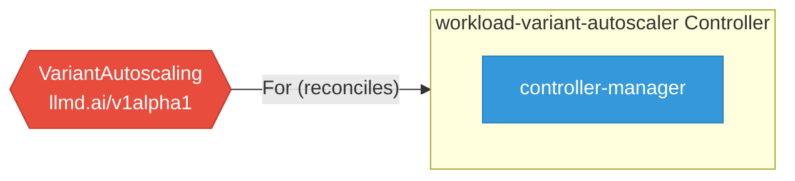

# workload-variant-autoscaler

> **Architecture snapshot: 2026-05-05** (2026-05-05)

**Repository:** llm-d/workload-variant-autoscaler  
**Analyzer:** arch-analyzer 0.2.0  
**Extracted:** 2026-05-05T15:10:24Z

## Summary

| Metric | Count |
|--------|-------|
| CRDs | 1 |
| Deployments | 1 |
| Services | 0 |
| Secrets | 2 |
| Cluster Roles | 7 |
| Controller Watches | 4 |

## Component Architecture

CRDs, controllers, and owned Kubernetes resources.

### CRDs

| Group | Version | Kind | Scope | Fields | Validation Rules | Source |
|-------|---------|------|-------|--------|------------------|--------|
| llmd.ai | v1alpha1 | VariantAutoscaling | Namespaced | 26 | 1 | [`config/crd/bases/llmd.ai_variantautoscalings.yaml`](https://github.com/llm-d/workload-variant-autoscaler/blob/e8fb8f01571f92111e7b68c8766a2bfca7dcec35/config/crd/bases/llmd.ai_variantautoscalings.yaml) |

## Dependencies

### Key External Dependencies

| Module | Version |
|--------|---------|
| github.com/go-logr/logr | v1.4.3 |
| github.com/prometheus-operator/prometheus-operator/pkg/apis/monitoring | v0.89.0 |
| github.com/prometheus/client_golang | v1.23.2 |
| github.com/prometheus/common | v0.67.5 |
| k8s.io/api | v0.34.5 |
| k8s.io/apimachinery | v0.34.5 |
| k8s.io/client-go | v0.34.5 |
| sigs.k8s.io/controller-runtime | v0.22.5 |

