# RBAC Surface

95 cluster roles across the platform.

## Permission Scope by Component

How many distinct Kubernetes resource types can each component's most powerful ClusterRole access? A wider scope means the component can read/write more types of resources, which increases its blast radius if compromised. Color: 🔴 wide (>30 types), 🟠 medium (10-30), 🟢 narrow (<10).

**Widest Role Scope (resource types)**

  argo-workflows
  

    

  

  21

  codeflare-operator
  

    

  

  34

  data-science-pipelines
  

    

  

  13

  data-science-pipelines-operator
  

    

  

  55

  kserve
  

    

  

  42

  llama-stack-k8s-operator
  

    

  

  17

  mlflow-operator
  

    

  

  13

  model-registry
  

    

  

  3

  odh-dashboard
  

    

  

  40

  odh-model-controller
  

    

  

  45

  opendatahub-operator
  

    

  

  2

  spark-operator
  

    

  

  15

  trainer
  

    

  

  16

  workload-variant-autoscaler
  

    

  

  20

## RBAC Binding Graph

Subject-to-role bindings across all platform components. Edge direction shows who has access to what.

```mermaid
graph LR
    classDef role fill:#e74c3c,stroke:#c0392b,color:#fff
    classDef subject fill:#3498db,stroke:#2980b9,color:#fff

    sa_argo["argo\nServiceAccount"]:::subject
    role_argo_cluster_role["argo-cluster-role"]:::role
    sa_argo -->|argo-workflows| role_argo_cluster_role
    sa_argo_server["argo-server\nServiceAccount"]:::subject
    role_argo_server_cluster_role["argo-server-cluster-role"]:::role
    sa_argo_server -->|argo-workflows| role_argo_server_cluster_role
    sa_controller_manager["controller-manager\nServiceAccount"]:::subject
    role_manager_role["manager-role"]:::role
    sa_controller_manager -->|codeflare-operator| role_manager_role
    role_manager_argo_role["manager-argo-role"]:::role
    sa_controller_manager -->|data-science-pipelines-operator| role_manager_argo_role
    sa_controller_manager -->|data-science-pipelines-operator| role_manager_role
    sa_kubeflow_pipelines_cache["kubeflow-pipelines-cache\nServiceAccount"]:::subject
    role_kubeflow_pipelines_cache_role["kubeflow-pipelines-cache-role"]:::role
    sa_kubeflow_pipelines_cache -->|data-science-pipelines| role_kubeflow_pipelines_cache_role
    sa_kubeflow_pipelines_cache_deployer_sa["kubeflow-pipelines-cache-deployer-sa\nServiceAccount"]:::subject
    role_kubeflow_pipelines_cache_deployer_clusterrole["kubeflow-pipelines-cache-deployer-clusterrole"]:::role
    sa_kubeflow_pipelines_cache_deployer_sa -->|data-science-pipelines| role_kubeflow_pipelines_cache_deployer_clusterrole
    sa_kubeflow_pipelines_metadata_writer["kubeflow-pipelines-metadata-writer\nServiceAccount"]:::subject
    role_kubeflow_pipelines_metadata_writer_role["kubeflow-pipelines-metadata-writer-role"]:::role
    sa_kubeflow_pipelines_metadata_writer -->|data-science-pipelines| role_kubeflow_pipelines_metadata_writer_role
    sa_meta_controller_service["meta-controller-service\nServiceAccount"]:::subject
    role_kubeflow_metacontroller["kubeflow-metacontroller"]:::role
    sa_meta_controller_service -->|data-science-pipelines| role_kubeflow_metacontroller
    sa_ml_pipeline["ml-pipeline\nServiceAccount"]:::subject
    role_ml_pipeline["ml-pipeline"]:::role
    sa_ml_pipeline -->|data-science-pipelines| role_ml_pipeline
    sa_ml_pipeline_persistenceagent["ml-pipeline-persistenceagent\nServiceAccount"]:::subject
    role_ml_pipeline_persistenceagent_role["ml-pipeline-persistenceagent-role"]:::role
    sa_ml_pipeline_persistenceagent -->|data-science-pipelines| role_ml_pipeline_persistenceagent_role
    sa_ml_pipeline_scheduledworkflow["ml-pipeline-scheduledworkflow\nServiceAccount"]:::subject
    role_ml_pipeline_scheduledworkflow_role["ml-pipeline-scheduledworkflow-role"]:::role
    sa_ml_pipeline_scheduledworkflow -->|data-science-pipelines| role_ml_pipeline_scheduledworkflow_role
    sa_ml_pipeline_ui["ml-pipeline-ui\nServiceAccount"]:::subject
    role_ml_pipeline_ui["ml-pipeline-ui"]:::role
    sa_ml_pipeline_ui -->|data-science-pipelines| role_ml_pipeline_ui
    sa_ml_pipeline_viewer_crd_service_account["ml-pipeline-viewer-crd-service-account\nServiceAccount"]:::subject
    role_ml_pipeline_viewer_controller_role["ml-pipeline-viewer-controller-role"]:::role
    sa_ml_pipeline_viewer_crd_service_account -->|data-science-pipelines| role_ml_pipeline_viewer_controller_role
    sa_kserve_controller_manager["kserve-controller-manager\nServiceAccount"]:::subject
    role_kserve_manager_role["kserve-manager-role"]:::role
    sa_kserve_controller_manager -->|kserve| role_kserve_manager_role
    role_kserve_proxy_role["kserve-proxy-role"]:::role
    sa_kserve_controller_manager -->|kserve| role_kserve_proxy_role
    sa_controller_manager -->|llama-stack-k8s-operator| role_manager_role
    role_proxy_role["proxy-role"]:::role
    sa_controller_manager -->|llama-stack-k8s-operator| role_proxy_role
    sa_controller_manager -->|mlflow-operator| role_manager_role
    role_metrics_auth_role["metrics-auth-role"]:::role
    sa_controller_manager -->|mlflow-operator| role_metrics_auth_role
    sa_controller_manager -->|model-registry| role_metrics_auth_role
    sa_model_registry_ui["model-registry-ui\nServiceAccount"]:::subject
    role_model_registry_create_sars["model-registry-create-sars"]:::role
    sa_model_registry_ui -->|model-registry| role_model_registry_create_sars
    role_model_registry_manager_role["model-registry-manager-role"]:::role
    sa_controller_manager -->|model-registry| role_model_registry_manager_role
    role_model_registry_retrieve_clusterrolebindings["model-registry-retrieve-clusterrolebindings"]:::role
    sa_model_registry_ui -->|model-registry| role_model_registry_retrieve_clusterrolebindings
    role_model_registry_ui_services_reader["model-registry-ui-services-reader"]:::role
    sa_model_registry_ui -->|model-registry| role_model_registry_ui_services_reader
    sa_odh_dashboard["odh-dashboard\nServiceAccount"]:::subject
    role_odh_dashboard["odh-dashboard"]:::role
    sa_odh_dashboard -->|odh-dashboard| role_odh_dashboard
    role_system_auth_delegator["system:auth-delegator"]:::role
    sa_odh_dashboard -->|odh-dashboard| role_system_auth_delegator
    role_cluster_monitoring_view["cluster-monitoring-view"]:::role
    sa_odh_dashboard -->|odh-dashboard| role_cluster_monitoring_view
    sa_controller_manager -->|odh-model-controller| role_metrics_auth_role
    sa_odh_model_controller["odh-model-controller\nServiceAccount"]:::subject
    role_odh_model_controller_role["odh-model-controller-role"]:::role
    sa_odh_model_controller -->|odh-model-controller| role_odh_model_controller_role
    sa_odh_model_controller -->|odh-model-controller| role_proxy_role
    role_controller_manager_role["controller-manager-role"]:::role
    sa_controller_manager -->|opendatahub-operator| role_controller_manager_role
    sa_spark_operator_controller["spark-operator-controller\nServiceAccount"]:::subject
    role_spark_operator_controller["spark-operator-controller"]:::role
    sa_spark_operator_controller -->|spark-operator| role_spark_operator_controller
    sa_kubeflow_trainer_controller_manager["kubeflow-trainer-controller-manager\nServiceAccount"]:::subject
    role_kubeflow_trainer_controller_manager["kubeflow-trainer-controller-manager"]:::role
    sa_kubeflow_trainer_controller_manager -->|trainer| role_kubeflow_trainer_controller_manager
    sa_notebook_controller_service_account["notebook-controller-service-account\nServiceAccount"]:::subject
    role_kubeflow_trainer_view["kubeflow-trainer-view"]:::role
    sa_notebook_controller_service_account -->|trainer| role_kubeflow_trainer_view
    sa_controller_service_account["controller-service-account\nServiceAccount"]:::subject
    sa_controller_service_account -->|trainer| role_kubeflow_trainer_view
    sa_epp_metrics_reader["epp-metrics-reader\nServiceAccount"]:::subject
    role_epp_metrics_reader_role["epp-metrics-reader-role"]:::role
    sa_epp_metrics_reader -->|workload-variant-autoscaler| role_epp_metrics_reader_role
    sa_controller_manager -->|workload-variant-autoscaler| role_manager_role
    sa_workload_variant_autoscaler_controller_manager["workload-variant-autoscaler-controller-manager\nServiceAccount"]:::subject
    sa_workload_variant_autoscaler_controller_manager -->|workload-variant-autoscaler| role_metrics_auth_role
    sa_kube_prometheus_stack_prometheus["kube-prometheus-stack-prometheus\nServiceAccount"]:::subject
    role_metrics_reader["metrics-reader"]:::role
    sa_kube_prometheus_stack_prometheus -->|workload-variant-autoscaler| role_metrics_reader
    role_workload_variant_autoscaler_metrics_auth_role["workload-variant-autoscaler-metrics-auth-role"]:::role
    sa_kube_prometheus_stack_prometheus -->|workload-variant-autoscaler| role_workload_variant_autoscaler_metrics_auth_role
```

## Roles by Component

| Component | Roles | Widest Role | Resources | Scope |
|-----------|-------|-------------|-----------|-------|
| argo-workflows | 5 | argo-cluster-role | 21 | medium |
| codeflare-operator | 3 | manager-role | 34 | **wide** |
| data-science-pipelines | 13 | aggregate-to-kubeflow-pipelines-edit | 13 | medium |
| data-science-pipelines-operator | 4 | manager-role | 55 | **wide** |
| kserve | 2 | kserve-manager-role | 42 | **wide** |
| llama-stack-k8s-operator | 5 | manager-role | 17 | medium |
| mlflow-operator | 6 | mlflow-edit | 13 | medium |
| model-registry | 6 | model-registry-manager-role | 3 | narrow |
| odh-dashboard | 1 | odh-dashboard | 40 | **wide** |
| odh-model-controller | 7 | odh-model-controller-role | 45 | **wide** |
| opendatahub-operator | 23 | ray-editor-role | 2 | narrow |
| spark-operator | 5 | spark-operator-controller | 15 | medium |
| trainer | 8 | kubeflow-trainer-controller-manager | 16 | medium |
| workload-variant-autoscaler | 7 | manager-role | 20 | medium |

