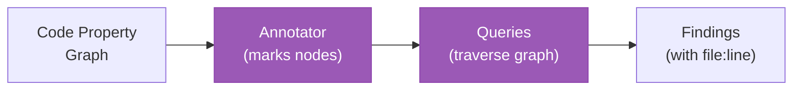

# Domains

The domain analysis framework provides pluggable analysis capabilities on top of the code property graph.

## Registered domains

| Domain | Dependencies | Description |
|--------|-------------|-------------|
| `security` | None | Taint analysis, hardcoded secrets, SQL injection, missing auth |
| `testing` | None | Test coverage analysis, mock usage patterns |
| `upgrade` | None | Deprecation detection, API version compatibility |

## Domain architecture

Each domain consists of three components:



1. **Annotator**: Walks CPG nodes and adds domain-specific metadata (annotations)
2. **Queries**: Traverse the annotated graph looking for patterns
3. **Findings**: Results with file:line references and severity

## Security domain

### Annotator (`go_annotator.go`)

Marks CPG nodes with security-relevant metadata:

- **Source annotations**: HTTP request parameters, environment variables, user input
- **Sink annotations**: SQL queries, command execution, file operations
- **Auth annotations**: Authentication/authorization function calls
- **Secret annotations**: Potential hardcoded credentials

### Queries

| Query ID | Name | Description |
|----------|------|-------------|
| CGA-003 | Taint Analysis | Traces data from source nodes to sink nodes through call chains |
| CGA-004 | Hardcoded Secrets | Pattern matching for API keys, passwords, tokens in string literals |
| CGA-005 | SQL Injection | Detects string concatenation in database query arguments |
| CGA-006 | Missing Auth | Finds HTTP handlers without authentication middleware |
| CGA-007 | Unconverted CRD | References to deprecated CRD versions (requires `--with-arch`) |
| CGA-008 | Dangerous Functions | Usage of known-unsafe functions (`exec.Command` with user input, etc.) |
| CGA-009 | Source Trust | Trust boundary violations in data flow paths |

## Testing domain

### Annotator

Marks nodes with testing metadata:

- Test function detection (`Test*`, `Benchmark*`)
- Mock usage patterns (interface mocks, fake clients)
- Table-driven test detection

### Queries

| Query ID | Name | Description |
|----------|------|-------------|
| CGA-T01 | Untested Functions | Public functions without corresponding test functions |
| CGA-T02 | Test State Leakage | Test functions sharing mutable state across cases |

## Upgrade domain

### Annotator

Marks nodes with upgrade-relevant metadata:

- Deprecated API version usage
- Old-style resource references
- Removed feature usage

### Queries

| Query ID | Name | Description |
|----------|------|-------------|
| CGA-U01 | Unconverted CRD | References to CRD versions not in the current schema |

## Using domains

```bash
# List registered domains
rhoai-analyzer domains

# Run all domains
rhoai-analyzer scan /path/to/repo

# Run specific domains
rhoai-analyzer scan /path/to/repo --domains security,testing

# With architecture enrichment
rhoai-analyzer scan /path/to/repo --domains security --with-arch arch.json
```

## Domain orchestrator

The orchestrator handles domain execution:

1. Reads domain dependencies via `Dependencies()` method
2. Performs topological sort to determine execution order
3. Runs annotators in dependency order
4. Runs queries after all annotators complete
5. Collects findings grouped by domain

Domains without dependencies can run their annotators in parallel.

## Adding a custom domain

See [Contributing: Adding Extractors](../contributing/adding-extractors.md) for guidance on the framework. A domain needs:

1. `analyzer.go`: Implements `DomainAnalyzer` interface
2. `annotations.go`: Defines annotation types
3. `go_annotator.go`: Implements the annotator
4. `queries.go`: Implements query functions
5. Registration in `main.go`
