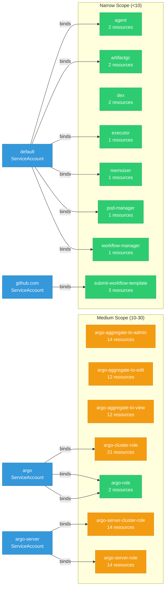

# argo-workflows: RBAC

ServiceAccount bindings, roles, and resource permissions.

## RBAC Overview

This component defines a large RBAC surface (297 diagram lines). The graph below groups roles by permission scope.

## Bindings

Subject-to-role mappings defining who has access to what.

| Binding | Type | Role | Subject |
|---------|------|------|---------|
| argo-binding | ClusterRoleBinding | argo-cluster-role | ServiceAccount/argo |
| argo-server-binding | ClusterRoleBinding | argo-server-cluster-role | ServiceAccount/argo-server |
| agent-default | RoleBinding | agent | ServiceAccount/default |
| argo-binding | RoleBinding | argo-role | ServiceAccount/argo |
| argo-binding | RoleBinding | argo-role | ServiceAccount/argo |
| argo-server-binding | RoleBinding | argo-server-role | ServiceAccount/argo-server |
| artifactgc-default | RoleBinding | artifactgc | ServiceAccount/default |
| executor-default | RoleBinding | executor | ServiceAccount/default |
| github.com | RoleBinding | submit-workflow-template | ServiceAccount/github.com |
| memoizer-default | RoleBinding | memoizer | ServiceAccount/default |
| pod-manager-default | RoleBinding | pod-manager | ServiceAccount/default |
| workflow-manager-default | RoleBinding | workflow-manager | ServiceAccount/default |

## Role Details

Per-rule breakdown of API groups, resources, and verbs for each role.

| Role | Kind | API Groups | Resources | Verbs |
|------|------|------------|-----------|-------|
| argo-aggregate-to-admin | ClusterRole |  | workflows, workflows/finalizers, workfloweventbindings, workfloweventbindings/finalizers, workflowtemplates, workflowtemplates/finalizers, cronworkflows, cronworkflows/finalizers, clusterworkflowtemplates, clusterworkflowtemplates/finalizers, workflowtasksets, workflowtasksets/finalizers, workflowtaskresults, workflowtaskresults/finalizers | create, delete, deletecollection, get, list, patch, update, watch |
| argo-aggregate-to-edit | ClusterRole |  | workflows, workflows/finalizers, workfloweventbindings, workfloweventbindings/finalizers, workflowtemplates, workflowtemplates/finalizers, cronworkflows, cronworkflows/finalizers, clusterworkflowtemplates, clusterworkflowtemplates/finalizers, workflowtaskresults, workflowtaskresults/finalizers | create, delete, deletecollection, get, list, patch, update, watch |
| argo-aggregate-to-view | ClusterRole |  | workflows, workflows/finalizers, workfloweventbindings, workfloweventbindings/finalizers, workflowtemplates, workflowtemplates/finalizers, cronworkflows, cronworkflows/finalizers, clusterworkflowtemplates, clusterworkflowtemplates/finalizers, workflowtaskresults, workflowtaskresults/finalizers | get, list, watch |
| argo-cluster-role | ClusterRole |  | pods, pods/exec | create, get, list, watch, update, patch, delete |
| argo-cluster-role | ClusterRole |  | configmaps | get, watch, list |
| argo-cluster-role | ClusterRole |  | persistentvolumeclaims, persistentvolumeclaims/finalizers | create, update, delete, get |
| argo-cluster-role | ClusterRole |  | workflows, workflows/finalizers, workflowtasksets, workflowtasksets/finalizers, workflowartifactgctasks | get, list, watch, update, patch, delete, create |
| argo-cluster-role | ClusterRole |  | workflowtemplates, workflowtemplates/finalizers, clusterworkflowtemplates, clusterworkflowtemplates/finalizers | get, list, watch |
| argo-cluster-role | ClusterRole |  | workflowtaskresults | list, watch, deletecollection |
| argo-cluster-role | ClusterRole |  | serviceaccounts | get, list |
| argo-cluster-role | ClusterRole |  | cronworkflows, cronworkflows/finalizers | get, list, watch, update, patch, delete |
| argo-cluster-role | ClusterRole |  | events | create, patch |
| argo-cluster-role | ClusterRole |  | poddisruptionbudgets | create, get, delete |
| argo-cluster-role | ClusterRole |  | secrets | get |
| argo-server-cluster-role | ClusterRole |  | configmaps | get, watch, list |
| argo-server-cluster-role | ClusterRole |  | secrets | get, create |
| argo-server-cluster-role | ClusterRole |  | pods, pods/exec, pods/log | get, list, watch, delete |
| argo-server-cluster-role | ClusterRole |  | events | watch, create, patch |
| argo-server-cluster-role | ClusterRole |  | serviceaccounts | get, list, watch |
| argo-server-cluster-role | ClusterRole |  | eventsources, sensors, workflows, workfloweventbindings, workflowtemplates, cronworkflows, clusterworkflowtemplates | create, get, list, watch, update, patch, delete |
| agent | Role |  | workflowtasksets | list, watch |
| agent | Role |  | workflowtasksets/status | patch |
| argo-role | Role |  | leases | create, get, update |
| argo-role | Role |  | secrets | get |
| argo-role | Role |  | leases | create, get, update |
| argo-role | Role |  | pods, pods/exec | create, get, list, watch, update, patch, delete |
| argo-role | Role |  | configmaps | get, watch, list |
| argo-role | Role |  | persistentvolumeclaims, persistentvolumeclaims/finalizers | create, update, delete, get |
| argo-role | Role |  | workflows, workflows/finalizers, workflowtasksets, workflowtasksets/finalizers, workflowartifactgctasks | get, list, watch, update, patch, delete, create |
| argo-role | Role |  | workflowtemplates, workflowtemplates/finalizers | get, list, watch |
| argo-role | Role |  | workflowtaskresults | list, watch, deletecollection |
| argo-role | Role |  | serviceaccounts | get, list |
| argo-role | Role |  | secrets | get |
| argo-role | Role |  | cronworkflows, cronworkflows/finalizers | get, list, watch, update, patch, delete |
| argo-role | Role |  | events | create, patch |
| argo-role | Role |  | poddisruptionbudgets | create, get, delete |
| argo-server-role | Role |  | configmaps | get, watch, list |
| argo-server-role | Role |  | secrets | get, create |
| argo-server-role | Role |  | pods, pods/exec, pods/log | get, list, watch, delete |
| argo-server-role | Role |  | events | watch, create, patch |
| argo-server-role | Role |  | serviceaccounts | get, list, watch |
| argo-server-role | Role |  | eventsources, sensors, workflows, workfloweventbindings, workflowtemplates, cronworkflows, cronworkflows/finalizers | create, get, list, watch, update, patch, delete |
| artifactgc | Role |  | workflowartifactgctasks | list, watch |
| artifactgc | Role |  | workflowartifactgctasks/status | patch |
| dex | Role |  | secrets, configmaps | get, list, watch |
| executor | Role |  | workflowtaskresults | create, patch |
| memoizer | Role |  | configmaps | create, get, update |
| pod-manager | Role |  | pods | create, get, patch |
| submit-workflow-template | Role |  | workfloweventbindings | list |
| submit-workflow-template | Role |  | workflowtemplates | get |
| submit-workflow-template | Role |  | workflows | create |
| workflow-manager | Role |  | workflows | create, get |

### Cluster Roles

| Name | Resources | Verbs | Source |
|------|-----------|-------|--------|
| argo-aggregate-to-admin | workflows, workflows/finalizers, workfloweventbindings, workfloweventbindings/finalizers, workflowtemplates, workflowtemplates/finalizers, cronworkflows, cronworkflows/finalizers, clusterworkflowtemplates, clusterworkflowtemplates/finalizers, workflowtasksets, workflowtasksets/finalizers, workflowtaskresults, workflowtaskresults/finalizers | create, delete, deletecollection, get, list, patch, update, watch | [`manifests/cluster-install/workflow-controller-rbac/workflow-aggregate-roles.yaml`](https://github.com/argoproj/argo-workflows/blob/003ed2b35a398772211441cb7c866c51f6f87e2d/manifests/cluster-install/workflow-controller-rbac/workflow-aggregate-roles.yaml) |
| argo-aggregate-to-edit | workflows, workflows/finalizers, workfloweventbindings, workfloweventbindings/finalizers, workflowtemplates, workflowtemplates/finalizers, cronworkflows, cronworkflows/finalizers, clusterworkflowtemplates, clusterworkflowtemplates/finalizers, workflowtaskresults, workflowtaskresults/finalizers | create, delete, deletecollection, get, list, patch, update, watch | [`manifests/cluster-install/workflow-controller-rbac/workflow-aggregate-roles.yaml`](https://github.com/argoproj/argo-workflows/blob/003ed2b35a398772211441cb7c866c51f6f87e2d/manifests/cluster-install/workflow-controller-rbac/workflow-aggregate-roles.yaml) |
| argo-aggregate-to-view | workflows, workflows/finalizers, workfloweventbindings, workfloweventbindings/finalizers, workflowtemplates, workflowtemplates/finalizers, cronworkflows, cronworkflows/finalizers, clusterworkflowtemplates, clusterworkflowtemplates/finalizers, workflowtaskresults, workflowtaskresults/finalizers | get, list, watch | [`manifests/cluster-install/workflow-controller-rbac/workflow-aggregate-roles.yaml`](https://github.com/argoproj/argo-workflows/blob/003ed2b35a398772211441cb7c866c51f6f87e2d/manifests/cluster-install/workflow-controller-rbac/workflow-aggregate-roles.yaml) |
| argo-cluster-role | pods, pods/exec | create, get, list, watch, update, patch, delete | [`manifests/cluster-install/workflow-controller-rbac/workflow-controller-clusterrole.yaml`](https://github.com/argoproj/argo-workflows/blob/003ed2b35a398772211441cb7c866c51f6f87e2d/manifests/cluster-install/workflow-controller-rbac/workflow-controller-clusterrole.yaml) |
| argo-cluster-role | configmaps | get, watch, list | [`manifests/cluster-install/workflow-controller-rbac/workflow-controller-clusterrole.yaml`](https://github.com/argoproj/argo-workflows/blob/003ed2b35a398772211441cb7c866c51f6f87e2d/manifests/cluster-install/workflow-controller-rbac/workflow-controller-clusterrole.yaml) |
| argo-cluster-role | persistentvolumeclaims, persistentvolumeclaims/finalizers | create, update, delete, get | [`manifests/cluster-install/workflow-controller-rbac/workflow-controller-clusterrole.yaml`](https://github.com/argoproj/argo-workflows/blob/003ed2b35a398772211441cb7c866c51f6f87e2d/manifests/cluster-install/workflow-controller-rbac/workflow-controller-clusterrole.yaml) |
| argo-cluster-role | workflows, workflows/finalizers, workflowtasksets, workflowtasksets/finalizers, workflowartifactgctasks | get, list, watch, update, patch, delete, create | [`manifests/cluster-install/workflow-controller-rbac/workflow-controller-clusterrole.yaml`](https://github.com/argoproj/argo-workflows/blob/003ed2b35a398772211441cb7c866c51f6f87e2d/manifests/cluster-install/workflow-controller-rbac/workflow-controller-clusterrole.yaml) |
| argo-cluster-role | workflowtemplates, workflowtemplates/finalizers, clusterworkflowtemplates, clusterworkflowtemplates/finalizers | get, list, watch | [`manifests/cluster-install/workflow-controller-rbac/workflow-controller-clusterrole.yaml`](https://github.com/argoproj/argo-workflows/blob/003ed2b35a398772211441cb7c866c51f6f87e2d/manifests/cluster-install/workflow-controller-rbac/workflow-controller-clusterrole.yaml) |
| argo-cluster-role | workflowtaskresults | list, watch, deletecollection | [`manifests/cluster-install/workflow-controller-rbac/workflow-controller-clusterrole.yaml`](https://github.com/argoproj/argo-workflows/blob/003ed2b35a398772211441cb7c866c51f6f87e2d/manifests/cluster-install/workflow-controller-rbac/workflow-controller-clusterrole.yaml) |
| argo-cluster-role | serviceaccounts | get, list | [`manifests/cluster-install/workflow-controller-rbac/workflow-controller-clusterrole.yaml`](https://github.com/argoproj/argo-workflows/blob/003ed2b35a398772211441cb7c866c51f6f87e2d/manifests/cluster-install/workflow-controller-rbac/workflow-controller-clusterrole.yaml) |
| argo-cluster-role | cronworkflows, cronworkflows/finalizers | get, list, watch, update, patch, delete | [`manifests/cluster-install/workflow-controller-rbac/workflow-controller-clusterrole.yaml`](https://github.com/argoproj/argo-workflows/blob/003ed2b35a398772211441cb7c866c51f6f87e2d/manifests/cluster-install/workflow-controller-rbac/workflow-controller-clusterrole.yaml) |
| argo-cluster-role | events | create, patch | [`manifests/cluster-install/workflow-controller-rbac/workflow-controller-clusterrole.yaml`](https://github.com/argoproj/argo-workflows/blob/003ed2b35a398772211441cb7c866c51f6f87e2d/manifests/cluster-install/workflow-controller-rbac/workflow-controller-clusterrole.yaml) |
| argo-cluster-role | poddisruptionbudgets | create, get, delete | [`manifests/cluster-install/workflow-controller-rbac/workflow-controller-clusterrole.yaml`](https://github.com/argoproj/argo-workflows/blob/003ed2b35a398772211441cb7c866c51f6f87e2d/manifests/cluster-install/workflow-controller-rbac/workflow-controller-clusterrole.yaml) |
| argo-cluster-role | secrets | get | [`manifests/cluster-install/workflow-controller-rbac/workflow-controller-clusterrole.yaml`](https://github.com/argoproj/argo-workflows/blob/003ed2b35a398772211441cb7c866c51f6f87e2d/manifests/cluster-install/workflow-controller-rbac/workflow-controller-clusterrole.yaml) |
| argo-server-cluster-role | configmaps | get, watch, list | [`manifests/cluster-install/argo-server-rbac/argo-server-clusterole.yaml`](https://github.com/argoproj/argo-workflows/blob/003ed2b35a398772211441cb7c866c51f6f87e2d/manifests/cluster-install/argo-server-rbac/argo-server-clusterole.yaml) |
| argo-server-cluster-role | secrets | get, create | [`manifests/cluster-install/argo-server-rbac/argo-server-clusterole.yaml`](https://github.com/argoproj/argo-workflows/blob/003ed2b35a398772211441cb7c866c51f6f87e2d/manifests/cluster-install/argo-server-rbac/argo-server-clusterole.yaml) |
| argo-server-cluster-role | pods, pods/exec, pods/log | get, list, watch, delete | [`manifests/cluster-install/argo-server-rbac/argo-server-clusterole.yaml`](https://github.com/argoproj/argo-workflows/blob/003ed2b35a398772211441cb7c866c51f6f87e2d/manifests/cluster-install/argo-server-rbac/argo-server-clusterole.yaml) |
| argo-server-cluster-role | events | watch, create, patch | [`manifests/cluster-install/argo-server-rbac/argo-server-clusterole.yaml`](https://github.com/argoproj/argo-workflows/blob/003ed2b35a398772211441cb7c866c51f6f87e2d/manifests/cluster-install/argo-server-rbac/argo-server-clusterole.yaml) |
| argo-server-cluster-role | serviceaccounts | get, list, watch | [`manifests/cluster-install/argo-server-rbac/argo-server-clusterole.yaml`](https://github.com/argoproj/argo-workflows/blob/003ed2b35a398772211441cb7c866c51f6f87e2d/manifests/cluster-install/argo-server-rbac/argo-server-clusterole.yaml) |
| argo-server-cluster-role | eventsources, sensors, workflows, workfloweventbindings, workflowtemplates, cronworkflows, clusterworkflowtemplates | create, get, list, watch, update, patch, delete | [`manifests/cluster-install/argo-server-rbac/argo-server-clusterole.yaml`](https://github.com/argoproj/argo-workflows/blob/003ed2b35a398772211441cb7c866c51f6f87e2d/manifests/cluster-install/argo-server-rbac/argo-server-clusterole.yaml) |

