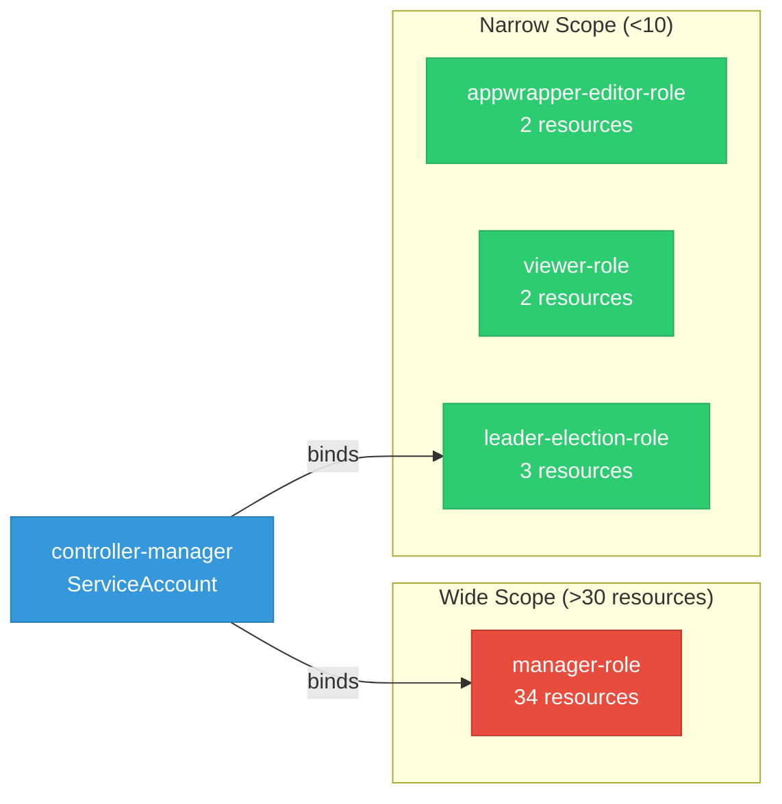

# codeflare-operator: RBAC

ServiceAccount bindings, roles, and resource permissions.

## RBAC Overview

This component defines a large RBAC surface (95 diagram lines). The graph below groups roles by permission scope.

## Bindings

Subject-to-role mappings defining who has access to what.

| Binding | Type | Role | Subject |
|---------|------|------|---------|
| manager-rolebinding | ClusterRoleBinding | manager-role | ServiceAccount/controller-manager |
| leader-election-rolebinding | RoleBinding | leader-election-role | ServiceAccount/controller-manager |

## Role Details

Per-rule breakdown of API groups, resources, and verbs for each role.

| Role | Kind | API Groups | Resources | Verbs |
|------|------|------------|-----------|-------|
| appwrapper-editor-role | ClusterRole |  | appwrappers | create, delete, get, list, patch, update, watch |
| appwrapper-editor-role | ClusterRole |  | appwrappers/status | get |
| manager-role | ClusterRole |  | events | create, patch, update, watch |
| manager-role | ClusterRole |  | nodes | get, list, watch |
| manager-role | ClusterRole |  | pods, services | create, delete, get, list, patch, update, watch |
| manager-role | ClusterRole |  | secrets | get, list, update, watch |
| manager-role | ClusterRole |  | mutatingwebhookconfigurations | get, list, update, watch |
| manager-role | ClusterRole |  | validatingwebhookconfigurations | get, list, update, watch |
| manager-role | ClusterRole |  | customresourcedefinitions | get, list, watch |
| manager-role | ClusterRole |  | deployments, statefulsets | create, delete, get, list, patch, update, watch |
| manager-role | ClusterRole |  | tokenreviews | create |
| manager-role | ClusterRole |  | subjectaccessreviews | create |
| manager-role | ClusterRole |  | jobs | create, delete, get, list, patch, update, watch |
| manager-role | ClusterRole |  | ingresses | get |
| manager-role | ClusterRole |  | secrets | create, delete, get, list, patch, watch |
| manager-role | ClusterRole |  | serviceaccounts | create, delete, get, list, patch, update, watch |
| manager-role | ClusterRole |  | services | create, delete, get, list, patch, update, watch |
| manager-role | ClusterRole |  | dscinitializations | get, list, watch |
| manager-role | ClusterRole |  | jobsets | create, delete, get, list, patch, update, watch |
| manager-role | ClusterRole |  | pytorchjobs | create, delete, get, list, patch, update, watch |
| manager-role | ClusterRole |  | ingresses | create, delete, get, list, patch, update, watch |
| manager-role | ClusterRole |  | networkpolicies | create, delete, get, list, patch, update, watch |
| manager-role | ClusterRole |  | rayclusters | create, delete, get, list, patch, update, watch |
| manager-role | ClusterRole |  | rayclusters/finalizers | update |
| manager-role | ClusterRole |  | rayclusters/status | get, patch, update |
| manager-role | ClusterRole |  | rayjobs | create, delete, get, list, patch, update, watch |
| manager-role | ClusterRole |  | clusterrolebindings | create, delete, get, list, patch, update, watch |
| manager-role | ClusterRole |  | routes, routes/custom-host | create, delete, get, list, patch, update, watch |
| manager-role | ClusterRole |  | podgroups | create, delete, get, list, patch, update, watch |
| manager-role | ClusterRole |  | podgroups | create, delete, get, list, patch, update, watch |
| manager-role | ClusterRole |  | appwrappers | create, delete, get, list, patch, update, watch |
| manager-role | ClusterRole |  | appwrappers/finalizers | update |
| manager-role | ClusterRole |  | appwrappers/status | get, patch, update |
| viewer-role | ClusterRole |  | appwrappers | get, list, watch |
| viewer-role | ClusterRole |  | appwrappers/status | get |
| leader-election-role | Role |  | configmaps | get, list, watch, create, update, patch, delete |
| leader-election-role | Role |  | leases | get, list, watch, create, update, patch, delete |
| leader-election-role | Role |  | events | create, patch |

### Cluster Roles

| Name | Resources | Verbs | Source |
|------|-----------|-------|--------|
| appwrapper-editor-role | appwrappers | create, delete, get, list, patch, update, watch | [`config/rbac/appwrapper_editor_role.yaml`](https://github.com/project-codeflare/codeflare-operator/blob/3febc27fff73efde4361d9107becf5a7647e2276/config/rbac/appwrapper_editor_role.yaml) |
| appwrapper-editor-role | appwrappers/status | get | [`config/rbac/appwrapper_editor_role.yaml`](https://github.com/project-codeflare/codeflare-operator/blob/3febc27fff73efde4361d9107becf5a7647e2276/config/rbac/appwrapper_editor_role.yaml) |
| manager-role | events | create, patch, update, watch | [`config/rbac/role.yaml`](https://github.com/project-codeflare/codeflare-operator/blob/3febc27fff73efde4361d9107becf5a7647e2276/config/rbac/role.yaml) |
| manager-role | nodes | get, list, watch | [`config/rbac/role.yaml`](https://github.com/project-codeflare/codeflare-operator/blob/3febc27fff73efde4361d9107becf5a7647e2276/config/rbac/role.yaml) |
| manager-role | pods, services | create, delete, get, list, patch, update, watch | [`config/rbac/role.yaml`](https://github.com/project-codeflare/codeflare-operator/blob/3febc27fff73efde4361d9107becf5a7647e2276/config/rbac/role.yaml) |
| manager-role | secrets | get, list, update, watch | [`config/rbac/role.yaml`](https://github.com/project-codeflare/codeflare-operator/blob/3febc27fff73efde4361d9107becf5a7647e2276/config/rbac/role.yaml) |
| manager-role | mutatingwebhookconfigurations | get, list, update, watch | [`config/rbac/role.yaml`](https://github.com/project-codeflare/codeflare-operator/blob/3febc27fff73efde4361d9107becf5a7647e2276/config/rbac/role.yaml) |
| manager-role | validatingwebhookconfigurations | get, list, update, watch | [`config/rbac/role.yaml`](https://github.com/project-codeflare/codeflare-operator/blob/3febc27fff73efde4361d9107becf5a7647e2276/config/rbac/role.yaml) |
| manager-role | customresourcedefinitions | get, list, watch | [`config/rbac/role.yaml`](https://github.com/project-codeflare/codeflare-operator/blob/3febc27fff73efde4361d9107becf5a7647e2276/config/rbac/role.yaml) |
| manager-role | deployments, statefulsets | create, delete, get, list, patch, update, watch | [`config/rbac/role.yaml`](https://github.com/project-codeflare/codeflare-operator/blob/3febc27fff73efde4361d9107becf5a7647e2276/config/rbac/role.yaml) |
| manager-role | tokenreviews | create | [`config/rbac/role.yaml`](https://github.com/project-codeflare/codeflare-operator/blob/3febc27fff73efde4361d9107becf5a7647e2276/config/rbac/role.yaml) |
| manager-role | subjectaccessreviews | create | [`config/rbac/role.yaml`](https://github.com/project-codeflare/codeflare-operator/blob/3febc27fff73efde4361d9107becf5a7647e2276/config/rbac/role.yaml) |
| manager-role | jobs | create, delete, get, list, patch, update, watch | [`config/rbac/role.yaml`](https://github.com/project-codeflare/codeflare-operator/blob/3febc27fff73efde4361d9107becf5a7647e2276/config/rbac/role.yaml) |
| manager-role | ingresses | get | [`config/rbac/role.yaml`](https://github.com/project-codeflare/codeflare-operator/blob/3febc27fff73efde4361d9107becf5a7647e2276/config/rbac/role.yaml) |
| manager-role | secrets | create, delete, get, list, patch, watch | [`config/rbac/role.yaml`](https://github.com/project-codeflare/codeflare-operator/blob/3febc27fff73efde4361d9107becf5a7647e2276/config/rbac/role.yaml) |
| manager-role | serviceaccounts | create, delete, get, list, patch, update, watch | [`config/rbac/role.yaml`](https://github.com/project-codeflare/codeflare-operator/blob/3febc27fff73efde4361d9107becf5a7647e2276/config/rbac/role.yaml) |
| manager-role | services | create, delete, get, list, patch, update, watch | [`config/rbac/role.yaml`](https://github.com/project-codeflare/codeflare-operator/blob/3febc27fff73efde4361d9107becf5a7647e2276/config/rbac/role.yaml) |
| manager-role | dscinitializations | get, list, watch | [`config/rbac/role.yaml`](https://github.com/project-codeflare/codeflare-operator/blob/3febc27fff73efde4361d9107becf5a7647e2276/config/rbac/role.yaml) |
| manager-role | jobsets | create, delete, get, list, patch, update, watch | [`config/rbac/role.yaml`](https://github.com/project-codeflare/codeflare-operator/blob/3febc27fff73efde4361d9107becf5a7647e2276/config/rbac/role.yaml) |
| manager-role | pytorchjobs | create, delete, get, list, patch, update, watch | [`config/rbac/role.yaml`](https://github.com/project-codeflare/codeflare-operator/blob/3febc27fff73efde4361d9107becf5a7647e2276/config/rbac/role.yaml) |
| manager-role | ingresses | create, delete, get, list, patch, update, watch | [`config/rbac/role.yaml`](https://github.com/project-codeflare/codeflare-operator/blob/3febc27fff73efde4361d9107becf5a7647e2276/config/rbac/role.yaml) |
| manager-role | networkpolicies | create, delete, get, list, patch, update, watch | [`config/rbac/role.yaml`](https://github.com/project-codeflare/codeflare-operator/blob/3febc27fff73efde4361d9107becf5a7647e2276/config/rbac/role.yaml) |
| manager-role | rayclusters | create, delete, get, list, patch, update, watch | [`config/rbac/role.yaml`](https://github.com/project-codeflare/codeflare-operator/blob/3febc27fff73efde4361d9107becf5a7647e2276/config/rbac/role.yaml) |
| manager-role | rayclusters/finalizers | update | [`config/rbac/role.yaml`](https://github.com/project-codeflare/codeflare-operator/blob/3febc27fff73efde4361d9107becf5a7647e2276/config/rbac/role.yaml) |
| manager-role | rayclusters/status | get, patch, update | [`config/rbac/role.yaml`](https://github.com/project-codeflare/codeflare-operator/blob/3febc27fff73efde4361d9107becf5a7647e2276/config/rbac/role.yaml) |
| manager-role | rayjobs | create, delete, get, list, patch, update, watch | [`config/rbac/role.yaml`](https://github.com/project-codeflare/codeflare-operator/blob/3febc27fff73efde4361d9107becf5a7647e2276/config/rbac/role.yaml) |
| manager-role | clusterrolebindings | create, delete, get, list, patch, update, watch | [`config/rbac/role.yaml`](https://github.com/project-codeflare/codeflare-operator/blob/3febc27fff73efde4361d9107becf5a7647e2276/config/rbac/role.yaml) |
| manager-role | routes, routes/custom-host | create, delete, get, list, patch, update, watch | [`config/rbac/role.yaml`](https://github.com/project-codeflare/codeflare-operator/blob/3febc27fff73efde4361d9107becf5a7647e2276/config/rbac/role.yaml) |
| manager-role | podgroups | create, delete, get, list, patch, update, watch | [`config/rbac/role.yaml`](https://github.com/project-codeflare/codeflare-operator/blob/3febc27fff73efde4361d9107becf5a7647e2276/config/rbac/role.yaml) |
| manager-role | podgroups | create, delete, get, list, patch, update, watch | [`config/rbac/role.yaml`](https://github.com/project-codeflare/codeflare-operator/blob/3febc27fff73efde4361d9107becf5a7647e2276/config/rbac/role.yaml) |
| manager-role | appwrappers | create, delete, get, list, patch, update, watch | [`config/rbac/role.yaml`](https://github.com/project-codeflare/codeflare-operator/blob/3febc27fff73efde4361d9107becf5a7647e2276/config/rbac/role.yaml) |
| manager-role | appwrappers/finalizers | update | [`config/rbac/role.yaml`](https://github.com/project-codeflare/codeflare-operator/blob/3febc27fff73efde4361d9107becf5a7647e2276/config/rbac/role.yaml) |
| manager-role | appwrappers/status | get, patch, update | [`config/rbac/role.yaml`](https://github.com/project-codeflare/codeflare-operator/blob/3febc27fff73efde4361d9107becf5a7647e2276/config/rbac/role.yaml) |
| viewer-role | appwrappers | get, list, watch | [`config/rbac/appwrapper_viewer_role.yaml`](https://github.com/project-codeflare/codeflare-operator/blob/3febc27fff73efde4361d9107becf5a7647e2276/config/rbac/appwrapper_viewer_role.yaml) |
| viewer-role | appwrappers/status | get | [`config/rbac/appwrapper_viewer_role.yaml`](https://github.com/project-codeflare/codeflare-operator/blob/3febc27fff73efde4361d9107becf5a7647e2276/config/rbac/appwrapper_viewer_role.yaml) |

### Kubebuilder RBAC Markers

Kubebuilder `+kubebuilder:rbac` markers declare the RBAC requirements of controller reconcilers. These are the source of truth for generated ClusterRole manifests. 16 markers found.

| File | Line | Groups | Resources | Verbs |
|------|------|--------|-----------|-------|
| [`pkg/controllers/appwrapper_controller.go:22`](https://github.com/project-codeflare/codeflare-operator/blob/3febc27fff73efde4361d9107becf5a7647e2276/pkg/controllers/appwrapper_controller.go#L22) | 22 |  |  | get, list, watch, create, update, patch, delete |
| [`pkg/controllers/appwrapper_controller.go:23`](https://github.com/project-codeflare/codeflare-operator/blob/3febc27fff73efde4361d9107becf5a7647e2276/pkg/controllers/appwrapper_controller.go#L23) | 23 |  |  | get, update, patch |
| [`pkg/controllers/appwrapper_controller.go:24`](https://github.com/project-codeflare/codeflare-operator/blob/3febc27fff73efde4361d9107becf5a7647e2276/pkg/controllers/appwrapper_controller.go#L24) | 24 |  |  |  |
| [`pkg/controllers/appwrapper_controller.go:27`](https://github.com/project-codeflare/codeflare-operator/blob/3febc27fff73efde4361d9107becf5a7647e2276/pkg/controllers/appwrapper_controller.go#L27) | 27 |  |  | create, watch, update, patch |
| [`pkg/controllers/appwrapper_controller.go:30`](https://github.com/project-codeflare/codeflare-operator/blob/3febc27fff73efde4361d9107becf5a7647e2276/pkg/controllers/appwrapper_controller.go#L30) | 30 |  | pods, services | get, list, watch, create, update, patch, delete |
| [`pkg/controllers/appwrapper_controller.go:31`](https://github.com/project-codeflare/codeflare-operator/blob/3febc27fff73efde4361d9107becf5a7647e2276/pkg/controllers/appwrapper_controller.go#L31) | 31 |  | deployments, statefulsets | get, list, watch, create, update, patch, delete |
| [`pkg/controllers/appwrapper_controller.go:32`](https://github.com/project-codeflare/codeflare-operator/blob/3febc27fff73efde4361d9107becf5a7647e2276/pkg/controllers/appwrapper_controller.go#L32) | 32 |  |  | get, list, watch, create, update, patch, delete |
| [`pkg/controllers/appwrapper_controller.go:33`](https://github.com/project-codeflare/codeflare-operator/blob/3febc27fff73efde4361d9107becf5a7647e2276/pkg/controllers/appwrapper_controller.go#L33) | 33 |  |  | get, list, watch, create, update, patch, delete |
| [`pkg/controllers/appwrapper_controller.go:34`](https://github.com/project-codeflare/codeflare-operator/blob/3febc27fff73efde4361d9107becf5a7647e2276/pkg/controllers/appwrapper_controller.go#L34) | 34 |  |  | get, list, watch, create, update, patch, delete |
| [`pkg/controllers/appwrapper_controller.go:35`](https://github.com/project-codeflare/codeflare-operator/blob/3febc27fff73efde4361d9107becf5a7647e2276/pkg/controllers/appwrapper_controller.go#L35) | 35 |  |  | get, list, watch, create, update, patch, delete |
| [`pkg/controllers/appwrapper_controller.go:36`](https://github.com/project-codeflare/codeflare-operator/blob/3febc27fff73efde4361d9107becf5a7647e2276/pkg/controllers/appwrapper_controller.go#L36) | 36 |  |  | get, list, watch, create, update, patch, delete |
| [`pkg/controllers/appwrapper_controller.go:37`](https://github.com/project-codeflare/codeflare-operator/blob/3febc27fff73efde4361d9107becf5a7647e2276/pkg/controllers/appwrapper_controller.go#L37) | 37 |  |  | get, list, watch, create, update, patch, delete |
| [`pkg/controllers/appwrapper_controller.go:38`](https://github.com/project-codeflare/codeflare-operator/blob/3febc27fff73efde4361d9107becf5a7647e2276/pkg/controllers/appwrapper_controller.go#L38) | 38 |  |  | get, list, watch, create, update, patch, delete |
| [`pkg/controllers/appwrapper_controller.go:41`](https://github.com/project-codeflare/codeflare-operator/blob/3febc27fff73efde4361d9107becf5a7647e2276/pkg/controllers/appwrapper_controller.go#L41) | 41 |  |  | get, list, watch |
| [`pkg/controllers/appwrapper_webhook.go:24`](https://github.com/project-codeflare/codeflare-operator/blob/3febc27fff73efde4361d9107becf5a7647e2276/pkg/controllers/appwrapper_webhook.go#L24) | 24 |  |  |  |
| [`pkg/controllers/appwrapper_webhook.go:25`](https://github.com/project-codeflare/codeflare-operator/blob/3febc27fff73efde4361d9107becf5a7647e2276/pkg/controllers/appwrapper_webhook.go#L25) | 25 |  |  |  |

