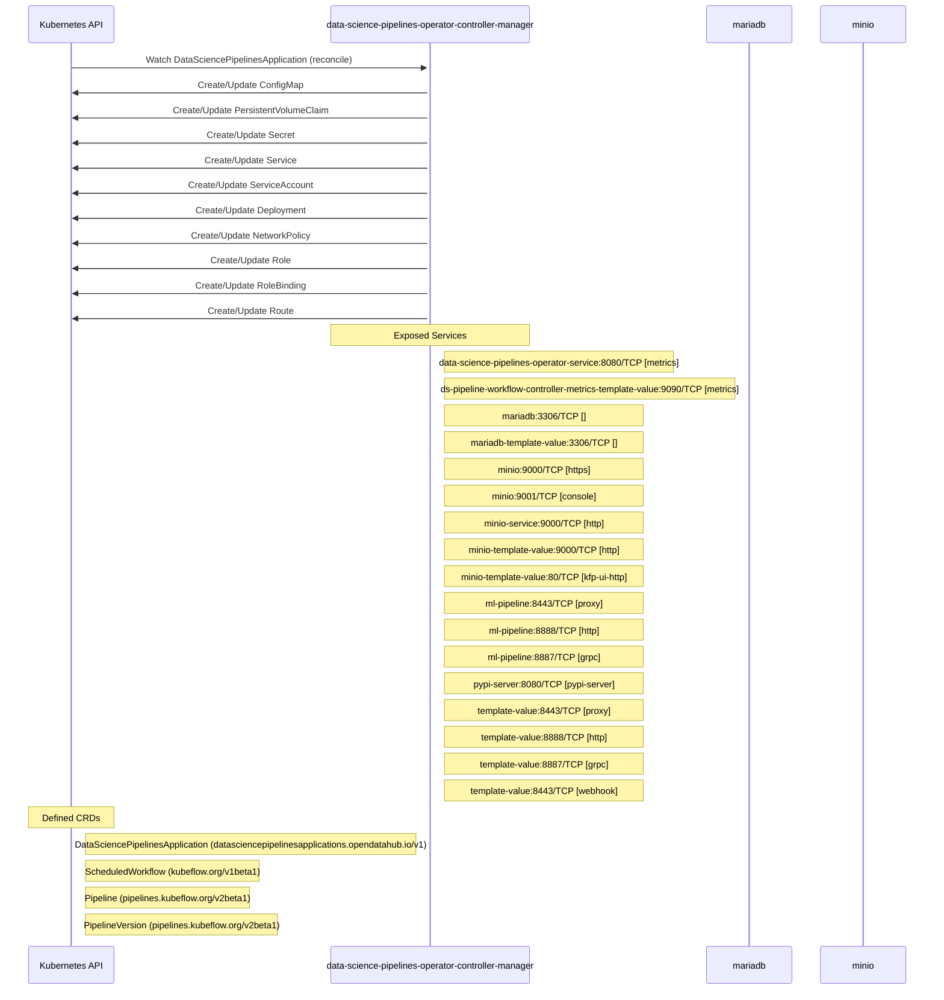

# data-science-pipelines-operator: Dataflow

## Controller Watches

Kubernetes resources this controller monitors for changes. Each watch triggers reconciliation when the watched resource is created, updated, or deleted.

| Type | GVK | Source |
|------|-----|--------|
| For | api/v1/DataSciencePipelinesApplication | [`controllers/dspipeline_controller.go:796`](https://github.com/opendatahub-io/data-science-pipelines-operator/blob/df94cb0eaab69dfb8c641ee8eef47a643921109f/controllers/dspipeline_controller.go#L796) |
| Owns | /v1/ConfigMap | [`controllers/dspipeline_controller.go:799`](https://github.com/opendatahub-io/data-science-pipelines-operator/blob/df94cb0eaab69dfb8c641ee8eef47a643921109f/controllers/dspipeline_controller.go#L799) |
| Owns | /v1/PersistentVolumeClaim | [`controllers/dspipeline_controller.go:802`](https://github.com/opendatahub-io/data-science-pipelines-operator/blob/df94cb0eaab69dfb8c641ee8eef47a643921109f/controllers/dspipeline_controller.go#L802) |
| Owns | /v1/Secret | [`controllers/dspipeline_controller.go:798`](https://github.com/opendatahub-io/data-science-pipelines-operator/blob/df94cb0eaab69dfb8c641ee8eef47a643921109f/controllers/dspipeline_controller.go#L798) |
| Owns | /v1/Service | [`controllers/dspipeline_controller.go:800`](https://github.com/opendatahub-io/data-science-pipelines-operator/blob/df94cb0eaab69dfb8c641ee8eef47a643921109f/controllers/dspipeline_controller.go#L800) |
| Owns | /v1/ServiceAccount | [`controllers/dspipeline_controller.go:801`](https://github.com/opendatahub-io/data-science-pipelines-operator/blob/df94cb0eaab69dfb8c641ee8eef47a643921109f/controllers/dspipeline_controller.go#L801) |
| Owns | apps/v1/Deployment | [`controllers/dspipeline_controller.go:797`](https://github.com/opendatahub-io/data-science-pipelines-operator/blob/df94cb0eaab69dfb8c641ee8eef47a643921109f/controllers/dspipeline_controller.go#L797) |
| Owns | networking.k8s.io/v1/NetworkPolicy | [`controllers/dspipeline_controller.go:803`](https://github.com/opendatahub-io/data-science-pipelines-operator/blob/df94cb0eaab69dfb8c641ee8eef47a643921109f/controllers/dspipeline_controller.go#L803) |
| Owns | rbac.authorization.k8s.io/v1/Role | [`controllers/dspipeline_controller.go:804`](https://github.com/opendatahub-io/data-science-pipelines-operator/blob/df94cb0eaab69dfb8c641ee8eef47a643921109f/controllers/dspipeline_controller.go#L804) |
| Owns | rbac.authorization.k8s.io/v1/RoleBinding | [`controllers/dspipeline_controller.go:805`](https://github.com/opendatahub-io/data-science-pipelines-operator/blob/df94cb0eaab69dfb8c641ee8eef47a643921109f/controllers/dspipeline_controller.go#L805) |
| Owns | route/v1/Route | [`controllers/dspipeline_controller.go:806`](https://github.com/opendatahub-io/data-science-pipelines-operator/blob/df94cb0eaab69dfb8c641ee8eef47a643921109f/controllers/dspipeline_controller.go#L806) |

## Reconciliation Flow

How the controller interacts with the Kubernetes API during reconciliation.

### Webhooks

| Name | Type | Path | Failure Policy | Service | Source |
|------|------|------|----------------|---------|--------|
| pipelineversions.pipelines.kubeflow.org | mutating | /webhooks/mutate-pipelineversion | Fail | template-value/template-value | [`config/internal/webhook/mutating_webhook.yaml.tmpl`](https://github.com/opendatahub-io/data-science-pipelines-operator/blob/df94cb0eaab69dfb8c641ee8eef47a643921109f/config/internal/webhook/mutating_webhook.yaml.tmpl) |
| pipelineversions.pipelines.kubeflow.org | validating | /webhooks/validate-pipelineversion | Fail | template-value/template-value | [`config/internal/webhook/validating_webhook.yaml.tmpl`](https://github.com/opendatahub-io/data-science-pipelines-operator/blob/df94cb0eaab69dfb8c641ee8eef47a643921109f/config/internal/webhook/validating_webhook.yaml.tmpl) |

## Configuration

ConfigMaps and Helm values that control this component's runtime behavior.

### ConfigMaps

| Name | Data Keys | Source |
|------|-----------|--------|
| workflow-controller-configmap |  | [`config/argo/configmap.workflow-controller-configmap.yaml`](https://github.com/opendatahub-io/data-science-pipelines-operator/blob/df94cb0eaab69dfb8c641ee8eef47a643921109f/config/argo/configmap.workflow-controller-configmap.yaml) |

