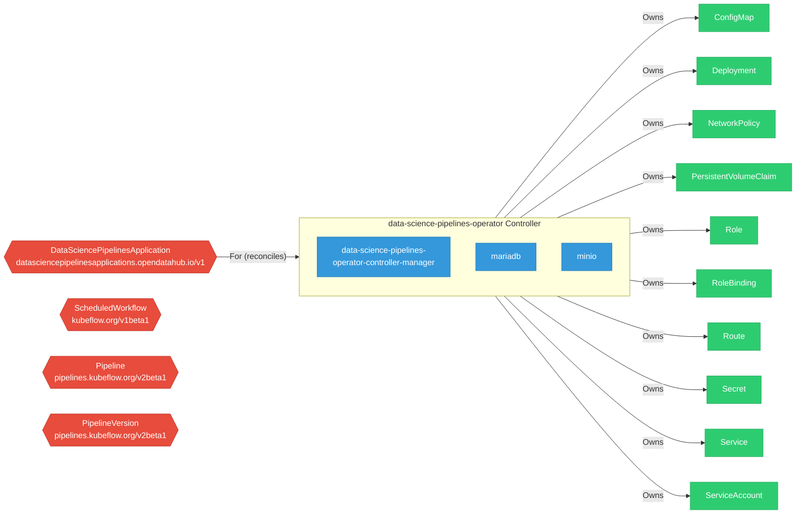

# data-science-pipelines-operator

> **Architecture snapshot: 2026-05-05** (2026-05-05)

**Repository:** opendatahub-io/data-science-pipelines-operator  
**Analyzer:** arch-analyzer 0.2.0  
**Extracted:** 2026-05-05T15:10:08Z

## Summary

| Metric | Count |
|--------|-------|
| CRDs | 4 |
| Deployments | 3 |
| Services | 11 |
| Secrets | 4 |
| Cluster Roles | 4 |
| Controller Watches | 11 |

## Component Architecture

CRDs, controllers, and owned Kubernetes resources.

### CRDs

| Group | Version | Kind | Scope | Fields | Validation Rules | Source |
|-------|---------|------|-------|--------|------------------|--------|
| datasciencepipelinesapplications.opendatahub.io | v1 | DataSciencePipelinesApplication | Namespaced | 205 | 2 | [`config/crd/bases/datasciencepipelinesapplications.opendatahub.io_datasciencepipelinesapplications.yaml`](https://github.com/opendatahub-io/data-science-pipelines-operator/blob/df94cb0eaab69dfb8c641ee8eef47a643921109f/config/crd/bases/datasciencepipelinesapplications.opendatahub.io_datasciencepipelinesapplications.yaml) |
| kubeflow.org | v1beta1 | ScheduledWorkflow | Namespaced | 5 | 0 | [`config/crd/bases/scheduledworkflows.yaml`](https://github.com/opendatahub-io/data-science-pipelines-operator/blob/df94cb0eaab69dfb8c641ee8eef47a643921109f/config/crd/bases/scheduledworkflows.yaml) |
| pipelines.kubeflow.org | v2beta1 | Pipeline | Namespaced | 7 | 0 | [`config/crd/bases/pipelines.kubeflow.org_pipelines.yaml`](https://github.com/opendatahub-io/data-science-pipelines-operator/blob/df94cb0eaab69dfb8c641ee8eef47a643921109f/config/crd/bases/pipelines.kubeflow.org_pipelines.yaml) |
| pipelines.kubeflow.org | v2beta1 | PipelineVersion | Namespaced | 18 | 0 | [`config/crd/bases/pipelines.kubeflow.org_pipelineversions.yaml`](https://github.com/opendatahub-io/data-science-pipelines-operator/blob/df94cb0eaab69dfb8c641ee8eef47a643921109f/config/crd/bases/pipelines.kubeflow.org_pipelineversions.yaml) |

## Dependencies

### Key External Dependencies

| Module | Version |
|--------|---------|
| github.com/go-logr/logr | v1.4.3 |
| github.com/prometheus/client_golang | v1.23.2 |
| k8s.io/api | v0.35.3 |
| k8s.io/apimachinery | v0.35.3 |
| k8s.io/client-go | v0.35.3 |
| sigs.k8s.io/controller-runtime | v0.23.3 |

