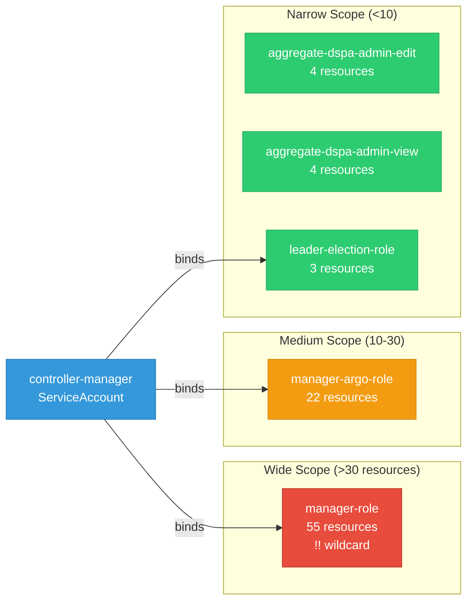

# data-science-pipelines-operator: RBAC

ServiceAccount bindings, roles, and resource permissions.

## RBAC Overview

This component defines a large RBAC surface (193 diagram lines). The graph below groups roles by permission scope.

## Bindings

Subject-to-role mappings defining who has access to what.

| Binding | Type | Role | Subject |
|---------|------|------|---------|
| manager-argo-rolebinding | ClusterRoleBinding | manager-argo-role | ServiceAccount/controller-manager |
| manager-rolebinding | ClusterRoleBinding | manager-role | ServiceAccount/controller-manager |
| leader-election-rolebinding | RoleBinding | leader-election-role | ServiceAccount/controller-manager |

## Role Details

Per-rule breakdown of API groups, resources, and verbs for each role.

| Role | Kind | API Groups | Resources | Verbs |
|------|------|------------|-----------|-------|
| aggregate-dspa-admin-edit | ClusterRole |  | datasciencepipelinesapplications, datasciencepipelinesapplications/api | get, list, watch, create, update, patch, delete |
| aggregate-dspa-admin-edit | ClusterRole |  | pipelines, pipelineversions | get, list, watch, create, update, patch, delete |
| aggregate-dspa-admin-view | ClusterRole |  | datasciencepipelinesapplications, datasciencepipelinesapplications/api | get, list, watch |
| aggregate-dspa-admin-view | ClusterRole |  | pipelines, pipelineversions | get, list, watch |
| manager-argo-role | ClusterRole |  | leases | create, get, update |
| manager-argo-role | ClusterRole |  | pods, pods/exec | create, get, list, watch, update, patch, delete |
| manager-argo-role | ClusterRole |  | configmaps | get, watch, list |
| manager-argo-role | ClusterRole |  | persistentvolumeclaims, persistentvolumeclaims/finalizers | create, update, delete, get |
| manager-argo-role | ClusterRole |  | workflows, workflows/finalizers, workflowtasksets, workflowtasksets/finalizers, workflowartifactgctasks, workflowartifactgctasks/finalizers | get, list, watch, update, patch, delete, create |
| manager-argo-role | ClusterRole |  | workflowtemplates, workflowtemplates/finalizers | get, list, watch |
| manager-argo-role | ClusterRole |  | serviceaccounts | get, list |
| manager-argo-role | ClusterRole |  | workflowtaskresults | list, watch, deletecollection |
| manager-argo-role | ClusterRole |  | serviceaccounts | get, list |
| manager-argo-role | ClusterRole |  | secrets | get |
| manager-argo-role | ClusterRole |  | cronworkflows, cronworkflows/finalizers | get, list, watch, update, patch, delete |
| manager-argo-role | ClusterRole |  | events | create, patch |
| manager-argo-role | ClusterRole |  | poddisruptionbudgets | create, get, delete |
| manager-role | ClusterRole |  | configmaps, secrets, serviceaccounts | create, delete, get, list, patch, update, watch |
| manager-role | ClusterRole |  | events | create, list, patch |
| manager-role | ClusterRole |  | persistentvolumeclaims, persistentvolumes, services | *, create, delete, get, list, patch, update, watch |
| manager-role | ClusterRole |  | pods, pods/exec, pods/log | * |
| manager-role | ClusterRole |  | deployments, deployments/finalizers, replicasets | * |
| manager-role | ClusterRole |  | deployments, services | create, delete, get, list, patch, update, watch |
| manager-role | ClusterRole |  | mutatingwebhookconfigurations, validatingwebhookconfigurations | create |
| manager-role | ClusterRole |  | mutatingwebhookconfigurations, validatingwebhookconfigurations | delete, get, list, patch, update, watch |
| manager-role | ClusterRole |  | deployments | create, delete, get, list, patch, update, watch |
| manager-role | ClusterRole |  | workflowartifactgctasks, workflowartifactgctasks/finalizers, workflows | * |
| manager-role | ClusterRole |  | workflowtaskresults | create, patch |
| manager-role | ClusterRole |  | tokenreviews | create |
| manager-role | ClusterRole |  | subjectaccessreviews | create |
| manager-role | ClusterRole |  | jobs | * |
| manager-role | ClusterRole |  | datasciencepipelinesapplications, datasciencepipelinesapplications/api | create, delete, get, list, patch, update, watch |
| manager-role | ClusterRole |  | datasciencepipelinesapplications/finalizers | update |
| manager-role | ClusterRole |  | datasciencepipelinesapplications/status | get, patch, update |
| manager-role | ClusterRole |  | imagestreamtags | get |
| manager-role | ClusterRole |  | * | * |
| manager-role | ClusterRole |  | seldondeployments | * |
| manager-role | ClusterRole |  | servicemonitors | create, delete, get, list, patch, update, watch |
| manager-role | ClusterRole |  | ingresses | get, list |
| manager-role | ClusterRole |  | networkpolicies | create, delete, get, list, patch, update, watch |
| manager-role | ClusterRole |  | pipelines, pipelines/finalizers, pipelineversions, pipelineversions/finalizers, pipelineversions/status | create, delete, get, list, patch, update, watch |
| manager-role | ClusterRole |  | rayclusters, rayjobs, rayservices | create, delete, get, list, patch |
| manager-role | ClusterRole |  | clusterrolebindings, clusterroles | create, delete, get, list, update, watch |
| manager-role | ClusterRole |  | rolebindings, roles | create, delete, get, list, patch, update, watch |
| manager-role | ClusterRole |  | routes | create, delete, get, list, patch, update, watch |
| manager-role | ClusterRole |  | inferenceservices | create, delete, get, list, patch |
| manager-role | ClusterRole |  | volumesnapshots | create, delete, get |
| manager-role | ClusterRole |  | appwrappers, appwrappers/finalizers, appwrappers/status | create, delete, deletecollection, get, list, patch, update, watch |
| leader-election-role | Role |  | configmaps | get, list, watch, create, update, patch, delete |
| leader-election-role | Role |  | leases | get, list, watch, create, update, patch, delete |
| leader-election-role | Role |  | events | create, patch |

### Cluster Roles

| Name | Resources | Verbs | Source |
|------|-----------|-------|--------|
| aggregate-dspa-admin-edit | datasciencepipelinesapplications, datasciencepipelinesapplications/api | get, list, watch, create, update, patch, delete | [`config/rbac/aggregate_dspa_role_edit.yaml`](https://github.com/opendatahub-io/data-science-pipelines-operator/blob/df94cb0eaab69dfb8c641ee8eef47a643921109f/config/rbac/aggregate_dspa_role_edit.yaml) |
| aggregate-dspa-admin-edit | pipelines, pipelineversions | get, list, watch, create, update, patch, delete | [`config/rbac/aggregate_dspa_role_edit.yaml`](https://github.com/opendatahub-io/data-science-pipelines-operator/blob/df94cb0eaab69dfb8c641ee8eef47a643921109f/config/rbac/aggregate_dspa_role_edit.yaml) |
| aggregate-dspa-admin-view | datasciencepipelinesapplications, datasciencepipelinesapplications/api | get, list, watch | [`config/rbac/aggregate_dspa_role_view.yaml`](https://github.com/opendatahub-io/data-science-pipelines-operator/blob/df94cb0eaab69dfb8c641ee8eef47a643921109f/config/rbac/aggregate_dspa_role_view.yaml) |
| aggregate-dspa-admin-view | pipelines, pipelineversions | get, list, watch | [`config/rbac/aggregate_dspa_role_view.yaml`](https://github.com/opendatahub-io/data-science-pipelines-operator/blob/df94cb0eaab69dfb8c641ee8eef47a643921109f/config/rbac/aggregate_dspa_role_view.yaml) |
| manager-argo-role | leases | create, get, update | [`config/rbac/argo_role.yaml`](https://github.com/opendatahub-io/data-science-pipelines-operator/blob/df94cb0eaab69dfb8c641ee8eef47a643921109f/config/rbac/argo_role.yaml) |
| manager-argo-role | pods, pods/exec | create, get, list, watch, update, patch, delete | [`config/rbac/argo_role.yaml`](https://github.com/opendatahub-io/data-science-pipelines-operator/blob/df94cb0eaab69dfb8c641ee8eef47a643921109f/config/rbac/argo_role.yaml) |
| manager-argo-role | configmaps | get, watch, list | [`config/rbac/argo_role.yaml`](https://github.com/opendatahub-io/data-science-pipelines-operator/blob/df94cb0eaab69dfb8c641ee8eef47a643921109f/config/rbac/argo_role.yaml) |
| manager-argo-role | persistentvolumeclaims, persistentvolumeclaims/finalizers | create, update, delete, get | [`config/rbac/argo_role.yaml`](https://github.com/opendatahub-io/data-science-pipelines-operator/blob/df94cb0eaab69dfb8c641ee8eef47a643921109f/config/rbac/argo_role.yaml) |
| manager-argo-role | workflows, workflows/finalizers, workflowtasksets, workflowtasksets/finalizers, workflowartifactgctasks, workflowartifactgctasks/finalizers | get, list, watch, update, patch, delete, create | [`config/rbac/argo_role.yaml`](https://github.com/opendatahub-io/data-science-pipelines-operator/blob/df94cb0eaab69dfb8c641ee8eef47a643921109f/config/rbac/argo_role.yaml) |
| manager-argo-role | workflowtemplates, workflowtemplates/finalizers | get, list, watch | [`config/rbac/argo_role.yaml`](https://github.com/opendatahub-io/data-science-pipelines-operator/blob/df94cb0eaab69dfb8c641ee8eef47a643921109f/config/rbac/argo_role.yaml) |
| manager-argo-role | serviceaccounts | get, list | [`config/rbac/argo_role.yaml`](https://github.com/opendatahub-io/data-science-pipelines-operator/blob/df94cb0eaab69dfb8c641ee8eef47a643921109f/config/rbac/argo_role.yaml) |
| manager-argo-role | workflowtaskresults | list, watch, deletecollection | [`config/rbac/argo_role.yaml`](https://github.com/opendatahub-io/data-science-pipelines-operator/blob/df94cb0eaab69dfb8c641ee8eef47a643921109f/config/rbac/argo_role.yaml) |
| manager-argo-role | serviceaccounts | get, list | [`config/rbac/argo_role.yaml`](https://github.com/opendatahub-io/data-science-pipelines-operator/blob/df94cb0eaab69dfb8c641ee8eef47a643921109f/config/rbac/argo_role.yaml) |
| manager-argo-role | secrets | get | [`config/rbac/argo_role.yaml`](https://github.com/opendatahub-io/data-science-pipelines-operator/blob/df94cb0eaab69dfb8c641ee8eef47a643921109f/config/rbac/argo_role.yaml) |
| manager-argo-role | cronworkflows, cronworkflows/finalizers | get, list, watch, update, patch, delete | [`config/rbac/argo_role.yaml`](https://github.com/opendatahub-io/data-science-pipelines-operator/blob/df94cb0eaab69dfb8c641ee8eef47a643921109f/config/rbac/argo_role.yaml) |
| manager-argo-role | events | create, patch | [`config/rbac/argo_role.yaml`](https://github.com/opendatahub-io/data-science-pipelines-operator/blob/df94cb0eaab69dfb8c641ee8eef47a643921109f/config/rbac/argo_role.yaml) |
| manager-argo-role | poddisruptionbudgets | create, get, delete | [`config/rbac/argo_role.yaml`](https://github.com/opendatahub-io/data-science-pipelines-operator/blob/df94cb0eaab69dfb8c641ee8eef47a643921109f/config/rbac/argo_role.yaml) |
| manager-role | configmaps, secrets, serviceaccounts | create, delete, get, list, patch, update, watch | [`config/rbac/role.yaml`](https://github.com/opendatahub-io/data-science-pipelines-operator/blob/df94cb0eaab69dfb8c641ee8eef47a643921109f/config/rbac/role.yaml) |
| manager-role | events | create, list, patch | [`config/rbac/role.yaml`](https://github.com/opendatahub-io/data-science-pipelines-operator/blob/df94cb0eaab69dfb8c641ee8eef47a643921109f/config/rbac/role.yaml) |
| manager-role | persistentvolumeclaims, persistentvolumes, services | *, create, delete, get, list, patch, update, watch | [`config/rbac/role.yaml`](https://github.com/opendatahub-io/data-science-pipelines-operator/blob/df94cb0eaab69dfb8c641ee8eef47a643921109f/config/rbac/role.yaml) |
| manager-role | pods, pods/exec, pods/log | * | [`config/rbac/role.yaml`](https://github.com/opendatahub-io/data-science-pipelines-operator/blob/df94cb0eaab69dfb8c641ee8eef47a643921109f/config/rbac/role.yaml) |
| manager-role | deployments, deployments/finalizers, replicasets | * | [`config/rbac/role.yaml`](https://github.com/opendatahub-io/data-science-pipelines-operator/blob/df94cb0eaab69dfb8c641ee8eef47a643921109f/config/rbac/role.yaml) |
| manager-role | deployments, services | create, delete, get, list, patch, update, watch | [`config/rbac/role.yaml`](https://github.com/opendatahub-io/data-science-pipelines-operator/blob/df94cb0eaab69dfb8c641ee8eef47a643921109f/config/rbac/role.yaml) |
| manager-role | mutatingwebhookconfigurations, validatingwebhookconfigurations | create | [`config/rbac/role.yaml`](https://github.com/opendatahub-io/data-science-pipelines-operator/blob/df94cb0eaab69dfb8c641ee8eef47a643921109f/config/rbac/role.yaml) |
| manager-role | mutatingwebhookconfigurations, validatingwebhookconfigurations | delete, get, list, patch, update, watch | [`config/rbac/role.yaml`](https://github.com/opendatahub-io/data-science-pipelines-operator/blob/df94cb0eaab69dfb8c641ee8eef47a643921109f/config/rbac/role.yaml) |
| manager-role | deployments | create, delete, get, list, patch, update, watch | [`config/rbac/role.yaml`](https://github.com/opendatahub-io/data-science-pipelines-operator/blob/df94cb0eaab69dfb8c641ee8eef47a643921109f/config/rbac/role.yaml) |
| manager-role | workflowartifactgctasks, workflowartifactgctasks/finalizers, workflows | * | [`config/rbac/role.yaml`](https://github.com/opendatahub-io/data-science-pipelines-operator/blob/df94cb0eaab69dfb8c641ee8eef47a643921109f/config/rbac/role.yaml) |
| manager-role | workflowtaskresults | create, patch | [`config/rbac/role.yaml`](https://github.com/opendatahub-io/data-science-pipelines-operator/blob/df94cb0eaab69dfb8c641ee8eef47a643921109f/config/rbac/role.yaml) |
| manager-role | tokenreviews | create | [`config/rbac/role.yaml`](https://github.com/opendatahub-io/data-science-pipelines-operator/blob/df94cb0eaab69dfb8c641ee8eef47a643921109f/config/rbac/role.yaml) |
| manager-role | subjectaccessreviews | create | [`config/rbac/role.yaml`](https://github.com/opendatahub-io/data-science-pipelines-operator/blob/df94cb0eaab69dfb8c641ee8eef47a643921109f/config/rbac/role.yaml) |
| manager-role | jobs | * | [`config/rbac/role.yaml`](https://github.com/opendatahub-io/data-science-pipelines-operator/blob/df94cb0eaab69dfb8c641ee8eef47a643921109f/config/rbac/role.yaml) |
| manager-role | datasciencepipelinesapplications, datasciencepipelinesapplications/api | create, delete, get, list, patch, update, watch | [`config/rbac/role.yaml`](https://github.com/opendatahub-io/data-science-pipelines-operator/blob/df94cb0eaab69dfb8c641ee8eef47a643921109f/config/rbac/role.yaml) |
| manager-role | datasciencepipelinesapplications/finalizers | update | [`config/rbac/role.yaml`](https://github.com/opendatahub-io/data-science-pipelines-operator/blob/df94cb0eaab69dfb8c641ee8eef47a643921109f/config/rbac/role.yaml) |
| manager-role | datasciencepipelinesapplications/status | get, patch, update | [`config/rbac/role.yaml`](https://github.com/opendatahub-io/data-science-pipelines-operator/blob/df94cb0eaab69dfb8c641ee8eef47a643921109f/config/rbac/role.yaml) |
| manager-role | imagestreamtags | get | [`config/rbac/role.yaml`](https://github.com/opendatahub-io/data-science-pipelines-operator/blob/df94cb0eaab69dfb8c641ee8eef47a643921109f/config/rbac/role.yaml) |
| manager-role | * | * | [`config/rbac/role.yaml`](https://github.com/opendatahub-io/data-science-pipelines-operator/blob/df94cb0eaab69dfb8c641ee8eef47a643921109f/config/rbac/role.yaml) |
| manager-role | seldondeployments | * | [`config/rbac/role.yaml`](https://github.com/opendatahub-io/data-science-pipelines-operator/blob/df94cb0eaab69dfb8c641ee8eef47a643921109f/config/rbac/role.yaml) |
| manager-role | servicemonitors | create, delete, get, list, patch, update, watch | [`config/rbac/role.yaml`](https://github.com/opendatahub-io/data-science-pipelines-operator/blob/df94cb0eaab69dfb8c641ee8eef47a643921109f/config/rbac/role.yaml) |
| manager-role | ingresses | get, list | [`config/rbac/role.yaml`](https://github.com/opendatahub-io/data-science-pipelines-operator/blob/df94cb0eaab69dfb8c641ee8eef47a643921109f/config/rbac/role.yaml) |
| manager-role | networkpolicies | create, delete, get, list, patch, update, watch | [`config/rbac/role.yaml`](https://github.com/opendatahub-io/data-science-pipelines-operator/blob/df94cb0eaab69dfb8c641ee8eef47a643921109f/config/rbac/role.yaml) |
| manager-role | pipelines, pipelines/finalizers, pipelineversions, pipelineversions/finalizers, pipelineversions/status | create, delete, get, list, patch, update, watch | [`config/rbac/role.yaml`](https://github.com/opendatahub-io/data-science-pipelines-operator/blob/df94cb0eaab69dfb8c641ee8eef47a643921109f/config/rbac/role.yaml) |
| manager-role | rayclusters, rayjobs, rayservices | create, delete, get, list, patch | [`config/rbac/role.yaml`](https://github.com/opendatahub-io/data-science-pipelines-operator/blob/df94cb0eaab69dfb8c641ee8eef47a643921109f/config/rbac/role.yaml) |
| manager-role | clusterrolebindings, clusterroles | create, delete, get, list, update, watch | [`config/rbac/role.yaml`](https://github.com/opendatahub-io/data-science-pipelines-operator/blob/df94cb0eaab69dfb8c641ee8eef47a643921109f/config/rbac/role.yaml) |
| manager-role | rolebindings, roles | create, delete, get, list, patch, update, watch | [`config/rbac/role.yaml`](https://github.com/opendatahub-io/data-science-pipelines-operator/blob/df94cb0eaab69dfb8c641ee8eef47a643921109f/config/rbac/role.yaml) |
| manager-role | routes | create, delete, get, list, patch, update, watch | [`config/rbac/role.yaml`](https://github.com/opendatahub-io/data-science-pipelines-operator/blob/df94cb0eaab69dfb8c641ee8eef47a643921109f/config/rbac/role.yaml) |
| manager-role | inferenceservices | create, delete, get, list, patch | [`config/rbac/role.yaml`](https://github.com/opendatahub-io/data-science-pipelines-operator/blob/df94cb0eaab69dfb8c641ee8eef47a643921109f/config/rbac/role.yaml) |
| manager-role | volumesnapshots | create, delete, get | [`config/rbac/role.yaml`](https://github.com/opendatahub-io/data-science-pipelines-operator/blob/df94cb0eaab69dfb8c641ee8eef47a643921109f/config/rbac/role.yaml) |
| manager-role | appwrappers, appwrappers/finalizers, appwrappers/status | create, delete, deletecollection, get, list, patch, update, watch | [`config/rbac/role.yaml`](https://github.com/opendatahub-io/data-science-pipelines-operator/blob/df94cb0eaab69dfb8c641ee8eef47a643921109f/config/rbac/role.yaml) |

### Kubebuilder RBAC Markers

Kubebuilder `+kubebuilder:rbac` markers declare the RBAC requirements of controller reconcilers. These are the source of truth for generated ClusterRole manifests. 32 markers found.

| File | Line | Groups | Resources | Verbs |
|------|------|--------|-----------|-------|
| [`controllers/dspipeline_controller.go:178`](https://github.com/opendatahub-io/data-science-pipelines-operator/blob/df94cb0eaab69dfb8c641ee8eef47a643921109f/controllers/dspipeline_controller.go#L178) | 178 | datasciencepipelinesapplications.opendatahub.io | datasciencepipelinesapplications | get, list, watch, create, update, patch, delete |
| [`controllers/dspipeline_controller.go:179`](https://github.com/opendatahub-io/data-science-pipelines-operator/blob/df94cb0eaab69dfb8c641ee8eef47a643921109f/controllers/dspipeline_controller.go#L179) | 179 | datasciencepipelinesapplications.opendatahub.io | datasciencepipelinesapplications/api | get, list, watch, create, update, patch, delete |
| [`controllers/dspipeline_controller.go:180`](https://github.com/opendatahub-io/data-science-pipelines-operator/blob/df94cb0eaab69dfb8c641ee8eef47a643921109f/controllers/dspipeline_controller.go#L180) | 180 | datasciencepipelinesapplications.opendatahub.io | datasciencepipelinesapplications/status | get, update, patch |
| [`controllers/dspipeline_controller.go:181`](https://github.com/opendatahub-io/data-science-pipelines-operator/blob/df94cb0eaab69dfb8c641ee8eef47a643921109f/controllers/dspipeline_controller.go#L181) | 181 | datasciencepipelinesapplications.opendatahub.io | datasciencepipelinesapplications/finalizers | update |
| [`controllers/dspipeline_controller.go:182`](https://github.com/opendatahub-io/data-science-pipelines-operator/blob/df94cb0eaab69dfb8c641ee8eef47a643921109f/controllers/dspipeline_controller.go#L182) | 182 | apps | deployments | get, list, watch, create, update, patch, delete |
| [`controllers/dspipeline_controller.go:183`](https://github.com/opendatahub-io/data-science-pipelines-operator/blob/df94cb0eaab69dfb8c641ee8eef47a643921109f/controllers/dspipeline_controller.go#L183) | 183 | networking.k8s.io | networkpolicies | get, list, watch, create, update, patch, delete |
| [`controllers/dspipeline_controller.go:184`](https://github.com/opendatahub-io/data-science-pipelines-operator/blob/df94cb0eaab69dfb8c641ee8eef47a643921109f/controllers/dspipeline_controller.go#L184) | 184 | networking.k8s.io | ingresses | get, list |
| [`controllers/dspipeline_controller.go:185`](https://github.com/opendatahub-io/data-science-pipelines-operator/blob/df94cb0eaab69dfb8c641ee8eef47a643921109f/controllers/dspipeline_controller.go#L185) | 185 | * | deployments, services | get, list, watch, create, update, patch, delete |
| [`controllers/dspipeline_controller.go:186`](https://github.com/opendatahub-io/data-science-pipelines-operator/blob/df94cb0eaab69dfb8c641ee8eef47a643921109f/controllers/dspipeline_controller.go#L186) | 186 | core | secrets, configmaps, services, serviceaccounts, persistentvolumes, persistentvolumeclaims | get, list, watch, create, update, patch, delete |
| [`controllers/dspipeline_controller.go:187`](https://github.com/opendatahub-io/data-science-pipelines-operator/blob/df94cb0eaab69dfb8c641ee8eef47a643921109f/controllers/dspipeline_controller.go#L187) | 187 | core | persistentvolumes, persistentvolumeclaims | * |
| [`controllers/dspipeline_controller.go:188`](https://github.com/opendatahub-io/data-science-pipelines-operator/blob/df94cb0eaab69dfb8c641ee8eef47a643921109f/controllers/dspipeline_controller.go#L188) | 188 | rbac.authorization.k8s.io | roles, rolebindings | get, list, watch, create, update, patch, delete |
| [`controllers/dspipeline_controller.go:189`](https://github.com/opendatahub-io/data-science-pipelines-operator/blob/df94cb0eaab69dfb8c641ee8eef47a643921109f/controllers/dspipeline_controller.go#L189) | 189 | rbac.authorization.k8s.io | clusterroles, clusterrolebindings | get, list, watch, create, update, delete |
| [`controllers/dspipeline_controller.go:190`](https://github.com/opendatahub-io/data-science-pipelines-operator/blob/df94cb0eaab69dfb8c641ee8eef47a643921109f/controllers/dspipeline_controller.go#L190) | 190 | route.openshift.io | routes | get, list, watch, create, update, patch, delete |
| [`controllers/dspipeline_controller.go:191`](https://github.com/opendatahub-io/data-science-pipelines-operator/blob/df94cb0eaab69dfb8c641ee8eef47a643921109f/controllers/dspipeline_controller.go#L191) | 191 | snapshot.storage.k8s.io | volumesnapshots | create, delete, get |
| [`controllers/dspipeline_controller.go:192`](https://github.com/opendatahub-io/data-science-pipelines-operator/blob/df94cb0eaab69dfb8c641ee8eef47a643921109f/controllers/dspipeline_controller.go#L192) | 192 | argoproj.io | workflows | * |
| [`controllers/dspipeline_controller.go:193`](https://github.com/opendatahub-io/data-science-pipelines-operator/blob/df94cb0eaab69dfb8c641ee8eef47a643921109f/controllers/dspipeline_controller.go#L193) | 193 | argoproj.io | workflowtaskresults | create, patch |
| [`controllers/dspipeline_controller.go:194`](https://github.com/opendatahub-io/data-science-pipelines-operator/blob/df94cb0eaab69dfb8c641ee8eef47a643921109f/controllers/dspipeline_controller.go#L194) | 194 | argoproj.io | workflowartifactgctasks, workflowartifactgctasks/finalizers | * |
| [`controllers/dspipeline_controller.go:195`](https://github.com/opendatahub-io/data-science-pipelines-operator/blob/df94cb0eaab69dfb8c641ee8eef47a643921109f/controllers/dspipeline_controller.go#L195) | 195 | core | pods, pods/exec, pods/log, services | * |
| [`controllers/dspipeline_controller.go:196`](https://github.com/opendatahub-io/data-science-pipelines-operator/blob/df94cb0eaab69dfb8c641ee8eef47a643921109f/controllers/dspipeline_controller.go#L196) | 196 | core, apps, extensions | deployments, deployments/finalizers, replicasets | * |
| [`controllers/dspipeline_controller.go:197`](https://github.com/opendatahub-io/data-science-pipelines-operator/blob/df94cb0eaab69dfb8c641ee8eef47a643921109f/controllers/dspipeline_controller.go#L197) | 197 | kubeflow.org | * | * |
| [`controllers/dspipeline_controller.go:198`](https://github.com/opendatahub-io/data-science-pipelines-operator/blob/df94cb0eaab69dfb8c641ee8eef47a643921109f/controllers/dspipeline_controller.go#L198) | 198 | batch | jobs | * |
| [`controllers/dspipeline_controller.go:199`](https://github.com/opendatahub-io/data-science-pipelines-operator/blob/df94cb0eaab69dfb8c641ee8eef47a643921109f/controllers/dspipeline_controller.go#L199) | 199 | machinelearning.seldon.io | seldondeployments | * |
| [`controllers/dspipeline_controller.go:200`](https://github.com/opendatahub-io/data-science-pipelines-operator/blob/df94cb0eaab69dfb8c641ee8eef47a643921109f/controllers/dspipeline_controller.go#L200) | 200 | ray.io | rayclusters, rayjobs, rayservices | create, get, list, patch, delete |
| [`controllers/dspipeline_controller.go:201`](https://github.com/opendatahub-io/data-science-pipelines-operator/blob/df94cb0eaab69dfb8c641ee8eef47a643921109f/controllers/dspipeline_controller.go#L201) | 201 | serving.kserve.io | inferenceservices | create, get, list, patch, delete |
| [`controllers/dspipeline_controller.go:202`](https://github.com/opendatahub-io/data-science-pipelines-operator/blob/df94cb0eaab69dfb8c641ee8eef47a643921109f/controllers/dspipeline_controller.go#L202) | 202 | authorization.k8s.io | subjectaccessreviews | create |
| [`controllers/dspipeline_controller.go:203`](https://github.com/opendatahub-io/data-science-pipelines-operator/blob/df94cb0eaab69dfb8c641ee8eef47a643921109f/controllers/dspipeline_controller.go#L203) | 203 | authentication.k8s.io | tokenreviews | create |
| [`controllers/dspipeline_controller.go:204`](https://github.com/opendatahub-io/data-science-pipelines-operator/blob/df94cb0eaab69dfb8c641ee8eef47a643921109f/controllers/dspipeline_controller.go#L204) | 204 | image.openshift.io | imagestreamtags | get |
| [`controllers/dspipeline_controller.go:205`](https://github.com/opendatahub-io/data-science-pipelines-operator/blob/df94cb0eaab69dfb8c641ee8eef47a643921109f/controllers/dspipeline_controller.go#L205) | 205 | core | events | create, patch, list |
| [`controllers/dspipeline_controller.go:206`](https://github.com/opendatahub-io/data-science-pipelines-operator/blob/df94cb0eaab69dfb8c641ee8eef47a643921109f/controllers/dspipeline_controller.go#L206) | 206 | monitoring.coreos.com | servicemonitors | get, list, watch, create, update, patch, delete |
| [`controllers/dspipeline_controller.go:207`](https://github.com/opendatahub-io/data-science-pipelines-operator/blob/df94cb0eaab69dfb8c641ee8eef47a643921109f/controllers/dspipeline_controller.go#L207) | 207 | workload.codeflare.dev | appwrappers, appwrappers/finalizers, appwrappers/status | create, delete, deletecollection, get, list, patch, update, watch |
| [`controllers/dspipeline_controller.go:208`](https://github.com/opendatahub-io/data-science-pipelines-operator/blob/df94cb0eaab69dfb8c641ee8eef47a643921109f/controllers/dspipeline_controller.go#L208) | 208 | pipelines.kubeflow.org | pipelines, pipelines/finalizers | create, get, list, watch, update, patch, delete |
| [`controllers/dspipeline_controller.go:209`](https://github.com/opendatahub-io/data-science-pipelines-operator/blob/df94cb0eaab69dfb8c641ee8eef47a643921109f/controllers/dspipeline_controller.go#L209) | 209 | pipelines.kubeflow.org | pipelineversions, pipelineversions/status, pipelineversions/finalizers | create, get, list, watch, update, patch, delete |

