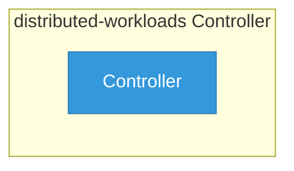

# distributed-workloads

> **Architecture snapshot: 2026-05-05** (2026-05-05)

**Repository:** opendatahub-io/distributed-workloads  
**Analyzer:** arch-analyzer 0.2.0  
**Extracted:** 2026-05-05T15:09:04Z

## Summary

| Metric | Count |
|--------|-------|
| CRDs | 0 |
| Deployments | 0 |
| Services | 0 |
| Secrets | 0 |
| Cluster Roles | 0 |
| Controller Watches | 0 |

## Component Architecture

CRDs, controllers, and owned Kubernetes resources.

### CRDs

No CRDs defined.

## Dependencies

### Key External Dependencies

| Module | Version |
|--------|---------|
| github.com/operator-framework/api | v0.36.0 |
| github.com/operator-framework/operator-lifecycle-manager | v0.38.0 |
| github.com/prometheus/client_golang | v1.23.2 |
| github.com/prometheus/common | v0.67.2 |
| k8s.io/api | v0.34.1 |
| k8s.io/apimachinery | v0.34.1 |
| k8s.io/client-go | v0.34.1 |

