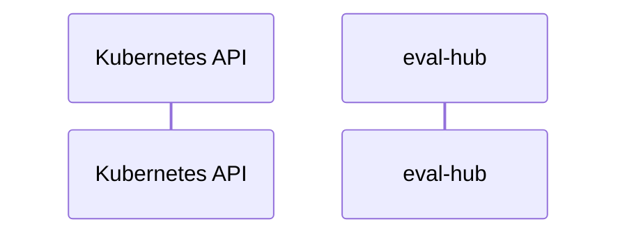

# eval-hub: Dataflow

## Controller Watches

Kubernetes resources this controller monitors for changes. Each watch triggers reconciliation when the watched resource is created, updated, or deleted.

No controller watches found.

## Reconciliation Flow

How the controller interacts with the Kubernetes API during reconciliation.

### HTTP Endpoints

| Method | Path | Source |
|--------|------|--------|
| GET | /api/v1/evaluations/collections | [`docs/openapi.yaml`](https://github.com/eval-hub/eval-hub/blob/334b0fbef0558005e41018e0493ac95d268054da/docs/openapi.yaml) |
| POST | /api/v1/evaluations/collections | [`docs/openapi.yaml`](https://github.com/eval-hub/eval-hub/blob/334b0fbef0558005e41018e0493ac95d268054da/docs/openapi.yaml) |
| DELETE | /api/v1/evaluations/collections/{id} | [`docs/openapi.yaml`](https://github.com/eval-hub/eval-hub/blob/334b0fbef0558005e41018e0493ac95d268054da/docs/openapi.yaml) |
| GET | /api/v1/evaluations/collections/{id} | [`docs/openapi.yaml`](https://github.com/eval-hub/eval-hub/blob/334b0fbef0558005e41018e0493ac95d268054da/docs/openapi.yaml) |
| PATCH | /api/v1/evaluations/collections/{id} | [`docs/openapi.yaml`](https://github.com/eval-hub/eval-hub/blob/334b0fbef0558005e41018e0493ac95d268054da/docs/openapi.yaml) |
| PUT | /api/v1/evaluations/collections/{id} | [`docs/openapi.yaml`](https://github.com/eval-hub/eval-hub/blob/334b0fbef0558005e41018e0493ac95d268054da/docs/openapi.yaml) |
| GET | /api/v1/evaluations/jobs | [`docs/openapi.yaml`](https://github.com/eval-hub/eval-hub/blob/334b0fbef0558005e41018e0493ac95d268054da/docs/openapi.yaml) |
| POST | /api/v1/evaluations/jobs | [`docs/openapi.yaml`](https://github.com/eval-hub/eval-hub/blob/334b0fbef0558005e41018e0493ac95d268054da/docs/openapi.yaml) |
| DELETE | /api/v1/evaluations/jobs/{id} | [`docs/openapi.yaml`](https://github.com/eval-hub/eval-hub/blob/334b0fbef0558005e41018e0493ac95d268054da/docs/openapi.yaml) |
| GET | /api/v1/evaluations/jobs/{id} | [`docs/openapi.yaml`](https://github.com/eval-hub/eval-hub/blob/334b0fbef0558005e41018e0493ac95d268054da/docs/openapi.yaml) |
| GET | /api/v1/evaluations/providers | [`docs/openapi.yaml`](https://github.com/eval-hub/eval-hub/blob/334b0fbef0558005e41018e0493ac95d268054da/docs/openapi.yaml) |
| POST | /api/v1/evaluations/providers | [`docs/openapi.yaml`](https://github.com/eval-hub/eval-hub/blob/334b0fbef0558005e41018e0493ac95d268054da/docs/openapi.yaml) |
| DELETE | /api/v1/evaluations/providers/{id} | [`docs/openapi.yaml`](https://github.com/eval-hub/eval-hub/blob/334b0fbef0558005e41018e0493ac95d268054da/docs/openapi.yaml) |
| GET | /api/v1/evaluations/providers/{id} | [`docs/openapi.yaml`](https://github.com/eval-hub/eval-hub/blob/334b0fbef0558005e41018e0493ac95d268054da/docs/openapi.yaml) |
| PATCH | /api/v1/evaluations/providers/{id} | [`docs/openapi.yaml`](https://github.com/eval-hub/eval-hub/blob/334b0fbef0558005e41018e0493ac95d268054da/docs/openapi.yaml) |
| PUT | /api/v1/evaluations/providers/{id} | [`docs/openapi.yaml`](https://github.com/eval-hub/eval-hub/blob/334b0fbef0558005e41018e0493ac95d268054da/docs/openapi.yaml) |
| GET | /api/v1/health | [`docs/openapi.yaml`](https://github.com/eval-hub/eval-hub/blob/334b0fbef0558005e41018e0493ac95d268054da/docs/openapi.yaml) |

## Configuration

ConfigMaps and Helm values that control this component's runtime behavior.

