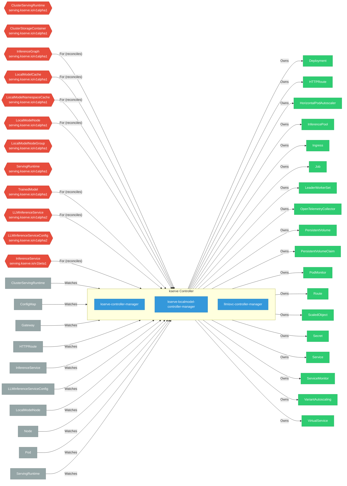

# kserve

> **Architecture snapshot: 2026-05-05** (2026-05-05)

**Repository:** kserve/kserve  
**Analyzer:** arch-analyzer 0.2.0  
**Extracted:** 2026-05-05T15:10:58Z

## Summary

| Metric | Count |
|--------|-------|
| CRDs | 12 |
| Deployments | 3 |
| Services | 6 |
| Secrets | 3 |
| Cluster Roles | 2 |
| Controller Watches | 49 |

## Component Architecture

CRDs, controllers, and owned Kubernetes resources.

### CRDs

| Group | Version | Kind | Scope | Fields | Validation Rules | Source |
|-------|---------|------|-------|--------|------------------|--------|
| serving.kserve.io | v1alpha1 | ClusterServingRuntime | Cluster | 1183 | 0 | [`config/crd/full/serving.kserve.io_clusterservingruntimes.yaml`](https://github.com/kserve/kserve/blob/5d509f23f903a2657dbe2394e785b3bd84c4c40d/config/crd/full/serving.kserve.io_clusterservingruntimes.yaml) |
| serving.kserve.io | v1alpha1 | ClusterStorageContainer | Cluster | 216 | 0 | [`config/crd/full/clusterstoragecontainer/serving.kserve.io_clusterstoragecontainers.yaml`](https://github.com/kserve/kserve/blob/5d509f23f903a2657dbe2394e785b3bd84c4c40d/config/crd/full/clusterstoragecontainer/serving.kserve.io_clusterstoragecontainers.yaml) |
| serving.kserve.io | v1alpha1 | InferenceGraph | Namespaced | 150 | 0 | [`config/crd/full/serving.kserve.io_inferencegraphs.yaml`](https://github.com/kserve/kserve/blob/5d509f23f903a2657dbe2394e785b3bd84c4c40d/config/crd/full/serving.kserve.io_inferencegraphs.yaml) |
| serving.kserve.io | v1alpha1 | LocalModelCache | Cluster | 20 | 1 | [`config/crd/full/localmodel/serving.kserve.io_localmodelcaches.yaml`](https://github.com/kserve/kserve/blob/5d509f23f903a2657dbe2394e785b3bd84c4c40d/config/crd/full/localmodel/serving.kserve.io_localmodelcaches.yaml) |
| serving.kserve.io | v1alpha1 | LocalModelNamespaceCache | Namespaced | 20 | 1 | [`config/crd/full/localmodel/serving.kserve.io_localmodelnamespacecaches.yaml`](https://github.com/kserve/kserve/blob/5d509f23f903a2657dbe2394e785b3bd84c4c40d/config/crd/full/localmodel/serving.kserve.io_localmodelnamespacecaches.yaml) |
| serving.kserve.io | v1alpha1 | LocalModelNode | Cluster | 15 | 0 | [`config/crd/full/localmodel/serving.kserve.io_localmodelnodes.yaml`](https://github.com/kserve/kserve/blob/5d509f23f903a2657dbe2394e785b3bd84c4c40d/config/crd/full/localmodel/serving.kserve.io_localmodelnodes.yaml) |
| serving.kserve.io | v1alpha1 | LocalModelNodeGroup | Cluster | 220 | 0 | [`config/crd/full/localmodel/serving.kserve.io_localmodelnodegroups.yaml`](https://github.com/kserve/kserve/blob/5d509f23f903a2657dbe2394e785b3bd84c4c40d/config/crd/full/localmodel/serving.kserve.io_localmodelnodegroups.yaml) |
| serving.kserve.io | v1alpha1 | ServingRuntime | Namespaced | 1183 | 0 | [`config/crd/full/serving.kserve.io_servingruntimes.yaml`](https://github.com/kserve/kserve/blob/5d509f23f903a2657dbe2394e785b3bd84c4c40d/config/crd/full/serving.kserve.io_servingruntimes.yaml) |
| serving.kserve.io | v1alpha1 | TrainedModel | Namespaced | 25 | 0 | [`config/crd/full/serving.kserve.io_trainedmodels.yaml`](https://github.com/kserve/kserve/blob/5d509f23f903a2657dbe2394e785b3bd84c4c40d/config/crd/full/serving.kserve.io_trainedmodels.yaml) |
| serving.kserve.io | v1alpha2 | LLMInferenceService | Namespaced | 5732 | 110 | [`config/crd/full/llmisvc/serving.kserve.io_llminferenceservices.yaml`](https://github.com/kserve/kserve/blob/5d509f23f903a2657dbe2394e785b3bd84c4c40d/config/crd/full/llmisvc/serving.kserve.io_llminferenceservices.yaml) |
| serving.kserve.io | v1alpha2 | LLMInferenceServiceConfig | Namespaced | 5711 | 95 | [`config/crd/full/llmisvc/serving.kserve.io_llminferenceserviceconfigs.yaml`](https://github.com/kserve/kserve/blob/5d509f23f903a2657dbe2394e785b3bd84c4c40d/config/crd/full/llmisvc/serving.kserve.io_llminferenceserviceconfigs.yaml) |
| serving.kserve.io | v1beta1 | InferenceService | Namespaced | 6547 | 0 | [`config/crd/full/serving.kserve.io_inferenceservices.yaml`](https://github.com/kserve/kserve/blob/5d509f23f903a2657dbe2394e785b3bd84c4c40d/config/crd/full/serving.kserve.io_inferenceservices.yaml) |

## Dependencies

### Key External Dependencies

| Module | Version |
|--------|---------|
| github.com/go-logr/logr | v1.4.3 |
| github.com/go-logr/zapr | v1.3.0 |
| github.com/prometheus-operator/prometheus-operator/pkg/apis/monitoring | v0.89.0 |
| github.com/prometheus/client_model | v0.6.2 |
| github.com/prometheus/common | v0.67.4 |
| k8s.io/api | v0.34.5 |
| k8s.io/apiextensions-apiserver | v0.34.3 |
| k8s.io/apimachinery | v0.34.5 |
| k8s.io/client-go | v0.34.5 |
| sigs.k8s.io/controller-runtime | v0.19.7 |

