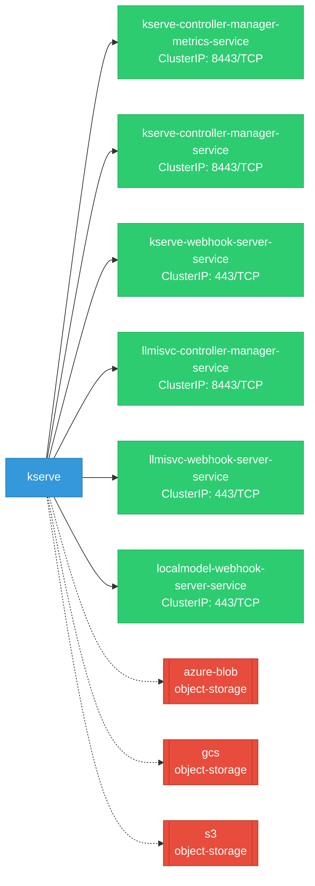
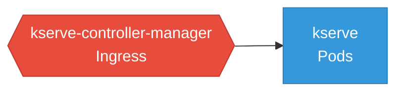

# kserve: Network

## Service Map

### Services

| Name | Type | Ports | Source |
|------|------|-------|--------|
| kserve-controller-manager-metrics-service | ClusterIP | 8443/TCP | [`kustomize:config/overlays/odh`](https://github.com/kserve/kserve/blob/5d509f23f903a2657dbe2394e785b3bd84c4c40d/kustomize:config/overlays/odh) |
| kserve-controller-manager-service | ClusterIP | 8443/TCP | [`kustomize:config/overlays/odh`](https://github.com/kserve/kserve/blob/5d509f23f903a2657dbe2394e785b3bd84c4c40d/kustomize:config/overlays/odh) |
| kserve-webhook-server-service | ClusterIP | 443/TCP | [`kustomize:config/overlays/odh`](https://github.com/kserve/kserve/blob/5d509f23f903a2657dbe2394e785b3bd84c4c40d/kustomize:config/overlays/odh) |
| llmisvc-controller-manager-service | ClusterIP | 8443/TCP | [`kustomize:config/overlays/odh`](https://github.com/kserve/kserve/blob/5d509f23f903a2657dbe2394e785b3bd84c4c40d/kustomize:config/overlays/odh) |
| llmisvc-webhook-server-service | ClusterIP | 443/TCP | [`kustomize:config/overlays/odh`](https://github.com/kserve/kserve/blob/5d509f23f903a2657dbe2394e785b3bd84c4c40d/kustomize:config/overlays/odh) |
| localmodel-webhook-server-service | ClusterIP | 443/TCP | [`config/webhook/localmodel/service.yaml`](https://github.com/kserve/kserve/blob/5d509f23f903a2657dbe2394e785b3bd84c4c40d/config/webhook/localmodel/service.yaml) |

### Ingress / Routing

| Kind | Name | Hosts | Paths | TLS | Source |
|------|------|-------|-------|-----|--------|
| HTTPRoute | rbac-inferred |  |  | no | [`rbac/kserve-manager-role`](https://github.com/kserve/kserve/blob/5d509f23f903a2657dbe2394e785b3bd84c4c40d/rbac/kserve-manager-role) |
| Ingress | rbac-inferred |  |  | no | [`rbac/kserve-manager-role`](https://github.com/kserve/kserve/blob/5d509f23f903a2657dbe2394e785b3bd84c4c40d/rbac/kserve-manager-role) |
| Route | rbac-inferred |  |  | no | [`rbac/kserve-manager-role`](https://github.com/kserve/kserve/blob/5d509f23f903a2657dbe2394e785b3bd84c4c40d/rbac/kserve-manager-role) |
| VirtualService | rbac-inferred |  |  | no | [`rbac/kserve-manager-role`](https://github.com/kserve/kserve/blob/5d509f23f903a2657dbe2394e785b3bd84c4c40d/rbac/kserve-manager-role) |

### Network Policies

| Name | Policy Types | Source |
|------|-------------|--------|
| kserve-controller-manager |  | [`kustomize:config/overlays/odh`](https://github.com/kserve/kserve/blob/5d509f23f903a2657dbe2394e785b3bd84c4c40d/kustomize:config/overlays/odh) |

## Network Policy Graph

Visual representation of NetworkPolicy rules. Ingress rules show what traffic is allowed into pods, egress rules show what traffic is allowed out.

