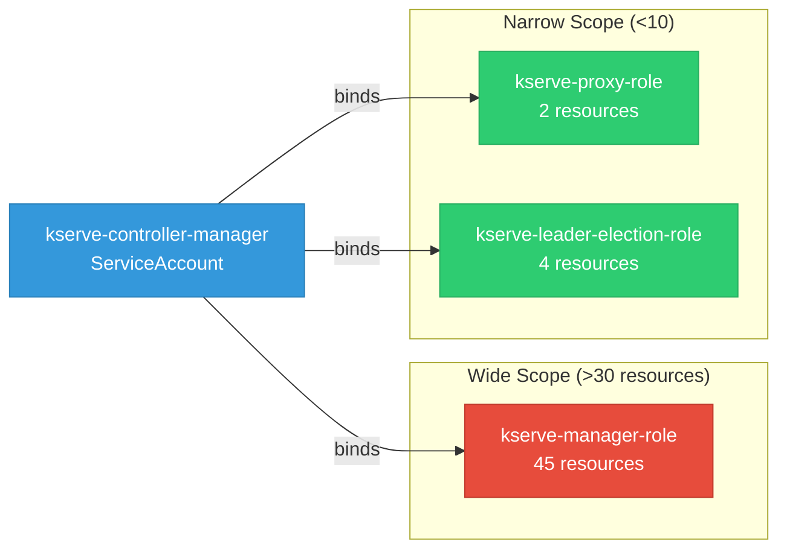

# kserve: RBAC

ServiceAccount bindings, roles, and resource permissions.

## RBAC Overview

This component defines a large RBAC surface (119 diagram lines). The graph below groups roles by permission scope.

## Bindings

Subject-to-role mappings defining who has access to what.

| Binding | Type | Role | Subject |
|---------|------|------|---------|
| kserve-manager-rolebinding | ClusterRoleBinding | kserve-manager-role | ServiceAccount/kserve-controller-manager |
| kserve-proxy-rolebinding | ClusterRoleBinding | kserve-proxy-role | ServiceAccount/kserve-controller-manager |
| kserve-leader-election-rolebinding | RoleBinding | kserve-leader-election-role | ServiceAccount/kserve-controller-manager |

## Role Details

Per-rule breakdown of API groups, resources, and verbs for each role.

| Role | Kind | API Groups | Resources | Verbs |
|------|------|------------|-----------|-------|
| kserve-manager-role | ClusterRole |  | configmaps | create, get, update |
| kserve-manager-role | ClusterRole |  | events, services | create, delete, get, list, patch, update, watch |
| kserve-manager-role | ClusterRole |  | namespaces, pods | get, list, watch |
| kserve-manager-role | ClusterRole |  | secrets | get |
| kserve-manager-role | ClusterRole |  | serviceaccounts | create, delete, get, patch |
| kserve-manager-role | ClusterRole |  | mutatingwebhookconfigurations, validatingwebhookconfigurations | create, delete, get, list, patch, update, watch |
| kserve-manager-role | ClusterRole |  | deployments | create, delete, get, list, patch, update, watch |
| kserve-manager-role | ClusterRole |  | horizontalpodautoscalers | create, delete, get, list, patch, update, watch |
| kserve-manager-role | ClusterRole |  | httproutes | create, delete, get, list, patch, update, watch |
| kserve-manager-role | ClusterRole |  | scaledobjects, scaledobjects/finalizers | create, delete, get, list, patch, update, watch |
| kserve-manager-role | ClusterRole |  | scaledobjects/status | get, patch, update |
| kserve-manager-role | ClusterRole |  | virtualservices, virtualservices/finalizers | create, delete, get, list, patch, update, watch |
| kserve-manager-role | ClusterRole |  | virtualservices/status | get, patch, update |
| kserve-manager-role | ClusterRole |  | ingresses | create, delete, get, list, patch, update, watch |
| kserve-manager-role | ClusterRole |  | opentelemetrycollectors, opentelemetrycollectors/finalizers | create, delete, get, list, patch, update, watch |
| kserve-manager-role | ClusterRole |  | opentelemetrycollectors/status | get, patch, update |
| kserve-manager-role | ClusterRole |  | clusterrolebindings | create, get, patch, update |
| kserve-manager-role | ClusterRole |  | routes | create, delete, get, list, patch, update, watch |
| kserve-manager-role | ClusterRole |  | routes/status | get |
| kserve-manager-role | ClusterRole |  | services, services/finalizers | create, delete, get, list, patch, update, watch |
| kserve-manager-role | ClusterRole |  | services/status | get, patch, update |
| kserve-manager-role | ClusterRole |  | clusterservingruntimes, clusterservingruntimes/finalizers, clusterstoragecontainers, inferencegraphs, inferencegraphs/finalizers, inferenceservices, inferenceservices/finalizers, servingruntimes, servingruntimes/finalizers, trainedmodels | create, delete, get, list, patch, update, watch |
| kserve-manager-role | ClusterRole |  | clusterservingruntimes/status, inferencegraphs/status, inferenceservices/status, servingruntimes/status, trainedmodels/status | get, patch, update |
| kserve-manager-role | ClusterRole |  | localmodelcaches, localmodelnamespacecaches | get, list, watch |
| kserve-proxy-role | ClusterRole |  | tokenreviews | create |
| kserve-proxy-role | ClusterRole |  | subjectaccessreviews | create |
| kserve-leader-election-role | Role |  | leases | create, get, list, update |
| kserve-leader-election-role | Role |  | configmaps | get, list, watch, create, update, patch, delete |
| kserve-leader-election-role | Role |  | configmaps/status | get, update, patch |
| kserve-leader-election-role | Role |  | events | create |

### Cluster Roles

| Name | Resources | Verbs | Source |
|------|-----------|-------|--------|
| kserve-manager-role | configmaps | create, get, update | [`config/rbac/role.yaml`](https://github.com/kserve/kserve/blob/50337bf162feeeca021123b3822076ef93d66731/config/rbac/role.yaml) |
| kserve-manager-role | events, services | create, delete, get, list, patch, update, watch | [`config/rbac/role.yaml`](https://github.com/kserve/kserve/blob/50337bf162feeeca021123b3822076ef93d66731/config/rbac/role.yaml) |
| kserve-manager-role | namespaces, pods | get, list, watch | [`config/rbac/role.yaml`](https://github.com/kserve/kserve/blob/50337bf162feeeca021123b3822076ef93d66731/config/rbac/role.yaml) |
| kserve-manager-role | secrets | get | [`config/rbac/role.yaml`](https://github.com/kserve/kserve/blob/50337bf162feeeca021123b3822076ef93d66731/config/rbac/role.yaml) |
| kserve-manager-role | serviceaccounts | create, delete, get, patch | [`config/rbac/role.yaml`](https://github.com/kserve/kserve/blob/50337bf162feeeca021123b3822076ef93d66731/config/rbac/role.yaml) |
| kserve-manager-role | mutatingwebhookconfigurations, validatingwebhookconfigurations | create, delete, get, list, patch, update, watch | [`config/rbac/role.yaml`](https://github.com/kserve/kserve/blob/50337bf162feeeca021123b3822076ef93d66731/config/rbac/role.yaml) |
| kserve-manager-role | deployments | create, delete, get, list, patch, update, watch | [`config/rbac/role.yaml`](https://github.com/kserve/kserve/blob/50337bf162feeeca021123b3822076ef93d66731/config/rbac/role.yaml) |
| kserve-manager-role | horizontalpodautoscalers | create, delete, get, list, patch, update, watch | [`config/rbac/role.yaml`](https://github.com/kserve/kserve/blob/50337bf162feeeca021123b3822076ef93d66731/config/rbac/role.yaml) |
| kserve-manager-role | httproutes | create, delete, get, list, patch, update, watch | [`config/rbac/role.yaml`](https://github.com/kserve/kserve/blob/50337bf162feeeca021123b3822076ef93d66731/config/rbac/role.yaml) |
| kserve-manager-role | scaledobjects, scaledobjects/finalizers | create, delete, get, list, patch, update, watch | [`config/rbac/role.yaml`](https://github.com/kserve/kserve/blob/50337bf162feeeca021123b3822076ef93d66731/config/rbac/role.yaml) |
| kserve-manager-role | scaledobjects/status | get, patch, update | [`config/rbac/role.yaml`](https://github.com/kserve/kserve/blob/50337bf162feeeca021123b3822076ef93d66731/config/rbac/role.yaml) |
| kserve-manager-role | virtualservices, virtualservices/finalizers | create, delete, get, list, patch, update, watch | [`config/rbac/role.yaml`](https://github.com/kserve/kserve/blob/50337bf162feeeca021123b3822076ef93d66731/config/rbac/role.yaml) |
| kserve-manager-role | virtualservices/status | get, patch, update | [`config/rbac/role.yaml`](https://github.com/kserve/kserve/blob/50337bf162feeeca021123b3822076ef93d66731/config/rbac/role.yaml) |
| kserve-manager-role | ingresses | create, delete, get, list, patch, update, watch | [`config/rbac/role.yaml`](https://github.com/kserve/kserve/blob/50337bf162feeeca021123b3822076ef93d66731/config/rbac/role.yaml) |
| kserve-manager-role | opentelemetrycollectors, opentelemetrycollectors/finalizers | create, delete, get, list, patch, update, watch | [`config/rbac/role.yaml`](https://github.com/kserve/kserve/blob/50337bf162feeeca021123b3822076ef93d66731/config/rbac/role.yaml) |
| kserve-manager-role | opentelemetrycollectors/status | get, patch, update | [`config/rbac/role.yaml`](https://github.com/kserve/kserve/blob/50337bf162feeeca021123b3822076ef93d66731/config/rbac/role.yaml) |
| kserve-manager-role | clusterrolebindings | create, get, patch, update | [`config/rbac/role.yaml`](https://github.com/kserve/kserve/blob/50337bf162feeeca021123b3822076ef93d66731/config/rbac/role.yaml) |
| kserve-manager-role | routes | create, delete, get, list, patch, update, watch | [`config/rbac/role.yaml`](https://github.com/kserve/kserve/blob/50337bf162feeeca021123b3822076ef93d66731/config/rbac/role.yaml) |
| kserve-manager-role | routes/status | get | [`config/rbac/role.yaml`](https://github.com/kserve/kserve/blob/50337bf162feeeca021123b3822076ef93d66731/config/rbac/role.yaml) |
| kserve-manager-role | services, services/finalizers | create, delete, get, list, patch, update, watch | [`config/rbac/role.yaml`](https://github.com/kserve/kserve/blob/50337bf162feeeca021123b3822076ef93d66731/config/rbac/role.yaml) |
| kserve-manager-role | services/status | get, patch, update | [`config/rbac/role.yaml`](https://github.com/kserve/kserve/blob/50337bf162feeeca021123b3822076ef93d66731/config/rbac/role.yaml) |
| kserve-manager-role | clusterservingruntimes, clusterservingruntimes/finalizers, clusterstoragecontainers, inferencegraphs, inferencegraphs/finalizers, inferenceservices, inferenceservices/finalizers, servingruntimes, servingruntimes/finalizers, trainedmodels | create, delete, get, list, patch, update, watch | [`config/rbac/role.yaml`](https://github.com/kserve/kserve/blob/50337bf162feeeca021123b3822076ef93d66731/config/rbac/role.yaml) |
| kserve-manager-role | clusterservingruntimes/status, inferencegraphs/status, inferenceservices/status, servingruntimes/status, trainedmodels/status | get, patch, update | [`config/rbac/role.yaml`](https://github.com/kserve/kserve/blob/50337bf162feeeca021123b3822076ef93d66731/config/rbac/role.yaml) |
| kserve-manager-role | localmodelcaches, localmodelnamespacecaches | get, list, watch | [`config/rbac/role.yaml`](https://github.com/kserve/kserve/blob/50337bf162feeeca021123b3822076ef93d66731/config/rbac/role.yaml) |
| kserve-proxy-role | tokenreviews | create | [`config/rbac/auth_proxy_role.yaml`](https://github.com/kserve/kserve/blob/50337bf162feeeca021123b3822076ef93d66731/config/rbac/auth_proxy_role.yaml) |
| kserve-proxy-role | subjectaccessreviews | create | [`config/rbac/auth_proxy_role.yaml`](https://github.com/kserve/kserve/blob/50337bf162feeeca021123b3822076ef93d66731/config/rbac/auth_proxy_role.yaml) |

### Kubebuilder RBAC Markers

Kubebuilder `+kubebuilder:rbac` markers declare the RBAC requirements of controller reconcilers. These are the source of truth for generated ClusterRole manifests. 34 markers found.

| File | Line | Groups | Resources | Verbs |
|------|------|--------|-----------|-------|
| [`pkg/controller/v1alpha1/localmodel/distro/controller_rbac_ocp.go:23`](https://github.com/kserve/kserve/blob/50337bf162feeeca021123b3822076ef93d66731/pkg/controller/v1alpha1/localmodel/distro/controller_rbac_ocp.go#L23) | 23 |  |  |  |
| [`pkg/controller/v1alpha1/localmodel/distro/controller_rbac_ocp.go:24`](https://github.com/kserve/kserve/blob/50337bf162feeeca021123b3822076ef93d66731/pkg/controller/v1alpha1/localmodel/distro/controller_rbac_ocp.go#L24) | 24 |  |  |  |
| [`pkg/controller/v1alpha1/localmodelnode/distro/controller_rbac_ocp.go:23`](https://github.com/kserve/kserve/blob/50337bf162feeeca021123b3822076ef93d66731/pkg/controller/v1alpha1/localmodelnode/distro/controller_rbac_ocp.go#L23) | 23 |  |  |  |
| [`pkg/controller/v1alpha2/llmisvc/controller.go:90`](https://github.com/kserve/kserve/blob/50337bf162feeeca021123b3822076ef93d66731/pkg/controller/v1alpha2/llmisvc/controller.go#L90) | 90 |  |  | get, list, watch, create, update, patch, delete |
| [`pkg/controller/v1alpha2/llmisvc/controller.go:91`](https://github.com/kserve/kserve/blob/50337bf162feeeca021123b3822076ef93d66731/pkg/controller/v1alpha2/llmisvc/controller.go#L91) | 91 |  |  | get, update, patch |
| [`pkg/controller/v1alpha2/llmisvc/controller.go:92`](https://github.com/kserve/kserve/blob/50337bf162feeeca021123b3822076ef93d66731/pkg/controller/v1alpha2/llmisvc/controller.go#L92) | 92 |  |  |  |
| [`pkg/controller/v1alpha2/llmisvc/controller.go:93`](https://github.com/kserve/kserve/blob/50337bf162feeeca021123b3822076ef93d66731/pkg/controller/v1alpha2/llmisvc/controller.go#L93) | 93 |  |  | get, list, watch, create, update, patch, delete |
| [`pkg/controller/v1alpha2/llmisvc/controller.go:94`](https://github.com/kserve/kserve/blob/50337bf162feeeca021123b3822076ef93d66731/pkg/controller/v1alpha2/llmisvc/controller.go#L94) | 94 |  |  |  |
| [`pkg/controller/v1alpha2/llmisvc/controller.go:95`](https://github.com/kserve/kserve/blob/50337bf162feeeca021123b3822076ef93d66731/pkg/controller/v1alpha2/llmisvc/controller.go#L95) | 95 |  |  | get, list, watch, create, update, patch, delete |
| [`pkg/controller/v1alpha2/llmisvc/controller.go:96`](https://github.com/kserve/kserve/blob/50337bf162feeeca021123b3822076ef93d66731/pkg/controller/v1alpha2/llmisvc/controller.go#L96) | 96 |  |  | get, list, watch, create, update, patch, delete |
| [`pkg/controller/v1alpha2/llmisvc/controller.go:97`](https://github.com/kserve/kserve/blob/50337bf162feeeca021123b3822076ef93d66731/pkg/controller/v1alpha2/llmisvc/controller.go#L97) | 97 |  |  | get, list, watch, create, update, patch, delete |
| [`pkg/controller/v1alpha2/llmisvc/controller.go:98`](https://github.com/kserve/kserve/blob/50337bf162feeeca021123b3822076ef93d66731/pkg/controller/v1alpha2/llmisvc/controller.go#L98) | 98 |  |  | get, list, watch, create, update, patch, delete |
| [`pkg/controller/v1alpha2/llmisvc/controller.go:99`](https://github.com/kserve/kserve/blob/50337bf162feeeca021123b3822076ef93d66731/pkg/controller/v1alpha2/llmisvc/controller.go#L99) | 99 |  |  | get, list, watch, create, update, patch, delete |
| [`pkg/controller/v1alpha2/llmisvc/controller.go:100`](https://github.com/kserve/kserve/blob/50337bf162feeeca021123b3822076ef93d66731/pkg/controller/v1alpha2/llmisvc/controller.go#L100) | 100 |  | httproutes, gateways, gatewayclasses | get, list, watch, create, update, patch, delete |
| [`pkg/controller/v1alpha2/llmisvc/controller.go:101`](https://github.com/kserve/kserve/blob/50337bf162feeeca021123b3822076ef93d66731/pkg/controller/v1alpha2/llmisvc/controller.go#L101) | 101 |  | inferencepools, inferenceobjectives, inferencemodels, inferencemodelrewrites, inferencepoolimports | get, list, watch, create, update, patch, delete |
| [`pkg/controller/v1alpha2/llmisvc/controller.go:102`](https://github.com/kserve/kserve/blob/50337bf162feeeca021123b3822076ef93d66731/pkg/controller/v1alpha2/llmisvc/controller.go#L102) | 102 |  | inferencepools, inferenceobjectives, inferencemodels | get, list, watch, create, update, patch, delete |
| [`pkg/controller/v1alpha2/llmisvc/controller.go:103`](https://github.com/kserve/kserve/blob/50337bf162feeeca021123b3822076ef93d66731/pkg/controller/v1alpha2/llmisvc/controller.go#L103) | 103 |  |  | get, list, watch |
| [`pkg/controller/v1alpha2/llmisvc/controller.go:104`](https://github.com/kserve/kserve/blob/50337bf162feeeca021123b3822076ef93d66731/pkg/controller/v1alpha2/llmisvc/controller.go#L104) | 104 |  |  | get, list, watch, create, update, patch, delete |
| [`pkg/controller/v1alpha2/llmisvc/controller.go:105`](https://github.com/kserve/kserve/blob/50337bf162feeeca021123b3822076ef93d66731/pkg/controller/v1alpha2/llmisvc/controller.go#L105) | 105 |  | roles, rolebindings, clusterrolebindings | get, list, watch, create, update, patch, delete |
| [`pkg/controller/v1alpha2/llmisvc/controller.go:106`](https://github.com/kserve/kserve/blob/50337bf162feeeca021123b3822076ef93d66731/pkg/controller/v1alpha2/llmisvc/controller.go#L106) | 106 |  |  | get, list, watch |
| [`pkg/controller/v1alpha2/llmisvc/controller.go:107`](https://github.com/kserve/kserve/blob/50337bf162feeeca021123b3822076ef93d66731/pkg/controller/v1alpha2/llmisvc/controller.go#L107) | 107 |  | tokenreviews, subjectaccessreviews |  |
| [`pkg/controller/v1alpha2/llmisvc/controller.go:108`](https://github.com/kserve/kserve/blob/50337bf162feeeca021123b3822076ef93d66731/pkg/controller/v1alpha2/llmisvc/controller.go#L108) | 108 |  |  |  |
| [`pkg/controller/v1alpha2/llmisvc/controller.go:109`](https://github.com/kserve/kserve/blob/50337bf162feeeca021123b3822076ef93d66731/pkg/controller/v1alpha2/llmisvc/controller.go#L109) | 109 |  |  | create, patch, update |
| [`pkg/controller/v1alpha2/llmisvc/controller.go:110`](https://github.com/kserve/kserve/blob/50337bf162feeeca021123b3822076ef93d66731/pkg/controller/v1alpha2/llmisvc/controller.go#L110) | 110 |  |  | get, list, watch |
| [`pkg/controller/v1alpha2/llmisvc/controller.go:111`](https://github.com/kserve/kserve/blob/50337bf162feeeca021123b3822076ef93d66731/pkg/controller/v1alpha2/llmisvc/controller.go#L111) | 111 |  |  | get, list, watch |
| [`pkg/controller/v1alpha2/llmisvc/controller.go:112`](https://github.com/kserve/kserve/blob/50337bf162feeeca021123b3822076ef93d66731/pkg/controller/v1alpha2/llmisvc/controller.go#L112) | 112 |  |  | update, patch |
| [`pkg/controller/v1alpha2/llmisvc/controller.go:113`](https://github.com/kserve/kserve/blob/50337bf162feeeca021123b3822076ef93d66731/pkg/controller/v1alpha2/llmisvc/controller.go#L113) | 113 |  |  |  |
| [`pkg/controller/v1alpha2/llmisvc/controller.go:114`](https://github.com/kserve/kserve/blob/50337bf162feeeca021123b3822076ef93d66731/pkg/controller/v1alpha2/llmisvc/controller.go#L114) | 114 |  |  | get, list, watch, create, update, patch, delete |
| [`pkg/controller/v1alpha2/llmisvc/controller.go:115`](https://github.com/kserve/kserve/blob/50337bf162feeeca021123b3822076ef93d66731/pkg/controller/v1alpha2/llmisvc/controller.go#L115) | 115 |  |  | get, list, watch, create, update, patch, delete |
| [`pkg/controller/v1alpha2/llmisvc/controller.go:116`](https://github.com/kserve/kserve/blob/50337bf162feeeca021123b3822076ef93d66731/pkg/controller/v1alpha2/llmisvc/controller.go#L116) | 116 |  |  | get, list, watch, create, update, patch, delete |
| [`pkg/controller/v1alpha2/llmisvc/controller.go:117`](https://github.com/kserve/kserve/blob/50337bf162feeeca021123b3822076ef93d66731/pkg/controller/v1alpha2/llmisvc/controller.go#L117) | 117 |  |  | get, list, watch, create, update, patch, delete |
| [`pkg/controller/v1alpha2/llmisvc/controller.go:118`](https://github.com/kserve/kserve/blob/50337bf162feeeca021123b3822076ef93d66731/pkg/controller/v1alpha2/llmisvc/controller.go#L118) | 118 |  | podmonitors, servicemonitors | get, list, watch, create, update, patch, delete |
| [`pkg/controller/v1alpha2/llmisvc/distro/controller_rbac_ocp.go:23`](https://github.com/kserve/kserve/blob/50337bf162feeeca021123b3822076ef93d66731/pkg/controller/v1alpha2/llmisvc/distro/controller_rbac_ocp.go#L23) | 23 |  |  | get, list, watch, create, update, delete |
| [`pkg/controller/v1alpha2/llmisvc/distro/controller_rbac_ocp.go:24`](https://github.com/kserve/kserve/blob/50337bf162feeeca021123b3822076ef93d66731/pkg/controller/v1alpha2/llmisvc/distro/controller_rbac_ocp.go#L24) | 24 |  |  |  |

