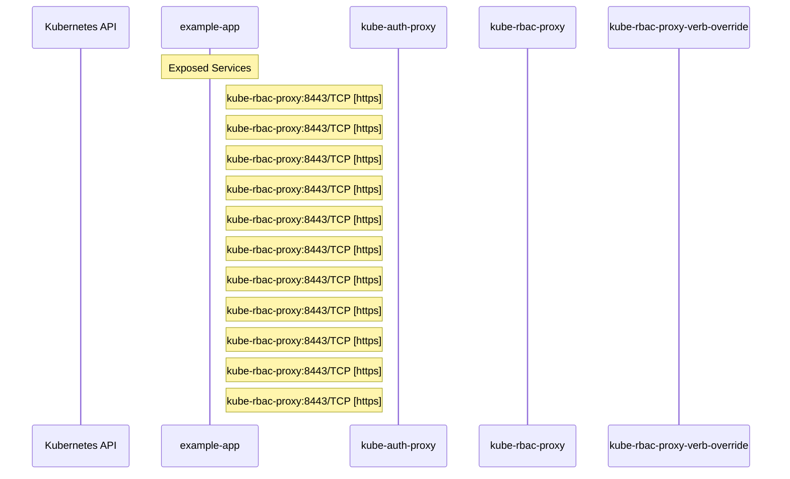

# kube-auth-proxy: Dataflow

## Controller Watches

Kubernetes resources this controller monitors for changes. Each watch triggers reconciliation when the watched resource is created, updated, or deleted.

No controller watches found.

## Reconciliation Flow

How the controller interacts with the Kubernetes API during reconciliation.

### HTTP Endpoints

| Method | Path | Source |
|--------|------|--------|
| * | / | [`kube-rbac-proxy/cmd/kube-rbac-proxy/app/kube-rbac-proxy.go:324`](https://github.com/opendatahub-io/kube-auth-proxy/blob/452fcec5cce53126a3271c145497d444f4e7f5e8/kube-rbac-proxy/cmd/kube-rbac-proxy/app/kube-rbac-proxy.go#L324) |
| * | /.well-known/oauth-authorization-server | [`test/integration/testutil/mock_openshift_oauth.go:41`](https://github.com/opendatahub-io/kube-auth-proxy/blob/452fcec5cce53126a3271c145497d444f4e7f5e8/test/integration/testutil/mock_openshift_oauth.go#L41) |
| * | /apis/user.openshift.io/v1/users/~ | [`test/integration/testutil/mock_openshift_oauth.go:44`](https://github.com/opendatahub-io/kube-auth-proxy/blob/452fcec5cce53126a3271c145497d444f4e7f5e8/test/integration/testutil/mock_openshift_oauth.go#L44) |
| * | /oauth/authorize | [`test/integration/testutil/mock_openshift_oauth.go:42`](https://github.com/opendatahub-io/kube-auth-proxy/blob/452fcec5cce53126a3271c145497d444f4e7f5e8/test/integration/testutil/mock_openshift_oauth.go#L42) |
| * | /oauth/token | [`test/integration/testutil/mock_openshift_oauth.go:43`](https://github.com/opendatahub-io/kube-auth-proxy/blob/452fcec5cce53126a3271c145497d444f4e7f5e8/test/integration/testutil/mock_openshift_oauth.go#L43) |

## Configuration

ConfigMaps and Helm values that control this component's runtime behavior.

### ConfigMaps

| Name | Data Keys | Source |
|------|-----------|--------|
| kube-rbac-proxy | config-file.yaml | [`kube-rbac-proxy/test/e2e/static-auth/configmap-non-resource.yaml`](https://github.com/opendatahub-io/kube-auth-proxy/blob/452fcec5cce53126a3271c145497d444f4e7f5e8/kube-rbac-proxy/test/e2e/static-auth/configmap-non-resource.yaml) |
| kube-rbac-proxy | config-file.yaml | [`kube-rbac-proxy/test/e2e/static-auth/configmap-resource.yaml`](https://github.com/opendatahub-io/kube-auth-proxy/blob/452fcec5cce53126a3271c145497d444f4e7f5e8/kube-rbac-proxy/test/e2e/static-auth/configmap-resource.yaml) |

### Helm

**Chart:** kubernetes v7.14.1

