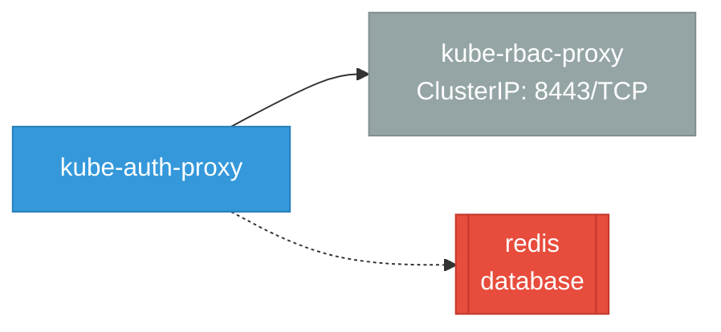

# kube-auth-proxy: Network

## Service Map

*1 unique services (11 total, duplicates from test fixtures collapsed).*

### Services

| Name | Type | Ports | Source |
|------|------|-------|--------|
| kube-rbac-proxy | ClusterIP | 8443/TCP | [`kube-rbac-proxy/test/e2e/allowpaths/service.yaml`](https://github.com/opendatahub-io/kube-auth-proxy/blob/452fcec5cce53126a3271c145497d444f4e7f5e8/kube-rbac-proxy/test/e2e/allowpaths/service.yaml) |
| kube-rbac-proxy | ClusterIP | 8443/TCP | [`kube-rbac-proxy/test/e2e/basics/service.yaml`](https://github.com/opendatahub-io/kube-auth-proxy/blob/452fcec5cce53126a3271c145497d444f4e7f5e8/kube-rbac-proxy/test/e2e/basics/service.yaml) |
| kube-rbac-proxy | ClusterIP | 8443/TCP | [`kube-rbac-proxy/test/e2e/clientcertificates/service.yaml`](https://github.com/opendatahub-io/kube-auth-proxy/blob/452fcec5cce53126a3271c145497d444f4e7f5e8/kube-rbac-proxy/test/e2e/clientcertificates/service.yaml) |
| kube-rbac-proxy | ClusterIP | 8443/TCP | [`kube-rbac-proxy/test/e2e/flags/service.yaml`](https://github.com/opendatahub-io/kube-auth-proxy/blob/452fcec5cce53126a3271c145497d444f4e7f5e8/kube-rbac-proxy/test/e2e/flags/service.yaml) |
| kube-rbac-proxy | ClusterIP | 8443/TCP | [`kube-rbac-proxy/test/e2e/h2c-upstream/service.yaml`](https://github.com/opendatahub-io/kube-auth-proxy/blob/452fcec5cce53126a3271c145497d444f4e7f5e8/kube-rbac-proxy/test/e2e/h2c-upstream/service.yaml) |
| kube-rbac-proxy | ClusterIP | 8443/TCP | [`kube-rbac-proxy/test/e2e/hardcoded_authorizer/service.yaml`](https://github.com/opendatahub-io/kube-auth-proxy/blob/452fcec5cce53126a3271c145497d444f4e7f5e8/kube-rbac-proxy/test/e2e/hardcoded_authorizer/service.yaml) |
| kube-rbac-proxy | ClusterIP | 8443/TCP | [`kube-rbac-proxy/test/e2e/http2/service.yaml`](https://github.com/opendatahub-io/kube-auth-proxy/blob/452fcec5cce53126a3271c145497d444f4e7f5e8/kube-rbac-proxy/test/e2e/http2/service.yaml) |
| kube-rbac-proxy | ClusterIP | 8443/TCP | [`kube-rbac-proxy/test/e2e/ignorepaths/service.yaml`](https://github.com/opendatahub-io/kube-auth-proxy/blob/452fcec5cce53126a3271c145497d444f4e7f5e8/kube-rbac-proxy/test/e2e/ignorepaths/service.yaml) |
| kube-rbac-proxy | ClusterIP | 8443/TCP | [`kube-rbac-proxy/test/e2e/static-auth/service.yaml`](https://github.com/opendatahub-io/kube-auth-proxy/blob/452fcec5cce53126a3271c145497d444f4e7f5e8/kube-rbac-proxy/test/e2e/static-auth/service.yaml) |
| kube-rbac-proxy | ClusterIP | 8443/TCP | [`kube-rbac-proxy/test/e2e/tokenmasking/service.yaml`](https://github.com/opendatahub-io/kube-auth-proxy/blob/452fcec5cce53126a3271c145497d444f4e7f5e8/kube-rbac-proxy/test/e2e/tokenmasking/service.yaml) |
| kube-rbac-proxy | ClusterIP | 8443/TCP | [`kube-rbac-proxy/test/e2e/tokenrequest/service.yaml`](https://github.com/opendatahub-io/kube-auth-proxy/blob/452fcec5cce53126a3271c145497d444f4e7f5e8/kube-rbac-proxy/test/e2e/tokenrequest/service.yaml) |

!!! warning "No Network Policies"
    No NetworkPolicy resources found. All pod-to-pod traffic is allowed by default.

