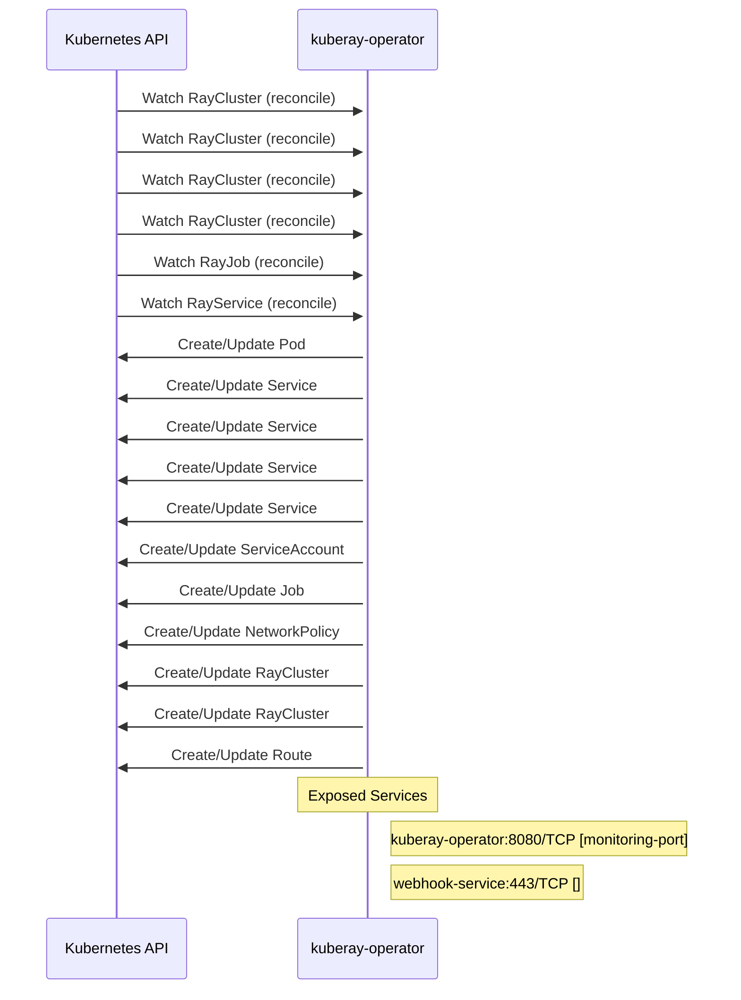

# kuberay: Dataflow

## Controller Watches

Kubernetes resources this controller monitors for changes. Each watch triggers reconciliation when the watched resource is created, updated, or deleted.

| Type | GVK | Source |
|------|-----|--------|
| For | ray/v1/RayCluster | [`ray-operator/controllers/ray/raycluster_mtls_controller.go:834`](https://github.com/ray-project/kuberay/blob/d6c54db15cc2c7cfba73dac1e76302a4b31071e0/ray-operator/controllers/ray/raycluster_mtls_controller.go#L834) |
| For | ray/v1/RayCluster | [`ray-operator/controllers/ray/networkpolicy_controller.go:427`](https://github.com/ray-project/kuberay/blob/d6c54db15cc2c7cfba73dac1e76302a4b31071e0/ray-operator/controllers/ray/networkpolicy_controller.go#L427) |
| For | ray/v1/RayCluster | [`ray-operator/controllers/ray/authentication_controller.go:1089`](https://github.com/ray-project/kuberay/blob/d6c54db15cc2c7cfba73dac1e76302a4b31071e0/ray-operator/controllers/ray/authentication_controller.go#L1089) |
| For | ray/v1/RayCluster | [`ray-operator/controllers/ray/raycluster_controller.go:1574`](https://github.com/ray-project/kuberay/blob/d6c54db15cc2c7cfba73dac1e76302a4b31071e0/ray-operator/controllers/ray/raycluster_controller.go#L1574) |
| For | ray/v1/RayJob | [`ray-operator/controllers/ray/rayjob_controller.go:729`](https://github.com/ray-project/kuberay/blob/d6c54db15cc2c7cfba73dac1e76302a4b31071e0/ray-operator/controllers/ray/rayjob_controller.go#L729) |
| For | ray/v1/RayService | [`ray-operator/controllers/ray/rayservice_controller.go:434`](https://github.com/ray-project/kuberay/blob/d6c54db15cc2c7cfba73dac1e76302a4b31071e0/ray-operator/controllers/ray/rayservice_controller.go#L434) |
| Owns | /v1/Pod | [`ray-operator/controllers/ray/raycluster_controller.go:1579`](https://github.com/ray-project/kuberay/blob/d6c54db15cc2c7cfba73dac1e76302a4b31071e0/ray-operator/controllers/ray/raycluster_controller.go#L1579) |
| Owns | /v1/Service | [`ray-operator/controllers/ray/raycluster_controller.go:1580`](https://github.com/ray-project/kuberay/blob/d6c54db15cc2c7cfba73dac1e76302a4b31071e0/ray-operator/controllers/ray/raycluster_controller.go#L1580) |
| Owns | /v1/Service | [`ray-operator/controllers/ray/authentication_controller.go:1092`](https://github.com/ray-project/kuberay/blob/d6c54db15cc2c7cfba73dac1e76302a4b31071e0/ray-operator/controllers/ray/authentication_controller.go#L1092) |
| Owns | /v1/Service | [`ray-operator/controllers/ray/rayjob_controller.go:731`](https://github.com/ray-project/kuberay/blob/d6c54db15cc2c7cfba73dac1e76302a4b31071e0/ray-operator/controllers/ray/rayjob_controller.go#L731) |
| Owns | /v1/Service | [`ray-operator/controllers/ray/rayservice_controller.go:440`](https://github.com/ray-project/kuberay/blob/d6c54db15cc2c7cfba73dac1e76302a4b31071e0/ray-operator/controllers/ray/rayservice_controller.go#L440) |
| Owns | /v1/ServiceAccount | [`ray-operator/controllers/ray/authentication_controller.go:1091`](https://github.com/ray-project/kuberay/blob/d6c54db15cc2c7cfba73dac1e76302a4b31071e0/ray-operator/controllers/ray/authentication_controller.go#L1091) |
| Owns | batch/v1/Job | [`ray-operator/controllers/ray/rayjob_controller.go:732`](https://github.com/ray-project/kuberay/blob/d6c54db15cc2c7cfba73dac1e76302a4b31071e0/ray-operator/controllers/ray/rayjob_controller.go#L732) |
| Owns | networking.k8s.io/v1/NetworkPolicy | [`ray-operator/controllers/ray/networkpolicy_controller.go:428`](https://github.com/ray-project/kuberay/blob/d6c54db15cc2c7cfba73dac1e76302a4b31071e0/ray-operator/controllers/ray/networkpolicy_controller.go#L428) |
| Owns | ray/v1/RayCluster | [`ray-operator/controllers/ray/rayjob_controller.go:730`](https://github.com/ray-project/kuberay/blob/d6c54db15cc2c7cfba73dac1e76302a4b31071e0/ray-operator/controllers/ray/rayjob_controller.go#L730) |
| Owns | ray/v1/RayCluster | [`ray-operator/controllers/ray/rayservice_controller.go:439`](https://github.com/ray-project/kuberay/blob/d6c54db15cc2c7cfba73dac1e76302a4b31071e0/ray-operator/controllers/ray/rayservice_controller.go#L439) |
| Owns | route/v1/Route | [`ray-operator/controllers/ray/authentication_controller.go:1093`](https://github.com/ray-project/kuberay/blob/d6c54db15cc2c7cfba73dac1e76302a4b31071e0/ray-operator/controllers/ray/authentication_controller.go#L1093) |

## Reconciliation Flow

How the controller interacts with the Kubernetes API during reconciliation.

### Webhooks

| Name | Type | Path | Failure Policy | Service | Source |
|------|------|------|----------------|---------|--------|
| mraycluster.kb.io | mutating | /mutate-ray-io-v1-raycluster | Fail | $(namespace)/kuberay-webhook-service | [`ray-operator/config/openshift/webhook.yaml`](https://github.com/ray-project/kuberay/blob/d6c54db15cc2c7cfba73dac1e76302a4b31071e0/ray-operator/config/openshift/webhook.yaml) |
| mraycluster.kb.io | mutating | /mutate-ray-io-v1-raycluster | fail |  | [`ray-operator/pkg/webhooks/v1/raycluster_mutating_webhook.go`](https://github.com/ray-project/kuberay/blob/d6c54db15cc2c7cfba73dac1e76302a4b31071e0/ray-operator/pkg/webhooks/v1/raycluster_mutating_webhook.go) |
| vraycluster.kb.io | validating | /validate-ray-io-v1-raycluster | fail |  | [`ray-operator/pkg/webhooks/v1/raycluster_validating_webhook.go`](https://github.com/ray-project/kuberay/blob/d6c54db15cc2c7cfba73dac1e76302a4b31071e0/ray-operator/pkg/webhooks/v1/raycluster_validating_webhook.go) |

### HTTP Endpoints

| Method | Path | Source |
|--------|------|--------|
| * | / | [`experimental/cmd/main.go:111`](https://github.com/ray-project/kuberay/blob/d6c54db15cc2c7cfba73dac1e76302a4b31071e0/experimental/cmd/main.go#L111) |
| * | /api/v1/namespaces/{namespace}/services/{service}/proxy | [`apiserversdk/proxy.go:46`](https://github.com/ray-project/kuberay/blob/d6c54db15cc2c7cfba73dac1e76302a4b31071e0/apiserversdk/proxy.go#L46) |
| * | /api/v1/namespaces/{namespace}/services/{service}/proxy/ | [`apiserversdk/proxy.go:47`](https://github.com/ray-project/kuberay/blob/d6c54db15cc2c7cfba73dac1e76302a4b31071e0/apiserversdk/proxy.go#L47) |
| * | /apis/ray.io/v1/ | [`apiserversdk/proxy.go:38`](https://github.com/ray-project/kuberay/blob/d6c54db15cc2c7cfba73dac1e76302a4b31071e0/apiserversdk/proxy.go#L38) |
| * | DELETE | [`proto/go_client/job.pb.gw.go:594`](https://github.com/ray-project/kuberay/blob/d6c54db15cc2c7cfba73dac1e76302a4b31071e0/proto/go_client/job.pb.gw.go#L594) |
| * | DELETE | [`proto/go_client/serve.pb.gw.go:561`](https://github.com/ray-project/kuberay/blob/d6c54db15cc2c7cfba73dac1e76302a4b31071e0/proto/go_client/serve.pb.gw.go#L561) |
| * | DELETE | [`proto/go_client/job_submission.pb.gw.go:847`](https://github.com/ray-project/kuberay/blob/d6c54db15cc2c7cfba73dac1e76302a4b31071e0/proto/go_client/job_submission.pb.gw.go#L847) |
| * | DELETE | [`proto/go_client/job_submission.pb.gw.go:683`](https://github.com/ray-project/kuberay/blob/d6c54db15cc2c7cfba73dac1e76302a4b31071e0/proto/go_client/job_submission.pb.gw.go#L683) |
| * | DELETE | [`proto/go_client/config.pb.gw.go:662`](https://github.com/ray-project/kuberay/blob/d6c54db15cc2c7cfba73dac1e76302a4b31071e0/proto/go_client/config.pb.gw.go#L662) |
| * | DELETE | [`proto/go_client/cluster.pb.gw.go:450`](https://github.com/ray-project/kuberay/blob/d6c54db15cc2c7cfba73dac1e76302a4b31071e0/proto/go_client/cluster.pb.gw.go#L450) |
| * | DELETE | [`proto/go_client/job.pb.gw.go:450`](https://github.com/ray-project/kuberay/blob/d6c54db15cc2c7cfba73dac1e76302a4b31071e0/proto/go_client/job.pb.gw.go#L450) |
| * | DELETE | [`proto/go_client/serve.pb.gw.go:725`](https://github.com/ray-project/kuberay/blob/d6c54db15cc2c7cfba73dac1e76302a4b31071e0/proto/go_client/serve.pb.gw.go#L725) |
| * | DELETE | [`proto/go_client/config.pb.gw.go:1052`](https://github.com/ray-project/kuberay/blob/d6c54db15cc2c7cfba73dac1e76302a4b31071e0/proto/go_client/config.pb.gw.go#L1052) |
| * | DELETE | [`proto/go_client/config.pb.gw.go:907`](https://github.com/ray-project/kuberay/blob/d6c54db15cc2c7cfba73dac1e76302a4b31071e0/proto/go_client/config.pb.gw.go#L907) |
| * | DELETE | [`proto/go_client/cluster.pb.gw.go:594`](https://github.com/ray-project/kuberay/blob/d6c54db15cc2c7cfba73dac1e76302a4b31071e0/proto/go_client/cluster.pb.gw.go#L594) |
| * | DELETE | [`proto/go_client/config.pb.gw.go:763`](https://github.com/ray-project/kuberay/blob/d6c54db15cc2c7cfba73dac1e76302a4b31071e0/proto/go_client/config.pb.gw.go#L763) |
| * | GET | [`proto/go_client/job.pb.gw.go:404`](https://github.com/ray-project/kuberay/blob/d6c54db15cc2c7cfba73dac1e76302a4b31071e0/proto/go_client/job.pb.gw.go#L404) |
| * | GET | [`proto/go_client/job.pb.gw.go:574`](https://github.com/ray-project/kuberay/blob/d6c54db15cc2c7cfba73dac1e76302a4b31071e0/proto/go_client/job.pb.gw.go#L574) |
| * | GET | [`proto/go_client/config.pb.gw.go:639`](https://github.com/ray-project/kuberay/blob/d6c54db15cc2c7cfba73dac1e76302a4b31071e0/proto/go_client/config.pb.gw.go#L639) |
| * | GET | [`proto/go_client/config.pb.gw.go:593`](https://github.com/ray-project/kuberay/blob/d6c54db15cc2c7cfba73dac1e76302a4b31071e0/proto/go_client/config.pb.gw.go#L593) |
| * | GET | [`proto/go_client/serve.pb.gw.go:705`](https://github.com/ray-project/kuberay/blob/d6c54db15cc2c7cfba73dac1e76302a4b31071e0/proto/go_client/serve.pb.gw.go#L705) |
| * | GET | [`proto/go_client/config.pb.gw.go:717`](https://github.com/ray-project/kuberay/blob/d6c54db15cc2c7cfba73dac1e76302a4b31071e0/proto/go_client/config.pb.gw.go#L717) |
| * | GET | [`proto/go_client/config.pb.gw.go:740`](https://github.com/ray-project/kuberay/blob/d6c54db15cc2c7cfba73dac1e76302a4b31071e0/proto/go_client/config.pb.gw.go#L740) |
| * | GET | [`proto/go_client/serve.pb.gw.go:685`](https://github.com/ray-project/kuberay/blob/d6c54db15cc2c7cfba73dac1e76302a4b31071e0/proto/go_client/serve.pb.gw.go#L685) |
| * | GET | [`proto/go_client/serve.pb.gw.go:665`](https://github.com/ray-project/kuberay/blob/d6c54db15cc2c7cfba73dac1e76302a4b31071e0/proto/go_client/serve.pb.gw.go#L665) |
| * | GET | [`proto/go_client/config.pb.gw.go:847`](https://github.com/ray-project/kuberay/blob/d6c54db15cc2c7cfba73dac1e76302a4b31071e0/proto/go_client/config.pb.gw.go#L847) |
| * | GET | [`proto/go_client/config.pb.gw.go:867`](https://github.com/ray-project/kuberay/blob/d6c54db15cc2c7cfba73dac1e76302a4b31071e0/proto/go_client/config.pb.gw.go#L867) |
| * | GET | [`proto/go_client/config.pb.gw.go:887`](https://github.com/ray-project/kuberay/blob/d6c54db15cc2c7cfba73dac1e76302a4b31071e0/proto/go_client/config.pb.gw.go#L887) |
| * | GET | [`proto/go_client/cluster.pb.gw.go:574`](https://github.com/ray-project/kuberay/blob/d6c54db15cc2c7cfba73dac1e76302a4b31071e0/proto/go_client/cluster.pb.gw.go#L574) |
| * | GET | [`proto/go_client/serve.pb.gw.go:538`](https://github.com/ray-project/kuberay/blob/d6c54db15cc2c7cfba73dac1e76302a4b31071e0/proto/go_client/serve.pb.gw.go#L538) |
| * | GET | [`proto/go_client/config.pb.gw.go:1012`](https://github.com/ray-project/kuberay/blob/d6c54db15cc2c7cfba73dac1e76302a4b31071e0/proto/go_client/config.pb.gw.go#L1012) |
| * | GET | [`proto/go_client/config.pb.gw.go:1032`](https://github.com/ray-project/kuberay/blob/d6c54db15cc2c7cfba73dac1e76302a4b31071e0/proto/go_client/config.pb.gw.go#L1032) |
| * | GET | [`proto/go_client/cluster.pb.gw.go:554`](https://github.com/ray-project/kuberay/blob/d6c54db15cc2c7cfba73dac1e76302a4b31071e0/proto/go_client/cluster.pb.gw.go#L554) |
| * | GET | [`proto/go_client/serve.pb.gw.go:515`](https://github.com/ray-project/kuberay/blob/d6c54db15cc2c7cfba73dac1e76302a4b31071e0/proto/go_client/serve.pb.gw.go#L515) |
| * | GET | [`proto/go_client/job.pb.gw.go:381`](https://github.com/ray-project/kuberay/blob/d6c54db15cc2c7cfba73dac1e76302a4b31071e0/proto/go_client/job.pb.gw.go#L381) |
| * | GET | [`proto/go_client/cluster.pb.gw.go:534`](https://github.com/ray-project/kuberay/blob/d6c54db15cc2c7cfba73dac1e76302a4b31071e0/proto/go_client/cluster.pb.gw.go#L534) |
| * | GET | [`proto/go_client/job.pb.gw.go:427`](https://github.com/ray-project/kuberay/blob/d6c54db15cc2c7cfba73dac1e76302a4b31071e0/proto/go_client/job.pb.gw.go#L427) |
| * | GET | [`proto/go_client/serve.pb.gw.go:492`](https://github.com/ray-project/kuberay/blob/d6c54db15cc2c7cfba73dac1e76302a4b31071e0/proto/go_client/serve.pb.gw.go#L492) |
| * | GET | [`proto/go_client/cluster.pb.gw.go:381`](https://github.com/ray-project/kuberay/blob/d6c54db15cc2c7cfba73dac1e76302a4b31071e0/proto/go_client/cluster.pb.gw.go#L381) |
| * | GET | [`proto/go_client/job.pb.gw.go:534`](https://github.com/ray-project/kuberay/blob/d6c54db15cc2c7cfba73dac1e76302a4b31071e0/proto/go_client/job.pb.gw.go#L534) |
| * | GET | [`proto/go_client/job.pb.gw.go:554`](https://github.com/ray-project/kuberay/blob/d6c54db15cc2c7cfba73dac1e76302a4b31071e0/proto/go_client/job.pb.gw.go#L554) |
| * | GET | [`proto/go_client/config.pb.gw.go:616`](https://github.com/ray-project/kuberay/blob/d6c54db15cc2c7cfba73dac1e76302a4b31071e0/proto/go_client/config.pb.gw.go#L616) |
| * | GET | [`proto/go_client/cluster.pb.gw.go:427`](https://github.com/ray-project/kuberay/blob/d6c54db15cc2c7cfba73dac1e76302a4b31071e0/proto/go_client/cluster.pb.gw.go#L427) |
| * | GET | [`proto/go_client/job_submission.pb.gw.go:807`](https://github.com/ray-project/kuberay/blob/d6c54db15cc2c7cfba73dac1e76302a4b31071e0/proto/go_client/job_submission.pb.gw.go#L807) |
| * | GET | [`proto/go_client/job_submission.pb.gw.go:591`](https://github.com/ray-project/kuberay/blob/d6c54db15cc2c7cfba73dac1e76302a4b31071e0/proto/go_client/job_submission.pb.gw.go#L591) |
| * | GET | [`proto/go_client/job_submission.pb.gw.go:614`](https://github.com/ray-project/kuberay/blob/d6c54db15cc2c7cfba73dac1e76302a4b31071e0/proto/go_client/job_submission.pb.gw.go#L614) |
| * | GET | [`proto/go_client/job_submission.pb.gw.go:637`](https://github.com/ray-project/kuberay/blob/d6c54db15cc2c7cfba73dac1e76302a4b31071e0/proto/go_client/job_submission.pb.gw.go#L637) |
| * | GET | [`proto/go_client/job_submission.pb.gw.go:787`](https://github.com/ray-project/kuberay/blob/d6c54db15cc2c7cfba73dac1e76302a4b31071e0/proto/go_client/job_submission.pb.gw.go#L787) |
| * | GET | [`proto/go_client/cluster.pb.gw.go:404`](https://github.com/ray-project/kuberay/blob/d6c54db15cc2c7cfba73dac1e76302a4b31071e0/proto/go_client/cluster.pb.gw.go#L404) |
| * | GET | [`proto/go_client/job_submission.pb.gw.go:767`](https://github.com/ray-project/kuberay/blob/d6c54db15cc2c7cfba73dac1e76302a4b31071e0/proto/go_client/job_submission.pb.gw.go#L767) |
| * | GET /api/v1/namespaces/{namespace}/events | [`apiserversdk/proxy.go:39`](https://github.com/ray-project/kuberay/blob/d6c54db15cc2c7cfba73dac1e76302a4b31071e0/apiserversdk/proxy.go#L39) |
| * | POST | [`proto/go_client/job.pb.gw.go:358`](https://github.com/ray-project/kuberay/blob/d6c54db15cc2c7cfba73dac1e76302a4b31071e0/proto/go_client/job.pb.gw.go#L358) |
| * | POST | [`proto/go_client/config.pb.gw.go:570`](https://github.com/ray-project/kuberay/blob/d6c54db15cc2c7cfba73dac1e76302a4b31071e0/proto/go_client/config.pb.gw.go#L570) |
| * | POST | [`proto/go_client/job_submission.pb.gw.go:827`](https://github.com/ray-project/kuberay/blob/d6c54db15cc2c7cfba73dac1e76302a4b31071e0/proto/go_client/job_submission.pb.gw.go#L827) |
| * | POST | [`proto/go_client/job.pb.gw.go:514`](https://github.com/ray-project/kuberay/blob/d6c54db15cc2c7cfba73dac1e76302a4b31071e0/proto/go_client/job.pb.gw.go#L514) |
| * | POST | [`proto/go_client/serve.pb.gw.go:446`](https://github.com/ray-project/kuberay/blob/d6c54db15cc2c7cfba73dac1e76302a4b31071e0/proto/go_client/serve.pb.gw.go#L446) |
| * | POST | [`proto/go_client/job_submission.pb.gw.go:660`](https://github.com/ray-project/kuberay/blob/d6c54db15cc2c7cfba73dac1e76302a4b31071e0/proto/go_client/job_submission.pb.gw.go#L660) |
| * | POST | [`proto/go_client/cluster.pb.gw.go:514`](https://github.com/ray-project/kuberay/blob/d6c54db15cc2c7cfba73dac1e76302a4b31071e0/proto/go_client/cluster.pb.gw.go#L514) |
| * | POST | [`proto/go_client/job_submission.pb.gw.go:747`](https://github.com/ray-project/kuberay/blob/d6c54db15cc2c7cfba73dac1e76302a4b31071e0/proto/go_client/job_submission.pb.gw.go#L747) |
| * | POST | [`proto/go_client/job_submission.pb.gw.go:568`](https://github.com/ray-project/kuberay/blob/d6c54db15cc2c7cfba73dac1e76302a4b31071e0/proto/go_client/job_submission.pb.gw.go#L568) |
| * | POST | [`proto/go_client/cluster.pb.gw.go:358`](https://github.com/ray-project/kuberay/blob/d6c54db15cc2c7cfba73dac1e76302a4b31071e0/proto/go_client/cluster.pb.gw.go#L358) |
| * | POST | [`proto/go_client/config.pb.gw.go:992`](https://github.com/ray-project/kuberay/blob/d6c54db15cc2c7cfba73dac1e76302a4b31071e0/proto/go_client/config.pb.gw.go#L992) |
| * | POST | [`proto/go_client/config.pb.gw.go:694`](https://github.com/ray-project/kuberay/blob/d6c54db15cc2c7cfba73dac1e76302a4b31071e0/proto/go_client/config.pb.gw.go#L694) |
| * | POST | [`proto/go_client/config.pb.gw.go:827`](https://github.com/ray-project/kuberay/blob/d6c54db15cc2c7cfba73dac1e76302a4b31071e0/proto/go_client/config.pb.gw.go#L827) |
| * | POST | [`proto/go_client/serve.pb.gw.go:625`](https://github.com/ray-project/kuberay/blob/d6c54db15cc2c7cfba73dac1e76302a4b31071e0/proto/go_client/serve.pb.gw.go#L625) |
| * | PUT | [`proto/go_client/serve.pb.gw.go:645`](https://github.com/ray-project/kuberay/blob/d6c54db15cc2c7cfba73dac1e76302a4b31071e0/proto/go_client/serve.pb.gw.go#L645) |
| * | PUT | [`proto/go_client/serve.pb.gw.go:469`](https://github.com/ray-project/kuberay/blob/d6c54db15cc2c7cfba73dac1e76302a4b31071e0/proto/go_client/serve.pb.gw.go#L469) |
| * | gateway.networking.k8s.io | [`ray-operator/controllers/ray/authentication_controller.go:432`](https://github.com/ray-project/kuberay/blob/d6c54db15cc2c7cfba73dac1e76302a4b31071e0/ray-operator/controllers/ray/authentication_controller.go#L432) |

## Configuration

ConfigMaps and Helm values that control this component's runtime behavior.

### Helm

**Chart:** kuberay-apiserver v1.4.2

