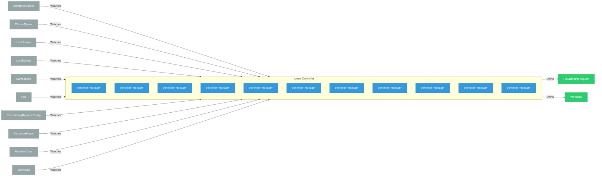

# kueue

> **Architecture snapshot: 2026-05-05** (2026-05-05)

**Repository:** red-hat-data-services/kueue  
**Analyzer:** arch-analyzer 0.2.0  
**Extracted:** 2026-05-05T15:09:55Z

## Summary

| Metric | Count |
|--------|-------|
| CRDs | 0 |
| Deployments | 11 |
| Services | 2 |
| Secrets | 1 |
| Cluster Roles | 0 |
| Controller Watches | 21 |

## Component Architecture

CRDs, controllers, and owned Kubernetes resources.

### CRDs

No CRDs defined.

## Dependencies

### Key External Dependencies

| Module | Version |
|--------|---------|
| github.com/go-logr/logr | v1.4.2 |
| github.com/prometheus/client_golang | v1.21.1 |
| github.com/prometheus/client_model | v0.6.1 |
| k8s.io/api | v0.32.3 |
| k8s.io/api | v0.32.3 |
| k8s.io/apimachinery | v0.32.3 |
| k8s.io/apimachinery | v0.32.3 |
| k8s.io/apiserver | v0.32.3 |
| k8s.io/client-go | v0.32.3 |
| k8s.io/client-go | v0.32.3 |
| sigs.k8s.io/controller-runtime | v0.19.4 |

