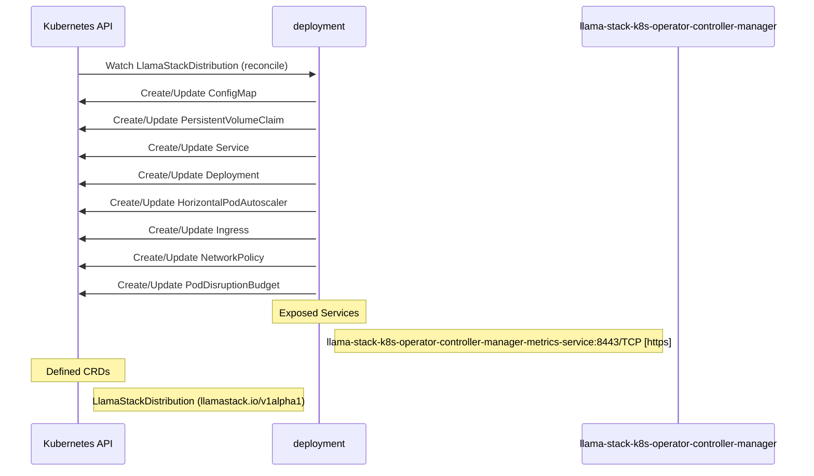

# llama-stack-k8s-operator: Dataflow

## Controller Watches

Kubernetes resources this controller monitors for changes. Each watch triggers reconciliation when the watched resource is created, updated, or deleted.

| Type | GVK | Source |
|------|-----|--------|
| For | api/v1alpha1/LlamaStackDistribution | [`controllers/llamastackdistribution_controller.go:590`](https://github.com/llamastack/llama-stack-k8s-operator/blob/916c672901f7e2fc091471677e219830761a532e/controllers/llamastackdistribution_controller.go#L590) |
| Owns | /v1/ConfigMap | [`controllers/llamastackdistribution_controller.go:597`](https://github.com/llamastack/llama-stack-k8s-operator/blob/916c672901f7e2fc091471677e219830761a532e/controllers/llamastackdistribution_controller.go#L597) |
| Owns | /v1/PersistentVolumeClaim | [`controllers/llamastackdistribution_controller.go:605`](https://github.com/llamastack/llama-stack-k8s-operator/blob/916c672901f7e2fc091471677e219830761a532e/controllers/llamastackdistribution_controller.go#L605) |
| Owns | /v1/Service | [`controllers/llamastackdistribution_controller.go:596`](https://github.com/llamastack/llama-stack-k8s-operator/blob/916c672901f7e2fc091471677e219830761a532e/controllers/llamastackdistribution_controller.go#L596) |
| Owns | apps/v1/Deployment | [`controllers/llamastackdistribution_controller.go:593`](https://github.com/llamastack/llama-stack-k8s-operator/blob/916c672901f7e2fc091471677e219830761a532e/controllers/llamastackdistribution_controller.go#L593) |
| Owns | autoscaling/v2/HorizontalPodAutoscaler | [`controllers/llamastackdistribution_controller.go:595`](https://github.com/llamastack/llama-stack-k8s-operator/blob/916c672901f7e2fc091471677e219830761a532e/controllers/llamastackdistribution_controller.go#L595) |
| Owns | networking.k8s.io/v1/Ingress | [`controllers/llamastackdistribution_controller.go:604`](https://github.com/llamastack/llama-stack-k8s-operator/blob/916c672901f7e2fc091471677e219830761a532e/controllers/llamastackdistribution_controller.go#L604) |
| Owns | networking.k8s.io/v1/NetworkPolicy | [`controllers/llamastackdistribution_controller.go:603`](https://github.com/llamastack/llama-stack-k8s-operator/blob/916c672901f7e2fc091471677e219830761a532e/controllers/llamastackdistribution_controller.go#L603) |
| Owns | policy/v1/PodDisruptionBudget | [`controllers/llamastackdistribution_controller.go:594`](https://github.com/llamastack/llama-stack-k8s-operator/blob/916c672901f7e2fc091471677e219830761a532e/controllers/llamastackdistribution_controller.go#L594) |

## Reconciliation Flow

How the controller interacts with the Kubernetes API during reconciliation.

## Configuration

ConfigMaps and Helm values that control this component's runtime behavior.

