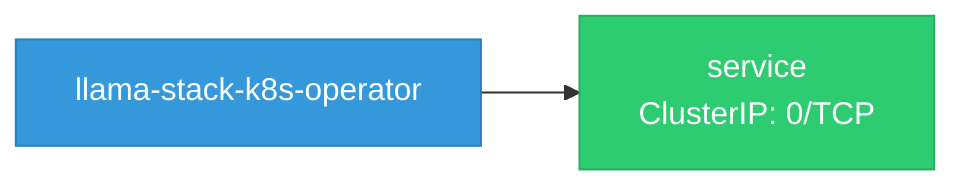
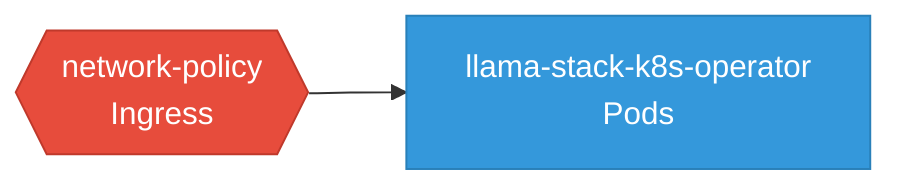

# llama-stack-k8s-operator: Network

## Service Map

### Services

| Name | Type | Ports | Source |
|------|------|-------|--------|
| service | ClusterIP | 0/TCP | [`controllers/manifests/base/service.yaml`](https://github.com/llamastack/llama-stack-k8s-operator/blob/498ad3f2ac59e93ea7c1ebee43e4c9b27727ddea/controllers/manifests/base/service.yaml) |

### Network Policies

| Name | Policy Types | Source |
|------|-------------|--------|
| network-policy | Ingress | [`controllers/manifests/base/networkpolicy.yaml`](https://github.com/llamastack/llama-stack-k8s-operator/blob/498ad3f2ac59e93ea7c1ebee43e4c9b27727ddea/controllers/manifests/base/networkpolicy.yaml) |

## Network Policy Graph

Visual representation of NetworkPolicy rules. Ingress rules show what traffic is allowed into pods, egress rules show what traffic is allowed out.

