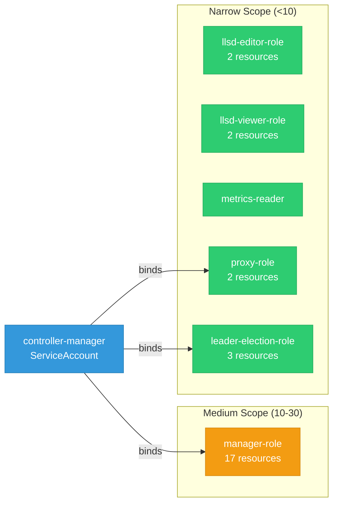

# llama-stack-k8s-operator: RBAC

ServiceAccount bindings, roles, and resource permissions.

## RBAC Overview

This component defines a large RBAC surface (69 diagram lines). The graph below groups roles by permission scope.

## Bindings

Subject-to-role mappings defining who has access to what.

| Binding | Type | Role | Subject |
|---------|------|------|---------|
| manager-rolebinding | ClusterRoleBinding | manager-role | ServiceAccount/controller-manager |
| proxy-rolebinding | ClusterRoleBinding | proxy-role | ServiceAccount/controller-manager |
| leader-election-rolebinding | RoleBinding | leader-election-role | ServiceAccount/controller-manager |

## Role Details

Per-rule breakdown of API groups, resources, and verbs for each role.

| Role | Kind | API Groups | Resources | Verbs |
|------|------|------------|-----------|-------|
| llsd-editor-role | ClusterRole |  | llamastackdistributions | create, delete, get, list, patch, update, watch |
| llsd-editor-role | ClusterRole |  | llamastackdistributions/status | get |
| llsd-viewer-role | ClusterRole |  | llamastackdistributions | get, list, watch |
| llsd-viewer-role | ClusterRole |  | llamastackdistributions/status | get |
| manager-role | ClusterRole |  | configmaps | create, get, list, patch, update, watch |
| manager-role | ClusterRole |  | persistentvolumeclaims | create, get, list, watch |
| manager-role | ClusterRole |  | serviceaccounts, services | create, delete, get, list, patch, update, watch |
| manager-role | ClusterRole |  | deployments | create, delete, get, list, patch, update, watch |
| manager-role | ClusterRole |  | horizontalpodautoscalers | create, delete, get, list, patch, update, watch |
| manager-role | ClusterRole |  | llamastackdistributions | create, delete, get, list, patch, update, watch |
| manager-role | ClusterRole |  | llamastackdistributions/finalizers | update |
| manager-role | ClusterRole |  | llamastackdistributions/status | get, patch, update |
| manager-role | ClusterRole |  | ingresses, networkpolicies | create, delete, get, list, patch, update, watch |
| manager-role | ClusterRole |  | poddisruptionbudgets | create, delete, get, list, patch, update, watch |
| manager-role | ClusterRole |  | clusterrolebindings | delete, get, list |
| manager-role | ClusterRole |  | clusterroles | get, list, watch |
| manager-role | ClusterRole |  | rolebindings | create, delete, get, list, patch, update, watch |
| manager-role | ClusterRole |  | securitycontextconstraints | use |
| manager-role | ClusterRole |  | securitycontextconstraints | use |
| metrics-reader | ClusterRole |  |  | get |
| proxy-role | ClusterRole |  | tokenreviews | create |
| proxy-role | ClusterRole |  | subjectaccessreviews | create |
| leader-election-role | Role |  | configmaps | get, list, watch, create, update, patch, delete |
| leader-election-role | Role |  | leases | get, list, watch, create, update, patch, delete |
| leader-election-role | Role |  | events | create, patch |

### Cluster Roles

| Name | Resources | Verbs | Source |
|------|-----------|-------|--------|
| llsd-editor-role | llamastackdistributions | create, delete, get, list, patch, update, watch | [`config/rbac/llsd_editor_role.yaml`](https://github.com/llamastack/llama-stack-k8s-operator/blob/916c672901f7e2fc091471677e219830761a532e/config/rbac/llsd_editor_role.yaml) |
| llsd-editor-role | llamastackdistributions/status | get | [`config/rbac/llsd_editor_role.yaml`](https://github.com/llamastack/llama-stack-k8s-operator/blob/916c672901f7e2fc091471677e219830761a532e/config/rbac/llsd_editor_role.yaml) |
| llsd-viewer-role | llamastackdistributions | get, list, watch | [`config/rbac/llsd_viewer_role.yaml`](https://github.com/llamastack/llama-stack-k8s-operator/blob/916c672901f7e2fc091471677e219830761a532e/config/rbac/llsd_viewer_role.yaml) |
| llsd-viewer-role | llamastackdistributions/status | get | [`config/rbac/llsd_viewer_role.yaml`](https://github.com/llamastack/llama-stack-k8s-operator/blob/916c672901f7e2fc091471677e219830761a532e/config/rbac/llsd_viewer_role.yaml) |
| manager-role | configmaps | create, get, list, patch, update, watch | [`config/rbac/role.yaml`](https://github.com/llamastack/llama-stack-k8s-operator/blob/916c672901f7e2fc091471677e219830761a532e/config/rbac/role.yaml) |
| manager-role | persistentvolumeclaims | create, get, list, watch | [`config/rbac/role.yaml`](https://github.com/llamastack/llama-stack-k8s-operator/blob/916c672901f7e2fc091471677e219830761a532e/config/rbac/role.yaml) |
| manager-role | serviceaccounts, services | create, delete, get, list, patch, update, watch | [`config/rbac/role.yaml`](https://github.com/llamastack/llama-stack-k8s-operator/blob/916c672901f7e2fc091471677e219830761a532e/config/rbac/role.yaml) |
| manager-role | deployments | create, delete, get, list, patch, update, watch | [`config/rbac/role.yaml`](https://github.com/llamastack/llama-stack-k8s-operator/blob/916c672901f7e2fc091471677e219830761a532e/config/rbac/role.yaml) |
| manager-role | horizontalpodautoscalers | create, delete, get, list, patch, update, watch | [`config/rbac/role.yaml`](https://github.com/llamastack/llama-stack-k8s-operator/blob/916c672901f7e2fc091471677e219830761a532e/config/rbac/role.yaml) |
| manager-role | llamastackdistributions | create, delete, get, list, patch, update, watch | [`config/rbac/role.yaml`](https://github.com/llamastack/llama-stack-k8s-operator/blob/916c672901f7e2fc091471677e219830761a532e/config/rbac/role.yaml) |
| manager-role | llamastackdistributions/finalizers | update | [`config/rbac/role.yaml`](https://github.com/llamastack/llama-stack-k8s-operator/blob/916c672901f7e2fc091471677e219830761a532e/config/rbac/role.yaml) |
| manager-role | llamastackdistributions/status | get, patch, update | [`config/rbac/role.yaml`](https://github.com/llamastack/llama-stack-k8s-operator/blob/916c672901f7e2fc091471677e219830761a532e/config/rbac/role.yaml) |
| manager-role | ingresses, networkpolicies | create, delete, get, list, patch, update, watch | [`config/rbac/role.yaml`](https://github.com/llamastack/llama-stack-k8s-operator/blob/916c672901f7e2fc091471677e219830761a532e/config/rbac/role.yaml) |
| manager-role | poddisruptionbudgets | create, delete, get, list, patch, update, watch | [`config/rbac/role.yaml`](https://github.com/llamastack/llama-stack-k8s-operator/blob/916c672901f7e2fc091471677e219830761a532e/config/rbac/role.yaml) |
| manager-role | clusterrolebindings | delete, get, list | [`config/rbac/role.yaml`](https://github.com/llamastack/llama-stack-k8s-operator/blob/916c672901f7e2fc091471677e219830761a532e/config/rbac/role.yaml) |
| manager-role | clusterroles | get, list, watch | [`config/rbac/role.yaml`](https://github.com/llamastack/llama-stack-k8s-operator/blob/916c672901f7e2fc091471677e219830761a532e/config/rbac/role.yaml) |
| manager-role | rolebindings | create, delete, get, list, patch, update, watch | [`config/rbac/role.yaml`](https://github.com/llamastack/llama-stack-k8s-operator/blob/916c672901f7e2fc091471677e219830761a532e/config/rbac/role.yaml) |
| manager-role | securitycontextconstraints | use | [`config/rbac/role.yaml`](https://github.com/llamastack/llama-stack-k8s-operator/blob/916c672901f7e2fc091471677e219830761a532e/config/rbac/role.yaml) |
| manager-role | securitycontextconstraints | use | [`config/rbac/role.yaml`](https://github.com/llamastack/llama-stack-k8s-operator/blob/916c672901f7e2fc091471677e219830761a532e/config/rbac/role.yaml) |
| metrics-reader |  | get | [`config/rbac/auth_proxy_client_clusterrole.yaml`](https://github.com/llamastack/llama-stack-k8s-operator/blob/916c672901f7e2fc091471677e219830761a532e/config/rbac/auth_proxy_client_clusterrole.yaml) |
| proxy-role | tokenreviews | create | [`config/rbac/auth_proxy_role.yaml`](https://github.com/llamastack/llama-stack-k8s-operator/blob/916c672901f7e2fc091471677e219830761a532e/config/rbac/auth_proxy_role.yaml) |
| proxy-role | subjectaccessreviews | create | [`config/rbac/auth_proxy_role.yaml`](https://github.com/llamastack/llama-stack-k8s-operator/blob/916c672901f7e2fc091471677e219830761a532e/config/rbac/auth_proxy_role.yaml) |

### Kubebuilder RBAC Markers

Kubebuilder `+kubebuilder:rbac` markers declare the RBAC requirements of controller reconcilers. These are the source of truth for generated ClusterRole manifests. 17 markers found.

| File | Line | Groups | Resources | Verbs |
|------|------|--------|-----------|-------|
| [`controllers/kubebuilder_rbac.go:4`](https://github.com/llamastack/llama-stack-k8s-operator/blob/916c672901f7e2fc091471677e219830761a532e/controllers/kubebuilder_rbac.go#L4) | 4 | llamastack.io | llamastackdistributions | get, list, watch, create, update, patch, delete |
| [`controllers/kubebuilder_rbac.go:5`](https://github.com/llamastack/llama-stack-k8s-operator/blob/916c672901f7e2fc091471677e219830761a532e/controllers/kubebuilder_rbac.go#L5) | 5 | llamastack.io | llamastackdistributions/status | get, update, patch |
| [`controllers/kubebuilder_rbac.go:6`](https://github.com/llamastack/llama-stack-k8s-operator/blob/916c672901f7e2fc091471677e219830761a532e/controllers/kubebuilder_rbac.go#L6) | 6 | llamastack.io | llamastackdistributions/finalizers | update |
| [`controllers/kubebuilder_rbac.go:9`](https://github.com/llamastack/llama-stack-k8s-operator/blob/916c672901f7e2fc091471677e219830761a532e/controllers/kubebuilder_rbac.go#L9) | 9 | apps | deployments | get, list, watch, create, update, patch, delete |
| [`controllers/kubebuilder_rbac.go:12`](https://github.com/llamastack/llama-stack-k8s-operator/blob/916c672901f7e2fc091471677e219830761a532e/controllers/kubebuilder_rbac.go#L12) | 12 | "" | services | get, list, watch, create, update, patch, delete |
| [`controllers/kubebuilder_rbac.go:15`](https://github.com/llamastack/llama-stack-k8s-operator/blob/916c672901f7e2fc091471677e219830761a532e/controllers/kubebuilder_rbac.go#L15) | 15 | "" | serviceaccounts | get, list, watch, create, update, patch, delete |
| [`controllers/kubebuilder_rbac.go:17`](https://github.com/llamastack/llama-stack-k8s-operator/blob/916c672901f7e2fc091471677e219830761a532e/controllers/kubebuilder_rbac.go#L17) | 17 | rbac.authorization.k8s.io | clusterrolebindings | get, list, delete |
| [`controllers/kubebuilder_rbac.go:18`](https://github.com/llamastack/llama-stack-k8s-operator/blob/916c672901f7e2fc091471677e219830761a532e/controllers/kubebuilder_rbac.go#L18) | 18 | rbac.authorization.k8s.io | clusterroles | get, list, watch |
| [`controllers/kubebuilder_rbac.go:21`](https://github.com/llamastack/llama-stack-k8s-operator/blob/916c672901f7e2fc091471677e219830761a532e/controllers/kubebuilder_rbac.go#L21) | 21 | rbac.authorization.k8s.io | rolebindings | get, list, watch, create, update, patch, delete |
| [`controllers/kubebuilder_rbac.go:23`](https://github.com/llamastack/llama-stack-k8s-operator/blob/916c672901f7e2fc091471677e219830761a532e/controllers/kubebuilder_rbac.go#L23) | 23 | security.openshift.io | securitycontextconstraints | use |
| [`controllers/kubebuilder_rbac.go:24`](https://github.com/llamastack/llama-stack-k8s-operator/blob/916c672901f7e2fc091471677e219830761a532e/controllers/kubebuilder_rbac.go#L24) | 24 | security.openshift.io | securitycontextconstraints | use |
| [`controllers/kubebuilder_rbac.go:26`](https://github.com/llamastack/llama-stack-k8s-operator/blob/916c672901f7e2fc091471677e219830761a532e/controllers/kubebuilder_rbac.go#L26) | 26 | "" | persistentvolumeclaims | get, list, watch, create |
| [`controllers/kubebuilder_rbac.go:29`](https://github.com/llamastack/llama-stack-k8s-operator/blob/916c672901f7e2fc091471677e219830761a532e/controllers/kubebuilder_rbac.go#L29) | 29 | "" | configmaps | get, list, watch, create, update, patch |
| [`controllers/kubebuilder_rbac.go:32`](https://github.com/llamastack/llama-stack-k8s-operator/blob/916c672901f7e2fc091471677e219830761a532e/controllers/kubebuilder_rbac.go#L32) | 32 | networking.k8s.io | networkpolicies | get, list, watch, create, update, patch, delete |
| [`controllers/kubebuilder_rbac.go:35`](https://github.com/llamastack/llama-stack-k8s-operator/blob/916c672901f7e2fc091471677e219830761a532e/controllers/kubebuilder_rbac.go#L35) | 35 | networking.k8s.io | ingresses | get, list, watch, create, update, patch, delete |
| [`controllers/kubebuilder_rbac.go:38`](https://github.com/llamastack/llama-stack-k8s-operator/blob/916c672901f7e2fc091471677e219830761a532e/controllers/kubebuilder_rbac.go#L38) | 38 | policy | poddisruptionbudgets | get, list, watch, create, update, patch, delete |
| [`controllers/kubebuilder_rbac.go:41`](https://github.com/llamastack/llama-stack-k8s-operator/blob/916c672901f7e2fc091471677e219830761a532e/controllers/kubebuilder_rbac.go#L41) | 41 | autoscaling | horizontalpodautoscalers | get, list, watch, create, update, patch, delete |

