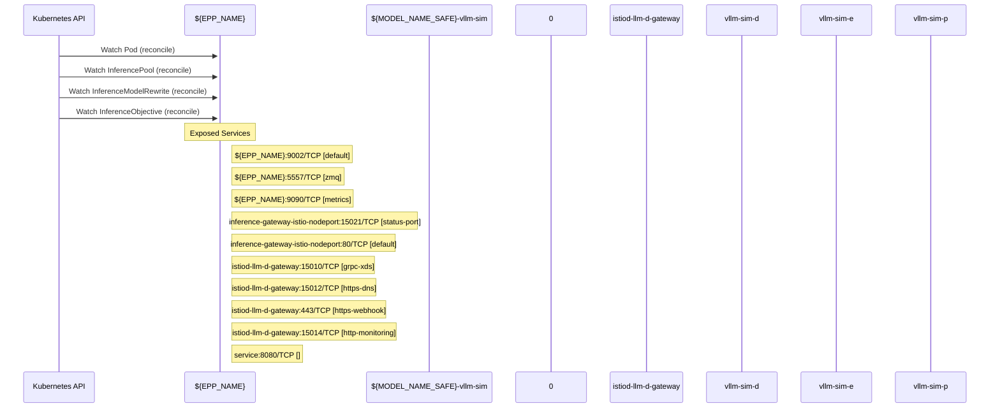

# llm-d-inference-scheduler: Dataflow

## Controller Watches

Kubernetes resources this controller monitors for changes. Each watch triggers reconciliation when the watched resource is created, updated, or deleted.

| Type | GVK | Source |
|------|-----|--------|
| For | /v1/Pod | [`pkg/epp/controller/pod_reconciler.go:85`](https://github.com/llm-d/llm-d-inference-scheduler/blob/eb2ef5d06644cdf1726fcbc3276d41d8f91f70eb/pkg/epp/controller/pod_reconciler.go#L85) |
| For | api/v1/InferencePool | [`pkg/epp/controller/inferencepool_reconciler.go:76`](https://github.com/llm-d/llm-d-inference-scheduler/blob/eb2ef5d06644cdf1726fcbc3276d41d8f91f70eb/pkg/epp/controller/inferencepool_reconciler.go#L76) |
| For | apix/v1alpha2/InferenceModelRewrite | [`pkg/epp/controller/inferencemodelrewrite_reconciler.go:78`](https://github.com/llm-d/llm-d-inference-scheduler/blob/eb2ef5d06644cdf1726fcbc3276d41d8f91f70eb/pkg/epp/controller/inferencemodelrewrite_reconciler.go#L78) |
| For | apix/v1alpha2/InferenceObjective | [`pkg/epp/controller/inferenceobjective_reconciler.go:73`](https://github.com/llm-d/llm-d-inference-scheduler/blob/eb2ef5d06644cdf1726fcbc3276d41d8f91f70eb/pkg/epp/controller/inferenceobjective_reconciler.go#L73) |

## Reconciliation Flow

How the controller interacts with the Kubernetes API during reconciliation.

### Webhooks

| Name | Type | Path | Failure Policy | Service | Source |
|------|------|------|----------------|---------|--------|
| namespace.sidecar-injector.istio.io | mutating | /inject | Fail | llm-d-istio-system/istiod-llm-d-gateway | [`deploy/components/istio-control-plane/webhooks.yaml`](https://github.com/llm-d/llm-d-inference-scheduler/blob/eb2ef5d06644cdf1726fcbc3276d41d8f91f70eb/deploy/components/istio-control-plane/webhooks.yaml) |
| object.sidecar-injector.istio.io | mutating | /inject | Fail | llm-d-istio-system/istiod-llm-d-gateway | [`deploy/components/istio-control-plane/webhooks.yaml`](https://github.com/llm-d/llm-d-inference-scheduler/blob/eb2ef5d06644cdf1726fcbc3276d41d8f91f70eb/deploy/components/istio-control-plane/webhooks.yaml) |
| rev.namespace.sidecar-injector.istio.io | mutating | /inject | Fail | llm-d-istio-system/istiod-llm-d-gateway | [`deploy/components/istio-control-plane/webhooks.yaml`](https://github.com/llm-d/llm-d-inference-scheduler/blob/eb2ef5d06644cdf1726fcbc3276d41d8f91f70eb/deploy/components/istio-control-plane/webhooks.yaml) |
| rev.object.sidecar-injector.istio.io | mutating | /inject | Fail | llm-d-istio-system/istiod-llm-d-gateway | [`deploy/components/istio-control-plane/webhooks.yaml`](https://github.com/llm-d/llm-d-inference-scheduler/blob/eb2ef5d06644cdf1726fcbc3276d41d8f91f70eb/deploy/components/istio-control-plane/webhooks.yaml) |
| rev.validation.istio.io | validating | /validate | Ignore | llm-d-istio-system/istiod-llm-d-gateway | [`deploy/components/istio-control-plane/webhooks.yaml`](https://github.com/llm-d/llm-d-inference-scheduler/blob/eb2ef5d06644cdf1726fcbc3276d41d8f91f70eb/deploy/components/istio-control-plane/webhooks.yaml) |

### HTTP Endpoints

| Method | Path | Source |
|--------|------|--------|
| * | / | [`pkg/sidecar/proxy/proxy.go:399`](https://github.com/llm-d/llm-d-inference-scheduler/blob/eb2ef5d06644cdf1726fcbc3276d41d8f91f70eb/pkg/sidecar/proxy/proxy.go#L399) |
| * | GET /health | [`pkg/sidecar/proxy/proxy.go:390`](https://github.com/llm-d/llm-d-inference-scheduler/blob/eb2ef5d06644cdf1726fcbc3276d41d8f91f70eb/pkg/sidecar/proxy/proxy.go#L390) |
| * | POST  | [`pkg/sidecar/proxy/proxy.go:393`](https://github.com/llm-d/llm-d-inference-scheduler/blob/eb2ef5d06644cdf1726fcbc3276d41d8f91f70eb/pkg/sidecar/proxy/proxy.go#L393) |
| * | POST  | [`pkg/sidecar/proxy/proxy.go:394`](https://github.com/llm-d/llm-d-inference-scheduler/blob/eb2ef5d06644cdf1726fcbc3276d41d8f91f70eb/pkg/sidecar/proxy/proxy.go#L394) |
| * | POST  | [`pkg/sidecar/proxy/proxy.go:395`](https://github.com/llm-d/llm-d-inference-scheduler/blob/eb2ef5d06644cdf1726fcbc3276d41d8f91f70eb/pkg/sidecar/proxy/proxy.go#L395) |

## Configuration

ConfigMaps and Helm values that control this component's runtime behavior.

### ConfigMaps

| Name | Data Keys | Source |
|------|-----------|--------|
| istio-llm-d-gateway | mesh, meshNetworks | [`deploy/components/istio-control-plane/configmaps.yaml`](https://github.com/llm-d/llm-d-inference-scheduler/blob/eb2ef5d06644cdf1726fcbc3276d41d8f91f70eb/deploy/components/istio-control-plane/configmaps.yaml) |
| istio-sidecar-injector-llm-d-gateway | config, values | [`deploy/components/istio-control-plane/configmaps.yaml`](https://github.com/llm-d/llm-d-inference-scheduler/blob/eb2ef5d06644cdf1726fcbc3276d41d8f91f70eb/deploy/components/istio-control-plane/configmaps.yaml) |

