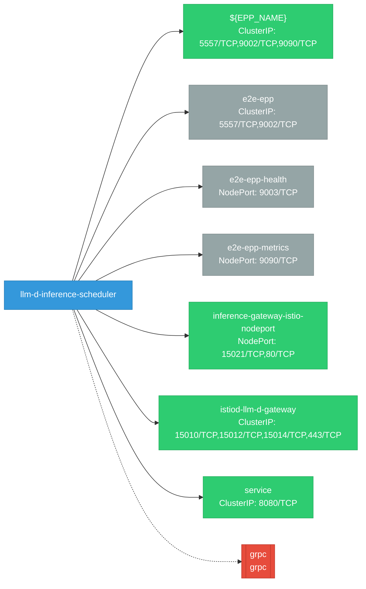

# llm-d-inference-scheduler: Network

## Service Map

### Services

| Name | Type | Ports | Source |
|------|------|-------|--------|
| ${EPP_NAME} | ClusterIP | 9002/TCP, 5557/TCP, 9090/TCP | [`deploy/components/inference-gateway/services.yaml`](https://github.com/llm-d/llm-d-inference-scheduler/blob/eb2ef5d06644cdf1726fcbc3276d41d8f91f70eb/deploy/components/inference-gateway/services.yaml) |
| e2e-epp | ClusterIP | 9002/TCP, 5557/TCP | [`test/e2e/yaml/services.yaml`](https://github.com/llm-d/llm-d-inference-scheduler/blob/eb2ef5d06644cdf1726fcbc3276d41d8f91f70eb/test/e2e/yaml/services.yaml) |
| e2e-epp-health | NodePort | 9003/TCP | [`test/e2e/yaml/services.yaml`](https://github.com/llm-d/llm-d-inference-scheduler/blob/eb2ef5d06644cdf1726fcbc3276d41d8f91f70eb/test/e2e/yaml/services.yaml) |
| e2e-epp-metrics | NodePort | 9090/TCP | [`test/e2e/yaml/services.yaml`](https://github.com/llm-d/llm-d-inference-scheduler/blob/eb2ef5d06644cdf1726fcbc3276d41d8f91f70eb/test/e2e/yaml/services.yaml) |
| inference-gateway-istio-nodeport | NodePort | 15021/TCP, 80/TCP | [`deploy/environments/dev/base-kind-istio/services.yaml`](https://github.com/llm-d/llm-d-inference-scheduler/blob/eb2ef5d06644cdf1726fcbc3276d41d8f91f70eb/deploy/environments/dev/base-kind-istio/services.yaml) |
| istiod-llm-d-gateway | ClusterIP | 15010/TCP, 15012/TCP, 443/TCP, 15014/TCP | [`deploy/components/istio-control-plane/services.yaml`](https://github.com/llm-d/llm-d-inference-scheduler/blob/eb2ef5d06644cdf1726fcbc3276d41d8f91f70eb/deploy/components/istio-control-plane/services.yaml) |
| service | ClusterIP | 8080/TCP | [`deploy/environments/kubernetes-base/common/service.yaml`](https://github.com/llm-d/llm-d-inference-scheduler/blob/eb2ef5d06644cdf1726fcbc3276d41d8f91f70eb/deploy/environments/kubernetes-base/common/service.yaml) |

### Ingress / Routing

| Kind | Name | Hosts | Paths | TLS | Source |
|------|------|-------|-------|-----|--------|
| Gateway | inference-gateway |  |  | no | [`deploy/components/inference-gateway/gateways.yaml`](https://github.com/llm-d/llm-d-inference-scheduler/blob/eb2ef5d06644cdf1726fcbc3276d41d8f91f70eb/deploy/components/inference-gateway/gateways.yaml) |
| Gateway | inference-gateway |  |  | no | [`test/sidecar/config/gateway/gateway.yaml`](https://github.com/llm-d/llm-d-inference-scheduler/blob/eb2ef5d06644cdf1726fcbc3276d41d8f91f70eb/test/sidecar/config/gateway/gateway.yaml) |
| HTTPRoute | ${POOL_NAME}-inference-route |  | / | no | [`deploy/components/inference-gateway/httproutes.yaml`](https://github.com/llm-d/llm-d-inference-scheduler/blob/eb2ef5d06644cdf1726fcbc3276d41d8f91f70eb/deploy/components/inference-gateway/httproutes.yaml) |
| Route | route |  |  | yes | [`deploy/environments/kubernetes-base/openshift/route.yaml`](https://github.com/llm-d/llm-d-inference-scheduler/blob/eb2ef5d06644cdf1726fcbc3276d41d8f91f70eb/deploy/environments/kubernetes-base/openshift/route.yaml) |

!!! warning "No Network Policies"
    No NetworkPolicy resources found. All pod-to-pod traffic is allowed by default.

