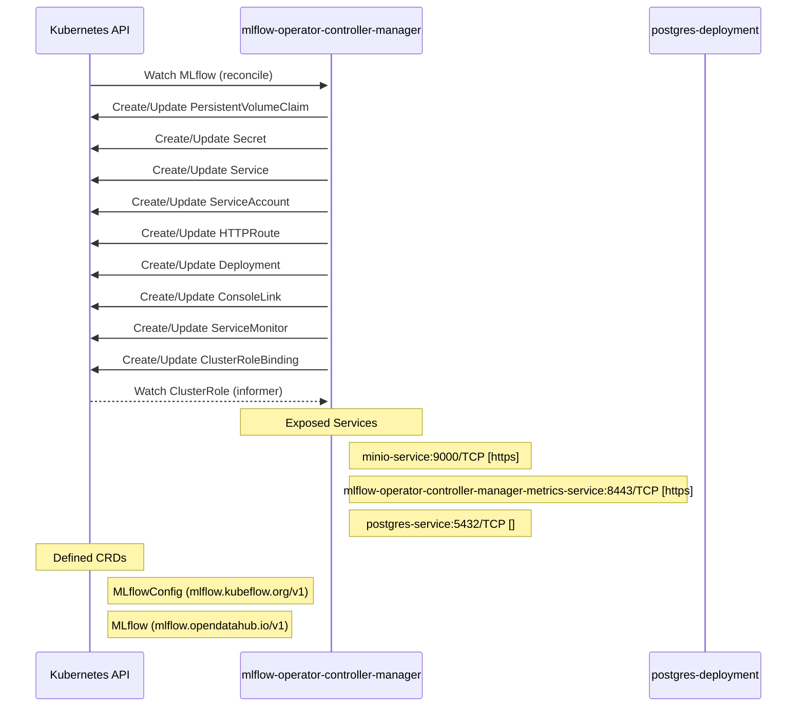

# mlflow-operator: Dataflow

## Controller Watches

Kubernetes resources this controller monitors for changes. Each watch triggers reconciliation when the watched resource is created, updated, or deleted.

| Type | GVK | Source |
|------|-----|--------|
| For | api/v1/MLflow | [`internal/controller/mlflow_controller.go:378`](https://github.com/opendatahub-io/mlflow-operator/blob/682055b5deae5d1cc92c0a24270aee8400704084/internal/controller/mlflow_controller.go#L378) |
| Owns | /v1/PersistentVolumeClaim | [`internal/controller/mlflow_controller.go:383`](https://github.com/opendatahub-io/mlflow-operator/blob/682055b5deae5d1cc92c0a24270aee8400704084/internal/controller/mlflow_controller.go#L383) |
| Owns | /v1/Secret | [`internal/controller/mlflow_controller.go:380`](https://github.com/opendatahub-io/mlflow-operator/blob/682055b5deae5d1cc92c0a24270aee8400704084/internal/controller/mlflow_controller.go#L380) |
| Owns | /v1/Service | [`internal/controller/mlflow_controller.go:381`](https://github.com/opendatahub-io/mlflow-operator/blob/682055b5deae5d1cc92c0a24270aee8400704084/internal/controller/mlflow_controller.go#L381) |
| Owns | /v1/ServiceAccount | [`internal/controller/mlflow_controller.go:382`](https://github.com/opendatahub-io/mlflow-operator/blob/682055b5deae5d1cc92c0a24270aee8400704084/internal/controller/mlflow_controller.go#L382) |
| Owns | apis/v1/HTTPRoute | [`internal/controller/mlflow_controller.go:412`](https://github.com/opendatahub-io/mlflow-operator/blob/682055b5deae5d1cc92c0a24270aee8400704084/internal/controller/mlflow_controller.go#L412) |
| Owns | apps/v1/Deployment | [`internal/controller/mlflow_controller.go:379`](https://github.com/opendatahub-io/mlflow-operator/blob/682055b5deae5d1cc92c0a24270aee8400704084/internal/controller/mlflow_controller.go#L379) |
| Owns | console/v1/ConsoleLink | [`internal/controller/mlflow_controller.go:404`](https://github.com/opendatahub-io/mlflow-operator/blob/682055b5deae5d1cc92c0a24270aee8400704084/internal/controller/mlflow_controller.go#L404) |
| Owns | monitoring/v1/ServiceMonitor | [`internal/controller/mlflow_controller.go:420`](https://github.com/opendatahub-io/mlflow-operator/blob/682055b5deae5d1cc92c0a24270aee8400704084/internal/controller/mlflow_controller.go#L420) |
| Owns | rbac.authorization.k8s.io/v1/ClusterRoleBinding | [`internal/controller/mlflow_controller.go:389`](https://github.com/opendatahub-io/mlflow-operator/blob/682055b5deae5d1cc92c0a24270aee8400704084/internal/controller/mlflow_controller.go#L389) |
| Watches | rbac.authorization.k8s.io/v1/ClusterRole | [`internal/controller/mlflow_controller.go:388`](https://github.com/opendatahub-io/mlflow-operator/blob/682055b5deae5d1cc92c0a24270aee8400704084/internal/controller/mlflow_controller.go#L388) |

## Reconciliation Flow

How the controller interacts with the Kubernetes API during reconciliation.

## Configuration

ConfigMaps and Helm values that control this component's runtime behavior.

### Helm

**Chart:** mlflow v0.1.0

