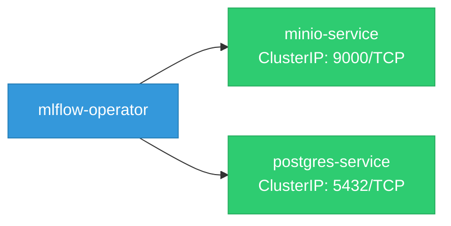
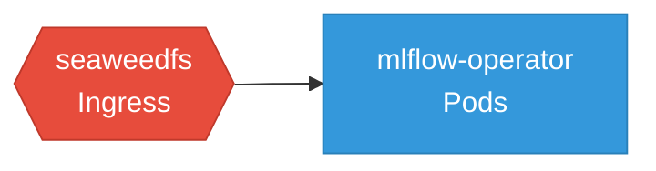

# mlflow-operator: Network

## Service Map

### Services

| Name | Type | Ports | Source |
|------|------|-------|--------|
| minio-service | ClusterIP | 9000/TCP | [`config/seaweedfs/components/tls/service-tls-patch.yaml`](https://github.com/opendatahub-io/mlflow-operator/blob/0f1ae27fceefa5171ae43ae008bd88349627a326/config/seaweedfs/components/tls/service-tls-patch.yaml) |
| postgres-service | ClusterIP | 5432/TCP | [`config/postgres/base/service.yaml`](https://github.com/opendatahub-io/mlflow-operator/blob/0f1ae27fceefa5171ae43ae008bd88349627a326/config/postgres/base/service.yaml) |

### Network Policies

| Name | Policy Types | Source |
|------|-------------|--------|
| seaweedfs | Ingress | [`config/seaweedfs/base/seaweedfs-networkpolicy.yaml`](https://github.com/opendatahub-io/mlflow-operator/blob/0f1ae27fceefa5171ae43ae008bd88349627a326/config/seaweedfs/base/seaweedfs-networkpolicy.yaml) |

## Network Policy Graph

Visual representation of NetworkPolicy rules. Ingress rules show what traffic is allowed into pods, egress rules show what traffic is allowed out.

