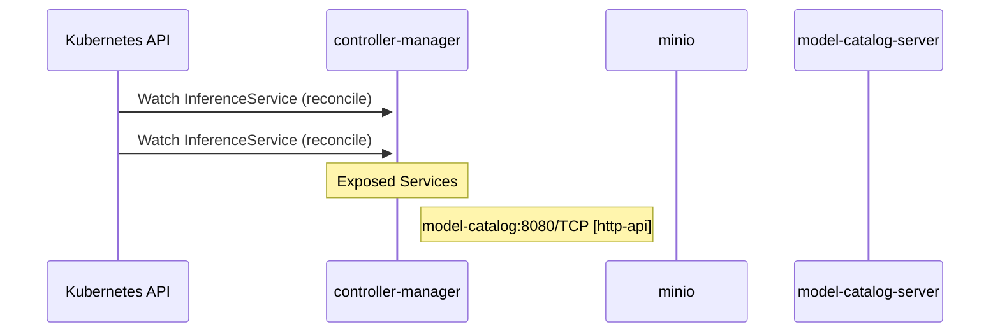

# model-registry: Dataflow

## Controller Watches

Kubernetes resources this controller monitors for changes. Each watch triggers reconciliation when the watched resource is created, updated, or deleted.

| Type | GVK | Source |
|------|-----|--------|
| For | serving/v1beta1/InferenceService | [`cmd/controller/internal/controllers/inferenceservice_controller.go:44`](https://github.com/kubeflow/model-registry/blob/bbd3a37dfa4adfa6239250a7c0cbf9b17fe7904a/cmd/controller/internal/controllers/inferenceservice_controller.go#L44) |
| For | serving/v1beta1/InferenceService | [`pkg/inferenceservice-controller/controller.go:239`](https://github.com/kubeflow/model-registry/blob/bbd3a37dfa4adfa6239250a7c0cbf9b17fe7904a/pkg/inferenceservice-controller/controller.go#L239) |

## Reconciliation Flow

How the controller interacts with the Kubernetes API during reconciliation.

## Configuration

ConfigMaps and Helm values that control this component's runtime behavior.

### ConfigMaps

| Name | Data Keys | Source |
|------|-----------|--------|
| auth-proxy-config | nginx.conf | [`manifests/kustomize/options/ui/overlays/standalone/auth-proxy-configmap.yaml`](https://github.com/kubeflow/model-registry/blob/bbd3a37dfa4adfa6239250a7c0cbf9b17fe7904a/manifests/kustomize/options/ui/overlays/standalone/auth-proxy-configmap.yaml) |
| model-registry-configmap | MODEL_REGISTRY_DATA_STORE_TYPE, MODEL_REGISTRY_REST_SERVICE_HOST, MODEL_REGISTRY_REST_SERVICE_PORT | [`manifests/kustomize/base/model-registry-configmap.yaml`](https://github.com/kubeflow/model-registry/blob/bbd3a37dfa4adfa6239250a7c0cbf9b17fe7904a/manifests/kustomize/base/model-registry-configmap.yaml) |

