# model-registry: RBAC

ServiceAccount bindings, roles, and resource permissions.

## RBAC Hierarchy

```mermaid
graph TD
    %% RBAC hierarchy for model-registry
    classDef sa fill:#4a90d9,stroke:#2c5f8a,color:#fff
    classDef role fill:#e8a838,stroke:#b07828,color:#fff
    classDef resource fill:#5cb85c,stroke:#3d8b3d,color:#fff

    sa_2["ServiceAccount: controller-manager (system)"] -->|bound via metrics-auth-rolebinding| crb_1["metrics-auth-rolebinding"]
    class sa_2 sa
    crb_1 -->|grants| cr_metrics_auth_role["CR: metrics-auth-role"]
    class cr_metrics_auth_role role
    sa_4["ServiceAccount: model-registry-ui"] -->|bound via model-registry-create-sars-binding| crb_3["model-registry-create-sars-binding"]
    class sa_4 sa
    crb_3 -->|grants| cr_model_registry_create_sars["CR: model-registry-create-sars"]
    class cr_model_registry_create_sars role
    sa_6["ServiceAccount: controller-manager (system)"] -->|bound via model-registry-manager-rolebinding| crb_5["model-registry-manager-rolebinding"]
    class sa_6 sa
    crb_5 -->|grants| cr_model_registry_manager_role["CR: model-registry-manager-role"]
    class cr_model_registry_manager_role role
    sa_8["ServiceAccount: model-registry-ui"] -->|bound via model-registry-retrieve-clusterrolebindings-binding| crb_7["model-registry-retrieve-clusterrolebindings-binding"]
    class sa_8 sa
    crb_7 -->|grants| cr_model_registry_retrieve_clusterrolebindings["CR: model-registry-retrieve-clusterrolebindings"]
    class cr_model_registry_retrieve_clusterrolebindings role
    sa_10["ServiceAccount: model-registry-ui"] -->|bound via model-registry-ui-services-reader-binding| crb_9["model-registry-ui-services-reader-binding"]
    class sa_10 sa
    crb_9 -->|grants| cr_model_registry_ui_services_reader["CR: model-registry-ui-services-reader"]
    class cr_model_registry_ui_services_reader role
    sa_12["ServiceAccount: controller-manager"] -->|bound via leader-election-rolebinding| rb_11["leader-election-rolebinding"]
    class sa_12 sa
    rb_11 -->|grants| r_leader_election_role["Role: leader-election-role"]
    class r_leader_election_role role
    cr_metrics_auth_role -->|create| res_13["authentication.k8s.io: tokenreviews"]
    class res_13 resource
    cr_metrics_auth_role -->|create| res_14["authorization.k8s.io: subjectaccessreviews"]
    class res_14 resource
    cr_model_registry_create_sars -->|create| res_15["authorization.k8s.io: subjectaccessreviews"]
    class res_15 resource
    cr_model_registry_manager_role -->|get, list, watch| res_16["core: services"]
    class res_16 resource
    cr_model_registry_manager_role -->|get, list, patch, update, watch| res_17["serving.kserve.io: inferenceservices"]
    class res_17 resource
    cr_model_registry_manager_role -->|create, delete, get, list, patch, update, watch| res_18["serving.kserve.io: inferenceservices/finalizers"]
    class res_18 resource
    cr_model_registry_retrieve_clusterrolebindings -->|get, list, watch| res_19["rbac.authorization.k8s.io: clusterrolebindings"]
    class res_19 resource
    cr_model_registry_ui_services_reader -->|get, list, watch| res_20["core: services"]
    class res_20 resource
    r_leader_election_role -->|get, list, watch, create, update, patch, delete| res_21["core: configmaps"]
    class res_21 resource
    r_leader_election_role -->|get, list, watch, create, update, patch, delete| res_22["coordination.k8s.io: leases"]
    class res_22 resource
    r_leader_election_role -->|create, patch| res_23["core: events"]
    class res_23 resource
```

## Bindings

Subject-to-role mappings defining who has access to what.

| Binding | Type | Role | Subject |
|---------|------|------|---------|
| metrics-auth-rolebinding | ClusterRoleBinding | metrics-auth-role | ServiceAccount/controller-manager |
| model-registry-create-sars-binding | ClusterRoleBinding | model-registry-create-sars | ServiceAccount/model-registry-ui |
| model-registry-manager-rolebinding | ClusterRoleBinding | model-registry-manager-role | ServiceAccount/controller-manager |
| model-registry-retrieve-clusterrolebindings-binding | ClusterRoleBinding | model-registry-retrieve-clusterrolebindings | ServiceAccount/model-registry-ui |
| model-registry-ui-services-reader-binding | ClusterRoleBinding | model-registry-ui-services-reader | ServiceAccount/model-registry-ui |
| leader-election-rolebinding | RoleBinding | leader-election-role | ServiceAccount/controller-manager |

## Role Details

Per-rule breakdown of API groups, resources, and verbs for each role.

| Role | Kind | API Groups | Resources | Verbs |
|------|------|------------|-----------|-------|
| metrics-auth-role | ClusterRole |  | tokenreviews | create |
| metrics-auth-role | ClusterRole |  | subjectaccessreviews | create |
| metrics-reader | ClusterRole |  |  | get |
| model-registry-create-sars | ClusterRole |  | subjectaccessreviews | create |
| model-registry-manager-role | ClusterRole |  | services | get, list, watch |
| model-registry-manager-role | ClusterRole |  | inferenceservices | get, list, patch, update, watch |
| model-registry-manager-role | ClusterRole |  | inferenceservices/finalizers | create, delete, get, list, patch, update, watch |
| model-registry-retrieve-clusterrolebindings | ClusterRole |  | clusterrolebindings | get, list, watch |
| model-registry-ui-services-reader | ClusterRole |  | services | get, list, watch |
| leader-election-role | Role |  | configmaps | get, list, watch, create, update, patch, delete |
| leader-election-role | Role |  | leases | get, list, watch, create, update, patch, delete |
| leader-election-role | Role |  | events | create, patch |

### Cluster Roles

| Name | Resources | Verbs | Source |
|------|-----------|-------|--------|
| metrics-auth-role | tokenreviews | create | [`manifests/kustomize/options/controller/rbac/metrics_auth_role.yaml`](https://github.com/kubeflow/model-registry/blob/bbd3a37dfa4adfa6239250a7c0cbf9b17fe7904a/manifests/kustomize/options/controller/rbac/metrics_auth_role.yaml) |
| metrics-auth-role | subjectaccessreviews | create | [`manifests/kustomize/options/controller/rbac/metrics_auth_role.yaml`](https://github.com/kubeflow/model-registry/blob/bbd3a37dfa4adfa6239250a7c0cbf9b17fe7904a/manifests/kustomize/options/controller/rbac/metrics_auth_role.yaml) |
| metrics-reader |  | get | [`manifests/kustomize/options/controller/rbac/metrics_reader_role.yaml`](https://github.com/kubeflow/model-registry/blob/bbd3a37dfa4adfa6239250a7c0cbf9b17fe7904a/manifests/kustomize/options/controller/rbac/metrics_reader_role.yaml) |
| model-registry-create-sars | subjectaccessreviews | create | [`manifests/kustomize/options/ui/base/model-registry-ui-role.yaml`](https://github.com/kubeflow/model-registry/blob/bbd3a37dfa4adfa6239250a7c0cbf9b17fe7904a/manifests/kustomize/options/ui/base/model-registry-ui-role.yaml) |
| model-registry-manager-role | services | get, list, watch | [`manifests/kustomize/options/controller/rbac/role.yaml`](https://github.com/kubeflow/model-registry/blob/bbd3a37dfa4adfa6239250a7c0cbf9b17fe7904a/manifests/kustomize/options/controller/rbac/role.yaml) |
| model-registry-manager-role | inferenceservices | get, list, patch, update, watch | [`manifests/kustomize/options/controller/rbac/role.yaml`](https://github.com/kubeflow/model-registry/blob/bbd3a37dfa4adfa6239250a7c0cbf9b17fe7904a/manifests/kustomize/options/controller/rbac/role.yaml) |
| model-registry-manager-role | inferenceservices/finalizers | create, delete, get, list, patch, update, watch | [`manifests/kustomize/options/controller/rbac/role.yaml`](https://github.com/kubeflow/model-registry/blob/bbd3a37dfa4adfa6239250a7c0cbf9b17fe7904a/manifests/kustomize/options/controller/rbac/role.yaml) |
| model-registry-retrieve-clusterrolebindings | clusterrolebindings | get, list, watch | [`manifests/kustomize/options/ui/base/model-registry-ui-role.yaml`](https://github.com/kubeflow/model-registry/blob/bbd3a37dfa4adfa6239250a7c0cbf9b17fe7904a/manifests/kustomize/options/ui/base/model-registry-ui-role.yaml) |
| model-registry-ui-services-reader | services | get, list, watch | [`manifests/kustomize/options/ui/base/model-registry-ui-role.yaml`](https://github.com/kubeflow/model-registry/blob/bbd3a37dfa4adfa6239250a7c0cbf9b17fe7904a/manifests/kustomize/options/ui/base/model-registry-ui-role.yaml) |

