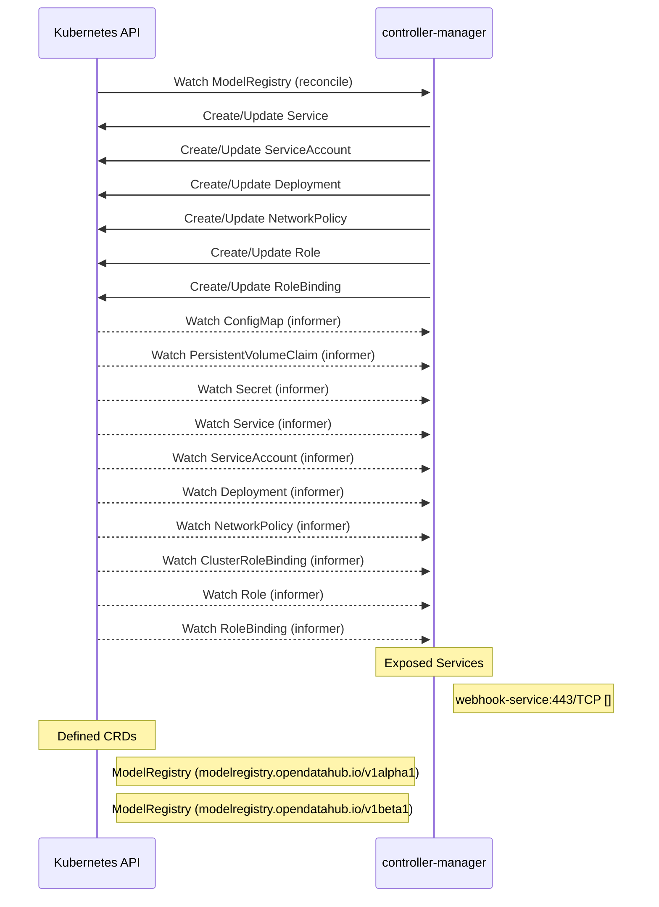

# model-registry-operator: Dataflow

## Controller Watches

Kubernetes resources this controller monitors for changes. Each watch triggers reconciliation when the watched resource is created, updated, or deleted.

| Type | GVK | Source |
|------|-----|--------|
| For | api/v1beta1/ModelRegistry | [`internal/controller/modelregistry_controller.go:258`](https://github.com/opendatahub-io/model-registry-operator/blob/c81ec8b48c8bd3fdd5ab30ddfdcd745f09ab4cab/internal/controller/modelregistry_controller.go#L258) |
| Owns | /v1/Service | [`internal/controller/modelregistry_controller.go:259`](https://github.com/opendatahub-io/model-registry-operator/blob/c81ec8b48c8bd3fdd5ab30ddfdcd745f09ab4cab/internal/controller/modelregistry_controller.go#L259) |
| Owns | /v1/ServiceAccount | [`internal/controller/modelregistry_controller.go:260`](https://github.com/opendatahub-io/model-registry-operator/blob/c81ec8b48c8bd3fdd5ab30ddfdcd745f09ab4cab/internal/controller/modelregistry_controller.go#L260) |
| Owns | apps/v1/Deployment | [`internal/controller/modelregistry_controller.go:261`](https://github.com/opendatahub-io/model-registry-operator/blob/c81ec8b48c8bd3fdd5ab30ddfdcd745f09ab4cab/internal/controller/modelregistry_controller.go#L261) |
| Owns | networking.k8s.io/v1/NetworkPolicy | [`internal/controller/modelregistry_controller.go:263`](https://github.com/opendatahub-io/model-registry-operator/blob/c81ec8b48c8bd3fdd5ab30ddfdcd745f09ab4cab/internal/controller/modelregistry_controller.go#L263) |
| Owns | rbac.authorization.k8s.io/v1/Role | [`internal/controller/modelregistry_controller.go:262`](https://github.com/opendatahub-io/model-registry-operator/blob/c81ec8b48c8bd3fdd5ab30ddfdcd745f09ab4cab/internal/controller/modelregistry_controller.go#L262) |
| Owns | rbac.authorization.k8s.io/v1/RoleBinding | [`internal/controller/modelregistry_controller.go:265`](https://github.com/opendatahub-io/model-registry-operator/blob/c81ec8b48c8bd3fdd5ab30ddfdcd745f09ab4cab/internal/controller/modelregistry_controller.go#L265) |
| Watches | /v1/ConfigMap | [`internal/controller/modelcatalog_controller.go:1335`](https://github.com/opendatahub-io/model-registry-operator/blob/c81ec8b48c8bd3fdd5ab30ddfdcd745f09ab4cab/internal/controller/modelcatalog_controller.go#L1335) |
| Watches | /v1/PersistentVolumeClaim | [`internal/controller/modelcatalog_controller.go:1339`](https://github.com/opendatahub-io/model-registry-operator/blob/c81ec8b48c8bd3fdd5ab30ddfdcd745f09ab4cab/internal/controller/modelcatalog_controller.go#L1339) |
| Watches | /v1/Secret | [`internal/controller/modelcatalog_controller.go:1336`](https://github.com/opendatahub-io/model-registry-operator/blob/c81ec8b48c8bd3fdd5ab30ddfdcd745f09ab4cab/internal/controller/modelcatalog_controller.go#L1336) |
| Watches | /v1/Service | [`internal/controller/modelcatalog_controller.go:1338`](https://github.com/opendatahub-io/model-registry-operator/blob/c81ec8b48c8bd3fdd5ab30ddfdcd745f09ab4cab/internal/controller/modelcatalog_controller.go#L1338) |
| Watches | /v1/ServiceAccount | [`internal/controller/modelcatalog_controller.go:1337`](https://github.com/opendatahub-io/model-registry-operator/blob/c81ec8b48c8bd3fdd5ab30ddfdcd745f09ab4cab/internal/controller/modelcatalog_controller.go#L1337) |
| Watches | apps/v1/Deployment | [`internal/controller/modelcatalog_controller.go:1334`](https://github.com/opendatahub-io/model-registry-operator/blob/c81ec8b48c8bd3fdd5ab30ddfdcd745f09ab4cab/internal/controller/modelcatalog_controller.go#L1334) |
| Watches | networking.k8s.io/v1/NetworkPolicy | [`internal/controller/modelcatalog_controller.go:1343`](https://github.com/opendatahub-io/model-registry-operator/blob/c81ec8b48c8bd3fdd5ab30ddfdcd745f09ab4cab/internal/controller/modelcatalog_controller.go#L1343) |
| Watches | rbac.authorization.k8s.io/v1/ClusterRoleBinding | [`internal/controller/modelcatalog_controller.go:1340`](https://github.com/opendatahub-io/model-registry-operator/blob/c81ec8b48c8bd3fdd5ab30ddfdcd745f09ab4cab/internal/controller/modelcatalog_controller.go#L1340) |
| Watches | rbac.authorization.k8s.io/v1/Role | [`internal/controller/modelcatalog_controller.go:1341`](https://github.com/opendatahub-io/model-registry-operator/blob/c81ec8b48c8bd3fdd5ab30ddfdcd745f09ab4cab/internal/controller/modelcatalog_controller.go#L1341) |
| Watches | rbac.authorization.k8s.io/v1/RoleBinding | [`internal/controller/modelcatalog_controller.go:1342`](https://github.com/opendatahub-io/model-registry-operator/blob/c81ec8b48c8bd3fdd5ab30ddfdcd745f09ab4cab/internal/controller/modelcatalog_controller.go#L1342) |

## Reconciliation Flow

How the controller interacts with the Kubernetes API during reconciliation.

### Webhooks

| Name | Type | Path | Failure Policy | Service | Source |
|------|------|------|----------------|---------|--------|
| mmodelregistry.opendatahub.io | mutating | /mutate-modelregistry-opendatahub-io-modelregistry | Fail | system/webhook-service | [`config/webhook/manifests.yaml`](https://github.com/opendatahub-io/model-registry-operator/blob/c81ec8b48c8bd3fdd5ab30ddfdcd745f09ab4cab/config/webhook/manifests.yaml) |
| mmodelregistry.opendatahub.io | mutating | /mutate-modelregistry-opendatahub-io-modelregistry | fail |  | [`internal/webhook/modelregistry_webhook.go`](https://github.com/opendatahub-io/model-registry-operator/blob/c81ec8b48c8bd3fdd5ab30ddfdcd745f09ab4cab/internal/webhook/modelregistry_webhook.go) |
| vmodelregistry.opendatahub.io | validating | /validate-modelregistry-opendatahub-io-modelregistry | Fail | system/webhook-service | [`config/webhook/manifests.yaml`](https://github.com/opendatahub-io/model-registry-operator/blob/c81ec8b48c8bd3fdd5ab30ddfdcd745f09ab4cab/config/webhook/manifests.yaml) |
| vmodelregistry.opendatahub.io | validating | /validate-modelregistry-opendatahub-io-modelregistry | fail |  | [`internal/webhook/modelregistry_webhook.go`](https://github.com/opendatahub-io/model-registry-operator/blob/c81ec8b48c8bd3fdd5ab30ddfdcd745f09ab4cab/internal/webhook/modelregistry_webhook.go) |

## Configuration

ConfigMaps and Helm values that control this component's runtime behavior.

