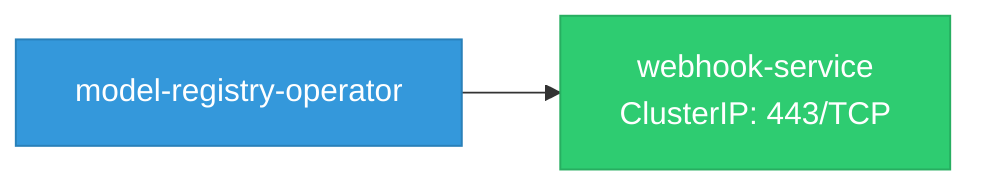

# model-registry-operator: Network

## Service Map

### Services

| Name | Type | Ports | Source |
|------|------|-------|--------|
| webhook-service | ClusterIP | 443/TCP | [`config/webhook/service.yaml`](https://github.com/opendatahub-io/model-registry-operator/blob/ac1c32da2173c5150fd4d1fbedf33a686b9f9608/config/webhook/service.yaml) |

!!! warning "No Network Policies"
    No NetworkPolicy resources found. All pod-to-pod traffic is allowed by default.

