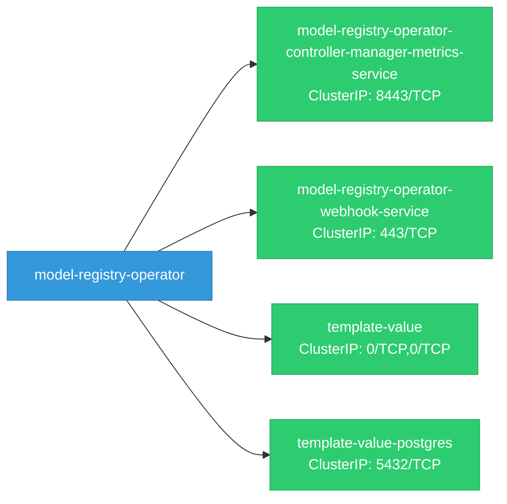
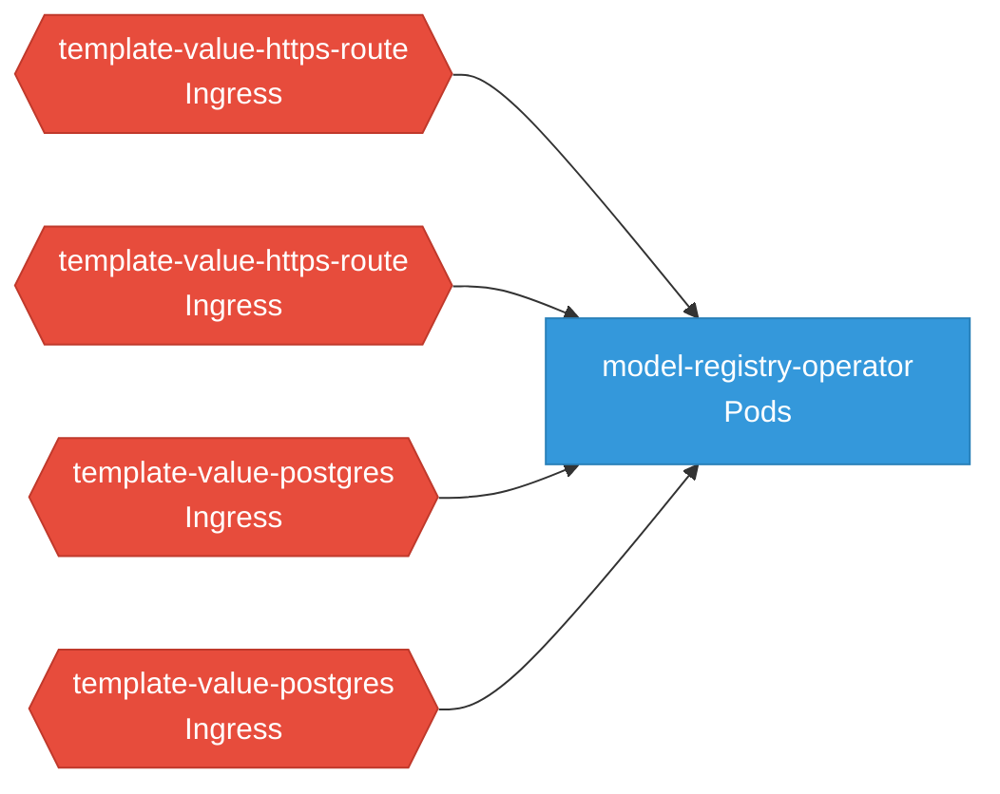

# model-registry-operator: Network

## Service Map

*4 unique services (6 total, duplicates from test fixtures collapsed).*

### Services

| Name | Type | Ports | Source |
|------|------|-------|--------|
| model-registry-operator-controller-manager-metrics-service | ClusterIP | 8443/TCP | [`kustomize:config/overlays/odh`](https://github.com/opendatahub-io/model-registry-operator/blob/34bd7584e8cbe37e2f767baa95883d5f3774ca51/kustomize:config/overlays/odh) |
| model-registry-operator-webhook-service | ClusterIP | 443/TCP | [`kustomize:config/overlays/odh`](https://github.com/opendatahub-io/model-registry-operator/blob/34bd7584e8cbe37e2f767baa95883d5f3774ca51/kustomize:config/overlays/odh) |
| template-value | ClusterIP | 0/TCP, 0/TCP | [`internal/controller/config/templates/service.yaml.tmpl`](https://github.com/opendatahub-io/model-registry-operator/blob/34bd7584e8cbe37e2f767baa95883d5f3774ca51/internal/controller/config/templates/service.yaml.tmpl) |
| template-value | ClusterIP | 0/TCP, 0/TCP | [`internal/controller/config/templates/catalog/catalog-service.yaml.tmpl`](https://github.com/opendatahub-io/model-registry-operator/blob/34bd7584e8cbe37e2f767baa95883d5f3774ca51/internal/controller/config/templates/catalog/catalog-service.yaml.tmpl) |
| template-value-postgres | ClusterIP | 5432/TCP | [`internal/controller/config/templates/catalog/catalog-postgres-service.yaml.tmpl`](https://github.com/opendatahub-io/model-registry-operator/blob/34bd7584e8cbe37e2f767baa95883d5f3774ca51/internal/controller/config/templates/catalog/catalog-postgres-service.yaml.tmpl) |
| template-value-postgres | ClusterIP | 5432/TCP | [`internal/controller/config/templates/postgres-service.yaml.tmpl`](https://github.com/opendatahub-io/model-registry-operator/blob/34bd7584e8cbe37e2f767baa95883d5f3774ca51/internal/controller/config/templates/postgres-service.yaml.tmpl) |

### Ingress / Routing

| Kind | Name | Hosts | Paths | TLS | Source |
|------|------|-------|-------|-----|--------|
| Route | rbac-inferred |  |  | no | [`rbac/manager-role`](https://github.com/opendatahub-io/model-registry-operator/blob/34bd7584e8cbe37e2f767baa95883d5f3774ca51/rbac/manager-role) |

### Network Policies

| Name | Policy Types | Source |
|------|-------------|--------|
| template-value-https-route | Ingress | [`internal/controller/config/templates/catalog/catalog-kube-rbac-proxy-network-policy.yaml.tmpl`](https://github.com/opendatahub-io/model-registry-operator/blob/34bd7584e8cbe37e2f767baa95883d5f3774ca51/internal/controller/config/templates/catalog/catalog-kube-rbac-proxy-network-policy.yaml.tmpl) |
| template-value-https-route | Ingress | [`internal/controller/config/templates/kube-rbac-proxy/kube-rbac-proxy-network-policy.yaml.tmpl`](https://github.com/opendatahub-io/model-registry-operator/blob/34bd7584e8cbe37e2f767baa95883d5f3774ca51/internal/controller/config/templates/kube-rbac-proxy/kube-rbac-proxy-network-policy.yaml.tmpl) |
| template-value-postgres | Ingress | [`internal/controller/config/templates/catalog/catalog-postgres-network-policy.yaml.tmpl`](https://github.com/opendatahub-io/model-registry-operator/blob/34bd7584e8cbe37e2f767baa95883d5f3774ca51/internal/controller/config/templates/catalog/catalog-postgres-network-policy.yaml.tmpl) |
| template-value-postgres | Ingress | [`internal/controller/config/templates/postgres-network-policy.yaml.tmpl`](https://github.com/opendatahub-io/model-registry-operator/blob/34bd7584e8cbe37e2f767baa95883d5f3774ca51/internal/controller/config/templates/postgres-network-policy.yaml.tmpl) |

## Network Policy Graph

Visual representation of NetworkPolicy rules. Ingress rules show what traffic is allowed into pods, egress rules show what traffic is allowed out.

