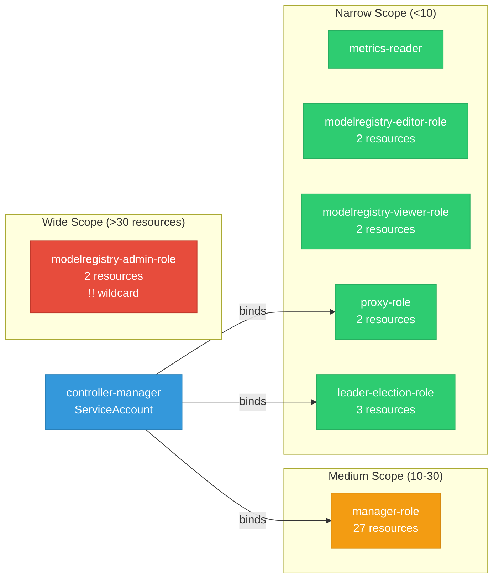

# model-registry-operator: RBAC

ServiceAccount bindings, roles, and resource permissions.

## RBAC Overview

This component defines a large RBAC surface (93 diagram lines). The graph below groups roles by permission scope.

## Bindings

Subject-to-role mappings defining who has access to what.

| Binding | Type | Role | Subject |
|---------|------|------|---------|
| manager-rolebinding | ClusterRoleBinding | manager-role | ServiceAccount/controller-manager |
| proxy-rolebinding | ClusterRoleBinding | proxy-role | ServiceAccount/controller-manager |
| leader-election-rolebinding | RoleBinding | leader-election-role | ServiceAccount/controller-manager |

## Role Details

Per-rule breakdown of API groups, resources, and verbs for each role.

| Role | Kind | API Groups | Resources | Verbs |
|------|------|------------|-----------|-------|
| manager-role | ClusterRole |  | configmaps, persistentvolumeclaims, secrets, serviceaccounts, services | create, delete, get, list, patch, update, watch |
| manager-role | ClusterRole |  | endpoints, pods, pods/log | get, list, watch |
| manager-role | ClusterRole |  | events | create, patch |
| manager-role | ClusterRole |  | customresourcedefinitions | get, list, watch |
| manager-role | ClusterRole |  | deployments | create, delete, get, list, patch, update, watch |
| manager-role | ClusterRole |  | tokenreviews | create |
| manager-role | ClusterRole |  | subjectaccessreviews | create |
| manager-role | ClusterRole |  | modelregistries | get, list, watch |
| manager-role | ClusterRole |  | ingresses | get, list, watch |
| manager-role | ClusterRole |  | storageversionmigrations | create, delete, get, list, patch, update, watch |
| manager-role | ClusterRole |  | modelregistries | create, delete, get, list, patch, update, watch |
| manager-role | ClusterRole |  | modelregistries/finalizers | update |
| manager-role | ClusterRole |  | modelregistries/status | get, patch, update |
| manager-role | ClusterRole |  | networkpolicies | create, delete, get, list, patch, update, watch |
| manager-role | ClusterRole |  | clusterrolebindings, rolebindings, roles | create, delete, get, list, patch, update, watch |
| manager-role | ClusterRole |  | routes, routes/custom-host | create, delete, get, list, patch, update, watch |
| manager-role | ClusterRole |  | auths | get, list, watch |
| manager-role | ClusterRole |  | groups | create, delete, get, list, patch, update, watch |
| metrics-reader | ClusterRole |  |  | get |
| modelregistry-admin-role | ClusterRole |  | modelregistries | * |
| modelregistry-admin-role | ClusterRole |  | modelregistries/status | get |
| modelregistry-editor-role | ClusterRole |  | modelregistries | create, delete, get, list, patch, update, watch |
| modelregistry-editor-role | ClusterRole |  | modelregistries/status | get |
| modelregistry-viewer-role | ClusterRole |  | modelregistries | get, list, watch |
| modelregistry-viewer-role | ClusterRole |  | modelregistries/status | get |
| proxy-role | ClusterRole |  | tokenreviews | create |
| proxy-role | ClusterRole |  | subjectaccessreviews | create |
| leader-election-role | Role |  | configmaps | get, list, watch, create, update, patch, delete |
| leader-election-role | Role |  | leases | get, list, watch, create, update, patch, delete |
| leader-election-role | Role |  | events | create, patch |

### Cluster Roles

| Name | Resources | Verbs | Source |
|------|-----------|-------|--------|
| manager-role | configmaps, persistentvolumeclaims, secrets, serviceaccounts, services | create, delete, get, list, patch, update, watch | [`config/rbac/role.yaml`](https://github.com/opendatahub-io/model-registry-operator/blob/34bd7584e8cbe37e2f767baa95883d5f3774ca51/config/rbac/role.yaml) |
| manager-role | endpoints, pods, pods/log | get, list, watch | [`config/rbac/role.yaml`](https://github.com/opendatahub-io/model-registry-operator/blob/34bd7584e8cbe37e2f767baa95883d5f3774ca51/config/rbac/role.yaml) |
| manager-role | events | create, patch | [`config/rbac/role.yaml`](https://github.com/opendatahub-io/model-registry-operator/blob/34bd7584e8cbe37e2f767baa95883d5f3774ca51/config/rbac/role.yaml) |
| manager-role | customresourcedefinitions | get, list, watch | [`config/rbac/role.yaml`](https://github.com/opendatahub-io/model-registry-operator/blob/34bd7584e8cbe37e2f767baa95883d5f3774ca51/config/rbac/role.yaml) |
| manager-role | deployments | create, delete, get, list, patch, update, watch | [`config/rbac/role.yaml`](https://github.com/opendatahub-io/model-registry-operator/blob/34bd7584e8cbe37e2f767baa95883d5f3774ca51/config/rbac/role.yaml) |
| manager-role | tokenreviews | create | [`config/rbac/role.yaml`](https://github.com/opendatahub-io/model-registry-operator/blob/34bd7584e8cbe37e2f767baa95883d5f3774ca51/config/rbac/role.yaml) |
| manager-role | subjectaccessreviews | create | [`config/rbac/role.yaml`](https://github.com/opendatahub-io/model-registry-operator/blob/34bd7584e8cbe37e2f767baa95883d5f3774ca51/config/rbac/role.yaml) |
| manager-role | modelregistries | get, list, watch | [`config/rbac/role.yaml`](https://github.com/opendatahub-io/model-registry-operator/blob/34bd7584e8cbe37e2f767baa95883d5f3774ca51/config/rbac/role.yaml) |
| manager-role | ingresses | get, list, watch | [`config/rbac/role.yaml`](https://github.com/opendatahub-io/model-registry-operator/blob/34bd7584e8cbe37e2f767baa95883d5f3774ca51/config/rbac/role.yaml) |
| manager-role | storageversionmigrations | create, delete, get, list, patch, update, watch | [`config/rbac/role.yaml`](https://github.com/opendatahub-io/model-registry-operator/blob/34bd7584e8cbe37e2f767baa95883d5f3774ca51/config/rbac/role.yaml) |
| manager-role | modelregistries | create, delete, get, list, patch, update, watch | [`config/rbac/role.yaml`](https://github.com/opendatahub-io/model-registry-operator/blob/34bd7584e8cbe37e2f767baa95883d5f3774ca51/config/rbac/role.yaml) |
| manager-role | modelregistries/finalizers | update | [`config/rbac/role.yaml`](https://github.com/opendatahub-io/model-registry-operator/blob/34bd7584e8cbe37e2f767baa95883d5f3774ca51/config/rbac/role.yaml) |
| manager-role | modelregistries/status | get, patch, update | [`config/rbac/role.yaml`](https://github.com/opendatahub-io/model-registry-operator/blob/34bd7584e8cbe37e2f767baa95883d5f3774ca51/config/rbac/role.yaml) |
| manager-role | networkpolicies | create, delete, get, list, patch, update, watch | [`config/rbac/role.yaml`](https://github.com/opendatahub-io/model-registry-operator/blob/34bd7584e8cbe37e2f767baa95883d5f3774ca51/config/rbac/role.yaml) |
| manager-role | clusterrolebindings, rolebindings, roles | create, delete, get, list, patch, update, watch | [`config/rbac/role.yaml`](https://github.com/opendatahub-io/model-registry-operator/blob/34bd7584e8cbe37e2f767baa95883d5f3774ca51/config/rbac/role.yaml) |
| manager-role | routes, routes/custom-host | create, delete, get, list, patch, update, watch | [`config/rbac/role.yaml`](https://github.com/opendatahub-io/model-registry-operator/blob/34bd7584e8cbe37e2f767baa95883d5f3774ca51/config/rbac/role.yaml) |
| manager-role | auths | get, list, watch | [`config/rbac/role.yaml`](https://github.com/opendatahub-io/model-registry-operator/blob/34bd7584e8cbe37e2f767baa95883d5f3774ca51/config/rbac/role.yaml) |
| manager-role | groups | create, delete, get, list, patch, update, watch | [`config/rbac/role.yaml`](https://github.com/opendatahub-io/model-registry-operator/blob/34bd7584e8cbe37e2f767baa95883d5f3774ca51/config/rbac/role.yaml) |
| metrics-reader |  | get | [`config/rbac/auth_proxy_client_clusterrole.yaml`](https://github.com/opendatahub-io/model-registry-operator/blob/34bd7584e8cbe37e2f767baa95883d5f3774ca51/config/rbac/auth_proxy_client_clusterrole.yaml) |
| modelregistry-admin-role | modelregistries | * | [`config/rbac/modelregistry_admin_role.yaml`](https://github.com/opendatahub-io/model-registry-operator/blob/34bd7584e8cbe37e2f767baa95883d5f3774ca51/config/rbac/modelregistry_admin_role.yaml) |
| modelregistry-admin-role | modelregistries/status | get | [`config/rbac/modelregistry_admin_role.yaml`](https://github.com/opendatahub-io/model-registry-operator/blob/34bd7584e8cbe37e2f767baa95883d5f3774ca51/config/rbac/modelregistry_admin_role.yaml) |
| modelregistry-editor-role | modelregistries | create, delete, get, list, patch, update, watch | [`config/rbac/modelregistry_editor_role.yaml`](https://github.com/opendatahub-io/model-registry-operator/blob/34bd7584e8cbe37e2f767baa95883d5f3774ca51/config/rbac/modelregistry_editor_role.yaml) |
| modelregistry-editor-role | modelregistries/status | get | [`config/rbac/modelregistry_editor_role.yaml`](https://github.com/opendatahub-io/model-registry-operator/blob/34bd7584e8cbe37e2f767baa95883d5f3774ca51/config/rbac/modelregistry_editor_role.yaml) |
| modelregistry-viewer-role | modelregistries | get, list, watch | [`config/rbac/modelregistry_viewer_role.yaml`](https://github.com/opendatahub-io/model-registry-operator/blob/34bd7584e8cbe37e2f767baa95883d5f3774ca51/config/rbac/modelregistry_viewer_role.yaml) |
| modelregistry-viewer-role | modelregistries/status | get | [`config/rbac/modelregistry_viewer_role.yaml`](https://github.com/opendatahub-io/model-registry-operator/blob/34bd7584e8cbe37e2f767baa95883d5f3774ca51/config/rbac/modelregistry_viewer_role.yaml) |
| proxy-role | tokenreviews | create | [`config/rbac/auth_proxy_role.yaml`](https://github.com/opendatahub-io/model-registry-operator/blob/34bd7584e8cbe37e2f767baa95883d5f3774ca51/config/rbac/auth_proxy_role.yaml) |
| proxy-role | subjectaccessreviews | create | [`config/rbac/auth_proxy_role.yaml`](https://github.com/opendatahub-io/model-registry-operator/blob/34bd7584e8cbe37e2f767baa95883d5f3774ca51/config/rbac/auth_proxy_role.yaml) |

### Kubebuilder RBAC Markers

Kubebuilder `+kubebuilder:rbac` markers declare the RBAC requirements of controller reconcilers. These are the source of truth for generated ClusterRole manifests. 5 markers found.

| File | Line | Groups | Resources | Verbs |
|------|------|--------|-----------|-------|
| [`internal/migration/detector.go:39`](https://github.com/opendatahub-io/model-registry-operator/blob/34bd7584e8cbe37e2f767baa95883d5f3774ca51/internal/migration/detector.go#L39) | 39 | migration.k8s.io | storageversionmigrations | get, list, watch, create, update, patch, delete |
| [`internal/migration/detector.go:40`](https://github.com/opendatahub-io/model-registry-operator/blob/34bd7584e8cbe37e2f767baa95883d5f3774ca51/internal/migration/detector.go#L40) | 40 | apiextensions.k8s.io | customresourcedefinitions | get, list, watch |
| [`internal/migration/detector.go:41`](https://github.com/opendatahub-io/model-registry-operator/blob/34bd7584e8cbe37e2f767baa95883d5f3774ca51/internal/migration/detector.go#L41) | 41 | modelregistry.opendatahub.io | modelregistries | get, list, watch, update, patch |
| [`internal/migration/manual_strategy.go:33`](https://github.com/opendatahub-io/model-registry-operator/blob/34bd7584e8cbe37e2f767baa95883d5f3774ca51/internal/migration/manual_strategy.go#L33) | 33 | modelregistry.opendatahub.io | modelregistries | get, list, watch, update, patch |
| [`internal/migration/svm_strategy.go:35`](https://github.com/opendatahub-io/model-registry-operator/blob/34bd7584e8cbe37e2f767baa95883d5f3774ca51/internal/migration/svm_strategy.go#L35) | 35 | migration.k8s.io | storageversionmigrations | get, list, watch, create, update, patch, delete |

