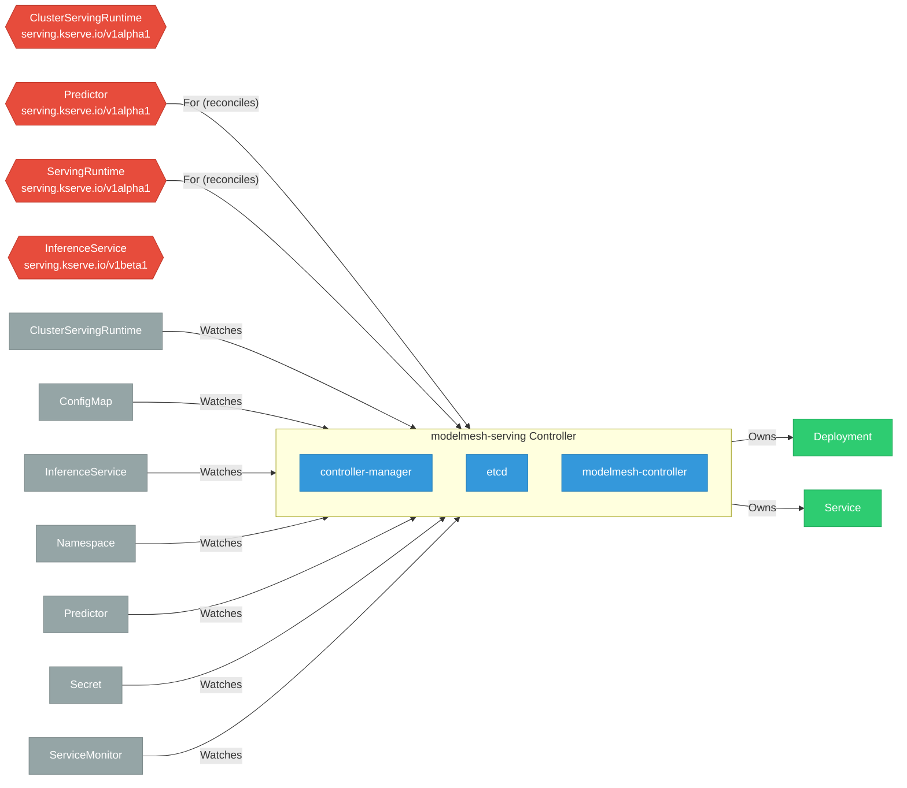

# modelmesh-serving

> **Architecture snapshot: 2026-05-05** (2026-05-05)

**Repository:** kserve/modelmesh-serving  
**Analyzer:** arch-analyzer 0.2.0  
**Extracted:** 2026-05-05T15:09:04Z

## Summary

| Metric | Count |
|--------|-------|
| CRDs | 4 |
| Deployments | 3 |
| Services | 3 |
| Secrets | 1 |
| Cluster Roles | 0 |
| Controller Watches | 17 |

## Component Architecture

CRDs, controllers, and owned Kubernetes resources.

### CRDs

| Group | Version | Kind | Scope | Fields | Validation Rules | Source |
|-------|---------|------|-------|--------|------------------|--------|
| serving.kserve.io | v1alpha1 | ClusterServingRuntime | Cluster | 559 | 0 | [`config/crd/bases/serving.kserve.io_clusterservingruntimes.yaml`](https://github.com/kserve/modelmesh-serving/blob/056bc2e855779c02536db9ef786b26cc73c63f20/config/crd/bases/serving.kserve.io_clusterservingruntimes.yaml) |
| serving.kserve.io | v1alpha1 | Predictor | Namespaced | 40 | 0 | [`config/crd/bases/serving.kserve.io_predictors.yaml`](https://github.com/kserve/modelmesh-serving/blob/056bc2e855779c02536db9ef786b26cc73c63f20/config/crd/bases/serving.kserve.io_predictors.yaml) |
| serving.kserve.io | v1alpha1 | ServingRuntime | Namespaced | 1140 | 0 | [`config/crd/bases/serving.kserve.io_servingruntimes.yaml`](https://github.com/kserve/modelmesh-serving/blob/056bc2e855779c02536db9ef786b26cc73c63f20/config/crd/bases/serving.kserve.io_servingruntimes.yaml) |
| serving.kserve.io | v1beta1 | InferenceService | Namespaced | 6195 | 0 | [`config/crd/bases/serving.kserve.io_inferenceservices.yaml`](https://github.com/kserve/modelmesh-serving/blob/056bc2e855779c02536db9ef786b26cc73c63f20/config/crd/bases/serving.kserve.io_inferenceservices.yaml) |

## Dependencies

### Key External Dependencies

| Module | Version |
|--------|---------|
| github.com/go-logr/logr | v1.4.1 |
| github.com/operator-framework/operator-lib | v0.10.0 |
| github.com/prometheus-operator/prometheus-operator/pkg/apis/monitoring | v0.55.0 |
| google.golang.org/grpc | v1.59.0 |
| k8s.io/api | v0.28.4 |
| k8s.io/apimachinery | v0.30.13 |
| k8s.io/client-go | v0.28.4 |
| sigs.k8s.io/controller-runtime | v0.16.3 |

