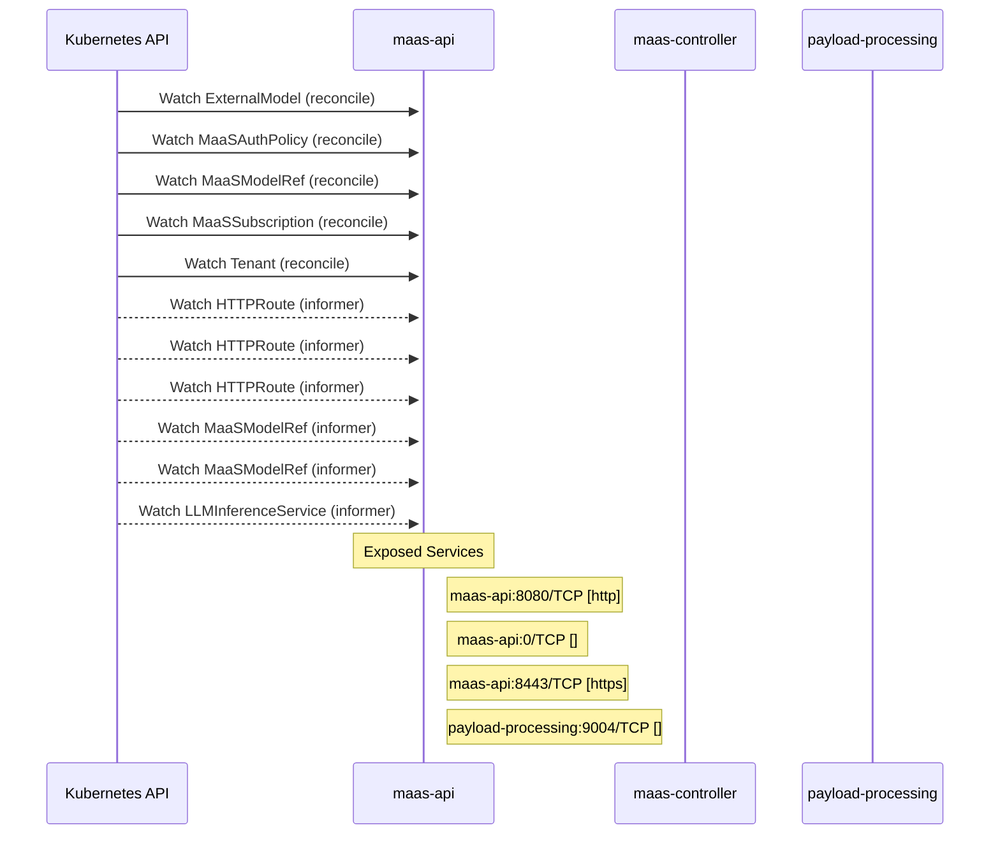

# models-as-a-service: Dataflow

## Controller Watches

Kubernetes resources this controller monitors for changes. Each watch triggers reconciliation when the watched resource is created, updated, or deleted.

| Type | GVK | Source |
|------|-----|--------|
| For | maas/v1alpha1/ExternalModel | [`maas-controller/pkg/reconciler/externalmodel/reconciler.go:299`](https://github.com/red-hat-data-services/models-as-a-service/blob/deb400cda287d7bb213b0450fe71ffa00f6dc646/maas-controller/pkg/reconciler/externalmodel/reconciler.go#L299) |
| For | maas/v1alpha1/MaaSAuthPolicy | [`maas-controller/pkg/controller/maas/maasauthpolicy_controller.go:1176`](https://github.com/red-hat-data-services/models-as-a-service/blob/deb400cda287d7bb213b0450fe71ffa00f6dc646/maas-controller/pkg/controller/maas/maasauthpolicy_controller.go#L1176) |
| For | maas/v1alpha1/MaaSModelRef | [`maas-controller/pkg/controller/maas/maasmodelref_controller.go:326`](https://github.com/red-hat-data-services/models-as-a-service/blob/deb400cda287d7bb213b0450fe71ffa00f6dc646/maas-controller/pkg/controller/maas/maasmodelref_controller.go#L326) |
| For | maas/v1alpha1/MaaSSubscription | [`maas-controller/pkg/controller/maas/maassubscription_controller.go:971`](https://github.com/red-hat-data-services/models-as-a-service/blob/deb400cda287d7bb213b0450fe71ffa00f6dc646/maas-controller/pkg/controller/maas/maassubscription_controller.go#L971) |
| For | maas/v1alpha1/Tenant | [`maas-controller/pkg/controller/maas/tenant_controller.go:178`](https://github.com/red-hat-data-services/models-as-a-service/blob/deb400cda287d7bb213b0450fe71ffa00f6dc646/maas-controller/pkg/controller/maas/tenant_controller.go#L178) |
| Watches | apis/v1/HTTPRoute | [`maas-controller/pkg/controller/maas/maasauthpolicy_controller.go:1182`](https://github.com/red-hat-data-services/models-as-a-service/blob/deb400cda287d7bb213b0450fe71ffa00f6dc646/maas-controller/pkg/controller/maas/maasauthpolicy_controller.go#L1182) |
| Watches | apis/v1/HTTPRoute | [`maas-controller/pkg/controller/maas/maasmodelref_controller.go:332`](https://github.com/red-hat-data-services/models-as-a-service/blob/deb400cda287d7bb213b0450fe71ffa00f6dc646/maas-controller/pkg/controller/maas/maasmodelref_controller.go#L332) |
| Watches | apis/v1/HTTPRoute | [`maas-controller/pkg/controller/maas/maassubscription_controller.go:984`](https://github.com/red-hat-data-services/models-as-a-service/blob/deb400cda287d7bb213b0450fe71ffa00f6dc646/maas-controller/pkg/controller/maas/maassubscription_controller.go#L984) |
| Watches | maas/v1alpha1/MaaSModelRef | [`maas-controller/pkg/controller/maas/maasauthpolicy_controller.go:1186`](https://github.com/red-hat-data-services/models-as-a-service/blob/deb400cda287d7bb213b0450fe71ffa00f6dc646/maas-controller/pkg/controller/maas/maasauthpolicy_controller.go#L1186) |
| Watches | maas/v1alpha1/MaaSModelRef | [`maas-controller/pkg/controller/maas/maassubscription_controller.go:988`](https://github.com/red-hat-data-services/models-as-a-service/blob/deb400cda287d7bb213b0450fe71ffa00f6dc646/maas-controller/pkg/controller/maas/maassubscription_controller.go#L988) |
| Watches | serving/v1alpha1/LLMInferenceService | [`maas-controller/pkg/controller/maas/maasmodelref_controller.go:337`](https://github.com/red-hat-data-services/models-as-a-service/blob/deb400cda287d7bb213b0450fe71ffa00f6dc646/maas-controller/pkg/controller/maas/maasmodelref_controller.go#L337) |

## Reconciliation Flow

How the controller interacts with the Kubernetes API during reconciliation.

### HTTP Endpoints

| Method | Path | Source |
|--------|------|--------|
| OPTIONS | /*path | [`maas-api/cmd/main.go:80`](https://github.com/red-hat-data-services/models-as-a-service/blob/deb400cda287d7bb213b0450fe71ffa00f6dc646/maas-api/cmd/main.go#L80) |
| DELETE | /:id | [`maas-api/cmd/main.go:175`](https://github.com/red-hat-data-services/models-as-a-service/blob/deb400cda287d7bb213b0450fe71ffa00f6dc646/maas-api/cmd/main.go#L175) |
| GET | /:id | [`maas-api/cmd/main.go:174`](https://github.com/red-hat-data-services/models-as-a-service/blob/deb400cda287d7bb213b0450fe71ffa00f6dc646/maas-api/cmd/main.go#L174) |
| * | /api-keys | [`maas-api/cmd/main.go:170`](https://github.com/red-hat-data-services/models-as-a-service/blob/deb400cda287d7bb213b0450fe71ffa00f6dc646/maas-api/cmd/main.go#L170) |
| POST | /api-keys/cleanup | [`maas-api/cmd/main.go:180`](https://github.com/red-hat-data-services/models-as-a-service/blob/deb400cda287d7bb213b0450fe71ffa00f6dc646/maas-api/cmd/main.go#L180) |
| POST | /api-keys/validate | [`maas-api/cmd/main.go:179`](https://github.com/red-hat-data-services/models-as-a-service/blob/deb400cda287d7bb213b0450fe71ffa00f6dc646/maas-api/cmd/main.go#L179) |
| POST | /bulk-revoke | [`maas-api/cmd/main.go:173`](https://github.com/red-hat-data-services/models-as-a-service/blob/deb400cda287d7bb213b0450fe71ffa00f6dc646/maas-api/cmd/main.go#L173) |
| GET | /health | [`maas-api/cmd/main.go:141`](https://github.com/red-hat-data-services/models-as-a-service/blob/deb400cda287d7bb213b0450fe71ffa00f6dc646/maas-api/cmd/main.go#L141) |
| * | /internal/v1 | [`maas-api/cmd/main.go:178`](https://github.com/red-hat-data-services/models-as-a-service/blob/deb400cda287d7bb213b0450fe71ffa00f6dc646/maas-api/cmd/main.go#L178) |
| GET | /model/:model-id/subscriptions | [`maas-api/cmd/main.go:167`](https://github.com/red-hat-data-services/models-as-a-service/blob/deb400cda287d7bb213b0450fe71ffa00f6dc646/maas-api/cmd/main.go#L167) |
| GET | /models | [`maas-api/cmd/main.go:163`](https://github.com/red-hat-data-services/models-as-a-service/blob/deb400cda287d7bb213b0450fe71ffa00f6dc646/maas-api/cmd/main.go#L163) |
| POST | /search | [`maas-api/cmd/main.go:172`](https://github.com/red-hat-data-services/models-as-a-service/blob/deb400cda287d7bb213b0450fe71ffa00f6dc646/maas-api/cmd/main.go#L172) |
| GET | /subscriptions | [`maas-api/cmd/main.go:166`](https://github.com/red-hat-data-services/models-as-a-service/blob/deb400cda287d7bb213b0450fe71ffa00f6dc646/maas-api/cmd/main.go#L166) |
| POST | /subscriptions/select | [`maas-api/cmd/main.go:181`](https://github.com/red-hat-data-services/models-as-a-service/blob/deb400cda287d7bb213b0450fe71ffa00f6dc646/maas-api/cmd/main.go#L181) |
| * | /v1 | [`maas-api/cmd/main.go:147`](https://github.com/red-hat-data-services/models-as-a-service/blob/deb400cda287d7bb213b0450fe71ffa00f6dc646/maas-api/cmd/main.go#L147) |

## Configuration

ConfigMaps and Helm values that control this component's runtime behavior.

