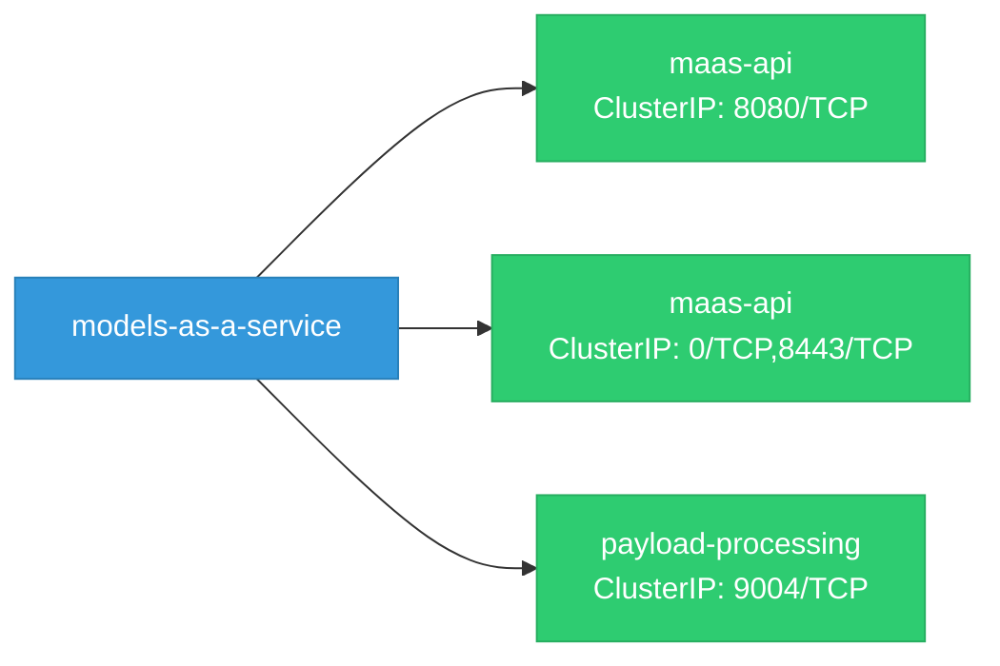
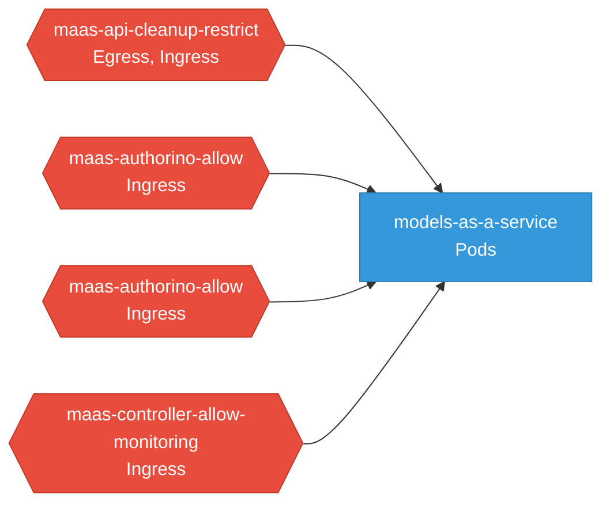

# models-as-a-service: Network

## Service Map

### Services

| Name | Type | Ports | Source |
|------|------|-------|--------|
| maas-api | ClusterIP | 8080/TCP | [`deployment/base/maas-api/core/service.yaml`](https://github.com/red-hat-data-services/models-as-a-service/blob/deb400cda287d7bb213b0450fe71ffa00f6dc646/deployment/base/maas-api/core/service.yaml) |
| maas-api | ClusterIP | 0/TCP, 8443/TCP | [`deployment/base/maas-api/overlays/tls/service-patch.yaml`](https://github.com/red-hat-data-services/models-as-a-service/blob/deb400cda287d7bb213b0450fe71ffa00f6dc646/deployment/base/maas-api/overlays/tls/service-patch.yaml) |
| payload-processing | ClusterIP | 9004/TCP | [`deployment/base/payload-processing/manager/service.yaml`](https://github.com/red-hat-data-services/models-as-a-service/blob/deb400cda287d7bb213b0450fe71ffa00f6dc646/deployment/base/payload-processing/manager/service.yaml) |

### Ingress / Routing

| Kind | Name | Hosts | Paths | TLS | Source |
|------|------|-------|-------|-----|--------|
| DestinationRule | maas-api-backend-tls |  |  | no | [`deployment/base/maas-api/overlays/tls/destinationrule.yaml`](https://github.com/red-hat-data-services/models-as-a-service/blob/deb400cda287d7bb213b0450fe71ffa00f6dc646/deployment/base/maas-api/overlays/tls/destinationrule.yaml) |
| HTTPRoute | maas-api-route |  | /v1/models, /maas-api | no | [`deployment/base/maas-api/networking/httproute.yaml`](https://github.com/red-hat-data-services/models-as-a-service/blob/deb400cda287d7bb213b0450fe71ffa00f6dc646/deployment/base/maas-api/networking/httproute.yaml) |

### Network Policies

| Name | Policy Types | Source |
|------|-------------|--------|
| maas-api-cleanup-restrict | Egress, Ingress | [`deployment/base/maas-api/core/networkpolicy-cleanup.yaml`](https://github.com/red-hat-data-services/models-as-a-service/blob/deb400cda287d7bb213b0450fe71ffa00f6dc646/deployment/base/maas-api/core/networkpolicy-cleanup.yaml) |
| maas-authorino-allow | Ingress | [`deployment/base/maas-api/networking/maas-authorino-networkpolicy.yaml`](https://github.com/red-hat-data-services/models-as-a-service/blob/deb400cda287d7bb213b0450fe71ffa00f6dc646/deployment/base/maas-api/networking/maas-authorino-networkpolicy.yaml) |
| maas-authorino-allow | Ingress | [`scripts/data/maas-authorino-networkpolicy.yaml`](https://github.com/red-hat-data-services/models-as-a-service/blob/deb400cda287d7bb213b0450fe71ffa00f6dc646/scripts/data/maas-authorino-networkpolicy.yaml) |
| maas-controller-allow-monitoring | Ingress | [`deployment/base/maas-controller/monitoring/networkpolicy.yaml`](https://github.com/red-hat-data-services/models-as-a-service/blob/deb400cda287d7bb213b0450fe71ffa00f6dc646/deployment/base/maas-controller/monitoring/networkpolicy.yaml) |

## Network Policy Graph

Visual representation of NetworkPolicy rules. Ingress rules show what traffic is allowed into pods, egress rules show what traffic is allowed out.

