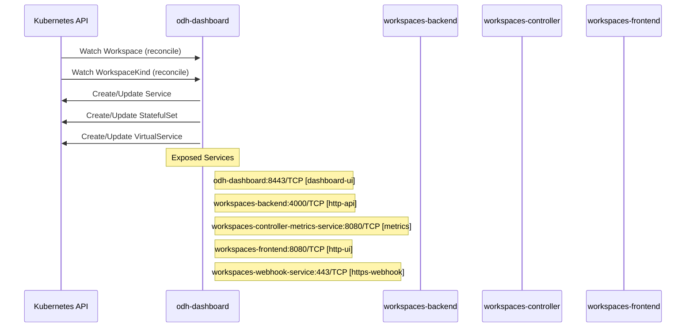

# odh-dashboard: Dataflow

## Controller Watches

Kubernetes resources this controller monitors for changes. Each watch triggers reconciliation when the watched resource is created, updated, or deleted.

| Type | GVK | Source |
|------|-----|--------|
| For | api/v1beta1/Workspace | [`packages/notebooks/upstream/workspaces/controller/internal/controller/workspace_controller.go:469`](https://github.com/red-hat-data-services/odh-dashboard/blob/9f2858e35f91324c8d5f4021189b10a82fa78147/packages/notebooks/upstream/workspaces/controller/internal/controller/workspace_controller.go#L469) |
| For | api/v1beta1/WorkspaceKind | [`packages/notebooks/upstream/workspaces/controller/internal/controller/workspacekind_controller.go:175`](https://github.com/red-hat-data-services/odh-dashboard/blob/9f2858e35f91324c8d5f4021189b10a82fa78147/packages/notebooks/upstream/workspaces/controller/internal/controller/workspacekind_controller.go#L175) |
| Owns | /v1/Service | [`packages/notebooks/upstream/workspaces/controller/internal/controller/workspace_controller.go:471`](https://github.com/red-hat-data-services/odh-dashboard/blob/9f2858e35f91324c8d5f4021189b10a82fa78147/packages/notebooks/upstream/workspaces/controller/internal/controller/workspace_controller.go#L471) |
| Owns | apps/v1/StatefulSet | [`packages/notebooks/upstream/workspaces/controller/internal/controller/workspace_controller.go:470`](https://github.com/red-hat-data-services/odh-dashboard/blob/9f2858e35f91324c8d5f4021189b10a82fa78147/packages/notebooks/upstream/workspaces/controller/internal/controller/workspace_controller.go#L470) |
| Owns | networking/v1/VirtualService | [`packages/notebooks/upstream/workspaces/controller/internal/controller/workspace_controller.go:475`](https://github.com/red-hat-data-services/odh-dashboard/blob/9f2858e35f91324c8d5f4021189b10a82fa78147/packages/notebooks/upstream/workspaces/controller/internal/controller/workspace_controller.go#L475) |

## Reconciliation Flow

How the controller interacts with the Kubernetes API during reconciliation.

## Configuration

ConfigMaps and Helm values that control this component's runtime behavior.

### ConfigMaps

| Name | Data Keys | Source |
|------|-----------|--------|
| federation-config | module-federation-config.json | [`manifests/modular-architecture/federation-configmap.yaml`](https://github.com/red-hat-data-services/odh-dashboard/blob/9f2858e35f91324c8d5f4021189b10a82fa78147/manifests/modular-architecture/federation-configmap.yaml) |
| federation-config | module-federation-config.json | [`manifests/rhoai/base/federation-configmap.yaml`](https://github.com/red-hat-data-services/odh-dashboard/blob/9f2858e35f91324c8d5f4021189b10a82fa78147/manifests/rhoai/base/federation-configmap.yaml) |
| model-registry-ui-config | images-jobs-async-upload | [`manifests/common/model-registry/configmap.yaml`](https://github.com/red-hat-data-services/odh-dashboard/blob/9f2858e35f91324c8d5f4021189b10a82fa78147/manifests/common/model-registry/configmap.yaml) |

