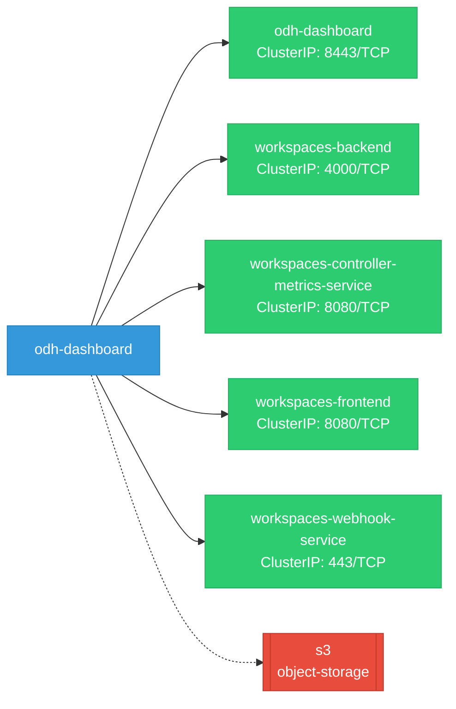
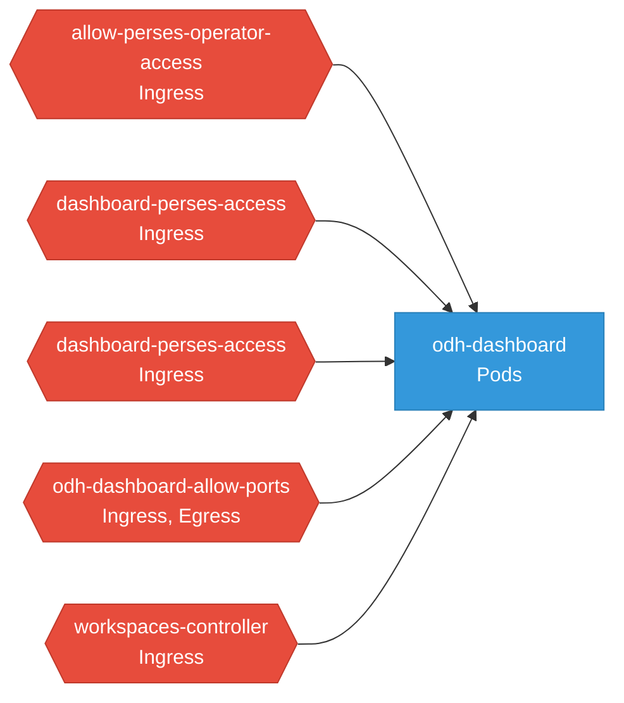

# odh-dashboard: Network

## Service Map

### Services

| Name | Type | Ports | Source |
|------|------|-------|--------|
| odh-dashboard | ClusterIP | 8443/TCP | [`manifests/core-bases/base/service.yaml`](https://github.com/red-hat-data-services/odh-dashboard/blob/9f2858e35f91324c8d5f4021189b10a82fa78147/manifests/core-bases/base/service.yaml) |
| workspaces-backend | ClusterIP | 4000/TCP | [`packages/notebooks/upstream/workspaces/backend/manifests/kustomize/base/service.yaml`](https://github.com/red-hat-data-services/odh-dashboard/blob/9f2858e35f91324c8d5f4021189b10a82fa78147/packages/notebooks/upstream/workspaces/backend/manifests/kustomize/base/service.yaml) |
| workspaces-controller-metrics-service | ClusterIP | 8080/TCP | [`packages/notebooks/upstream/workspaces/controller/manifests/kustomize/components/prometheus/service.yaml`](https://github.com/red-hat-data-services/odh-dashboard/blob/9f2858e35f91324c8d5f4021189b10a82fa78147/packages/notebooks/upstream/workspaces/controller/manifests/kustomize/components/prometheus/service.yaml) |
| workspaces-frontend | ClusterIP | 8080/TCP | [`packages/notebooks/upstream/workspaces/frontend/manifests/kustomize/base/service.yaml`](https://github.com/red-hat-data-services/odh-dashboard/blob/9f2858e35f91324c8d5f4021189b10a82fa78147/packages/notebooks/upstream/workspaces/frontend/manifests/kustomize/base/service.yaml) |
| workspaces-webhook-service | ClusterIP | 443/TCP | [`packages/notebooks/upstream/workspaces/controller/manifests/kustomize/base/webhook/service.yaml`](https://github.com/red-hat-data-services/odh-dashboard/blob/9f2858e35f91324c8d5f4021189b10a82fa78147/packages/notebooks/upstream/workspaces/controller/manifests/kustomize/base/webhook/service.yaml) |

### Ingress / Routing

| Kind | Name | Hosts | Paths | TLS | Source |
|------|------|-------|-------|-----|--------|
| Gateway | kubeflow-gateway |  |  | no | [`packages/notebooks/upstream/developing/manifests/istio-gateway/gateway.yaml`](https://github.com/red-hat-data-services/odh-dashboard/blob/9f2858e35f91324c8d5f4021189b10a82fa78147/packages/notebooks/upstream/developing/manifests/istio-gateway/gateway.yaml) |
| HTTPRoute | odh-dashboard |  | / | no | [`manifests/core-bases/base/httproute.yaml`](https://github.com/red-hat-data-services/odh-dashboard/blob/9f2858e35f91324c8d5f4021189b10a82fa78147/manifests/core-bases/base/httproute.yaml) |
| Route | odh-dashboard |  |  | yes | [`manifests/core-bases/base/routes.yaml`](https://github.com/red-hat-data-services/odh-dashboard/blob/9f2858e35f91324c8d5f4021189b10a82fa78147/manifests/core-bases/base/routes.yaml) |

### Network Policies

| Name | Policy Types | Source |
|------|-------------|--------|
| allow-perses-operator-access | Ingress | [`packages/observability/setup/network-policy-perses-operator-access.yaml`](https://github.com/red-hat-data-services/odh-dashboard/blob/9f2858e35f91324c8d5f4021189b10a82fa78147/packages/observability/setup/network-policy-perses-operator-access.yaml) |
| dashboard-perses-access | Ingress | [`manifests/observability/odh/network-policy.yaml`](https://github.com/red-hat-data-services/odh-dashboard/blob/9f2858e35f91324c8d5f4021189b10a82fa78147/manifests/observability/odh/network-policy.yaml) |
| dashboard-perses-access | Ingress | [`manifests/observability/rhoai/network-policy.yaml`](https://github.com/red-hat-data-services/odh-dashboard/blob/9f2858e35f91324c8d5f4021189b10a82fa78147/manifests/observability/rhoai/network-policy.yaml) |
| odh-dashboard-allow-ports | Ingress, Egress | [`manifests/modular-architecture/networkpolicy.yaml`](https://github.com/red-hat-data-services/odh-dashboard/blob/9f2858e35f91324c8d5f4021189b10a82fa78147/manifests/modular-architecture/networkpolicy.yaml) |
| workspaces-controller | Ingress | [`packages/notebooks/upstream/workspaces/controller/manifests/kustomize/components/istio/network-policy.yaml`](https://github.com/red-hat-data-services/odh-dashboard/blob/9f2858e35f91324c8d5f4021189b10a82fa78147/packages/notebooks/upstream/workspaces/controller/manifests/kustomize/components/istio/network-policy.yaml) |

## Network Policy Graph

Visual representation of NetworkPolicy rules. Ingress rules show what traffic is allowed into pods, egress rules show what traffic is allowed out.

