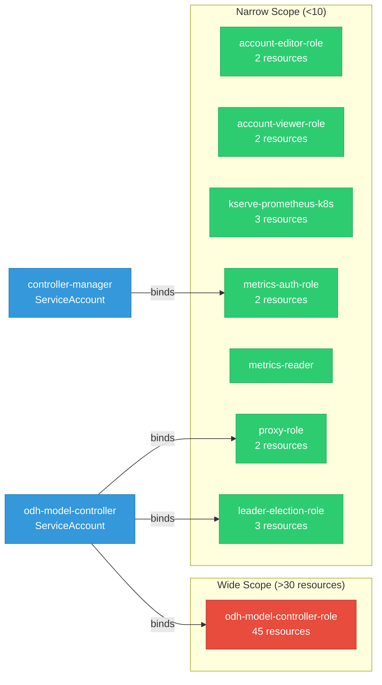

# odh-model-controller: RBAC

ServiceAccount bindings, roles, and resource permissions.

## RBAC Overview

This component defines a large RBAC surface (139 diagram lines). The graph below groups roles by permission scope.

## Bindings

Subject-to-role mappings defining who has access to what.

| Binding | Type | Role | Subject |
|---------|------|------|---------|
| metrics-auth-rolebinding | ClusterRoleBinding | metrics-auth-role | ServiceAccount/controller-manager |
| odh-model-controller-rolebinding-opendatahub | ClusterRoleBinding | odh-model-controller-role | ServiceAccount/odh-model-controller |
| proxy-rolebinding | ClusterRoleBinding | proxy-role | ServiceAccount/odh-model-controller |
| leader-election-rolebinding | RoleBinding | leader-election-role | ServiceAccount/odh-model-controller |

## Role Details

Per-rule breakdown of API groups, resources, and verbs for each role.

| Role | Kind | API Groups | Resources | Verbs |
|------|------|------------|-----------|-------|
| account-editor-role | ClusterRole |  | accounts | create, delete, get, list, patch, update, watch |
| account-editor-role | ClusterRole |  | accounts/status | get |
| account-viewer-role | ClusterRole |  | accounts | get, list, watch |
| account-viewer-role | ClusterRole |  | accounts/status | get |
| kserve-prometheus-k8s | ClusterRole |  | services, endpoints, pods | get, list, watch |
| metrics-auth-role | ClusterRole |  | tokenreviews | create |
| metrics-auth-role | ClusterRole |  | subjectaccessreviews | create |
| metrics-reader | ClusterRole |  |  | get |
| odh-model-controller-role | ClusterRole |  | configmaps, secrets, serviceaccounts, services | create, delete, get, list, patch, update, watch |
| odh-model-controller-role | ClusterRole |  | endpoints, namespaces, pods | create, get, list, patch, update, watch |
| odh-model-controller-role | ClusterRole |  | events | create, patch |
| odh-model-controller-role | ClusterRole |  | authentications | get, list, watch |
| odh-model-controller-role | ClusterRole |  | datascienceclusters | get, list, watch |
| odh-model-controller-role | ClusterRole |  | dscinitializations | get, list, watch |
| odh-model-controller-role | ClusterRole |  | ingresses | get, list, watch |
| odh-model-controller-role | ClusterRole |  | gateways | get, list, patch, update, watch |
| odh-model-controller-role | ClusterRole |  | gateways/finalizers | patch, update |
| odh-model-controller-role | ClusterRole |  | httproutes | get, list, watch |
| odh-model-controller-role | ClusterRole |  | triggerauthentications | create, delete, get, list, patch, update, watch |
| odh-model-controller-role | ClusterRole |  | authpolicies | create, delete, get, list, patch, update, watch |
| odh-model-controller-role | ClusterRole |  | authpolicies/status | get, patch, update |
| odh-model-controller-role | ClusterRole |  | kuadrants | get, list, watch |
| odh-model-controller-role | ClusterRole |  | nodes, pods | get, list, watch |
| odh-model-controller-role | ClusterRole |  | podmonitors, servicemonitors | create, delete, get, list, patch, update, watch |
| odh-model-controller-role | ClusterRole |  | envoyfilters | create, delete, get, list, patch, update, watch |
| odh-model-controller-role | ClusterRole |  | networkpolicies | create, delete, get, list, patch, update, watch |
| odh-model-controller-role | ClusterRole |  | accounts | get, list, patch, update, watch |
| odh-model-controller-role | ClusterRole |  | accounts/finalizers | update |
| odh-model-controller-role | ClusterRole |  | accounts/status | get, list, update, watch |
| odh-model-controller-role | ClusterRole |  | authorinos | get, list, watch |
| odh-model-controller-role | ClusterRole |  | clusterrolebindings, rolebindings, roles | create, delete, get, list, patch, update, watch |
| odh-model-controller-role | ClusterRole |  | routes | create, delete, get, list, patch, update, watch |
| odh-model-controller-role | ClusterRole |  | routes/custom-host | create |
| odh-model-controller-role | ClusterRole |  | inferencegraphs, llminferenceserviceconfigs | get, list, watch |
| odh-model-controller-role | ClusterRole |  | inferencegraphs/finalizers, servingruntimes/finalizers | update |
| odh-model-controller-role | ClusterRole |  | inferenceservices | get, list, patch, update, watch |
| odh-model-controller-role | ClusterRole |  | inferenceservices/finalizers | create, delete, get, list, patch, update, watch |
| odh-model-controller-role | ClusterRole |  | llminferenceservices | get, list, patch, post, update, watch |
| odh-model-controller-role | ClusterRole |  | llminferenceservices/finalizers | patch, update |
| odh-model-controller-role | ClusterRole |  | llminferenceservices/status | get, patch, update |
| odh-model-controller-role | ClusterRole |  | servingruntimes | create, get, list, update, watch |
| odh-model-controller-role | ClusterRole |  | templates | create, delete, get, list, patch, update, watch |
| proxy-role | ClusterRole |  | tokenreviews | create |
| proxy-role | ClusterRole |  | subjectaccessreviews | create |
| leader-election-role | Role |  | configmaps | get, list, watch, create, update, patch, delete |
| leader-election-role | Role |  | leases | get, list, watch, create, update, patch, delete |
| leader-election-role | Role |  | events | create, patch |

### Cluster Roles

| Name | Resources | Verbs | Source |
|------|-----------|-------|--------|
| account-editor-role | accounts | create, delete, get, list, patch, update, watch | [`config/rbac/account_editor_role.yaml`](https://github.com/opendatahub-io/odh-model-controller/blob/55c98bf18a3fa4334d31305c836593a7f6dc4d6d/config/rbac/account_editor_role.yaml) |
| account-editor-role | accounts/status | get | [`config/rbac/account_editor_role.yaml`](https://github.com/opendatahub-io/odh-model-controller/blob/55c98bf18a3fa4334d31305c836593a7f6dc4d6d/config/rbac/account_editor_role.yaml) |
| account-viewer-role | accounts | get, list, watch | [`config/rbac/account_viewer_role.yaml`](https://github.com/opendatahub-io/odh-model-controller/blob/55c98bf18a3fa4334d31305c836593a7f6dc4d6d/config/rbac/account_viewer_role.yaml) |
| account-viewer-role | accounts/status | get | [`config/rbac/account_viewer_role.yaml`](https://github.com/opendatahub-io/odh-model-controller/blob/55c98bf18a3fa4334d31305c836593a7f6dc4d6d/config/rbac/account_viewer_role.yaml) |
| kserve-prometheus-k8s | services, endpoints, pods | get, list, watch | [`config/rbac/kserve_prometheus_clusterrole.yaml`](https://github.com/opendatahub-io/odh-model-controller/blob/55c98bf18a3fa4334d31305c836593a7f6dc4d6d/config/rbac/kserve_prometheus_clusterrole.yaml) |
| metrics-auth-role | tokenreviews | create | [`config/rbac/metrics_auth_role.yaml`](https://github.com/opendatahub-io/odh-model-controller/blob/55c98bf18a3fa4334d31305c836593a7f6dc4d6d/config/rbac/metrics_auth_role.yaml) |
| metrics-auth-role | subjectaccessreviews | create | [`config/rbac/metrics_auth_role.yaml`](https://github.com/opendatahub-io/odh-model-controller/blob/55c98bf18a3fa4334d31305c836593a7f6dc4d6d/config/rbac/metrics_auth_role.yaml) |
| metrics-reader |  | get | [`config/rbac/metrics_reader_role.yaml`](https://github.com/opendatahub-io/odh-model-controller/blob/55c98bf18a3fa4334d31305c836593a7f6dc4d6d/config/rbac/metrics_reader_role.yaml) |
| odh-model-controller-role | configmaps, secrets, serviceaccounts, services | create, delete, get, list, patch, update, watch | [`config/rbac/role.yaml`](https://github.com/opendatahub-io/odh-model-controller/blob/55c98bf18a3fa4334d31305c836593a7f6dc4d6d/config/rbac/role.yaml) |
| odh-model-controller-role | endpoints, namespaces, pods | create, get, list, patch, update, watch | [`config/rbac/role.yaml`](https://github.com/opendatahub-io/odh-model-controller/blob/55c98bf18a3fa4334d31305c836593a7f6dc4d6d/config/rbac/role.yaml) |
| odh-model-controller-role | events | create, patch | [`config/rbac/role.yaml`](https://github.com/opendatahub-io/odh-model-controller/blob/55c98bf18a3fa4334d31305c836593a7f6dc4d6d/config/rbac/role.yaml) |
| odh-model-controller-role | authentications | get, list, watch | [`config/rbac/role.yaml`](https://github.com/opendatahub-io/odh-model-controller/blob/55c98bf18a3fa4334d31305c836593a7f6dc4d6d/config/rbac/role.yaml) |
| odh-model-controller-role | datascienceclusters | get, list, watch | [`config/rbac/role.yaml`](https://github.com/opendatahub-io/odh-model-controller/blob/55c98bf18a3fa4334d31305c836593a7f6dc4d6d/config/rbac/role.yaml) |
| odh-model-controller-role | dscinitializations | get, list, watch | [`config/rbac/role.yaml`](https://github.com/opendatahub-io/odh-model-controller/blob/55c98bf18a3fa4334d31305c836593a7f6dc4d6d/config/rbac/role.yaml) |
| odh-model-controller-role | ingresses | get, list, watch | [`config/rbac/role.yaml`](https://github.com/opendatahub-io/odh-model-controller/blob/55c98bf18a3fa4334d31305c836593a7f6dc4d6d/config/rbac/role.yaml) |
| odh-model-controller-role | gateways | get, list, patch, update, watch | [`config/rbac/role.yaml`](https://github.com/opendatahub-io/odh-model-controller/blob/55c98bf18a3fa4334d31305c836593a7f6dc4d6d/config/rbac/role.yaml) |
| odh-model-controller-role | gateways/finalizers | patch, update | [`config/rbac/role.yaml`](https://github.com/opendatahub-io/odh-model-controller/blob/55c98bf18a3fa4334d31305c836593a7f6dc4d6d/config/rbac/role.yaml) |
| odh-model-controller-role | httproutes | get, list, watch | [`config/rbac/role.yaml`](https://github.com/opendatahub-io/odh-model-controller/blob/55c98bf18a3fa4334d31305c836593a7f6dc4d6d/config/rbac/role.yaml) |
| odh-model-controller-role | triggerauthentications | create, delete, get, list, patch, update, watch | [`config/rbac/role.yaml`](https://github.com/opendatahub-io/odh-model-controller/blob/55c98bf18a3fa4334d31305c836593a7f6dc4d6d/config/rbac/role.yaml) |
| odh-model-controller-role | authpolicies | create, delete, get, list, patch, update, watch | [`config/rbac/role.yaml`](https://github.com/opendatahub-io/odh-model-controller/blob/55c98bf18a3fa4334d31305c836593a7f6dc4d6d/config/rbac/role.yaml) |
| odh-model-controller-role | authpolicies/status | get, patch, update | [`config/rbac/role.yaml`](https://github.com/opendatahub-io/odh-model-controller/blob/55c98bf18a3fa4334d31305c836593a7f6dc4d6d/config/rbac/role.yaml) |
| odh-model-controller-role | kuadrants | get, list, watch | [`config/rbac/role.yaml`](https://github.com/opendatahub-io/odh-model-controller/blob/55c98bf18a3fa4334d31305c836593a7f6dc4d6d/config/rbac/role.yaml) |
| odh-model-controller-role | nodes, pods | get, list, watch | [`config/rbac/role.yaml`](https://github.com/opendatahub-io/odh-model-controller/blob/55c98bf18a3fa4334d31305c836593a7f6dc4d6d/config/rbac/role.yaml) |
| odh-model-controller-role | podmonitors, servicemonitors | create, delete, get, list, patch, update, watch | [`config/rbac/role.yaml`](https://github.com/opendatahub-io/odh-model-controller/blob/55c98bf18a3fa4334d31305c836593a7f6dc4d6d/config/rbac/role.yaml) |
| odh-model-controller-role | envoyfilters | create, delete, get, list, patch, update, watch | [`config/rbac/role.yaml`](https://github.com/opendatahub-io/odh-model-controller/blob/55c98bf18a3fa4334d31305c836593a7f6dc4d6d/config/rbac/role.yaml) |
| odh-model-controller-role | networkpolicies | create, delete, get, list, patch, update, watch | [`config/rbac/role.yaml`](https://github.com/opendatahub-io/odh-model-controller/blob/55c98bf18a3fa4334d31305c836593a7f6dc4d6d/config/rbac/role.yaml) |
| odh-model-controller-role | accounts | get, list, patch, update, watch | [`config/rbac/role.yaml`](https://github.com/opendatahub-io/odh-model-controller/blob/55c98bf18a3fa4334d31305c836593a7f6dc4d6d/config/rbac/role.yaml) |
| odh-model-controller-role | accounts/finalizers | update | [`config/rbac/role.yaml`](https://github.com/opendatahub-io/odh-model-controller/blob/55c98bf18a3fa4334d31305c836593a7f6dc4d6d/config/rbac/role.yaml) |
| odh-model-controller-role | accounts/status | get, list, update, watch | [`config/rbac/role.yaml`](https://github.com/opendatahub-io/odh-model-controller/blob/55c98bf18a3fa4334d31305c836593a7f6dc4d6d/config/rbac/role.yaml) |
| odh-model-controller-role | authorinos | get, list, watch | [`config/rbac/role.yaml`](https://github.com/opendatahub-io/odh-model-controller/blob/55c98bf18a3fa4334d31305c836593a7f6dc4d6d/config/rbac/role.yaml) |
| odh-model-controller-role | clusterrolebindings, rolebindings, roles | create, delete, get, list, patch, update, watch | [`config/rbac/role.yaml`](https://github.com/opendatahub-io/odh-model-controller/blob/55c98bf18a3fa4334d31305c836593a7f6dc4d6d/config/rbac/role.yaml) |
| odh-model-controller-role | routes | create, delete, get, list, patch, update, watch | [`config/rbac/role.yaml`](https://github.com/opendatahub-io/odh-model-controller/blob/55c98bf18a3fa4334d31305c836593a7f6dc4d6d/config/rbac/role.yaml) |
| odh-model-controller-role | routes/custom-host | create | [`config/rbac/role.yaml`](https://github.com/opendatahub-io/odh-model-controller/blob/55c98bf18a3fa4334d31305c836593a7f6dc4d6d/config/rbac/role.yaml) |
| odh-model-controller-role | inferencegraphs, llminferenceserviceconfigs | get, list, watch | [`config/rbac/role.yaml`](https://github.com/opendatahub-io/odh-model-controller/blob/55c98bf18a3fa4334d31305c836593a7f6dc4d6d/config/rbac/role.yaml) |
| odh-model-controller-role | inferencegraphs/finalizers, servingruntimes/finalizers | update | [`config/rbac/role.yaml`](https://github.com/opendatahub-io/odh-model-controller/blob/55c98bf18a3fa4334d31305c836593a7f6dc4d6d/config/rbac/role.yaml) |
| odh-model-controller-role | inferenceservices | get, list, patch, update, watch | [`config/rbac/role.yaml`](https://github.com/opendatahub-io/odh-model-controller/blob/55c98bf18a3fa4334d31305c836593a7f6dc4d6d/config/rbac/role.yaml) |
| odh-model-controller-role | inferenceservices/finalizers | create, delete, get, list, patch, update, watch | [`config/rbac/role.yaml`](https://github.com/opendatahub-io/odh-model-controller/blob/55c98bf18a3fa4334d31305c836593a7f6dc4d6d/config/rbac/role.yaml) |
| odh-model-controller-role | llminferenceservices | get, list, patch, post, update, watch | [`config/rbac/role.yaml`](https://github.com/opendatahub-io/odh-model-controller/blob/55c98bf18a3fa4334d31305c836593a7f6dc4d6d/config/rbac/role.yaml) |
| odh-model-controller-role | llminferenceservices/finalizers | patch, update | [`config/rbac/role.yaml`](https://github.com/opendatahub-io/odh-model-controller/blob/55c98bf18a3fa4334d31305c836593a7f6dc4d6d/config/rbac/role.yaml) |
| odh-model-controller-role | llminferenceservices/status | get, patch, update | [`config/rbac/role.yaml`](https://github.com/opendatahub-io/odh-model-controller/blob/55c98bf18a3fa4334d31305c836593a7f6dc4d6d/config/rbac/role.yaml) |
| odh-model-controller-role | servingruntimes | create, get, list, update, watch | [`config/rbac/role.yaml`](https://github.com/opendatahub-io/odh-model-controller/blob/55c98bf18a3fa4334d31305c836593a7f6dc4d6d/config/rbac/role.yaml) |
| odh-model-controller-role | templates | create, delete, get, list, patch, update, watch | [`config/rbac/role.yaml`](https://github.com/opendatahub-io/odh-model-controller/blob/55c98bf18a3fa4334d31305c836593a7f6dc4d6d/config/rbac/role.yaml) |
| proxy-role | tokenreviews | create | [`config/rbac/auth_proxy_role.yaml`](https://github.com/opendatahub-io/odh-model-controller/blob/55c98bf18a3fa4334d31305c836593a7f6dc4d6d/config/rbac/auth_proxy_role.yaml) |
| proxy-role | subjectaccessreviews | create | [`config/rbac/auth_proxy_role.yaml`](https://github.com/opendatahub-io/odh-model-controller/blob/55c98bf18a3fa4334d31305c836593a7f6dc4d6d/config/rbac/auth_proxy_role.yaml) |

