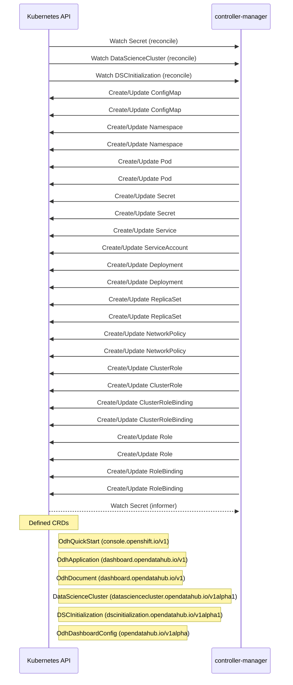

# opendatahub-operator: Dataflow

## Controller Watches

Kubernetes resources this controller monitors for changes. Each watch triggers reconciliation when the watched resource is created, updated, or deleted.

| Type | GVK | Source |
|------|-----|--------|
| For | /v1/Secret | [`controllers/secretgenerator/secretgenerator_controller.go:66`](https://github.com/opendatahub-io/opendatahub-operator/blob/fc3568b08335435af8f5ca135376f7793c260b43/controllers/secretgenerator/secretgenerator_controller.go#L66) |
| For | datasciencecluster/v1alpha1/DataScienceCluster | [`controllers/datasciencecluster/datasciencecluster_controller.go:273`](https://github.com/opendatahub-io/opendatahub-operator/blob/fc3568b08335435af8f5ca135376f7793c260b43/controllers/datasciencecluster/datasciencecluster_controller.go#L273) |
| For | dscinitialization/v1alpha1/DSCInitialization | [`controllers/dscinitialization/dscinitialization_controller.go:215`](https://github.com/opendatahub-io/opendatahub-operator/blob/fc3568b08335435af8f5ca135376f7793c260b43/controllers/dscinitialization/dscinitialization_controller.go#L215) |
| Owns | /v1/ConfigMap | [`controllers/dscinitialization/dscinitialization_controller.go:218`](https://github.com/opendatahub-io/opendatahub-operator/blob/fc3568b08335435af8f5ca135376f7793c260b43/controllers/dscinitialization/dscinitialization_controller.go#L218) |
| Owns | /v1/ConfigMap | [`controllers/datasciencecluster/datasciencecluster_controller.go:276`](https://github.com/opendatahub-io/opendatahub-operator/blob/fc3568b08335435af8f5ca135376f7793c260b43/controllers/datasciencecluster/datasciencecluster_controller.go#L276) |
| Owns | /v1/Namespace | [`controllers/dscinitialization/dscinitialization_controller.go:216`](https://github.com/opendatahub-io/opendatahub-operator/blob/fc3568b08335435af8f5ca135376f7793c260b43/controllers/dscinitialization/dscinitialization_controller.go#L216) |
| Owns | /v1/Namespace | [`controllers/datasciencecluster/datasciencecluster_controller.go:274`](https://github.com/opendatahub-io/opendatahub-operator/blob/fc3568b08335435af8f5ca135376f7793c260b43/controllers/datasciencecluster/datasciencecluster_controller.go#L274) |
| Owns | /v1/Pod | [`controllers/dscinitialization/dscinitialization_controller.go:226`](https://github.com/opendatahub-io/opendatahub-operator/blob/fc3568b08335435af8f5ca135376f7793c260b43/controllers/dscinitialization/dscinitialization_controller.go#L226) |
| Owns | /v1/Pod | [`controllers/datasciencecluster/datasciencecluster_controller.go:284`](https://github.com/opendatahub-io/opendatahub-operator/blob/fc3568b08335435af8f5ca135376f7793c260b43/controllers/datasciencecluster/datasciencecluster_controller.go#L284) |
| Owns | /v1/Secret | [`controllers/datasciencecluster/datasciencecluster_controller.go:275`](https://github.com/opendatahub-io/opendatahub-operator/blob/fc3568b08335435af8f5ca135376f7793c260b43/controllers/datasciencecluster/datasciencecluster_controller.go#L275) |
| Owns | /v1/Secret | [`controllers/dscinitialization/dscinitialization_controller.go:217`](https://github.com/opendatahub-io/opendatahub-operator/blob/fc3568b08335435af8f5ca135376f7793c260b43/controllers/dscinitialization/dscinitialization_controller.go#L217) |
| Owns | /v1/Service | [`controllers/dscinitialization/dscinitialization_controller.go:228`](https://github.com/opendatahub-io/opendatahub-operator/blob/fc3568b08335435af8f5ca135376f7793c260b43/controllers/dscinitialization/dscinitialization_controller.go#L228) |
| Owns | /v1/ServiceAccount | [`controllers/dscinitialization/dscinitialization_controller.go:227`](https://github.com/opendatahub-io/opendatahub-operator/blob/fc3568b08335435af8f5ca135376f7793c260b43/controllers/dscinitialization/dscinitialization_controller.go#L227) |
| Owns | apps/v1/Deployment | [`controllers/dscinitialization/dscinitialization_controller.go:224`](https://github.com/opendatahub-io/opendatahub-operator/blob/fc3568b08335435af8f5ca135376f7793c260b43/controllers/dscinitialization/dscinitialization_controller.go#L224) |
| Owns | apps/v1/Deployment | [`controllers/datasciencecluster/datasciencecluster_controller.go:282`](https://github.com/opendatahub-io/opendatahub-operator/blob/fc3568b08335435af8f5ca135376f7793c260b43/controllers/datasciencecluster/datasciencecluster_controller.go#L282) |
| Owns | apps/v1/ReplicaSet | [`controllers/dscinitialization/dscinitialization_controller.go:225`](https://github.com/opendatahub-io/opendatahub-operator/blob/fc3568b08335435af8f5ca135376f7793c260b43/controllers/dscinitialization/dscinitialization_controller.go#L225) |
| Owns | apps/v1/ReplicaSet | [`controllers/datasciencecluster/datasciencecluster_controller.go:283`](https://github.com/opendatahub-io/opendatahub-operator/blob/fc3568b08335435af8f5ca135376f7793c260b43/controllers/datasciencecluster/datasciencecluster_controller.go#L283) |
| Owns | networking.k8s.io/v1/NetworkPolicy | [`controllers/dscinitialization/dscinitialization_controller.go:219`](https://github.com/opendatahub-io/opendatahub-operator/blob/fc3568b08335435af8f5ca135376f7793c260b43/controllers/dscinitialization/dscinitialization_controller.go#L219) |
| Owns | networking.k8s.io/v1/NetworkPolicy | [`controllers/datasciencecluster/datasciencecluster_controller.go:277`](https://github.com/opendatahub-io/opendatahub-operator/blob/fc3568b08335435af8f5ca135376f7793c260b43/controllers/datasciencecluster/datasciencecluster_controller.go#L277) |
| Owns | rbac.authorization.k8s.io/v1/ClusterRole | [`controllers/datasciencecluster/datasciencecluster_controller.go:280`](https://github.com/opendatahub-io/opendatahub-operator/blob/fc3568b08335435af8f5ca135376f7793c260b43/controllers/datasciencecluster/datasciencecluster_controller.go#L280) |
| Owns | rbac.authorization.k8s.io/v1/ClusterRole | [`controllers/dscinitialization/dscinitialization_controller.go:222`](https://github.com/opendatahub-io/opendatahub-operator/blob/fc3568b08335435af8f5ca135376f7793c260b43/controllers/dscinitialization/dscinitialization_controller.go#L222) |
| Owns | rbac.authorization.k8s.io/v1/ClusterRoleBinding | [`controllers/dscinitialization/dscinitialization_controller.go:223`](https://github.com/opendatahub-io/opendatahub-operator/blob/fc3568b08335435af8f5ca135376f7793c260b43/controllers/dscinitialization/dscinitialization_controller.go#L223) |
| Owns | rbac.authorization.k8s.io/v1/ClusterRoleBinding | [`controllers/datasciencecluster/datasciencecluster_controller.go:281`](https://github.com/opendatahub-io/opendatahub-operator/blob/fc3568b08335435af8f5ca135376f7793c260b43/controllers/datasciencecluster/datasciencecluster_controller.go#L281) |
| Owns | rbac.authorization.k8s.io/v1/Role | [`controllers/datasciencecluster/datasciencecluster_controller.go:278`](https://github.com/opendatahub-io/opendatahub-operator/blob/fc3568b08335435af8f5ca135376f7793c260b43/controllers/datasciencecluster/datasciencecluster_controller.go#L278) |
| Owns | rbac.authorization.k8s.io/v1/Role | [`controllers/dscinitialization/dscinitialization_controller.go:220`](https://github.com/opendatahub-io/opendatahub-operator/blob/fc3568b08335435af8f5ca135376f7793c260b43/controllers/dscinitialization/dscinitialization_controller.go#L220) |
| Owns | rbac.authorization.k8s.io/v1/RoleBinding | [`controllers/dscinitialization/dscinitialization_controller.go:221`](https://github.com/opendatahub-io/opendatahub-operator/blob/fc3568b08335435af8f5ca135376f7793c260b43/controllers/dscinitialization/dscinitialization_controller.go#L221) |
| Owns | rbac.authorization.k8s.io/v1/RoleBinding | [`controllers/datasciencecluster/datasciencecluster_controller.go:279`](https://github.com/opendatahub-io/opendatahub-operator/blob/fc3568b08335435af8f5ca135376f7793c260b43/controllers/datasciencecluster/datasciencecluster_controller.go#L279) |
| Watches | /v1/Secret | [`controllers/secretgenerator/secretgenerator_controller.go:67`](https://github.com/opendatahub-io/opendatahub-operator/blob/fc3568b08335435af8f5ca135376f7793c260b43/controllers/secretgenerator/secretgenerator_controller.go#L67) |

## Reconciliation Flow

How the controller interacts with the Kubernetes API during reconciliation.

## Configuration

ConfigMaps and Helm values that control this component's runtime behavior.

