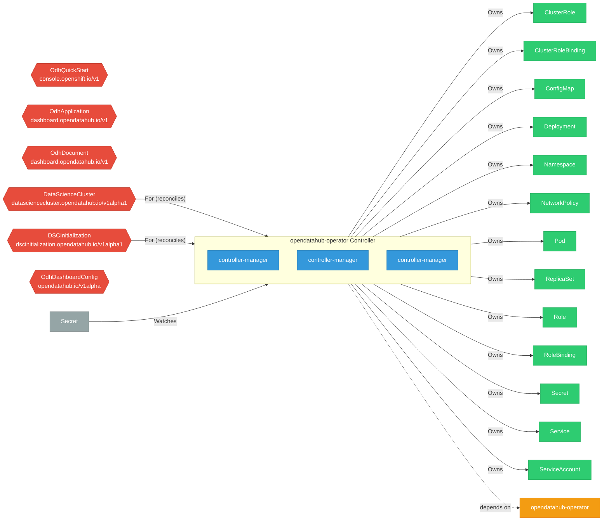

# opendatahub-operator

> **Architecture snapshot: 2026-05-05** (2026-05-05)

**Repository:** opendatahub-io/opendatahub-operator  
**Analyzer:** arch-analyzer 0.2.0  
**Extracted:** 2026-05-05T15:10:47Z

## Summary

| Metric | Count |
|--------|-------|
| CRDs | 6 |
| Deployments | 3 |
| Services | 0 |
| Secrets | 0 |
| Cluster Roles | 7 |
| Controller Watches | 28 |

## Component Architecture

CRDs, controllers, and owned Kubernetes resources.

### CRDs

| Group | Version | Kind | Scope | Fields | Validation Rules | Source |
|-------|---------|------|-------|--------|------------------|--------|
| console.openshift.io | v1 | OdhQuickStart | Namespaced | 31 | 0 | [`config/crd/bases/odhquickstarts.console.openshift.io_odhquickstarts.yaml`](https://github.com/opendatahub-io/opendatahub-operator/blob/fc3568b08335435af8f5ca135376f7793c260b43/config/crd/bases/odhquickstarts.console.openshift.io_odhquickstarts.yaml) |
| dashboard.opendatahub.io | v1 | OdhApplication | Namespaced | 52 | 0 | [`config/crd/bases/odhapplications.dashboard.opendatahub.io_odhapplications.yaml`](https://github.com/opendatahub-io/opendatahub-operator/blob/fc3568b08335435af8f5ca135376f7793c260b43/config/crd/bases/odhapplications.dashboard.opendatahub.io_odhapplications.yaml) |
| dashboard.opendatahub.io | v1 | OdhDocument | Namespaced | 16 | 0 | [`config/crd/bases/odhdocuments.dashboard.opendatahub.io_odhdocuments.yaml`](https://github.com/opendatahub-io/opendatahub-operator/blob/fc3568b08335435af8f5ca135376f7793c260b43/config/crd/bases/odhdocuments.dashboard.opendatahub.io_odhdocuments.yaml) |
| datasciencecluster.opendatahub.io | v1alpha1 | DataScienceCluster | Cluster | 38 | 0 | [`config/crd/bases/datasciencecluster.opendatahub.io_datascienceclusters.yaml`](https://github.com/opendatahub-io/opendatahub-operator/blob/fc3568b08335435af8f5ca135376f7793c260b43/config/crd/bases/datasciencecluster.opendatahub.io_datascienceclusters.yaml) |
| dscinitialization.opendatahub.io | v1alpha1 | DSCInitialization | Cluster | 27 | 0 | [`config/crd/bases/dscinitialization.opendatahub.io_dscinitializations.yaml`](https://github.com/opendatahub-io/opendatahub-operator/blob/fc3568b08335435af8f5ca135376f7793c260b43/config/crd/bases/dscinitialization.opendatahub.io_dscinitializations.yaml) |
| opendatahub.io | v1alpha | OdhDashboardConfig | Namespaced | 54 | 0 | [`config/crd/bases/odhdashboardconfigs.opendatahub.io_odhdashboardconfigs.yaml`](https://github.com/opendatahub-io/opendatahub-operator/blob/fc3568b08335435af8f5ca135376f7793c260b43/config/crd/bases/odhdashboardconfigs.opendatahub.io_odhdashboardconfigs.yaml) |

## Dependencies

### Internal Platform Dependencies

| Component | Interaction |
|-----------|-------------|
| opendatahub-operator | Go module dependency: github.com/opendatahub-io/opendatahub-operator |

### Key External Dependencies

| Module | Version |
|--------|---------|
| github.com/go-logr/logr | v1.2.4 |
| github.com/operator-framework/api | v0.17.6 |
| k8s.io/api | v0.26.0 |
| k8s.io/apiextensions-apiserver | v0.27.2 |
| k8s.io/apimachinery | v0.27.2 |
| k8s.io/client-go | v0.26.0 |
| sigs.k8s.io/controller-runtime | v0.14.4 |

