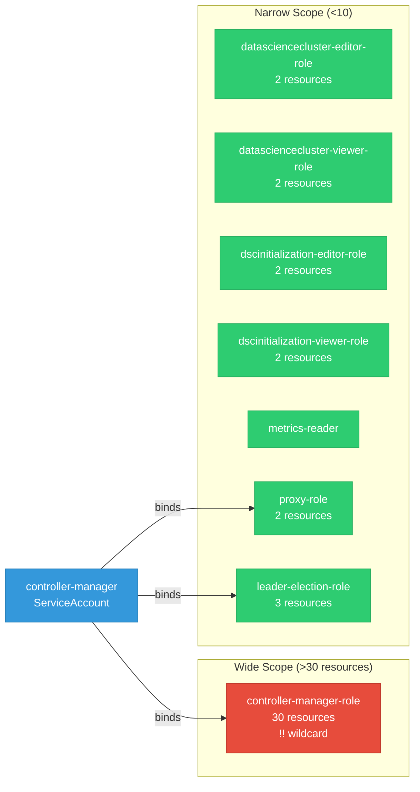

# opendatahub-operator: RBAC

ServiceAccount bindings, roles, and resource permissions.

## RBAC Overview

This component defines a large RBAC surface (103 diagram lines). The graph below groups roles by permission scope.

## Bindings

Subject-to-role mappings defining who has access to what.

| Binding | Type | Role | Subject |
|---------|------|------|---------|
| controller-manager-rolebinding | ClusterRoleBinding | controller-manager-role | ServiceAccount/controller-manager |
| proxy-rolebinding | ClusterRoleBinding | proxy-role | ServiceAccount/controller-manager |
| leader-election-rolebinding | RoleBinding | leader-election-role | ServiceAccount/controller-manager |

## Role Details

Per-rule breakdown of API groups, resources, and verbs for each role.

| Role | Kind | API Groups | Resources | Verbs |
|------|------|------------|-----------|-------|
| controller-manager-role | ClusterRole |  | * | * |
| controller-manager-role | ClusterRole |  | addons | get, list |
| controller-manager-role | ClusterRole |  | daemonsets, deployments, replicasets, statefulsets | * |
| controller-manager-role | ClusterRole |  | configmaps, endpoints, events, persistentvolumeclaims, pods, secrets, services, services/finalizers | * |
| controller-manager-role | ClusterRole |  | configmaps, namespaces, secrets, serviceaccounts, services | create, get, list, patch, update, watch |
| controller-manager-role | ClusterRole |  | datascienceclusters | create, delete, get, list, patch, update, watch |
| controller-manager-role | ClusterRole |  | datascienceclusters/finalizers | update |
| controller-manager-role | ClusterRole |  | datascienceclusters/status | get, patch, update |
| controller-manager-role | ClusterRole |  | dscinitializations | create, delete, get, list, patch, update, watch |
| controller-manager-role | ClusterRole |  | dscinitializations/finalizers | update |
| controller-manager-role | ClusterRole |  | dscinitializations/status | get, patch, update |
| controller-manager-role | ClusterRole |  | networkpolicies | create, get, list, patch, update, watch |
| controller-manager-role | ClusterRole |  | clusterrolebindings, clusterroles, rolebindings, roles | create, get, list, patch, update, watch |
| datasciencecluster-editor-role | ClusterRole |  | datascienceclusters | create, delete, get, list, patch, update, watch |
| datasciencecluster-editor-role | ClusterRole |  | datascienceclusters/status | get |
| datasciencecluster-viewer-role | ClusterRole |  | datascienceclusters | get, list, watch |
| datasciencecluster-viewer-role | ClusterRole |  | datascienceclusters/status | get |
| dscinitialization-editor-role | ClusterRole |  | dscinitializations | create, delete, get, list, patch, update, watch |
| dscinitialization-editor-role | ClusterRole |  | dscinitializations/status | get |
| dscinitialization-viewer-role | ClusterRole |  | dscinitializations | get, list, watch |
| dscinitialization-viewer-role | ClusterRole |  | dscinitializations/status | get |
| metrics-reader | ClusterRole |  |  | get |
| proxy-role | ClusterRole |  | tokenreviews | create |
| proxy-role | ClusterRole |  | subjectaccessreviews | create |
| leader-election-role | Role |  | configmaps | get, list, watch, create, update, patch, delete |
| leader-election-role | Role |  | leases | get, list, watch, create, update, patch, delete |
| leader-election-role | Role |  | events | create, patch |

### Cluster Roles

| Name | Resources | Verbs | Source |
|------|-----------|-------|--------|
| controller-manager-role | * | * | [`config/rbac/role.yaml`](https://github.com/opendatahub-io/opendatahub-operator/blob/fc3568b08335435af8f5ca135376f7793c260b43/config/rbac/role.yaml) |
| controller-manager-role | addons | get, list | [`config/rbac/role.yaml`](https://github.com/opendatahub-io/opendatahub-operator/blob/fc3568b08335435af8f5ca135376f7793c260b43/config/rbac/role.yaml) |
| controller-manager-role | daemonsets, deployments, replicasets, statefulsets | * | [`config/rbac/role.yaml`](https://github.com/opendatahub-io/opendatahub-operator/blob/fc3568b08335435af8f5ca135376f7793c260b43/config/rbac/role.yaml) |
| controller-manager-role | configmaps, endpoints, events, persistentvolumeclaims, pods, secrets, services, services/finalizers | * | [`config/rbac/role.yaml`](https://github.com/opendatahub-io/opendatahub-operator/blob/fc3568b08335435af8f5ca135376f7793c260b43/config/rbac/role.yaml) |
| controller-manager-role | configmaps, namespaces, secrets, serviceaccounts, services | create, get, list, patch, update, watch | [`config/rbac/role.yaml`](https://github.com/opendatahub-io/opendatahub-operator/blob/fc3568b08335435af8f5ca135376f7793c260b43/config/rbac/role.yaml) |
| controller-manager-role | datascienceclusters | create, delete, get, list, patch, update, watch | [`config/rbac/role.yaml`](https://github.com/opendatahub-io/opendatahub-operator/blob/fc3568b08335435af8f5ca135376f7793c260b43/config/rbac/role.yaml) |
| controller-manager-role | datascienceclusters/finalizers | update | [`config/rbac/role.yaml`](https://github.com/opendatahub-io/opendatahub-operator/blob/fc3568b08335435af8f5ca135376f7793c260b43/config/rbac/role.yaml) |
| controller-manager-role | datascienceclusters/status | get, patch, update | [`config/rbac/role.yaml`](https://github.com/opendatahub-io/opendatahub-operator/blob/fc3568b08335435af8f5ca135376f7793c260b43/config/rbac/role.yaml) |
| controller-manager-role | dscinitializations | create, delete, get, list, patch, update, watch | [`config/rbac/role.yaml`](https://github.com/opendatahub-io/opendatahub-operator/blob/fc3568b08335435af8f5ca135376f7793c260b43/config/rbac/role.yaml) |
| controller-manager-role | dscinitializations/finalizers | update | [`config/rbac/role.yaml`](https://github.com/opendatahub-io/opendatahub-operator/blob/fc3568b08335435af8f5ca135376f7793c260b43/config/rbac/role.yaml) |
| controller-manager-role | dscinitializations/status | get, patch, update | [`config/rbac/role.yaml`](https://github.com/opendatahub-io/opendatahub-operator/blob/fc3568b08335435af8f5ca135376f7793c260b43/config/rbac/role.yaml) |
| controller-manager-role | networkpolicies | create, get, list, patch, update, watch | [`config/rbac/role.yaml`](https://github.com/opendatahub-io/opendatahub-operator/blob/fc3568b08335435af8f5ca135376f7793c260b43/config/rbac/role.yaml) |
| controller-manager-role | clusterrolebindings, clusterroles, rolebindings, roles | create, get, list, patch, update, watch | [`config/rbac/role.yaml`](https://github.com/opendatahub-io/opendatahub-operator/blob/fc3568b08335435af8f5ca135376f7793c260b43/config/rbac/role.yaml) |
| datasciencecluster-editor-role | datascienceclusters | create, delete, get, list, patch, update, watch | [`config/rbac/datasciencecluster_datasciencecluster_editor_role.yaml`](https://github.com/opendatahub-io/opendatahub-operator/blob/fc3568b08335435af8f5ca135376f7793c260b43/config/rbac/datasciencecluster_datasciencecluster_editor_role.yaml) |
| datasciencecluster-editor-role | datascienceclusters/status | get | [`config/rbac/datasciencecluster_datasciencecluster_editor_role.yaml`](https://github.com/opendatahub-io/opendatahub-operator/blob/fc3568b08335435af8f5ca135376f7793c260b43/config/rbac/datasciencecluster_datasciencecluster_editor_role.yaml) |
| datasciencecluster-viewer-role | datascienceclusters | get, list, watch | [`config/rbac/datasciencecluster_datasciencecluster_viewer_role.yaml`](https://github.com/opendatahub-io/opendatahub-operator/blob/fc3568b08335435af8f5ca135376f7793c260b43/config/rbac/datasciencecluster_datasciencecluster_viewer_role.yaml) |
| datasciencecluster-viewer-role | datascienceclusters/status | get | [`config/rbac/datasciencecluster_datasciencecluster_viewer_role.yaml`](https://github.com/opendatahub-io/opendatahub-operator/blob/fc3568b08335435af8f5ca135376f7793c260b43/config/rbac/datasciencecluster_datasciencecluster_viewer_role.yaml) |
| dscinitialization-editor-role | dscinitializations | create, delete, get, list, patch, update, watch | [`config/rbac/dscinitialization_dscinitialization_editor_role.yaml`](https://github.com/opendatahub-io/opendatahub-operator/blob/fc3568b08335435af8f5ca135376f7793c260b43/config/rbac/dscinitialization_dscinitialization_editor_role.yaml) |
| dscinitialization-editor-role | dscinitializations/status | get | [`config/rbac/dscinitialization_dscinitialization_editor_role.yaml`](https://github.com/opendatahub-io/opendatahub-operator/blob/fc3568b08335435af8f5ca135376f7793c260b43/config/rbac/dscinitialization_dscinitialization_editor_role.yaml) |
| dscinitialization-viewer-role | dscinitializations | get, list, watch | [`config/rbac/dscinitialization_dscinitialization_viewer_role.yaml`](https://github.com/opendatahub-io/opendatahub-operator/blob/fc3568b08335435af8f5ca135376f7793c260b43/config/rbac/dscinitialization_dscinitialization_viewer_role.yaml) |
| dscinitialization-viewer-role | dscinitializations/status | get | [`config/rbac/dscinitialization_dscinitialization_viewer_role.yaml`](https://github.com/opendatahub-io/opendatahub-operator/blob/fc3568b08335435af8f5ca135376f7793c260b43/config/rbac/dscinitialization_dscinitialization_viewer_role.yaml) |
| metrics-reader |  | get | [`config/rbac/auth_proxy_client_clusterrole.yaml`](https://github.com/opendatahub-io/opendatahub-operator/blob/fc3568b08335435af8f5ca135376f7793c260b43/config/rbac/auth_proxy_client_clusterrole.yaml) |
| proxy-role | tokenreviews | create | [`config/rbac/auth_proxy_role.yaml`](https://github.com/opendatahub-io/opendatahub-operator/blob/fc3568b08335435af8f5ca135376f7793c260b43/config/rbac/auth_proxy_role.yaml) |
| proxy-role | subjectaccessreviews | create | [`config/rbac/auth_proxy_role.yaml`](https://github.com/opendatahub-io/opendatahub-operator/blob/fc3568b08335435af8f5ca135376f7793c260b43/config/rbac/auth_proxy_role.yaml) |

### Kubebuilder RBAC Markers

Kubebuilder `+kubebuilder:rbac` markers declare the RBAC requirements of controller reconcilers. These are the source of truth for generated ClusterRole manifests. 7 markers found.

| File | Line | Groups | Resources | Verbs |
|------|------|--------|-----------|-------|
| [`controllers/datasciencecluster/datasciencecluster_controller.go:61`](https://github.com/opendatahub-io/opendatahub-operator/blob/fc3568b08335435af8f5ca135376f7793c260b43/controllers/datasciencecluster/datasciencecluster_controller.go#L61) | 61 | datasciencecluster.opendatahub.io | datascienceclusters | get, list, watch, create, update, patch, delete |
| [`controllers/datasciencecluster/datasciencecluster_controller.go:62`](https://github.com/opendatahub-io/opendatahub-operator/blob/fc3568b08335435af8f5ca135376f7793c260b43/controllers/datasciencecluster/datasciencecluster_controller.go#L62) | 62 | datasciencecluster.opendatahub.io | datascienceclusters/status | get, update, patch |
| [`controllers/datasciencecluster/datasciencecluster_controller.go:63`](https://github.com/opendatahub-io/opendatahub-operator/blob/fc3568b08335435af8f5ca135376f7793c260b43/controllers/datasciencecluster/datasciencecluster_controller.go#L63) | 63 | datasciencecluster.opendatahub.io | datascienceclusters/finalizers | update |
| [`controllers/datasciencecluster/datasciencecluster_controller.go:64`](https://github.com/opendatahub-io/opendatahub-operator/blob/fc3568b08335435af8f5ca135376f7793c260b43/controllers/datasciencecluster/datasciencecluster_controller.go#L64) | 64 | addons.managed.openshift.io | addons | get, list |
| [`controllers/datasciencecluster/datasciencecluster_controller.go:65`](https://github.com/opendatahub-io/opendatahub-operator/blob/fc3568b08335435af8f5ca135376f7793c260b43/controllers/datasciencecluster/datasciencecluster_controller.go#L65) | 65 | rbac.authorization.k8s.io | rolebindings, roles, clusterrolebindings, clusterroles | get, list, watch, create, update, patch |
| [`controllers/datasciencecluster/datasciencecluster_controller.go:66`](https://github.com/opendatahub-io/opendatahub-operator/blob/fc3568b08335435af8f5ca135376f7793c260b43/controllers/datasciencecluster/datasciencecluster_controller.go#L66) | 66 | apps | deployments, daemonsets, replicasets, statefulsets | * |
| [`controllers/datasciencecluster/datasciencecluster_controller.go:67`](https://github.com/opendatahub-io/opendatahub-operator/blob/fc3568b08335435af8f5ca135376f7793c260b43/controllers/datasciencecluster/datasciencecluster_controller.go#L67) | 67 | "core" | pods, services, services/finalizers, endpoints, persistentvolumeclaims, events, configmaps, secrets | "*" |

