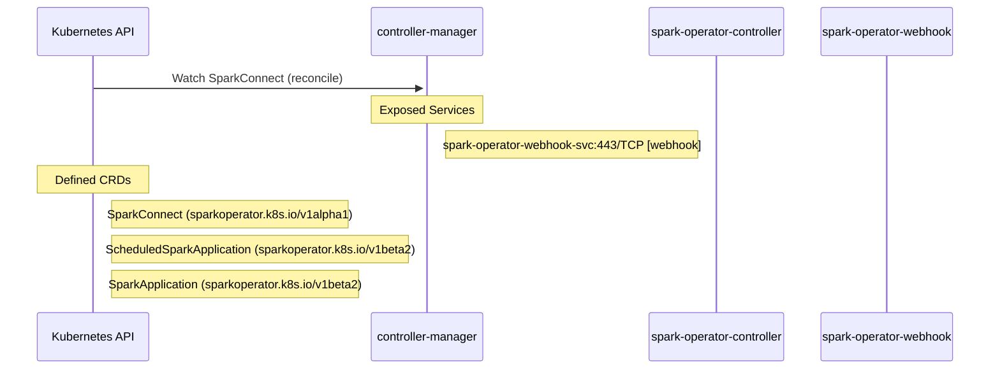

# spark-operator: Dataflow

## Controller Watches

Kubernetes resources this controller monitors for changes. Each watch triggers reconciliation when the watched resource is created, updated, or deleted.

| Type | GVK | Source |
|------|-----|--------|
| For | api/v1alpha1/SparkConnect | [`internal/controller/sparkconnect/reconciler.go:97`](https://github.com/kubeflow/spark-operator/blob/5366d3d2fe80d4a3e972ea010e3556631d52f017/internal/controller/sparkconnect/reconciler.go#L97) |

## Reconciliation Flow

How the controller interacts with the Kubernetes API during reconciliation.

### Webhooks

| Name | Type | Path | Failure Policy | Service | Source |
|------|------|------|----------------|---------|--------|
| mutate-pod.sparkoperator.k8s.io | mutating | /mutate--v1-pod | Fail | system/webhook-service | [`config/webhook/manifests.yaml`](https://github.com/kubeflow/spark-operator/blob/5366d3d2fe80d4a3e972ea010e3556631d52f017/config/webhook/manifests.yaml) |
| mutate-pod.sparkoperator.k8s.io | mutating | /mutate--v1-pod | Fail | system/spark-operator-webhook-svc | [`config/webhook/mutatingwebhookconfiguration.yaml`](https://github.com/kubeflow/spark-operator/blob/5366d3d2fe80d4a3e972ea010e3556631d52f017/config/webhook/mutatingwebhookconfiguration.yaml) |
| mutate-scheduledsparkapplication.sparkoperator.k8s.io | validating | /validate-sparkoperator-k8s-io-v1beta2-sparkapplication | Fail | system/webhook-service | [`config/webhook/manifests.yaml`](https://github.com/kubeflow/spark-operator/blob/5366d3d2fe80d4a3e972ea010e3556631d52f017/config/webhook/manifests.yaml) |
| mutate-scheduledsparkapplication.sparkoperator.k8s.io | mutating | /mutate-sparkoperator-k8s-io-v1beta2-scheduledsparkapplication | Fail | system/spark-operator-webhook-svc | [`config/webhook/mutatingwebhookconfiguration.yaml`](https://github.com/kubeflow/spark-operator/blob/5366d3d2fe80d4a3e972ea010e3556631d52f017/config/webhook/mutatingwebhookconfiguration.yaml) |
| mutate-sparkapplication.sparkoperator.k8s.io | mutating | /mutate-sparkoperator-k8s-io-v1beta2-sparkapplication | Fail | system/webhook-service | [`config/webhook/manifests.yaml`](https://github.com/kubeflow/spark-operator/blob/5366d3d2fe80d4a3e972ea010e3556631d52f017/config/webhook/manifests.yaml) |
| mutate-sparkapplication.sparkoperator.k8s.io | mutating | /mutate-sparkoperator-k8s-io-v1beta2-sparkapplication | Fail | system/spark-operator-webhook-svc | [`config/webhook/mutatingwebhookconfiguration.yaml`](https://github.com/kubeflow/spark-operator/blob/5366d3d2fe80d4a3e972ea010e3556631d52f017/config/webhook/mutatingwebhookconfiguration.yaml) |
| validate-scheduledsparkapplication.sparkoperator.k8s.io | validating | /validate-sparkoperator-k8s-io-v1beta2-scheduledsparkapplication | Fail | system/webhook-service | [`config/webhook/manifests.yaml`](https://github.com/kubeflow/spark-operator/blob/5366d3d2fe80d4a3e972ea010e3556631d52f017/config/webhook/manifests.yaml) |
| validate-scheduledsparkapplication.sparkoperator.k8s.io | validating | /validate-sparkoperator-k8s-io-v1beta2-scheduledsparkapplication | Fail | system/spark-operator-webhook-svc | [`config/webhook/validatingwebhookconfiguration.yaml`](https://github.com/kubeflow/spark-operator/blob/5366d3d2fe80d4a3e972ea010e3556631d52f017/config/webhook/validatingwebhookconfiguration.yaml) |
| validate-sparkapplication.sparkoperator.k8s.io | validating | /validate-sparkoperator-k8s-io-v1beta2-sparkapplication | Fail | system/webhook-service | [`config/webhook/manifests.yaml`](https://github.com/kubeflow/spark-operator/blob/5366d3d2fe80d4a3e972ea010e3556631d52f017/config/webhook/manifests.yaml) |
| validate-sparkapplication.sparkoperator.k8s.io | validating | /validate-sparkoperator-k8s-io-v1beta2-sparkapplication | Fail | system/spark-operator-webhook-svc | [`config/webhook/validatingwebhookconfiguration.yaml`](https://github.com/kubeflow/spark-operator/blob/5366d3d2fe80d4a3e972ea010e3556631d52f017/config/webhook/validatingwebhookconfiguration.yaml) |

## Configuration

ConfigMaps and Helm values that control this component's runtime behavior.

### Helm

**Chart:** spark-operator v2.4.0

