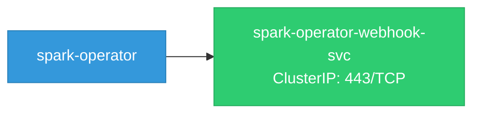
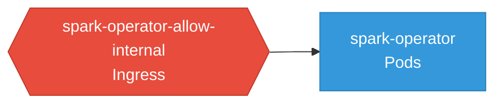

# spark-operator: Network

## Service Map

### Services

| Name | Type | Ports | Source |
|------|------|-------|--------|
| spark-operator-webhook-svc | ClusterIP | 443/TCP | [`kustomize:config/overlays/odh`](https://github.com/kubeflow/spark-operator/blob/16adb437ef96672ef47603845e2078e899f3edbe/kustomize:config/overlays/odh) |

### Ingress / Routing

| Kind | Name | Hosts | Paths | TLS | Source |
|------|------|-------|-------|-----|--------|
| Ingress | rbac-inferred |  |  | no | [`rbac/spark-operator-controller`](https://github.com/kubeflow/spark-operator/blob/16adb437ef96672ef47603845e2078e899f3edbe/rbac/spark-operator-controller) |

### Network Policies

| Name | Policy Types | Source |
|------|-------------|--------|
| spark-operator-allow-internal | Ingress | [`kustomize:config/overlays/odh`](https://github.com/kubeflow/spark-operator/blob/16adb437ef96672ef47603845e2078e899f3edbe/kustomize:config/overlays/odh) |

## Network Policy Graph

Visual representation of NetworkPolicy rules. Ingress rules show what traffic is allowed into pods, egress rules show what traffic is allowed out.

