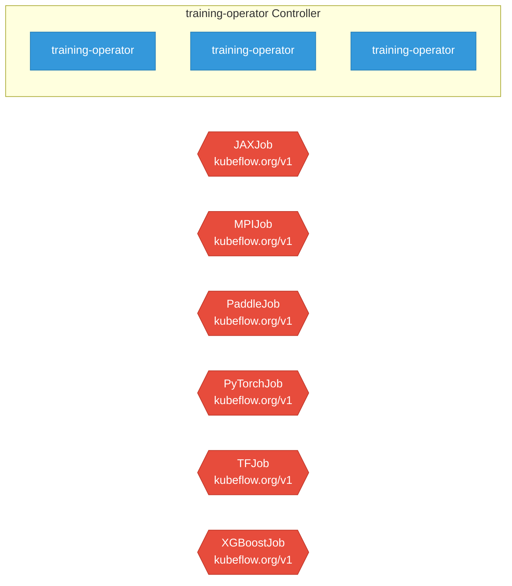

# training-operator

> **Architecture snapshot: 2026-05-05** (2026-05-05)

**Repository:** kubeflow/training-operator  
**Analyzer:** arch-analyzer 0.2.0  
**Extracted:** 2026-05-05T15:09:06Z

## Summary

| Metric | Count |
|--------|-------|
| CRDs | 6 |
| Deployments | 3 |
| Services | 1 |
| Secrets | 2 |
| Cluster Roles | 6 |
| Controller Watches | 0 |

## Component Architecture

CRDs, controllers, and owned Kubernetes resources.

### CRDs

| Group | Version | Kind | Scope | Fields | Validation Rules | Source |
|-------|---------|------|-------|--------|------------------|--------|
| kubeflow.org | v1 | JAXJob | Namespaced | 1073 | 1 | [`manifests/base/crds/kubeflow.org_jaxjobs.yaml`](https://github.com/kubeflow/training-operator/blob/8582a4b2a238e3552c6b726764580295303a3414/manifests/base/crds/kubeflow.org_jaxjobs.yaml) |
| kubeflow.org | v1 | MPIJob | Namespaced | 1076 | 1 | [`manifests/base/crds/kubeflow.org_mpijobs.yaml`](https://github.com/kubeflow/training-operator/blob/8582a4b2a238e3552c6b726764580295303a3414/manifests/base/crds/kubeflow.org_mpijobs.yaml) |
| kubeflow.org | v1 | PaddleJob | Namespaced | 1140 | 1 | [`manifests/base/crds/kubeflow.org_paddlejobs.yaml`](https://github.com/kubeflow/training-operator/blob/8582a4b2a238e3552c6b726764580295303a3414/manifests/base/crds/kubeflow.org_paddlejobs.yaml) |
| kubeflow.org | v1 | PyTorchJob | Namespaced | 1150 | 1 | [`manifests/base/crds/kubeflow.org_pytorchjobs.yaml`](https://github.com/kubeflow/training-operator/blob/8582a4b2a238e3552c6b726764580295303a3414/manifests/base/crds/kubeflow.org_pytorchjobs.yaml) |
| kubeflow.org | v1 | TFJob | Namespaced | 1075 | 1 | [`manifests/base/crds/kubeflow.org_tfjobs.yaml`](https://github.com/kubeflow/training-operator/blob/8582a4b2a238e3552c6b726764580295303a3414/manifests/base/crds/kubeflow.org_tfjobs.yaml) |
| kubeflow.org | v1 | XGBoostJob | Namespaced | 1073 | 1 | [`manifests/base/crds/kubeflow.org_xgboostjobs.yaml`](https://github.com/kubeflow/training-operator/blob/8582a4b2a238e3552c6b726764580295303a3414/manifests/base/crds/kubeflow.org_xgboostjobs.yaml) |

## Dependencies

### Key External Dependencies

| Module | Version |
|--------|---------|
| github.com/go-logr/logr | v1.4.2 |
| github.com/prometheus/client_golang | v1.20.2 |
| k8s.io/api | v0.31.3 |
| k8s.io/apimachinery | v0.31.3 |
| k8s.io/client-go | v0.31.3 |
| sigs.k8s.io/controller-runtime | v0.19.1 |

