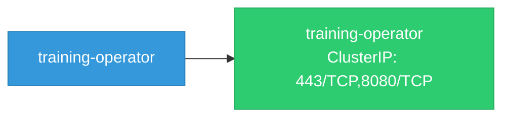

# training-operator: Network

## Service Map

### Services

| Name | Type | Ports | Source |
|------|------|-------|--------|
| training-operator | ClusterIP | 8080/TCP, 443/TCP | [`manifests/base/service.yaml`](https://github.com/kubeflow/training-operator/blob/8582a4b2a238e3552c6b726764580295303a3414/manifests/base/service.yaml) |

!!! warning "No Network Policies"
    No NetworkPolicy resources found. All pod-to-pod traffic is allowed by default.

