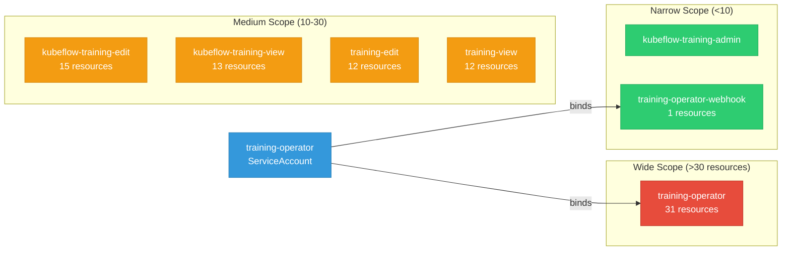

# training-operator: RBAC

ServiceAccount bindings, roles, and resource permissions.

## RBAC Overview

This component defines a large RBAC surface (181 diagram lines). The graph below groups roles by permission scope.

## Bindings

Subject-to-role mappings defining who has access to what.

| Binding | Type | Role | Subject |
|---------|------|------|---------|
| training-operator | ClusterRoleBinding | training-operator | ServiceAccount/training-operator |
| training-operator-webhook | RoleBinding | training-operator-webhook | ServiceAccount/training-operator |

## Role Details

Per-rule breakdown of API groups, resources, and verbs for each role.

| Role | Kind | API Groups | Resources | Verbs |
|------|------|------------|-----------|-------|
| kubeflow-training-edit | ClusterRole |  | mpijobs, tfjobs, pytorchjobs, xgboostjobs, paddlejobs, jaxjobs | create, delete, get, list, patch, update, watch |
| kubeflow-training-edit | ClusterRole |  | mpijobs/status, tfjobs/status, pytorchjobs/status, xgboostjobs/status, paddlejobs/status, jaxjobs/status | get |
| kubeflow-training-edit | ClusterRole |  | localqueues | get, list |
| kubeflow-training-edit | ClusterRole |  | persistentvolumeclaims | create, delete, get, list, watch |
| kubeflow-training-edit | ClusterRole |  | events | get, list, watch |
| kubeflow-training-view | ClusterRole |  | mpijobs, tfjobs, pytorchjobs, xgboostjobs, paddlejobs, jaxjobs | get, list, watch |
| kubeflow-training-view | ClusterRole |  | mpijobs/status, tfjobs/status, pytorchjobs/status, xgboostjobs/status, paddlejobs/status, jaxjobs/status | get |
| kubeflow-training-view | ClusterRole |  | localqueues | get, list |
| training-edit | ClusterRole |  | mpijobs, tfjobs, pytorchjobs, mxjobs, xgboostjobs, paddlejobs | create, delete, get, list, patch, update, watch |
| training-edit | ClusterRole |  | mpijobs/status, tfjobs/status, pytorchjobs/status, mxjobs/status, xgboostjobs/status, paddlejobs/status | get |
| training-operator | ClusterRole |  | configmaps | create, list, update, watch |
| training-operator | ClusterRole |  | events | create, delete, get, list, patch, update, watch |
| training-operator | ClusterRole |  | pods | create, delete, get, list, patch, update, watch |
| training-operator | ClusterRole |  | pods/exec | create |
| training-operator | ClusterRole |  | serviceaccounts | create, get, list, watch |
| training-operator | ClusterRole |  | services | create, delete, get, list, watch |
| training-operator | ClusterRole |  | validatingwebhookconfigurations | get, list, update, watch |
| training-operator | ClusterRole |  | horizontalpodautoscalers | create, delete, get, list, patch, update, watch |
| training-operator | ClusterRole |  | jaxjobs | create, delete, get, list, patch, update, watch |
| training-operator | ClusterRole |  | jaxjobs/finalizers | update |
| training-operator | ClusterRole |  | jaxjobs/status | get, patch, update |
| training-operator | ClusterRole |  | mpijobs | create, delete, get, list, patch, update, watch |
| training-operator | ClusterRole |  | mpijobs/finalizers | update |
| training-operator | ClusterRole |  | mpijobs/status | get, patch, update |
| training-operator | ClusterRole |  | paddlejobs | create, delete, get, list, patch, update, watch |
| training-operator | ClusterRole |  | paddlejobs/finalizers | update |
| training-operator | ClusterRole |  | paddlejobs/status | get, patch, update |
| training-operator | ClusterRole |  | pytorchjobs | create, delete, get, list, patch, update, watch |
| training-operator | ClusterRole |  | pytorchjobs/finalizers | update |
| training-operator | ClusterRole |  | pytorchjobs/status | get, patch, update |
| training-operator | ClusterRole |  | tfjobs | create, delete, get, list, patch, update, watch |
| training-operator | ClusterRole |  | tfjobs/finalizers | update |
| training-operator | ClusterRole |  | tfjobs/status | get, patch, update |
| training-operator | ClusterRole |  | xgboostjobs | create, delete, get, list, patch, update, watch |
| training-operator | ClusterRole |  | xgboostjobs/finalizers | update |
| training-operator | ClusterRole |  | xgboostjobs/status | get, patch, update |
| training-operator | ClusterRole |  | rolebindings | create, list, update, watch |
| training-operator | ClusterRole |  | roles | create, list, update, watch |
| training-operator | ClusterRole |  | podgroups | create, delete, get, list, patch, update, watch |
| training-operator | ClusterRole |  | podgroups | create, delete, get, list, patch, update, watch |
| training-operator | ClusterRole |  | networkpolicies | create, delete, get, list, patch, update, watch |
| training-view | ClusterRole |  | mpijobs, tfjobs, pytorchjobs, mxjobs, xgboostjobs, paddlejobs | get, list, watch |
| training-view | ClusterRole |  | mpijobs/status, tfjobs/status, pytorchjobs/status, mxjobs/status, xgboostjobs/status, paddlejobs/status | get |
| training-operator-webhook | Role |  | secrets | get, list, update, watch |

### Cluster Roles

| Name | Resources | Verbs | Source |
|------|-----------|-------|--------|
| kubeflow-training-edit | mpijobs, tfjobs, pytorchjobs, xgboostjobs, paddlejobs, jaxjobs | create, delete, get, list, patch, update, watch | [`manifests/overlays/kubeflow/kubeflow-training-roles.yaml`](https://github.com/kubeflow/training-operator/blob/8582a4b2a238e3552c6b726764580295303a3414/manifests/overlays/kubeflow/kubeflow-training-roles.yaml) |
| kubeflow-training-edit | mpijobs/status, tfjobs/status, pytorchjobs/status, xgboostjobs/status, paddlejobs/status, jaxjobs/status | get | [`manifests/overlays/kubeflow/kubeflow-training-roles.yaml`](https://github.com/kubeflow/training-operator/blob/8582a4b2a238e3552c6b726764580295303a3414/manifests/overlays/kubeflow/kubeflow-training-roles.yaml) |
| kubeflow-training-edit | localqueues | get, list | [`manifests/overlays/kubeflow/kubeflow-training-roles.yaml`](https://github.com/kubeflow/training-operator/blob/8582a4b2a238e3552c6b726764580295303a3414/manifests/overlays/kubeflow/kubeflow-training-roles.yaml) |
| kubeflow-training-edit | persistentvolumeclaims | create, delete, get, list, watch | [`manifests/overlays/kubeflow/kubeflow-training-roles.yaml`](https://github.com/kubeflow/training-operator/blob/8582a4b2a238e3552c6b726764580295303a3414/manifests/overlays/kubeflow/kubeflow-training-roles.yaml) |
| kubeflow-training-edit | events | get, list, watch | [`manifests/overlays/kubeflow/kubeflow-training-roles.yaml`](https://github.com/kubeflow/training-operator/blob/8582a4b2a238e3552c6b726764580295303a3414/manifests/overlays/kubeflow/kubeflow-training-roles.yaml) |
| kubeflow-training-view | mpijobs, tfjobs, pytorchjobs, xgboostjobs, paddlejobs, jaxjobs | get, list, watch | [`manifests/overlays/kubeflow/kubeflow-training-roles.yaml`](https://github.com/kubeflow/training-operator/blob/8582a4b2a238e3552c6b726764580295303a3414/manifests/overlays/kubeflow/kubeflow-training-roles.yaml) |
| kubeflow-training-view | mpijobs/status, tfjobs/status, pytorchjobs/status, xgboostjobs/status, paddlejobs/status, jaxjobs/status | get | [`manifests/overlays/kubeflow/kubeflow-training-roles.yaml`](https://github.com/kubeflow/training-operator/blob/8582a4b2a238e3552c6b726764580295303a3414/manifests/overlays/kubeflow/kubeflow-training-roles.yaml) |
| kubeflow-training-view | localqueues | get, list | [`manifests/overlays/kubeflow/kubeflow-training-roles.yaml`](https://github.com/kubeflow/training-operator/blob/8582a4b2a238e3552c6b726764580295303a3414/manifests/overlays/kubeflow/kubeflow-training-roles.yaml) |
| training-edit | mpijobs, tfjobs, pytorchjobs, mxjobs, xgboostjobs, paddlejobs | create, delete, get, list, patch, update, watch | [`manifests/rhoai/kubeflow-training-roles.yaml`](https://github.com/kubeflow/training-operator/blob/8582a4b2a238e3552c6b726764580295303a3414/manifests/rhoai/kubeflow-training-roles.yaml) |
| training-edit | mpijobs/status, tfjobs/status, pytorchjobs/status, mxjobs/status, xgboostjobs/status, paddlejobs/status | get | [`manifests/rhoai/kubeflow-training-roles.yaml`](https://github.com/kubeflow/training-operator/blob/8582a4b2a238e3552c6b726764580295303a3414/manifests/rhoai/kubeflow-training-roles.yaml) |
| training-operator | configmaps | create, list, update, watch | [`manifests/base/rbac/role.yaml`](https://github.com/kubeflow/training-operator/blob/8582a4b2a238e3552c6b726764580295303a3414/manifests/base/rbac/role.yaml) |
| training-operator | events | create, delete, get, list, patch, update, watch | [`manifests/base/rbac/role.yaml`](https://github.com/kubeflow/training-operator/blob/8582a4b2a238e3552c6b726764580295303a3414/manifests/base/rbac/role.yaml) |
| training-operator | pods | create, delete, get, list, patch, update, watch | [`manifests/base/rbac/role.yaml`](https://github.com/kubeflow/training-operator/blob/8582a4b2a238e3552c6b726764580295303a3414/manifests/base/rbac/role.yaml) |
| training-operator | pods/exec | create | [`manifests/base/rbac/role.yaml`](https://github.com/kubeflow/training-operator/blob/8582a4b2a238e3552c6b726764580295303a3414/manifests/base/rbac/role.yaml) |
| training-operator | serviceaccounts | create, get, list, watch | [`manifests/base/rbac/role.yaml`](https://github.com/kubeflow/training-operator/blob/8582a4b2a238e3552c6b726764580295303a3414/manifests/base/rbac/role.yaml) |
| training-operator | services | create, delete, get, list, watch | [`manifests/base/rbac/role.yaml`](https://github.com/kubeflow/training-operator/blob/8582a4b2a238e3552c6b726764580295303a3414/manifests/base/rbac/role.yaml) |
| training-operator | validatingwebhookconfigurations | get, list, update, watch | [`manifests/base/rbac/role.yaml`](https://github.com/kubeflow/training-operator/blob/8582a4b2a238e3552c6b726764580295303a3414/manifests/base/rbac/role.yaml) |
| training-operator | horizontalpodautoscalers | create, delete, get, list, patch, update, watch | [`manifests/base/rbac/role.yaml`](https://github.com/kubeflow/training-operator/blob/8582a4b2a238e3552c6b726764580295303a3414/manifests/base/rbac/role.yaml) |
| training-operator | jaxjobs | create, delete, get, list, patch, update, watch | [`manifests/base/rbac/role.yaml`](https://github.com/kubeflow/training-operator/blob/8582a4b2a238e3552c6b726764580295303a3414/manifests/base/rbac/role.yaml) |
| training-operator | jaxjobs/finalizers | update | [`manifests/base/rbac/role.yaml`](https://github.com/kubeflow/training-operator/blob/8582a4b2a238e3552c6b726764580295303a3414/manifests/base/rbac/role.yaml) |
| training-operator | jaxjobs/status | get, patch, update | [`manifests/base/rbac/role.yaml`](https://github.com/kubeflow/training-operator/blob/8582a4b2a238e3552c6b726764580295303a3414/manifests/base/rbac/role.yaml) |
| training-operator | mpijobs | create, delete, get, list, patch, update, watch | [`manifests/base/rbac/role.yaml`](https://github.com/kubeflow/training-operator/blob/8582a4b2a238e3552c6b726764580295303a3414/manifests/base/rbac/role.yaml) |
| training-operator | mpijobs/finalizers | update | [`manifests/base/rbac/role.yaml`](https://github.com/kubeflow/training-operator/blob/8582a4b2a238e3552c6b726764580295303a3414/manifests/base/rbac/role.yaml) |
| training-operator | mpijobs/status | get, patch, update | [`manifests/base/rbac/role.yaml`](https://github.com/kubeflow/training-operator/blob/8582a4b2a238e3552c6b726764580295303a3414/manifests/base/rbac/role.yaml) |
| training-operator | paddlejobs | create, delete, get, list, patch, update, watch | [`manifests/base/rbac/role.yaml`](https://github.com/kubeflow/training-operator/blob/8582a4b2a238e3552c6b726764580295303a3414/manifests/base/rbac/role.yaml) |
| training-operator | paddlejobs/finalizers | update | [`manifests/base/rbac/role.yaml`](https://github.com/kubeflow/training-operator/blob/8582a4b2a238e3552c6b726764580295303a3414/manifests/base/rbac/role.yaml) |
| training-operator | paddlejobs/status | get, patch, update | [`manifests/base/rbac/role.yaml`](https://github.com/kubeflow/training-operator/blob/8582a4b2a238e3552c6b726764580295303a3414/manifests/base/rbac/role.yaml) |
| training-operator | pytorchjobs | create, delete, get, list, patch, update, watch | [`manifests/base/rbac/role.yaml`](https://github.com/kubeflow/training-operator/blob/8582a4b2a238e3552c6b726764580295303a3414/manifests/base/rbac/role.yaml) |
| training-operator | pytorchjobs/finalizers | update | [`manifests/base/rbac/role.yaml`](https://github.com/kubeflow/training-operator/blob/8582a4b2a238e3552c6b726764580295303a3414/manifests/base/rbac/role.yaml) |
| training-operator | pytorchjobs/status | get, patch, update | [`manifests/base/rbac/role.yaml`](https://github.com/kubeflow/training-operator/blob/8582a4b2a238e3552c6b726764580295303a3414/manifests/base/rbac/role.yaml) |
| training-operator | tfjobs | create, delete, get, list, patch, update, watch | [`manifests/base/rbac/role.yaml`](https://github.com/kubeflow/training-operator/blob/8582a4b2a238e3552c6b726764580295303a3414/manifests/base/rbac/role.yaml) |
| training-operator | tfjobs/finalizers | update | [`manifests/base/rbac/role.yaml`](https://github.com/kubeflow/training-operator/blob/8582a4b2a238e3552c6b726764580295303a3414/manifests/base/rbac/role.yaml) |
| training-operator | tfjobs/status | get, patch, update | [`manifests/base/rbac/role.yaml`](https://github.com/kubeflow/training-operator/blob/8582a4b2a238e3552c6b726764580295303a3414/manifests/base/rbac/role.yaml) |
| training-operator | xgboostjobs | create, delete, get, list, patch, update, watch | [`manifests/base/rbac/role.yaml`](https://github.com/kubeflow/training-operator/blob/8582a4b2a238e3552c6b726764580295303a3414/manifests/base/rbac/role.yaml) |
| training-operator | xgboostjobs/finalizers | update | [`manifests/base/rbac/role.yaml`](https://github.com/kubeflow/training-operator/blob/8582a4b2a238e3552c6b726764580295303a3414/manifests/base/rbac/role.yaml) |
| training-operator | xgboostjobs/status | get, patch, update | [`manifests/base/rbac/role.yaml`](https://github.com/kubeflow/training-operator/blob/8582a4b2a238e3552c6b726764580295303a3414/manifests/base/rbac/role.yaml) |
| training-operator | rolebindings | create, list, update, watch | [`manifests/base/rbac/role.yaml`](https://github.com/kubeflow/training-operator/blob/8582a4b2a238e3552c6b726764580295303a3414/manifests/base/rbac/role.yaml) |
| training-operator | roles | create, list, update, watch | [`manifests/base/rbac/role.yaml`](https://github.com/kubeflow/training-operator/blob/8582a4b2a238e3552c6b726764580295303a3414/manifests/base/rbac/role.yaml) |
| training-operator | podgroups | create, delete, get, list, patch, update, watch | [`manifests/base/rbac/role.yaml`](https://github.com/kubeflow/training-operator/blob/8582a4b2a238e3552c6b726764580295303a3414/manifests/base/rbac/role.yaml) |
| training-operator | podgroups | create, delete, get, list, patch, update, watch | [`manifests/base/rbac/role.yaml`](https://github.com/kubeflow/training-operator/blob/8582a4b2a238e3552c6b726764580295303a3414/manifests/base/rbac/role.yaml) |
| training-operator | networkpolicies | create, delete, get, list, patch, update, watch | [`manifests/base/rbac/role.yaml`](https://github.com/kubeflow/training-operator/blob/8582a4b2a238e3552c6b726764580295303a3414/manifests/base/rbac/role.yaml) |
| training-view | mpijobs, tfjobs, pytorchjobs, mxjobs, xgboostjobs, paddlejobs | get, list, watch | [`manifests/rhoai/kubeflow-training-roles.yaml`](https://github.com/kubeflow/training-operator/blob/8582a4b2a238e3552c6b726764580295303a3414/manifests/rhoai/kubeflow-training-roles.yaml) |
| training-view | mpijobs/status, tfjobs/status, pytorchjobs/status, mxjobs/status, xgboostjobs/status, paddlejobs/status | get | [`manifests/rhoai/kubeflow-training-roles.yaml`](https://github.com/kubeflow/training-operator/blob/8582a4b2a238e3552c6b726764580295303a3414/manifests/rhoai/kubeflow-training-roles.yaml) |

### Kubebuilder RBAC Markers

Kubebuilder `+kubebuilder:rbac` markers declare the RBAC requirements of controller reconcilers. These are the source of truth for generated ClusterRole manifests. 1 markers found.

| File | Line | Groups | Resources | Verbs |
|------|------|--------|-----------|-------|
| [`pkg/cert/cert.go:43`](https://github.com/kubeflow/training-operator/blob/8582a4b2a238e3552c6b726764580295303a3414/pkg/cert/cert.go#L43) | 43 | "admissionregistration.k8s.io" | validatingwebhookconfigurations | get, list, watch, update |

