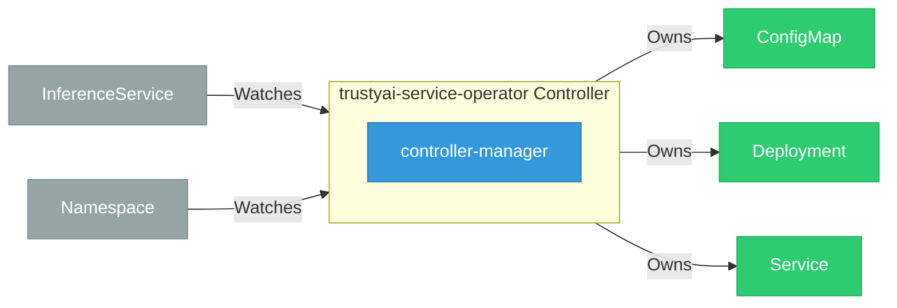

# trustyai-service-operator

> **Architecture snapshot: 2026-04-27** (2026-04-27)

**Repository:** trustyai-explainability/trustyai-service-operator  
**Analyzer:** arch-analyzer 0.2.0  
**Extracted:** 2026-04-27T08:21:31Z

## Summary

| Metric | Count |
|--------|-------|
| CRDs | 0 |
| Deployments | 1 |
| Services | 0 |
| Secrets | 0 |
| Cluster Roles | 0 |
| Controller Watches | 13 |

## Component Architecture

CRDs, controllers, and owned Kubernetes resources.

### CRDs

No CRDs defined.

## Dependencies

### Key External Dependencies

| Module | Version |
|--------|---------|
| github.com/go-logr/logr | v1.4.2 |
| github.com/prometheus-operator/prometheus-operator/pkg/apis/monitoring | v0.64.1 |
| github.com/prometheus/client_golang | v1.18.0 |
| k8s.io/api | v0.29.2 |
| k8s.io/apiextensions-apiserver | v0.29.0 |
| k8s.io/apimachinery | v0.29.2 |
| k8s.io/client-go | v0.29.2 |
| sigs.k8s.io/controller-runtime | v0.17.0 |

