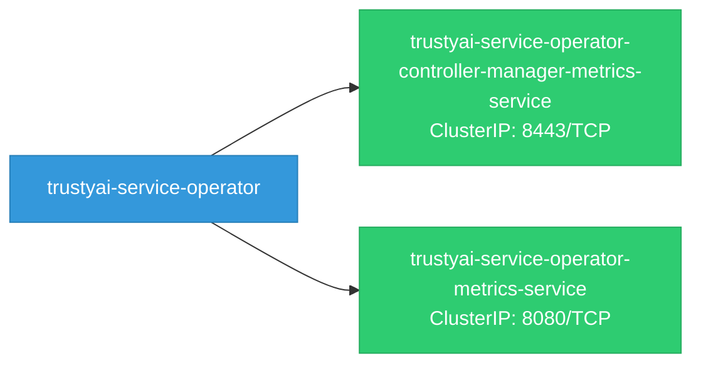

# trustyai-service-operator: Network

## Service Map

### Services

| Name | Type | Ports | Source |
|------|------|-------|--------|
| trustyai-service-operator-controller-manager-metrics-service | ClusterIP | 8443/TCP | [`kustomize:config/overlays/odh`](https://github.com/trustyai-explainability/trustyai-service-operator/blob/6b52d04c51b89713876a2f783e3dd0729ad34065/kustomize:config/overlays/odh) |
| trustyai-service-operator-metrics-service | ClusterIP | 8080/TCP | [`kustomize:config/overlays/odh`](https://github.com/trustyai-explainability/trustyai-service-operator/blob/6b52d04c51b89713876a2f783e3dd0729ad34065/kustomize:config/overlays/odh) |

!!! warning "No Network Policies"
    No NetworkPolicy resources found. All pod-to-pod traffic is allowed by default.

