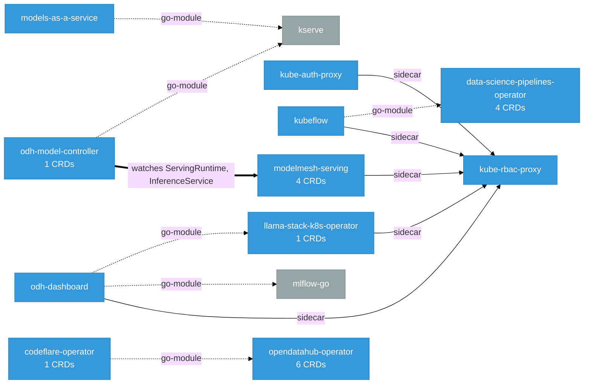

# OpenShift AI Platform Analysis

> **Architecture snapshot: 2026-04-23** (2026-04-23)

*Generated by architecture-analyzer. All data produced by deterministic static analysis.*

## Platform Summary

| Metric | Count |
|--------|-------|
| Components | 20 |
| CRDs | 25 |
| Services | 31 |
| Secrets | 25 |
| Cluster Roles | 50 |
| Cross-Component Dependencies | 14 |

## Component Dependency Graph

## Components Analyzed

| Component | CRDs |
|-----------|------|
| argo-workflows | 0 |
| codeflare-operator | 1 |
| data-science-pipelines-operator | 4 |
| distributed-workloads | 0 |
| eval-hub | 0 |
| fms-guardrails-orchestrator | 0 |
| kube-auth-proxy | 0 |
| kube-rbac-proxy | 0 |
| kubeflow | 0 |
| llama-stack-k8s-operator | 1 |
| llm-d-inference-scheduler | 0 |
| model-registry | 0 |
| model-registry-operator | 2 |
| modelmesh-serving | 4 |
| models-as-a-service | 0 |
| notebooks | 0 |
| odh-dashboard | 0 |
| odh-model-controller | 1 |
| opendatahub-operator | 6 |
| training-operator | 6 |

