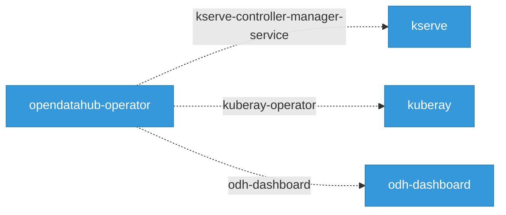

# Network Topology

29 Kubernetes services across the platform.

## Network Topology Graph

Interactive service mesh view of the platform. Drag nodes to rearrange, hover to highlight connections, click for details. Double-click background to fit all.

  <button data-action="fit" title="Fit to view">Fit</button>
  <button data-action="zoom-in" title="Zoom in">+</button>
  <button data-action="zoom-out" title="Zoom out">&minus;</button>
  <button data-action="relayout" title="Re-run layout">Relayout</button>

  

   Component
   Service
   External
   CRD Watch
   Sidecar
   Module
   External Conn

## Cross-Component Service References

Services referenced across component boundaries. When component A defines a service that component B also references, it indicates a deployment dependency.

## Services by Component

| Component | Services | Webhook (443) | Metrics (8443) | Data |
|-----------|----------|---------------|----------------|------|
| data-science-pipelines-operator | 3 | 0 | 0 | 3 |
| kserve | 6 | 4 | 2 | 0 |
| kube-auth-proxy | 1 | 0 | 1 | 0 |
| kube-rbac-proxy | 1 | 0 | 1 | 0 |
| kuberay | 2 | 1 | 0 | 1 |
| model-registry-operator | 1 | 1 | 0 | 0 |
| notebooks | 1 | 0 | 0 | 1 |
| odh-dashboard | 5 | 1 | 1 | 3 |
| odh-model-controller | 1 | 1 | 0 | 0 |
| opendatahub-operator | 8 | 5 | 2 | 1 |

## Service Detail

Per-component service breakdown with exact port numbers and protocols.

### data-science-pipelines-operator (3 services)

| Service | Type | Ports |
|---------|------|-------|
| mariadb | ClusterIP | 3306/TCP |
| minio | ClusterIP | 9000/TCP, 9001/TCP |
| pypi-server | ClusterIP | 8080/TCP |

### kserve (6 services)

| Service | Type | Ports |
|---------|------|-------|
| llmisvc-controller-manager-service | ClusterIP | 8443/TCP |
| kserve-controller-manager-service | ClusterIP | 8443/TCP |
| llmisvc-webhook-server-service | ClusterIP | 443/TCP |
| localmodel-webhook-server-service | ClusterIP | 443/TCP |
| kserve-webhook-server-service | ClusterIP | 443/TCP |
| webhook-service | ClusterIP | 443/TCP |

### kube-auth-proxy (1 services)

| Service | Type | Ports |
|---------|------|-------|
| kube-rbac-proxy | ClusterIP | 8443/TCP |

### kube-rbac-proxy (1 services)

| Service | Type | Ports |
|---------|------|-------|
| kube-rbac-proxy | ClusterIP | 8443/TCP |

### kuberay (2 services)

| Service | Type | Ports |
|---------|------|-------|
| kuberay-operator | ClusterIP | 8080/TCP |
| webhook-service | ClusterIP | 443/TCP |

### model-registry-operator (1 services)

| Service | Type | Ports |
|---------|------|-------|
| webhook-service | ClusterIP | 443/TCP |

### notebooks (1 services)

| Service | Type | Ports |
|---------|------|-------|
| notebook | ClusterIP | 8888/TCP |

### odh-dashboard (5 services)

| Service | Type | Ports |
|---------|------|-------|
| odh-dashboard | ClusterIP | 8443/TCP |
| workspaces-backend | ClusterIP | 4000/TCP |
| workspaces-webhook-service | ClusterIP | 443/TCP |
| workspaces-controller-metrics-service | ClusterIP | 8080/TCP |
| workspaces-frontend | ClusterIP | 8080/TCP |

### odh-model-controller (1 services)

| Service | Type | Ports |
|---------|------|-------|
| odh-model-controller-webhook-service | ClusterIP | 443/TCP |

### opendatahub-operator (8 services)

| Service | Type | Ports |
|---------|------|-------|
| webhook-service | ClusterIP | 443/TCP |
| odh-dashboard | ClusterIP | 8443/TCP |
| kserve-controller-manager-service | ClusterIP | 8443/TCP |
| kserve-webhook-server-service | ClusterIP | 443/TCP |
| odh-model-controller-webhook-service | ClusterIP | 443/TCP |
| kuberay-operator | ClusterIP | 8080/TCP |
| training-operator | ClusterIP | 8080/TCP, 443/TCP |
| service | ClusterIP | 443/TCP |

## Port Patterns

- **3306/TCP**: mariadb
- **4000/TCP**: workspaces-backend
- **443/TCP**: llmisvc-webhook-server-service, localmodel-webhook-server-service, kserve-webhook-server-service, webhook-service, webhook-service, webhook-service, workspaces-webhook-service, odh-model-controller-webhook-service, webhook-service, kserve-webhook-server-service, odh-model-controller-webhook-service, training-operator, service
- **8080/TCP**: pypi-server, kuberay-operator, workspaces-controller-metrics-service, workspaces-frontend, kuberay-operator, training-operator
- **8443/TCP**: llmisvc-controller-manager-service, kserve-controller-manager-service, kube-rbac-proxy, kube-rbac-proxy, odh-dashboard, odh-dashboard, kserve-controller-manager-service
- **8888/TCP**: notebook
- **9000/TCP**: minio
- **9001/TCP**: minio

