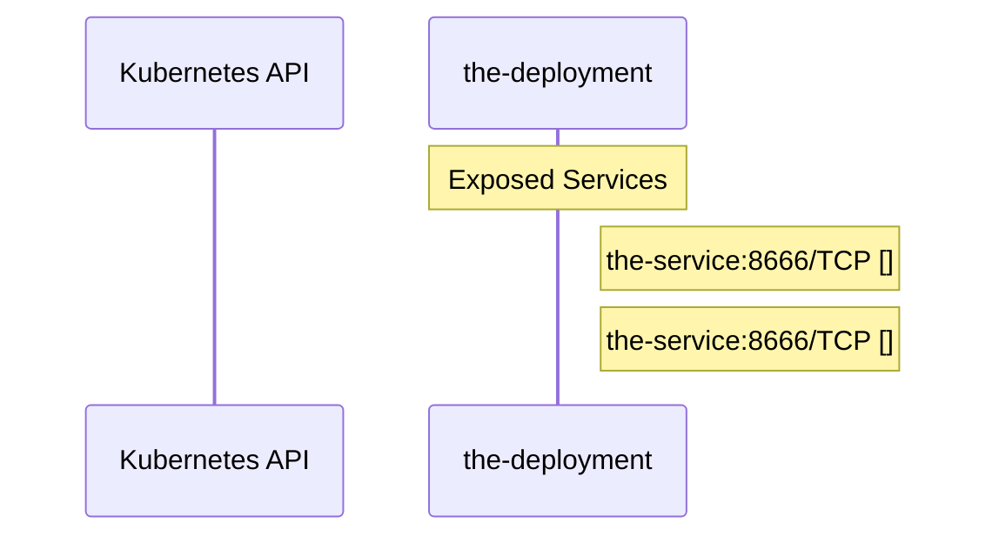

# argo-workflows: Dataflow

## Controller Watches

Kubernetes resources this controller monitors for changes. Each watch triggers reconciliation when the watched resource is created, updated, or deleted.

No controller watches found in analyzed sources.

## Reconciliation Flow

How the controller interacts with the Kubernetes API during reconciliation.

### HTTP Endpoints

| Method | Path | Source |
|--------|------|--------|
| * | / | [`.gopath-loader/pkg/mod/github.com/google/s2a-go@v0.1.9/tools/internal_ci/test_gae/main.go:79`](https://github.com/argoproj/argo-workflows/blob/d07b4418769855f690fa23709472fd173761b4da/.gopath-loader/pkg/mod/github.com/google/s2a-go@v0.1.9/tools/internal_ci/test_gae/main.go#L79) |
| * | / | [`.gomod-cache/golang.org/x/net@v0.38.0/webdav/litmus_test_server.go:83`](https://github.com/argoproj/argo-workflows/blob/d07b4418769855f690fa23709472fd173761b4da/.gomod-cache/golang.org/x/net@v0.38.0/webdav/litmus_test_server.go#L83) |
| * | / | [`.gopath-loader/pkg/mod/golang.org/x/net@v0.38.0/webdav/litmus_test_server.go:83`](https://github.com/argoproj/argo-workflows/blob/d07b4418769855f690fa23709472fd173761b4da/.gopath-loader/pkg/mod/golang.org/x/net@v0.38.0/webdav/litmus_test_server.go#L83) |
| * | / | [`.gomod-cache/github.com/aws/aws-sdk-go-v2@v1.36.3/internal/awstesting/certificate_utils.go:225`](https://github.com/argoproj/argo-workflows/blob/d07b4418769855f690fa23709472fd173761b4da/.gomod-cache/github.com/aws/aws-sdk-go-v2@v1.36.3/internal/awstesting/certificate_utils.go#L225) |
| * | / | [`.gomod-cache/github.com/coreos/go-oidc/v3@v3.9.0/example/idtoken/app.go:65`](https://github.com/argoproj/argo-workflows/blob/d07b4418769855f690fa23709472fd173761b4da/.gomod-cache/github.com/coreos/go-oidc/v3@v3.9.0/example/idtoken/app.go#L65) |
| * | / | [`.gomod-cache/golang.org/toolchain@v0.0.1-go1.25.7.linux-amd64/src/net/http/triv.go:130`](https://github.com/argoproj/argo-workflows/blob/d07b4418769855f690fa23709472fd173761b4da/.gomod-cache/golang.org/toolchain@v0.0.1-go1.25.7.linux-amd64/src/net/http/triv.go#L130) |
| * | / | [`.gomod-cache/github.com/coreos/go-oidc/v3@v3.9.0/example/userinfo/app.go:60`](https://github.com/argoproj/argo-workflows/blob/d07b4418769855f690fa23709472fd173761b4da/.gomod-cache/github.com/coreos/go-oidc/v3@v3.9.0/example/userinfo/app.go#L60) |
| * | / | [`.gomod-cache/golang.org/toolchain@v0.0.1-go1.25.7.linux-amd64/src/cmd/trace/main.go:188`](https://github.com/argoproj/argo-workflows/blob/d07b4418769855f690fa23709472fd173761b4da/.gomod-cache/golang.org/toolchain@v0.0.1-go1.25.7.linux-amd64/src/cmd/trace/main.go#L188) |
| * | / | [`.gopath-loader/pkg/mod/github.com/coreos/go-oidc/v3@v3.9.0/example/idtoken/app.go:65`](https://github.com/argoproj/argo-workflows/blob/d07b4418769855f690fa23709472fd173761b4da/.gopath-loader/pkg/mod/github.com/coreos/go-oidc/v3@v3.9.0/example/idtoken/app.go#L65) |
| * | / | [`.gopath-loader/pkg/mod/github.com/aws/aws-sdk-go-v2@v1.36.3/internal/awstesting/certificate_utils.go:225`](https://github.com/argoproj/argo-workflows/blob/d07b4418769855f690fa23709472fd173761b4da/.gopath-loader/pkg/mod/github.com/aws/aws-sdk-go-v2@v1.36.3/internal/awstesting/certificate_utils.go#L225) |
| * | / | [`server/apiserver/argoserver.go:416`](https://github.com/argoproj/argo-workflows/blob/d07b4418769855f690fa23709472fd173761b4da/server/apiserver/argoserver.go#L416) |
| * | / | [`.gomod-cache/github.com/google/s2a-go@v0.1.9/tools/internal_ci/test_gae/main.go:79`](https://github.com/argoproj/argo-workflows/blob/d07b4418769855f690fa23709472fd173761b4da/.gomod-cache/github.com/google/s2a-go@v0.1.9/tools/internal_ci/test_gae/main.go#L79) |
| * | / | [`.gopath-loader/pkg/mod/github.com/coreos/go-oidc/v3@v3.9.0/example/userinfo/app.go:60`](https://github.com/argoproj/argo-workflows/blob/d07b4418769855f690fa23709472fd173761b4da/.gopath-loader/pkg/mod/github.com/coreos/go-oidc/v3@v3.9.0/example/userinfo/app.go#L60) |
| * | / | [`.gopath-loader/pkg/mod/golang.org/toolchain@v0.0.1-go1.25.7.linux-amd64/src/cmd/trace/main.go:188`](https://github.com/argoproj/argo-workflows/blob/d07b4418769855f690fa23709472fd173761b4da/.gopath-loader/pkg/mod/golang.org/toolchain@v0.0.1-go1.25.7.linux-amd64/src/cmd/trace/main.go#L188) |
| * | / | [`.gopath-loader/pkg/mod/golang.org/toolchain@v0.0.1-go1.25.7.linux-amd64/src/net/http/triv.go:130`](https://github.com/argoproj/argo-workflows/blob/d07b4418769855f690fa23709472fd173761b4da/.gopath-loader/pkg/mod/golang.org/toolchain@v0.0.1-go1.25.7.linux-amd64/src/net/http/triv.go#L130) |
| * | /AfterSuiteDidRun | [`.gomod-cache/github.com/onsi/ginkgo@v1.16.5/internal/remote/server.go:62`](https://github.com/argoproj/argo-workflows/blob/d07b4418769855f690fa23709472fd173761b4da/.gomod-cache/github.com/onsi/ginkgo@v1.16.5/internal/remote/server.go#L62) |
| * | /AfterSuiteDidRun | [`.gopath-loader/pkg/mod/github.com/onsi/ginkgo@v1.16.5/internal/remote/server.go:62`](https://github.com/argoproj/argo-workflows/blob/d07b4418769855f690fa23709472fd173761b4da/.gopath-loader/pkg/mod/github.com/onsi/ginkgo@v1.16.5/internal/remote/server.go#L62) |
| * | /BeforeSuiteDidRun | [`.gomod-cache/github.com/onsi/ginkgo@v1.16.5/internal/remote/server.go:61`](https://github.com/argoproj/argo-workflows/blob/d07b4418769855f690fa23709472fd173761b4da/.gomod-cache/github.com/onsi/ginkgo@v1.16.5/internal/remote/server.go#L61) |
| * | /BeforeSuiteDidRun | [`.gopath-loader/pkg/mod/github.com/onsi/ginkgo@v1.16.5/internal/remote/server.go:61`](https://github.com/argoproj/argo-workflows/blob/d07b4418769855f690fa23709472fd173761b4da/.gopath-loader/pkg/mod/github.com/onsi/ginkgo@v1.16.5/internal/remote/server.go#L61) |
| * | /BeforeSuiteState | [`.gopath-loader/pkg/mod/github.com/onsi/ginkgo@v1.16.5/internal/remote/server.go:68`](https://github.com/argoproj/argo-workflows/blob/d07b4418769855f690fa23709472fd173761b4da/.gopath-loader/pkg/mod/github.com/onsi/ginkgo@v1.16.5/internal/remote/server.go#L68) |
| * | /BeforeSuiteState | [`.gomod-cache/github.com/onsi/ginkgo@v1.16.5/internal/remote/server.go:68`](https://github.com/argoproj/argo-workflows/blob/d07b4418769855f690fa23709472fd173761b4da/.gomod-cache/github.com/onsi/ginkgo@v1.16.5/internal/remote/server.go#L68) |
| * | /RemoteAfterSuiteData | [`.gomod-cache/github.com/onsi/ginkgo@v1.16.5/internal/remote/server.go:69`](https://github.com/argoproj/argo-workflows/blob/d07b4418769855f690fa23709472fd173761b4da/.gomod-cache/github.com/onsi/ginkgo@v1.16.5/internal/remote/server.go#L69) |
| * | /RemoteAfterSuiteData | [`.gopath-loader/pkg/mod/github.com/onsi/ginkgo@v1.16.5/internal/remote/server.go:69`](https://github.com/argoproj/argo-workflows/blob/d07b4418769855f690fa23709472fd173761b4da/.gopath-loader/pkg/mod/github.com/onsi/ginkgo@v1.16.5/internal/remote/server.go#L69) |
| * | /SpecDidComplete | [`.gopath-loader/pkg/mod/github.com/onsi/ginkgo@v1.16.5/internal/remote/server.go:64`](https://github.com/argoproj/argo-workflows/blob/d07b4418769855f690fa23709472fd173761b4da/.gopath-loader/pkg/mod/github.com/onsi/ginkgo@v1.16.5/internal/remote/server.go#L64) |
| * | /SpecDidComplete | [`.gomod-cache/github.com/onsi/ginkgo@v1.16.5/internal/remote/server.go:64`](https://github.com/argoproj/argo-workflows/blob/d07b4418769855f690fa23709472fd173761b4da/.gomod-cache/github.com/onsi/ginkgo@v1.16.5/internal/remote/server.go#L64) |
| * | /SpecSuiteDidEnd | [`.gopath-loader/pkg/mod/github.com/onsi/ginkgo@v1.16.5/internal/remote/server.go:65`](https://github.com/argoproj/argo-workflows/blob/d07b4418769855f690fa23709472fd173761b4da/.gopath-loader/pkg/mod/github.com/onsi/ginkgo@v1.16.5/internal/remote/server.go#L65) |
| * | /SpecSuiteDidEnd | [`.gomod-cache/github.com/onsi/ginkgo@v1.16.5/internal/remote/server.go:65`](https://github.com/argoproj/argo-workflows/blob/d07b4418769855f690fa23709472fd173761b4da/.gomod-cache/github.com/onsi/ginkgo@v1.16.5/internal/remote/server.go#L65) |
| * | /SpecSuiteWillBegin | [`.gopath-loader/pkg/mod/github.com/onsi/ginkgo@v1.16.5/internal/remote/server.go:60`](https://github.com/argoproj/argo-workflows/blob/d07b4418769855f690fa23709472fd173761b4da/.gopath-loader/pkg/mod/github.com/onsi/ginkgo@v1.16.5/internal/remote/server.go#L60) |
| * | /SpecSuiteWillBegin | [`.gomod-cache/github.com/onsi/ginkgo@v1.16.5/internal/remote/server.go:60`](https://github.com/argoproj/argo-workflows/blob/d07b4418769855f690fa23709472fd173761b4da/.gomod-cache/github.com/onsi/ginkgo@v1.16.5/internal/remote/server.go#L60) |
| * | /SpecWillRun | [`.gopath-loader/pkg/mod/github.com/onsi/ginkgo@v1.16.5/internal/remote/server.go:63`](https://github.com/argoproj/argo-workflows/blob/d07b4418769855f690fa23709472fd173761b4da/.gopath-loader/pkg/mod/github.com/onsi/ginkgo@v1.16.5/internal/remote/server.go#L63) |
| * | /SpecWillRun | [`.gomod-cache/github.com/onsi/ginkgo@v1.16.5/internal/remote/server.go:63`](https://github.com/argoproj/argo-workflows/blob/d07b4418769855f690fa23709472fd173761b4da/.gomod-cache/github.com/onsi/ginkgo@v1.16.5/internal/remote/server.go#L63) |
| * | /api/ | [`server/apiserver/argoserver.go:381`](https://github.com/argoproj/argo-workflows/blob/d07b4418769855f690fa23709472fd173761b4da/server/apiserver/argoserver.go#L381) |
| * | /args | [`.gopath-loader/pkg/mod/golang.org/toolchain@v0.0.1-go1.25.7.linux-amd64/src/net/http/triv.go:136`](https://github.com/argoproj/argo-workflows/blob/d07b4418769855f690fa23709472fd173761b4da/.gopath-loader/pkg/mod/golang.org/toolchain@v0.0.1-go1.25.7.linux-amd64/src/net/http/triv.go#L136) |
| * | /args | [`.gomod-cache/golang.org/toolchain@v0.0.1-go1.25.7.linux-amd64/src/net/http/triv.go:136`](https://github.com/argoproj/argo-workflows/blob/d07b4418769855f690fa23709472fd173761b4da/.gomod-cache/golang.org/toolchain@v0.0.1-go1.25.7.linux-amd64/src/net/http/triv.go#L136) |
| * | /artifact-files/ | [`server/apiserver/argoserver.go:393`](https://github.com/argoproj/argo-workflows/blob/d07b4418769855f690fa23709472fd173761b4da/server/apiserver/argoserver.go#L393) |
| * | /artifacts-by-uid/ | [`server/apiserver/argoserver.go:391`](https://github.com/argoproj/argo-workflows/blob/d07b4418769855f690fa23709472fd173761b4da/server/apiserver/argoserver.go#L391) |
| * | /artifacts/ | [`server/apiserver/argoserver.go:389`](https://github.com/argoproj/argo-workflows/blob/d07b4418769855f690fa23709472fd173761b4da/server/apiserver/argoserver.go#L389) |
| * | /auth/google/callback | [`.gomod-cache/github.com/coreos/go-oidc/v3@v3.9.0/example/userinfo/app.go:71`](https://github.com/argoproj/argo-workflows/blob/d07b4418769855f690fa23709472fd173761b4da/.gomod-cache/github.com/coreos/go-oidc/v3@v3.9.0/example/userinfo/app.go#L71) |
| * | /auth/google/callback | [`.gomod-cache/github.com/coreos/go-oidc/v3@v3.9.0/example/idtoken/app.go:82`](https://github.com/argoproj/argo-workflows/blob/d07b4418769855f690fa23709472fd173761b4da/.gomod-cache/github.com/coreos/go-oidc/v3@v3.9.0/example/idtoken/app.go#L82) |
| * | /auth/google/callback | [`.gopath-loader/pkg/mod/github.com/coreos/go-oidc/v3@v3.9.0/example/userinfo/app.go:71`](https://github.com/argoproj/argo-workflows/blob/d07b4418769855f690fa23709472fd173761b4da/.gopath-loader/pkg/mod/github.com/coreos/go-oidc/v3@v3.9.0/example/userinfo/app.go#L71) |
| * | /auth/google/callback | [`.gopath-loader/pkg/mod/github.com/coreos/go-oidc/v3@v3.9.0/example/idtoken/app.go:82`](https://github.com/argoproj/argo-workflows/blob/d07b4418769855f690fa23709472fd173761b4da/.gopath-loader/pkg/mod/github.com/coreos/go-oidc/v3@v3.9.0/example/idtoken/app.go#L82) |
| * | /authority.cer | [`.gopath-loader/pkg/mod/cloud.google.com/go@v0.119.0/httpreplay/cmd/httpr/httpr.go:76`](https://github.com/argoproj/argo-workflows/blob/d07b4418769855f690fa23709472fd173761b4da/.gopath-loader/pkg/mod/cloud.google.com/go@v0.119.0/httpreplay/cmd/httpr/httpr.go#L76) |
| * | /authority.cer | [`.gomod-cache/cloud.google.com/go@v0.119.0/httpreplay/cmd/httpr/httpr.go:76`](https://github.com/argoproj/argo-workflows/blob/d07b4418769855f690fa23709472fd173761b4da/.gomod-cache/cloud.google.com/go@v0.119.0/httpreplay/cmd/httpr/httpr.go#L76) |
| * | /bar | [`.gopath-loader/pkg/mod/golang.org/toolchain@v0.0.1-go1.25.7.linux-amd64/src/net/http/doc.go:67`](https://github.com/argoproj/argo-workflows/blob/d07b4418769855f690fa23709472fd173761b4da/.gopath-loader/pkg/mod/golang.org/toolchain@v0.0.1-go1.25.7.linux-amd64/src/net/http/doc.go#L67) |
| * | /bar | [`.gomod-cache/golang.org/toolchain@v0.0.1-go1.25.7.linux-amd64/src/net/http/doc.go:67`](https://github.com/argoproj/argo-workflows/blob/d07b4418769855f690fa23709472fd173761b4da/.gomod-cache/golang.org/toolchain@v0.0.1-go1.25.7.linux-amd64/src/net/http/doc.go#L67) |
| * | /block | [`.gomod-cache/golang.org/toolchain@v0.0.1-go1.25.7.linux-amd64/src/cmd/trace/main.go:210`](https://github.com/argoproj/argo-workflows/blob/d07b4418769855f690fa23709472fd173761b4da/.gomod-cache/golang.org/toolchain@v0.0.1-go1.25.7.linux-amd64/src/cmd/trace/main.go#L210) |
| * | /block | [`.gopath-loader/pkg/mod/golang.org/toolchain@v0.0.1-go1.25.7.linux-amd64/src/cmd/trace/main.go:210`](https://github.com/argoproj/argo-workflows/blob/d07b4418769855f690fa23709472fd173761b4da/.gopath-loader/pkg/mod/golang.org/toolchain@v0.0.1-go1.25.7.linux-amd64/src/cmd/trace/main.go#L210) |
| * | /chan | [`.gopath-loader/pkg/mod/golang.org/toolchain@v0.0.1-go1.25.7.linux-amd64/src/net/http/triv.go:134`](https://github.com/argoproj/argo-workflows/blob/d07b4418769855f690fa23709472fd173761b4da/.gopath-loader/pkg/mod/golang.org/toolchain@v0.0.1-go1.25.7.linux-amd64/src/net/http/triv.go#L134) |
| * | /chan | [`.gomod-cache/golang.org/toolchain@v0.0.1-go1.25.7.linux-amd64/src/net/http/triv.go:134`](https://github.com/argoproj/argo-workflows/blob/d07b4418769855f690fa23709472fd173761b4da/.gomod-cache/golang.org/toolchain@v0.0.1-go1.25.7.linux-amd64/src/net/http/triv.go#L134) |
| * | /counter | [`.gomod-cache/github.com/onsi/ginkgo@v1.16.5/internal/remote/server.go:70`](https://github.com/argoproj/argo-workflows/blob/d07b4418769855f690fa23709472fd173761b4da/.gomod-cache/github.com/onsi/ginkgo@v1.16.5/internal/remote/server.go#L70) |
| * | /counter | [`.gomod-cache/golang.org/toolchain@v0.0.1-go1.25.7.linux-amd64/src/net/http/triv.go:129`](https://github.com/argoproj/argo-workflows/blob/d07b4418769855f690fa23709472fd173761b4da/.gomod-cache/golang.org/toolchain@v0.0.1-go1.25.7.linux-amd64/src/net/http/triv.go#L129) |
| * | /counter | [`.gopath-loader/pkg/mod/golang.org/toolchain@v0.0.1-go1.25.7.linux-amd64/src/net/http/triv.go:129`](https://github.com/argoproj/argo-workflows/blob/d07b4418769855f690fa23709472fd173761b4da/.gopath-loader/pkg/mod/golang.org/toolchain@v0.0.1-go1.25.7.linux-amd64/src/net/http/triv.go#L129) |
| * | /counter | [`.gopath-loader/pkg/mod/github.com/onsi/ginkgo@v1.16.5/internal/remote/server.go:70`](https://github.com/argoproj/argo-workflows/blob/d07b4418769855f690fa23709472fd173761b4da/.gopath-loader/pkg/mod/github.com/onsi/ginkgo@v1.16.5/internal/remote/server.go#L70) |
| * | /date | [`.gopath-loader/pkg/mod/golang.org/toolchain@v0.0.1-go1.25.7.linux-amd64/src/net/http/triv.go:138`](https://github.com/argoproj/argo-workflows/blob/d07b4418769855f690fa23709472fd173761b4da/.gopath-loader/pkg/mod/golang.org/toolchain@v0.0.1-go1.25.7.linux-amd64/src/net/http/triv.go#L138) |
| * | /date | [`.gomod-cache/golang.org/toolchain@v0.0.1-go1.25.7.linux-amd64/src/net/http/triv.go:138`](https://github.com/argoproj/argo-workflows/blob/d07b4418769855f690fa23709472fd173761b4da/.gomod-cache/golang.org/toolchain@v0.0.1-go1.25.7.linux-amd64/src/net/http/triv.go#L138) |
| * | /debug/health | [`.gopath-loader/pkg/mod/github.com/docker/distribution@v2.8.2+incompatible/health/health.go:305`](https://github.com/argoproj/argo-workflows/blob/d07b4418769855f690fa23709472fd173761b4da/.gopath-loader/pkg/mod/github.com/docker/distribution@v2.8.2+incompatible/health/health.go#L305) |
| * | /debug/health | [`.gomod-cache/github.com/docker/distribution@v2.8.2+incompatible/health/health.go:305`](https://github.com/argoproj/argo-workflows/blob/d07b4418769855f690fa23709472fd173761b4da/.gomod-cache/github.com/docker/distribution@v2.8.2+incompatible/health/health.go#L305) |
| * | /debug/health/down | [`.gopath-loader/pkg/mod/github.com/docker/distribution@v2.8.2+incompatible/health/api/api.go:35`](https://github.com/argoproj/argo-workflows/blob/d07b4418769855f690fa23709472fd173761b4da/.gopath-loader/pkg/mod/github.com/docker/distribution@v2.8.2+incompatible/health/api/api.go#L35) |
| * | /debug/health/down | [`.gomod-cache/github.com/docker/distribution@v2.8.2+incompatible/health/api/api.go:35`](https://github.com/argoproj/argo-workflows/blob/d07b4418769855f690fa23709472fd173761b4da/.gomod-cache/github.com/docker/distribution@v2.8.2+incompatible/health/api/api.go#L35) |
| * | /debug/health/up | [`.gopath-loader/pkg/mod/github.com/docker/distribution@v2.8.2+incompatible/health/api/api.go:36`](https://github.com/argoproj/argo-workflows/blob/d07b4418769855f690fa23709472fd173761b4da/.gopath-loader/pkg/mod/github.com/docker/distribution@v2.8.2+incompatible/health/api/api.go#L36) |
| * | /debug/health/up | [`.gomod-cache/github.com/docker/distribution@v2.8.2+incompatible/health/api/api.go:36`](https://github.com/argoproj/argo-workflows/blob/d07b4418769855f690fa23709472fd173761b4da/.gomod-cache/github.com/docker/distribution@v2.8.2+incompatible/health/api/api.go#L36) |
| * | /debug/pprof/ | [`util/pprof/pprof.go:16`](https://github.com/argoproj/argo-workflows/blob/d07b4418769855f690fa23709472fd173761b4da/util/pprof/pprof.go#L16) |
| * | /debug/pprof/cmdline | [`util/pprof/pprof.go:17`](https://github.com/argoproj/argo-workflows/blob/d07b4418769855f690fa23709472fd173761b4da/util/pprof/pprof.go#L17) |
| * | /debug/pprof/profile | [`util/pprof/pprof.go:18`](https://github.com/argoproj/argo-workflows/blob/d07b4418769855f690fa23709472fd173761b4da/util/pprof/pprof.go#L18) |
| * | /debug/pprof/symbol | [`util/pprof/pprof.go:19`](https://github.com/argoproj/argo-workflows/blob/d07b4418769855f690fa23709472fd173761b4da/util/pprof/pprof.go#L19) |
| * | /debug/pprof/trace | [`util/pprof/pprof.go:20`](https://github.com/argoproj/argo-workflows/blob/d07b4418769855f690fa23709472fd173761b4da/util/pprof/pprof.go#L20) |
| * | /debug/vars | [`.gomod-cache/golang.org/toolchain@v0.0.1-go1.25.7.linux-amd64/src/expvar/expvar.go:382`](https://github.com/argoproj/argo-workflows/blob/d07b4418769855f690fa23709472fd173761b4da/.gomod-cache/golang.org/toolchain@v0.0.1-go1.25.7.linux-amd64/src/expvar/expvar.go#L382) |
| * | /debug/vars | [`.gopath-loader/pkg/mod/golang.org/toolchain@v0.0.1-go1.25.7.linux-amd64/src/expvar/expvar.go:382`](https://github.com/argoproj/argo-workflows/blob/d07b4418769855f690fa23709472fd173761b4da/.gopath-loader/pkg/mod/golang.org/toolchain@v0.0.1-go1.25.7.linux-amd64/src/expvar/expvar.go#L382) |
| * | /flags | [`.gopath-loader/pkg/mod/golang.org/toolchain@v0.0.1-go1.25.7.linux-amd64/src/net/http/triv.go:135`](https://github.com/argoproj/argo-workflows/blob/d07b4418769855f690fa23709472fd173761b4da/.gopath-loader/pkg/mod/golang.org/toolchain@v0.0.1-go1.25.7.linux-amd64/src/net/http/triv.go#L135) |
| * | /flags | [`.gomod-cache/golang.org/toolchain@v0.0.1-go1.25.7.linux-amd64/src/net/http/triv.go:135`](https://github.com/argoproj/argo-workflows/blob/d07b4418769855f690fa23709472fd173761b4da/.gomod-cache/golang.org/toolchain@v0.0.1-go1.25.7.linux-amd64/src/net/http/triv.go#L135) |
| * | /foo | [`.gomod-cache/golang.org/toolchain@v0.0.1-go1.25.7.linux-amd64/src/net/http/doc.go:65`](https://github.com/argoproj/argo-workflows/blob/d07b4418769855f690fa23709472fd173761b4da/.gomod-cache/golang.org/toolchain@v0.0.1-go1.25.7.linux-amd64/src/net/http/doc.go#L65) |
| * | /foo | [`.gopath-loader/pkg/mod/golang.org/toolchain@v0.0.1-go1.25.7.linux-amd64/src/net/http/doc.go:65`](https://github.com/argoproj/argo-workflows/blob/d07b4418769855f690fa23709472fd173761b4da/.gopath-loader/pkg/mod/golang.org/toolchain@v0.0.1-go1.25.7.linux-amd64/src/net/http/doc.go#L65) |
| * | /go/ | [`.gopath-loader/pkg/mod/golang.org/toolchain@v0.0.1-go1.25.7.linux-amd64/src/net/http/triv.go:132`](https://github.com/argoproj/argo-workflows/blob/d07b4418769855f690fa23709472fd173761b4da/.gopath-loader/pkg/mod/golang.org/toolchain@v0.0.1-go1.25.7.linux-amd64/src/net/http/triv.go#L132) |
| * | /go/ | [`.gomod-cache/golang.org/toolchain@v0.0.1-go1.25.7.linux-amd64/src/net/http/triv.go:132`](https://github.com/argoproj/argo-workflows/blob/d07b4418769855f690fa23709472fd173761b4da/.gomod-cache/golang.org/toolchain@v0.0.1-go1.25.7.linux-amd64/src/net/http/triv.go#L132) |
| * | /go/hello | [`.gomod-cache/golang.org/toolchain@v0.0.1-go1.25.7.linux-amd64/src/net/http/triv.go:137`](https://github.com/argoproj/argo-workflows/blob/d07b4418769855f690fa23709472fd173761b4da/.gomod-cache/golang.org/toolchain@v0.0.1-go1.25.7.linux-amd64/src/net/http/triv.go#L137) |
| * | /go/hello | [`.gopath-loader/pkg/mod/golang.org/toolchain@v0.0.1-go1.25.7.linux-amd64/src/net/http/triv.go:137`](https://github.com/argoproj/argo-workflows/blob/d07b4418769855f690fa23709472fd173761b4da/.gopath-loader/pkg/mod/golang.org/toolchain@v0.0.1-go1.25.7.linux-amd64/src/net/http/triv.go#L137) |
| * | /goroutine | [`.gomod-cache/golang.org/toolchain@v0.0.1-go1.25.7.linux-amd64/src/cmd/trace/main.go:203`](https://github.com/argoproj/argo-workflows/blob/d07b4418769855f690fa23709472fd173761b4da/.gomod-cache/golang.org/toolchain@v0.0.1-go1.25.7.linux-amd64/src/cmd/trace/main.go#L203) |
| * | /goroutine | [`.gopath-loader/pkg/mod/golang.org/toolchain@v0.0.1-go1.25.7.linux-amd64/src/cmd/trace/main.go:203`](https://github.com/argoproj/argo-workflows/blob/d07b4418769855f690fa23709472fd173761b4da/.gopath-loader/pkg/mod/golang.org/toolchain@v0.0.1-go1.25.7.linux-amd64/src/cmd/trace/main.go#L203) |
| * | /goroutines | [`.gopath-loader/pkg/mod/golang.org/toolchain@v0.0.1-go1.25.7.linux-amd64/src/cmd/trace/main.go:202`](https://github.com/argoproj/argo-workflows/blob/d07b4418769855f690fa23709472fd173761b4da/.gopath-loader/pkg/mod/golang.org/toolchain@v0.0.1-go1.25.7.linux-amd64/src/cmd/trace/main.go#L202) |
| * | /goroutines | [`.gomod-cache/golang.org/toolchain@v0.0.1-go1.25.7.linux-amd64/src/cmd/trace/main.go:202`](https://github.com/argoproj/argo-workflows/blob/d07b4418769855f690fa23709472fd173761b4da/.gomod-cache/golang.org/toolchain@v0.0.1-go1.25.7.linux-amd64/src/cmd/trace/main.go#L202) |
| * | /has-counter | [`.gomod-cache/github.com/onsi/ginkgo@v1.16.5/internal/remote/server.go:71`](https://github.com/argoproj/argo-workflows/blob/d07b4418769855f690fa23709472fd173761b4da/.gomod-cache/github.com/onsi/ginkgo@v1.16.5/internal/remote/server.go#L71) |
| * | /has-counter | [`.gopath-loader/pkg/mod/github.com/onsi/ginkgo@v1.16.5/internal/remote/server.go:71`](https://github.com/argoproj/argo-workflows/blob/d07b4418769855f690fa23709472fd173761b4da/.gopath-loader/pkg/mod/github.com/onsi/ginkgo@v1.16.5/internal/remote/server.go#L71) |
| * | /healthz | [`cmd/workflow-controller/main.go:181`](https://github.com/argoproj/argo-workflows/blob/d07b4418769855f690fa23709472fd173761b4da/cmd/workflow-controller/main.go#L181) |
| * | /initial | [`.gopath-loader/pkg/mod/cloud.google.com/go@v0.119.0/httpreplay/cmd/httpr/httpr.go:77`](https://github.com/argoproj/argo-workflows/blob/d07b4418769855f690fa23709472fd173761b4da/.gopath-loader/pkg/mod/cloud.google.com/go@v0.119.0/httpreplay/cmd/httpr/httpr.go#L77) |
| * | /initial | [`.gomod-cache/cloud.google.com/go@v0.119.0/httpreplay/cmd/httpr/httpr.go:77`](https://github.com/argoproj/argo-workflows/blob/d07b4418769855f690fa23709472fd173761b4da/.gomod-cache/cloud.google.com/go@v0.119.0/httpreplay/cmd/httpr/httpr.go#L77) |
| * | /input-artifacts-by-uid/ | [`server/apiserver/argoserver.go:392`](https://github.com/argoproj/argo-workflows/blob/d07b4418769855f690fa23709472fd173761b4da/server/apiserver/argoserver.go#L392) |
| * | /input-artifacts/ | [`server/apiserver/argoserver.go:390`](https://github.com/argoproj/argo-workflows/blob/d07b4418769855f690fa23709472fd173761b4da/server/apiserver/argoserver.go#L390) |
| * | /io | [`.gomod-cache/golang.org/toolchain@v0.0.1-go1.25.7.linux-amd64/src/cmd/trace/main.go:209`](https://github.com/argoproj/argo-workflows/blob/d07b4418769855f690fa23709472fd173761b4da/.gomod-cache/golang.org/toolchain@v0.0.1-go1.25.7.linux-amd64/src/cmd/trace/main.go#L209) |
| * | /io | [`.gopath-loader/pkg/mod/golang.org/toolchain@v0.0.1-go1.25.7.linux-amd64/src/cmd/trace/main.go:209`](https://github.com/argoproj/argo-workflows/blob/d07b4418769855f690fa23709472fd173761b4da/.gopath-loader/pkg/mod/golang.org/toolchain@v0.0.1-go1.25.7.linux-amd64/src/cmd/trace/main.go#L209) |
| * | /jsontrace | [`.gopath-loader/pkg/mod/golang.org/toolchain@v0.0.1-go1.25.7.linux-amd64/src/cmd/trace/main.go:198`](https://github.com/argoproj/argo-workflows/blob/d07b4418769855f690fa23709472fd173761b4da/.gopath-loader/pkg/mod/golang.org/toolchain@v0.0.1-go1.25.7.linux-amd64/src/cmd/trace/main.go#L198) |
| * | /jsontrace | [`.gomod-cache/golang.org/toolchain@v0.0.1-go1.25.7.linux-amd64/src/cmd/trace/main.go:198`](https://github.com/argoproj/argo-workflows/blob/d07b4418769855f690fa23709472fd173761b4da/.gomod-cache/golang.org/toolchain@v0.0.1-go1.25.7.linux-amd64/src/cmd/trace/main.go#L198) |
| * | /metrics | [`.gomod-cache/github.com/argoproj/argo-events@v1.9.6/pkg/metrics/metrics.go:203`](https://github.com/argoproj/argo-workflows/blob/d07b4418769855f690fa23709472fd173761b4da/.gomod-cache/github.com/argoproj/argo-events@v1.9.6/pkg/metrics/metrics.go#L203) |
| * | /metrics | [`server/apiserver/argoserver.go:397`](https://github.com/argoproj/argo-workflows/blob/d07b4418769855f690fa23709472fd173761b4da/server/apiserver/argoserver.go#L397) |
| * | /metrics | [`.gopath-loader/pkg/mod/github.com/argoproj/argo-events@v1.9.6/pkg/metrics/metrics.go:203`](https://github.com/argoproj/argo-workflows/blob/d07b4418769855f690fa23709472fd173761b4da/.gopath-loader/pkg/mod/github.com/argoproj/argo-events@v1.9.6/pkg/metrics/metrics.go#L203) |
| * | /mmu | [`.gomod-cache/golang.org/toolchain@v0.0.1-go1.25.7.linux-amd64/src/cmd/trace/main.go:206`](https://github.com/argoproj/argo-workflows/blob/d07b4418769855f690fa23709472fd173761b4da/.gomod-cache/golang.org/toolchain@v0.0.1-go1.25.7.linux-amd64/src/cmd/trace/main.go#L206) |
| * | /mmu | [`.gopath-loader/pkg/mod/golang.org/toolchain@v0.0.1-go1.25.7.linux-amd64/src/cmd/trace/main.go:206`](https://github.com/argoproj/argo-workflows/blob/d07b4418769855f690fa23709472fd173761b4da/.gopath-loader/pkg/mod/golang.org/toolchain@v0.0.1-go1.25.7.linux-amd64/src/cmd/trace/main.go#L206) |
| * | /oauth2/callback | [`server/apiserver/argoserver.go:396`](https://github.com/argoproj/argo-workflows/blob/d07b4418769855f690fa23709472fd173761b4da/server/apiserver/argoserver.go#L396) |
| * | /oauth2/redirect | [`server/apiserver/argoserver.go:395`](https://github.com/argoproj/argo-workflows/blob/d07b4418769855f690fa23709472fd173761b4da/server/apiserver/argoserver.go#L395) |
| * | /regionblock | [`.gopath-loader/pkg/mod/golang.org/toolchain@v0.0.1-go1.25.7.linux-amd64/src/cmd/trace/main.go:216`](https://github.com/argoproj/argo-workflows/blob/d07b4418769855f690fa23709472fd173761b4da/.gopath-loader/pkg/mod/golang.org/toolchain@v0.0.1-go1.25.7.linux-amd64/src/cmd/trace/main.go#L216) |
| * | /regionblock | [`.gomod-cache/golang.org/toolchain@v0.0.1-go1.25.7.linux-amd64/src/cmd/trace/main.go:216`](https://github.com/argoproj/argo-workflows/blob/d07b4418769855f690fa23709472fd173761b4da/.gomod-cache/golang.org/toolchain@v0.0.1-go1.25.7.linux-amd64/src/cmd/trace/main.go#L216) |
| * | /regionio | [`.gomod-cache/golang.org/toolchain@v0.0.1-go1.25.7.linux-amd64/src/cmd/trace/main.go:215`](https://github.com/argoproj/argo-workflows/blob/d07b4418769855f690fa23709472fd173761b4da/.gomod-cache/golang.org/toolchain@v0.0.1-go1.25.7.linux-amd64/src/cmd/trace/main.go#L215) |
| * | /regionio | [`.gopath-loader/pkg/mod/golang.org/toolchain@v0.0.1-go1.25.7.linux-amd64/src/cmd/trace/main.go:215`](https://github.com/argoproj/argo-workflows/blob/d07b4418769855f690fa23709472fd173761b4da/.gopath-loader/pkg/mod/golang.org/toolchain@v0.0.1-go1.25.7.linux-amd64/src/cmd/trace/main.go#L215) |
| * | /regionsched | [`.gopath-loader/pkg/mod/golang.org/toolchain@v0.0.1-go1.25.7.linux-amd64/src/cmd/trace/main.go:218`](https://github.com/argoproj/argo-workflows/blob/d07b4418769855f690fa23709472fd173761b4da/.gopath-loader/pkg/mod/golang.org/toolchain@v0.0.1-go1.25.7.linux-amd64/src/cmd/trace/main.go#L218) |
| * | /regionsched | [`.gomod-cache/golang.org/toolchain@v0.0.1-go1.25.7.linux-amd64/src/cmd/trace/main.go:218`](https://github.com/argoproj/argo-workflows/blob/d07b4418769855f690fa23709472fd173761b4da/.gomod-cache/golang.org/toolchain@v0.0.1-go1.25.7.linux-amd64/src/cmd/trace/main.go#L218) |
| * | /regionsyscall | [`.gopath-loader/pkg/mod/golang.org/toolchain@v0.0.1-go1.25.7.linux-amd64/src/cmd/trace/main.go:217`](https://github.com/argoproj/argo-workflows/blob/d07b4418769855f690fa23709472fd173761b4da/.gopath-loader/pkg/mod/golang.org/toolchain@v0.0.1-go1.25.7.linux-amd64/src/cmd/trace/main.go#L217) |
| * | /regionsyscall | [`.gomod-cache/golang.org/toolchain@v0.0.1-go1.25.7.linux-amd64/src/cmd/trace/main.go:217`](https://github.com/argoproj/argo-workflows/blob/d07b4418769855f690fa23709472fd173761b4da/.gomod-cache/golang.org/toolchain@v0.0.1-go1.25.7.linux-amd64/src/cmd/trace/main.go#L217) |
| * | /sched | [`.gopath-loader/pkg/mod/golang.org/toolchain@v0.0.1-go1.25.7.linux-amd64/src/cmd/trace/main.go:212`](https://github.com/argoproj/argo-workflows/blob/d07b4418769855f690fa23709472fd173761b4da/.gopath-loader/pkg/mod/golang.org/toolchain@v0.0.1-go1.25.7.linux-amd64/src/cmd/trace/main.go#L212) |
| * | /sched | [`.gomod-cache/golang.org/toolchain@v0.0.1-go1.25.7.linux-amd64/src/cmd/trace/main.go:212`](https://github.com/argoproj/argo-workflows/blob/d07b4418769855f690fa23709472fd173761b4da/.gomod-cache/golang.org/toolchain@v0.0.1-go1.25.7.linux-amd64/src/cmd/trace/main.go#L212) |
| * | /static/ | [`.gomod-cache/golang.org/toolchain@v0.0.1-go1.25.7.linux-amd64/src/cmd/trace/main.go:199`](https://github.com/argoproj/argo-workflows/blob/d07b4418769855f690fa23709472fd173761b4da/.gomod-cache/golang.org/toolchain@v0.0.1-go1.25.7.linux-amd64/src/cmd/trace/main.go#L199) |
| * | /static/ | [`.gopath-loader/pkg/mod/golang.org/toolchain@v0.0.1-go1.25.7.linux-amd64/src/cmd/trace/main.go:199`](https://github.com/argoproj/argo-workflows/blob/d07b4418769855f690fa23709472fd173761b4da/.gopath-loader/pkg/mod/golang.org/toolchain@v0.0.1-go1.25.7.linux-amd64/src/cmd/trace/main.go#L199) |
| * | /syscall | [`.gomod-cache/golang.org/toolchain@v0.0.1-go1.25.7.linux-amd64/src/cmd/trace/main.go:211`](https://github.com/argoproj/argo-workflows/blob/d07b4418769855f690fa23709472fd173761b4da/.gomod-cache/golang.org/toolchain@v0.0.1-go1.25.7.linux-amd64/src/cmd/trace/main.go#L211) |
| * | /syscall | [`.gopath-loader/pkg/mod/golang.org/toolchain@v0.0.1-go1.25.7.linux-amd64/src/cmd/trace/main.go:211`](https://github.com/argoproj/argo-workflows/blob/d07b4418769855f690fa23709472fd173761b4da/.gopath-loader/pkg/mod/golang.org/toolchain@v0.0.1-go1.25.7.linux-amd64/src/cmd/trace/main.go#L211) |
| * | /trace | [`.gomod-cache/golang.org/toolchain@v0.0.1-go1.25.7.linux-amd64/src/cmd/trace/main.go:197`](https://github.com/argoproj/argo-workflows/blob/d07b4418769855f690fa23709472fd173761b4da/.gomod-cache/golang.org/toolchain@v0.0.1-go1.25.7.linux-amd64/src/cmd/trace/main.go#L197) |
| * | /trace | [`.gopath-loader/pkg/mod/golang.org/toolchain@v0.0.1-go1.25.7.linux-amd64/src/cmd/trace/main.go:197`](https://github.com/argoproj/argo-workflows/blob/d07b4418769855f690fa23709472fd173761b4da/.gopath-loader/pkg/mod/golang.org/toolchain@v0.0.1-go1.25.7.linux-amd64/src/cmd/trace/main.go#L197) |
| * | /userregion | [`.gomod-cache/golang.org/toolchain@v0.0.1-go1.25.7.linux-amd64/src/cmd/trace/main.go:222`](https://github.com/argoproj/argo-workflows/blob/d07b4418769855f690fa23709472fd173761b4da/.gomod-cache/golang.org/toolchain@v0.0.1-go1.25.7.linux-amd64/src/cmd/trace/main.go#L222) |
| * | /userregion | [`.gopath-loader/pkg/mod/golang.org/toolchain@v0.0.1-go1.25.7.linux-amd64/src/cmd/trace/main.go:222`](https://github.com/argoproj/argo-workflows/blob/d07b4418769855f690fa23709472fd173761b4da/.gopath-loader/pkg/mod/golang.org/toolchain@v0.0.1-go1.25.7.linux-amd64/src/cmd/trace/main.go#L222) |
| * | /userregions | [`.gomod-cache/golang.org/toolchain@v0.0.1-go1.25.7.linux-amd64/src/cmd/trace/main.go:221`](https://github.com/argoproj/argo-workflows/blob/d07b4418769855f690fa23709472fd173761b4da/.gomod-cache/golang.org/toolchain@v0.0.1-go1.25.7.linux-amd64/src/cmd/trace/main.go#L221) |
| * | /userregions | [`.gopath-loader/pkg/mod/golang.org/toolchain@v0.0.1-go1.25.7.linux-amd64/src/cmd/trace/main.go:221`](https://github.com/argoproj/argo-workflows/blob/d07b4418769855f690fa23709472fd173761b4da/.gopath-loader/pkg/mod/golang.org/toolchain@v0.0.1-go1.25.7.linux-amd64/src/cmd/trace/main.go#L221) |
| * | /usertask | [`.gomod-cache/golang.org/toolchain@v0.0.1-go1.25.7.linux-amd64/src/cmd/trace/main.go:226`](https://github.com/argoproj/argo-workflows/blob/d07b4418769855f690fa23709472fd173761b4da/.gomod-cache/golang.org/toolchain@v0.0.1-go1.25.7.linux-amd64/src/cmd/trace/main.go#L226) |
| * | /usertask | [`.gopath-loader/pkg/mod/golang.org/toolchain@v0.0.1-go1.25.7.linux-amd64/src/cmd/trace/main.go:226`](https://github.com/argoproj/argo-workflows/blob/d07b4418769855f690fa23709472fd173761b4da/.gopath-loader/pkg/mod/golang.org/toolchain@v0.0.1-go1.25.7.linux-amd64/src/cmd/trace/main.go#L226) |
| * | /usertasks | [`.gomod-cache/golang.org/toolchain@v0.0.1-go1.25.7.linux-amd64/src/cmd/trace/main.go:225`](https://github.com/argoproj/argo-workflows/blob/d07b4418769855f690fa23709472fd173761b4da/.gomod-cache/golang.org/toolchain@v0.0.1-go1.25.7.linux-amd64/src/cmd/trace/main.go#L225) |
| * | /usertasks | [`.gopath-loader/pkg/mod/golang.org/toolchain@v0.0.1-go1.25.7.linux-amd64/src/cmd/trace/main.go:225`](https://github.com/argoproj/argo-workflows/blob/d07b4418769855f690fa23709472fd173761b4da/.gopath-loader/pkg/mod/golang.org/toolchain@v0.0.1-go1.25.7.linux-amd64/src/cmd/trace/main.go#L225) |
| GET | /{user-id} | [`.gopath-loader/pkg/mod/github.com/emicklei/go-restful/v3@v3.11.0/doc.go:19`](https://github.com/argoproj/argo-workflows/blob/d07b4418769855f690fa23709472fd173761b4da/.gopath-loader/pkg/mod/github.com/emicklei/go-restful/v3@v3.11.0/doc.go#L19) |
| GET | /{user-id} | [`.gopath-loader/pkg/mod/github.com/emicklei/go-restful/v3@v3.11.0/doc.go:83`](https://github.com/argoproj/argo-workflows/blob/d07b4418769855f690fa23709472fd173761b4da/.gopath-loader/pkg/mod/github.com/emicklei/go-restful/v3@v3.11.0/doc.go#L83) |
| GET | /{user-id} | [`.gomod-cache/github.com/emicklei/go-restful/v3@v3.11.0/doc.go:19`](https://github.com/argoproj/argo-workflows/blob/d07b4418769855f690fa23709472fd173761b4da/.gomod-cache/github.com/emicklei/go-restful/v3@v3.11.0/doc.go#L19) |
| GET | /{user-id} | [`.gomod-cache/github.com/emicklei/go-restful/v3@v3.11.0/doc.go:83`](https://github.com/argoproj/argo-workflows/blob/d07b4418769855f690fa23709472fd173761b4da/.gomod-cache/github.com/emicklei/go-restful/v3@v3.11.0/doc.go#L83) |
| * | DELETE | [`pkg/apiclient/workflowtemplate/workflow-template.pb.gw.go:626`](https://github.com/argoproj/argo-workflows/blob/d07b4418769855f690fa23709472fd173761b4da/pkg/apiclient/workflowtemplate/workflow-template.pb.gw.go#L626) |
| * | DELETE | [`pkg/apiclient/sensor/sensor.pb.gw.go:826`](https://github.com/argoproj/argo-workflows/blob/d07b4418769855f690fa23709472fd173761b4da/pkg/apiclient/sensor/sensor.pb.gw.go#L826) |
| * | DELETE | [`pkg/apiclient/workflowarchive/workflow-archive.pb.gw.go:480`](https://github.com/argoproj/argo-workflows/blob/d07b4418769855f690fa23709472fd173761b4da/pkg/apiclient/workflowarchive/workflow-archive.pb.gw.go#L480) |
| * | DELETE | [`pkg/apiclient/workflow/workflow.pb.gw.go:1841`](https://github.com/argoproj/argo-workflows/blob/d07b4418769855f690fa23709472fd173761b4da/pkg/apiclient/workflow/workflow.pb.gw.go#L1841) |
| * | DELETE | [`pkg/apiclient/workflow/workflow.pb.gw.go:1456`](https://github.com/argoproj/argo-workflows/blob/d07b4418769855f690fa23709472fd173761b4da/pkg/apiclient/workflow/workflow.pb.gw.go#L1456) |
| * | DELETE | [`pkg/apiclient/cronworkflow/cron-workflow.pb.gw.go:1043`](https://github.com/argoproj/argo-workflows/blob/d07b4418769855f690fa23709472fd173761b4da/pkg/apiclient/cronworkflow/cron-workflow.pb.gw.go#L1043) |
| * | DELETE | [`pkg/apiclient/eventsource/eventsource.pb.gw.go:584`](https://github.com/argoproj/argo-workflows/blob/d07b4418769855f690fa23709472fd173761b4da/pkg/apiclient/eventsource/eventsource.pb.gw.go#L584) |
| * | DELETE | [`pkg/apiclient/clusterworkflowtemplate/cluster-workflow-template.pb.gw.go:452`](https://github.com/argoproj/argo-workflows/blob/d07b4418769855f690fa23709472fd173761b4da/pkg/apiclient/clusterworkflowtemplate/cluster-workflow-template.pb.gw.go#L452) |
| * | DELETE | [`pkg/apiclient/cronworkflow/cron-workflow.pb.gw.go:833`](https://github.com/argoproj/argo-workflows/blob/d07b4418769855f690fa23709472fd173761b4da/pkg/apiclient/cronworkflow/cron-workflow.pb.gw.go#L833) |
| * | DELETE | [`pkg/apiclient/clusterworkflowtemplate/cluster-workflow-template.pb.gw.go:619`](https://github.com/argoproj/argo-workflows/blob/d07b4418769855f690fa23709472fd173761b4da/pkg/apiclient/clusterworkflowtemplate/cluster-workflow-template.pb.gw.go#L619) |
| * | DELETE | [`pkg/apiclient/sensor/sensor.pb.gw.go:639`](https://github.com/argoproj/argo-workflows/blob/d07b4418769855f690fa23709472fd173761b4da/pkg/apiclient/sensor/sensor.pb.gw.go#L639) |
| * | DELETE | [`pkg/apiclient/eventsource/eventsource.pb.gw.go:748`](https://github.com/argoproj/argo-workflows/blob/d07b4418769855f690fa23709472fd173761b4da/pkg/apiclient/eventsource/eventsource.pb.gw.go#L748) |
| * | DELETE | [`pkg/apiclient/workflowtemplate/workflow-template.pb.gw.go:793`](https://github.com/argoproj/argo-workflows/blob/d07b4418769855f690fa23709472fd173761b4da/pkg/apiclient/workflowtemplate/workflow-template.pb.gw.go#L793) |
| * | DELETE | [`pkg/apiclient/workflowarchive/workflow-archive.pb.gw.go:676`](https://github.com/argoproj/argo-workflows/blob/d07b4418769855f690fa23709472fd173761b4da/pkg/apiclient/workflowarchive/workflow-archive.pb.gw.go#L676) |
| * | G | [`.gomod-cache/golang.org/toolchain@v0.0.1-go1.25.7.linux-amd64/src/testing/slogtest/slogtest.go:225`](https://github.com/argoproj/argo-workflows/blob/d07b4418769855f690fa23709472fd173761b4da/.gomod-cache/golang.org/toolchain@v0.0.1-go1.25.7.linux-amd64/src/testing/slogtest/slogtest.go#L225) |
| * | G | [`.gopath-loader/pkg/mod/golang.org/toolchain@v0.0.1-go1.25.7.linux-amd64/src/testing/slogtest/slogtest.go:109`](https://github.com/argoproj/argo-workflows/blob/d07b4418769855f690fa23709472fd173761b4da/.gopath-loader/pkg/mod/golang.org/toolchain@v0.0.1-go1.25.7.linux-amd64/src/testing/slogtest/slogtest.go#L109) |
| * | G | [`.gopath-loader/pkg/mod/golang.org/toolchain@v0.0.1-go1.25.7.linux-amd64/src/testing/slogtest/slogtest.go:203`](https://github.com/argoproj/argo-workflows/blob/d07b4418769855f690fa23709472fd173761b4da/.gopath-loader/pkg/mod/golang.org/toolchain@v0.0.1-go1.25.7.linux-amd64/src/testing/slogtest/slogtest.go#L203) |
| * | G | [`.gomod-cache/golang.org/toolchain@v0.0.1-go1.25.7.linux-amd64/src/testing/slogtest/slogtest.go:97`](https://github.com/argoproj/argo-workflows/blob/d07b4418769855f690fa23709472fd173761b4da/.gomod-cache/golang.org/toolchain@v0.0.1-go1.25.7.linux-amd64/src/testing/slogtest/slogtest.go#L97) |
| * | G | [`.gomod-cache/golang.org/toolchain@v0.0.1-go1.25.7.linux-amd64/src/testing/slogtest/slogtest.go:203`](https://github.com/argoproj/argo-workflows/blob/d07b4418769855f690fa23709472fd173761b4da/.gomod-cache/golang.org/toolchain@v0.0.1-go1.25.7.linux-amd64/src/testing/slogtest/slogtest.go#L203) |
| * | G | [`.gomod-cache/golang.org/toolchain@v0.0.1-go1.25.7.linux-amd64/src/testing/slogtest/slogtest.go:109`](https://github.com/argoproj/argo-workflows/blob/d07b4418769855f690fa23709472fd173761b4da/.gomod-cache/golang.org/toolchain@v0.0.1-go1.25.7.linux-amd64/src/testing/slogtest/slogtest.go#L109) |
| * | G | [`.gopath-loader/pkg/mod/golang.org/toolchain@v0.0.1-go1.25.7.linux-amd64/src/testing/slogtest/slogtest.go:97`](https://github.com/argoproj/argo-workflows/blob/d07b4418769855f690fa23709472fd173761b4da/.gopath-loader/pkg/mod/golang.org/toolchain@v0.0.1-go1.25.7.linux-amd64/src/testing/slogtest/slogtest.go#L97) |
| * | G | [`.gomod-cache/golang.org/x/exp@v0.0.0-20240719175910-8a7402abbf56/slog/slogtest/slogtest.go:191`](https://github.com/argoproj/argo-workflows/blob/d07b4418769855f690fa23709472fd173761b4da/.gomod-cache/golang.org/x/exp@v0.0.0-20240719175910-8a7402abbf56/slog/slogtest/slogtest.go#L191) |
| * | G | [`.gopath-loader/pkg/mod/golang.org/toolchain@v0.0.1-go1.25.7.linux-amd64/src/testing/slogtest/slogtest.go:225`](https://github.com/argoproj/argo-workflows/blob/d07b4418769855f690fa23709472fd173761b4da/.gopath-loader/pkg/mod/golang.org/toolchain@v0.0.1-go1.25.7.linux-amd64/src/testing/slogtest/slogtest.go#L225) |
| * | G | [`.gomod-cache/golang.org/x/exp@v0.0.0-20240719175910-8a7402abbf56/slog/slogtest/slogtest.go:102`](https://github.com/argoproj/argo-workflows/blob/d07b4418769855f690fa23709472fd173761b4da/.gomod-cache/golang.org/x/exp@v0.0.0-20240719175910-8a7402abbf56/slog/slogtest/slogtest.go#L102) |
| * | G | [`.gomod-cache/golang.org/x/exp@v0.0.0-20240719175910-8a7402abbf56/slog/slogtest/slogtest.go:171`](https://github.com/argoproj/argo-workflows/blob/d07b4418769855f690fa23709472fd173761b4da/.gomod-cache/golang.org/x/exp@v0.0.0-20240719175910-8a7402abbf56/slog/slogtest/slogtest.go#L171) |
| * | G | [`.gopath-loader/pkg/mod/golang.org/x/exp@v0.0.0-20240719175910-8a7402abbf56/slog/slogtest/slogtest.go:102`](https://github.com/argoproj/argo-workflows/blob/d07b4418769855f690fa23709472fd173761b4da/.gopath-loader/pkg/mod/golang.org/x/exp@v0.0.0-20240719175910-8a7402abbf56/slog/slogtest/slogtest.go#L102) |
| * | G | [`.gopath-loader/pkg/mod/golang.org/x/exp@v0.0.0-20240719175910-8a7402abbf56/slog/slogtest/slogtest.go:113`](https://github.com/argoproj/argo-workflows/blob/d07b4418769855f690fa23709472fd173761b4da/.gopath-loader/pkg/mod/golang.org/x/exp@v0.0.0-20240719175910-8a7402abbf56/slog/slogtest/slogtest.go#L113) |
| * | G | [`.gopath-loader/pkg/mod/golang.org/x/exp@v0.0.0-20240719175910-8a7402abbf56/slog/slogtest/slogtest.go:171`](https://github.com/argoproj/argo-workflows/blob/d07b4418769855f690fa23709472fd173761b4da/.gopath-loader/pkg/mod/golang.org/x/exp@v0.0.0-20240719175910-8a7402abbf56/slog/slogtest/slogtest.go#L171) |
| * | G | [`.gopath-loader/pkg/mod/golang.org/x/exp@v0.0.0-20240719175910-8a7402abbf56/slog/slogtest/slogtest.go:191`](https://github.com/argoproj/argo-workflows/blob/d07b4418769855f690fa23709472fd173761b4da/.gopath-loader/pkg/mod/golang.org/x/exp@v0.0.0-20240719175910-8a7402abbf56/slog/slogtest/slogtest.go#L191) |
| * | G | [`.gomod-cache/golang.org/x/exp@v0.0.0-20240719175910-8a7402abbf56/slog/slogtest/slogtest.go:113`](https://github.com/argoproj/argo-workflows/blob/d07b4418769855f690fa23709472fd173761b4da/.gomod-cache/golang.org/x/exp@v0.0.0-20240719175910-8a7402abbf56/slog/slogtest/slogtest.go#L113) |
| * | GET | [`pkg/apiclient/sensor/sensor.pb.gw.go:846`](https://github.com/argoproj/argo-workflows/blob/d07b4418769855f690fa23709472fd173761b4da/pkg/apiclient/sensor/sensor.pb.gw.go#L846) |
| * | GET | [`pkg/apiclient/info/info.pb.gw.go:263`](https://github.com/argoproj/argo-workflows/blob/d07b4418769855f690fa23709472fd173761b4da/pkg/apiclient/info/info.pb.gw.go#L263) |
| * | GET | [`pkg/apiclient/workflowtemplate/workflow-template.pb.gw.go:753`](https://github.com/argoproj/argo-workflows/blob/d07b4418769855f690fa23709472fd173761b4da/pkg/apiclient/workflowtemplate/workflow-template.pb.gw.go#L753) |
| * | GET | [`pkg/apiclient/workflowtemplate/workflow-template.pb.gw.go:733`](https://github.com/argoproj/argo-workflows/blob/d07b4418769855f690fa23709472fd173761b4da/pkg/apiclient/workflowtemplate/workflow-template.pb.gw.go#L733) |
| * | GET | [`pkg/apiclient/workflowtemplate/workflow-template.pb.gw.go:580`](https://github.com/argoproj/argo-workflows/blob/d07b4418769855f690fa23709472fd173761b4da/pkg/apiclient/workflowtemplate/workflow-template.pb.gw.go#L580) |
| * | GET | [`pkg/apiclient/workflowtemplate/workflow-template.pb.gw.go:557`](https://github.com/argoproj/argo-workflows/blob/d07b4418769855f690fa23709472fd173761b4da/pkg/apiclient/workflowtemplate/workflow-template.pb.gw.go#L557) |
| * | GET | [`pkg/apiclient/workflowarchive/workflow-archive.pb.gw.go:716`](https://github.com/argoproj/argo-workflows/blob/d07b4418769855f690fa23709472fd173761b4da/pkg/apiclient/workflowarchive/workflow-archive.pb.gw.go#L716) |
| * | GET | [`pkg/apiclient/workflowarchive/workflow-archive.pb.gw.go:696`](https://github.com/argoproj/argo-workflows/blob/d07b4418769855f690fa23709472fd173761b4da/pkg/apiclient/workflowarchive/workflow-archive.pb.gw.go#L696) |
| * | GET | [`pkg/apiclient/workflowarchive/workflow-archive.pb.gw.go:656`](https://github.com/argoproj/argo-workflows/blob/d07b4418769855f690fa23709472fd173761b4da/pkg/apiclient/workflowarchive/workflow-archive.pb.gw.go#L656) |
| * | GET | [`pkg/apiclient/clusterworkflowtemplate/cluster-workflow-template.pb.gw.go:383`](https://github.com/argoproj/argo-workflows/blob/d07b4418769855f690fa23709472fd173761b4da/pkg/apiclient/clusterworkflowtemplate/cluster-workflow-template.pb.gw.go#L383) |
| * | GET | [`pkg/apiclient/clusterworkflowtemplate/cluster-workflow-template.pb.gw.go:406`](https://github.com/argoproj/argo-workflows/blob/d07b4418769855f690fa23709472fd173761b4da/pkg/apiclient/clusterworkflowtemplate/cluster-workflow-template.pb.gw.go#L406) |
| * | GET | [`pkg/apiclient/workflowarchive/workflow-archive.pb.gw.go:636`](https://github.com/argoproj/argo-workflows/blob/d07b4418769855f690fa23709472fd173761b4da/pkg/apiclient/workflowarchive/workflow-archive.pb.gw.go#L636) |
| * | GET | [`pkg/apiclient/workflowarchive/workflow-archive.pb.gw.go:526`](https://github.com/argoproj/argo-workflows/blob/d07b4418769855f690fa23709472fd173761b4da/pkg/apiclient/workflowarchive/workflow-archive.pb.gw.go#L526) |
| * | GET | [`pkg/apiclient/workflowarchive/workflow-archive.pb.gw.go:503`](https://github.com/argoproj/argo-workflows/blob/d07b4418769855f690fa23709472fd173761b4da/pkg/apiclient/workflowarchive/workflow-archive.pb.gw.go#L503) |
| * | GET | [`pkg/apiclient/workflowarchive/workflow-archive.pb.gw.go:457`](https://github.com/argoproj/argo-workflows/blob/d07b4418769855f690fa23709472fd173761b4da/pkg/apiclient/workflowarchive/workflow-archive.pb.gw.go#L457) |
| * | GET | [`pkg/apiclient/clusterworkflowtemplate/cluster-workflow-template.pb.gw.go:559`](https://github.com/argoproj/argo-workflows/blob/d07b4418769855f690fa23709472fd173761b4da/pkg/apiclient/clusterworkflowtemplate/cluster-workflow-template.pb.gw.go#L559) |
| * | GET | [`pkg/apiclient/clusterworkflowtemplate/cluster-workflow-template.pb.gw.go:579`](https://github.com/argoproj/argo-workflows/blob/d07b4418769855f690fa23709472fd173761b4da/pkg/apiclient/clusterworkflowtemplate/cluster-workflow-template.pb.gw.go#L579) |
| * | GET | [`pkg/apiclient/workflowarchive/workflow-archive.pb.gw.go:434`](https://github.com/argoproj/argo-workflows/blob/d07b4418769855f690fa23709472fd173761b4da/pkg/apiclient/workflowarchive/workflow-archive.pb.gw.go#L434) |
| * | GET | [`pkg/apiclient/workflow/workflow.pb.gw.go:2041`](https://github.com/argoproj/argo-workflows/blob/d07b4418769855f690fa23709472fd173761b4da/pkg/apiclient/workflow/workflow.pb.gw.go#L2041) |
| * | GET | [`pkg/apiclient/workflow/workflow.pb.gw.go:2021`](https://github.com/argoproj/argo-workflows/blob/d07b4418769855f690fa23709472fd173761b4da/pkg/apiclient/workflow/workflow.pb.gw.go#L2021) |
| * | GET | [`pkg/apiclient/workflow/workflow.pb.gw.go:1821`](https://github.com/argoproj/argo-workflows/blob/d07b4418769855f690fa23709472fd173761b4da/pkg/apiclient/workflow/workflow.pb.gw.go#L1821) |
| * | GET | [`pkg/apiclient/workflow/workflow.pb.gw.go:1801`](https://github.com/argoproj/argo-workflows/blob/d07b4418769855f690fa23709472fd173761b4da/pkg/apiclient/workflow/workflow.pb.gw.go#L1801) |
| * | GET | [`pkg/apiclient/cronworkflow/cron-workflow.pb.gw.go:764`](https://github.com/argoproj/argo-workflows/blob/d07b4418769855f690fa23709472fd173761b4da/pkg/apiclient/cronworkflow/cron-workflow.pb.gw.go#L764) |
| * | GET | [`pkg/apiclient/cronworkflow/cron-workflow.pb.gw.go:787`](https://github.com/argoproj/argo-workflows/blob/d07b4418769855f690fa23709472fd173761b4da/pkg/apiclient/cronworkflow/cron-workflow.pb.gw.go#L787) |
| * | GET | [`pkg/apiclient/workflow/workflow.pb.gw.go:1781`](https://github.com/argoproj/argo-workflows/blob/d07b4418769855f690fa23709472fd173761b4da/pkg/apiclient/workflow/workflow.pb.gw.go#L1781) |
| * | GET | [`pkg/apiclient/workflow/workflow.pb.gw.go:1761`](https://github.com/argoproj/argo-workflows/blob/d07b4418769855f690fa23709472fd173761b4da/pkg/apiclient/workflow/workflow.pb.gw.go#L1761) |
| * | GET | [`pkg/apiclient/workflow/workflow.pb.gw.go:1670`](https://github.com/argoproj/argo-workflows/blob/d07b4418769855f690fa23709472fd173761b4da/pkg/apiclient/workflow/workflow.pb.gw.go#L1670) |
| * | GET | [`pkg/apiclient/workflow/workflow.pb.gw.go:1663`](https://github.com/argoproj/argo-workflows/blob/d07b4418769855f690fa23709472fd173761b4da/pkg/apiclient/workflow/workflow.pb.gw.go#L1663) |
| * | GET | [`pkg/apiclient/workflow/workflow.pb.gw.go:1449`](https://github.com/argoproj/argo-workflows/blob/d07b4418769855f690fa23709472fd173761b4da/pkg/apiclient/workflow/workflow.pb.gw.go#L1449) |
| * | GET | [`pkg/apiclient/cronworkflow/cron-workflow.pb.gw.go:983`](https://github.com/argoproj/argo-workflows/blob/d07b4418769855f690fa23709472fd173761b4da/pkg/apiclient/cronworkflow/cron-workflow.pb.gw.go#L983) |
| * | GET | [`pkg/apiclient/cronworkflow/cron-workflow.pb.gw.go:1003`](https://github.com/argoproj/argo-workflows/blob/d07b4418769855f690fa23709472fd173761b4da/pkg/apiclient/cronworkflow/cron-workflow.pb.gw.go#L1003) |
| * | GET | [`pkg/apiclient/workflow/workflow.pb.gw.go:1442`](https://github.com/argoproj/argo-workflows/blob/d07b4418769855f690fa23709472fd173761b4da/pkg/apiclient/workflow/workflow.pb.gw.go#L1442) |
| * | GET | [`pkg/apiclient/workflow/workflow.pb.gw.go:1419`](https://github.com/argoproj/argo-workflows/blob/d07b4418769855f690fa23709472fd173761b4da/pkg/apiclient/workflow/workflow.pb.gw.go#L1419) |
| * | GET | [`pkg/apiclient/workflow/workflow.pb.gw.go:1396`](https://github.com/argoproj/argo-workflows/blob/d07b4418769855f690fa23709472fd173761b4da/pkg/apiclient/workflow/workflow.pb.gw.go#L1396) |
| * | GET | [`pkg/apiclient/sensor/sensor.pb.gw.go:766`](https://github.com/argoproj/argo-workflows/blob/d07b4418769855f690fa23709472fd173761b4da/pkg/apiclient/sensor/sensor.pb.gw.go#L766) |
| * | GET | [`pkg/apiclient/sensor/sensor.pb.gw.go:746`](https://github.com/argoproj/argo-workflows/blob/d07b4418769855f690fa23709472fd173761b4da/pkg/apiclient/sensor/sensor.pb.gw.go#L746) |
| * | GET | [`pkg/apiclient/event/event.pb.gw.go:229`](https://github.com/argoproj/argo-workflows/blob/d07b4418769855f690fa23709472fd173761b4da/pkg/apiclient/event/event.pb.gw.go#L229) |
| * | GET | [`pkg/apiclient/sensor/sensor.pb.gw.go:726`](https://github.com/argoproj/argo-workflows/blob/d07b4418769855f690fa23709472fd173761b4da/pkg/apiclient/sensor/sensor.pb.gw.go#L726) |
| * | GET | [`pkg/apiclient/event/event.pb.gw.go:313`](https://github.com/argoproj/argo-workflows/blob/d07b4418769855f690fa23709472fd173761b4da/pkg/apiclient/event/event.pb.gw.go#L313) |
| * | GET | [`pkg/apiclient/sensor/sensor.pb.gw.go:662`](https://github.com/argoproj/argo-workflows/blob/d07b4418769855f690fa23709472fd173761b4da/pkg/apiclient/sensor/sensor.pb.gw.go#L662) |
| * | GET | [`pkg/apiclient/eventsource/eventsource.pb.gw.go:561`](https://github.com/argoproj/argo-workflows/blob/d07b4418769855f690fa23709472fd173761b4da/pkg/apiclient/eventsource/eventsource.pb.gw.go#L561) |
| * | GET | [`pkg/apiclient/sensor/sensor.pb.gw.go:586`](https://github.com/argoproj/argo-workflows/blob/d07b4418769855f690fa23709472fd173761b4da/pkg/apiclient/sensor/sensor.pb.gw.go#L586) |
| * | GET | [`pkg/apiclient/sensor/sensor.pb.gw.go:579`](https://github.com/argoproj/argo-workflows/blob/d07b4418769855f690fa23709472fd173761b4da/pkg/apiclient/sensor/sensor.pb.gw.go#L579) |
| * | GET | [`pkg/apiclient/eventsource/eventsource.pb.gw.go:630`](https://github.com/argoproj/argo-workflows/blob/d07b4418769855f690fa23709472fd173761b4da/pkg/apiclient/eventsource/eventsource.pb.gw.go#L630) |
| * | GET | [`pkg/apiclient/eventsource/eventsource.pb.gw.go:653`](https://github.com/argoproj/argo-workflows/blob/d07b4418769855f690fa23709472fd173761b4da/pkg/apiclient/eventsource/eventsource.pb.gw.go#L653) |
| * | GET | [`pkg/apiclient/eventsource/eventsource.pb.gw.go:660`](https://github.com/argoproj/argo-workflows/blob/d07b4418769855f690fa23709472fd173761b4da/pkg/apiclient/eventsource/eventsource.pb.gw.go#L660) |
| * | GET | [`pkg/apiclient/sensor/sensor.pb.gw.go:556`](https://github.com/argoproj/argo-workflows/blob/d07b4418769855f690fa23709472fd173761b4da/pkg/apiclient/sensor/sensor.pb.gw.go#L556) |
| * | GET | [`pkg/apiclient/eventsource/eventsource.pb.gw.go:728`](https://github.com/argoproj/argo-workflows/blob/d07b4418769855f690fa23709472fd173761b4da/pkg/apiclient/eventsource/eventsource.pb.gw.go#L728) |
| * | GET | [`pkg/apiclient/info/info.pb.gw.go:303`](https://github.com/argoproj/argo-workflows/blob/d07b4418769855f690fa23709472fd173761b4da/pkg/apiclient/info/info.pb.gw.go#L303) |
| * | GET | [`pkg/apiclient/info/info.pb.gw.go:283`](https://github.com/argoproj/argo-workflows/blob/d07b4418769855f690fa23709472fd173761b4da/pkg/apiclient/info/info.pb.gw.go#L283) |
| * | GET | [`pkg/apiclient/eventsource/eventsource.pb.gw.go:788`](https://github.com/argoproj/argo-workflows/blob/d07b4418769855f690fa23709472fd173761b4da/pkg/apiclient/eventsource/eventsource.pb.gw.go#L788) |
| * | GET | [`pkg/apiclient/eventsource/eventsource.pb.gw.go:808`](https://github.com/argoproj/argo-workflows/blob/d07b4418769855f690fa23709472fd173761b4da/pkg/apiclient/eventsource/eventsource.pb.gw.go#L808) |
| * | GET | [`pkg/apiclient/eventsource/eventsource.pb.gw.go:828`](https://github.com/argoproj/argo-workflows/blob/d07b4418769855f690fa23709472fd173761b4da/pkg/apiclient/eventsource/eventsource.pb.gw.go#L828) |
| * | GET | [`pkg/apiclient/info/info.pb.gw.go:130`](https://github.com/argoproj/argo-workflows/blob/d07b4418769855f690fa23709472fd173761b4da/pkg/apiclient/info/info.pb.gw.go#L130) |
| * | GET | [`pkg/apiclient/info/info.pb.gw.go:153`](https://github.com/argoproj/argo-workflows/blob/d07b4418769855f690fa23709472fd173761b4da/pkg/apiclient/info/info.pb.gw.go#L153) |
| * | GET | [`pkg/apiclient/info/info.pb.gw.go:176`](https://github.com/argoproj/argo-workflows/blob/d07b4418769855f690fa23709472fd173761b4da/pkg/apiclient/info/info.pb.gw.go#L176) |
| * | GET /debug/vars | [`.gomod-cache/golang.org/toolchain@v0.0.1-go1.25.7.linux-amd64/src/expvar/expvar.go:384`](https://github.com/argoproj/argo-workflows/blob/d07b4418769855f690fa23709472fd173761b4da/.gomod-cache/golang.org/toolchain@v0.0.1-go1.25.7.linux-amd64/src/expvar/expvar.go#L384) |
| * | GET /debug/vars | [`.gopath-loader/pkg/mod/golang.org/toolchain@v0.0.1-go1.25.7.linux-amd64/src/expvar/expvar.go:384`](https://github.com/argoproj/argo-workflows/blob/d07b4418769855f690fa23709472fd173761b4da/.gopath-loader/pkg/mod/golang.org/toolchain@v0.0.1-go1.25.7.linux-amd64/src/expvar/expvar.go#L384) |
| * | POST | [`pkg/apiclient/event/event.pb.gw.go:206`](https://github.com/argoproj/argo-workflows/blob/d07b4418769855f690fa23709472fd173761b4da/pkg/apiclient/event/event.pb.gw.go#L206) |
| * | POST | [`pkg/apiclient/info/info.pb.gw.go:199`](https://github.com/argoproj/argo-workflows/blob/d07b4418769855f690fa23709472fd173761b4da/pkg/apiclient/info/info.pb.gw.go#L199) |
| * | POST | [`.gomod-cache/go.opentelemetry.io/proto/otlp@v1.3.1/collector/logs/v1/logs_service.pb.gw.go:74`](https://github.com/argoproj/argo-workflows/blob/d07b4418769855f690fa23709472fd173761b4da/.gomod-cache/go.opentelemetry.io/proto/otlp@v1.3.1/collector/logs/v1/logs_service.pb.gw.go#L74) |
| * | POST | [`.gopath-loader/pkg/mod/go.opentelemetry.io/proto/otlp@v1.3.1/collector/profiles/v1experimental/profiles_service.pb.gw.go:140`](https://github.com/argoproj/argo-workflows/blob/d07b4418769855f690fa23709472fd173761b4da/.gopath-loader/pkg/mod/go.opentelemetry.io/proto/otlp@v1.3.1/collector/profiles/v1experimental/profiles_service.pb.gw.go#L140) |
| * | POST | [`pkg/apiclient/info/info.pb.gw.go:323`](https://github.com/argoproj/argo-workflows/blob/d07b4418769855f690fa23709472fd173761b4da/pkg/apiclient/info/info.pb.gw.go#L323) |
| * | POST | [`pkg/apiclient/eventsource/eventsource.pb.gw.go:708`](https://github.com/argoproj/argo-workflows/blob/d07b4418769855f690fa23709472fd173761b4da/pkg/apiclient/eventsource/eventsource.pb.gw.go#L708) |
| * | POST | [`.gomod-cache/go.opentelemetry.io/proto/otlp@v1.3.1/collector/logs/v1/logs_service.pb.gw.go:140`](https://github.com/argoproj/argo-workflows/blob/d07b4418769855f690fa23709472fd173761b4da/.gomod-cache/go.opentelemetry.io/proto/otlp@v1.3.1/collector/logs/v1/logs_service.pb.gw.go#L140) |
| * | POST | [`.gopath-loader/pkg/mod/go.opentelemetry.io/proto/otlp@v1.3.1/collector/trace/v1/trace_service.pb.gw.go:74`](https://github.com/argoproj/argo-workflows/blob/d07b4418769855f690fa23709472fd173761b4da/.gopath-loader/pkg/mod/go.opentelemetry.io/proto/otlp@v1.3.1/collector/trace/v1/trace_service.pb.gw.go#L74) |
| * | POST | [`pkg/apiclient/sensor/sensor.pb.gw.go:593`](https://github.com/argoproj/argo-workflows/blob/d07b4418769855f690fa23709472fd173761b4da/pkg/apiclient/sensor/sensor.pb.gw.go#L593) |
| * | POST | [`.gomod-cache/go.opentelemetry.io/proto/otlp@v1.3.1/collector/metrics/v1/metrics_service.pb.gw.go:74`](https://github.com/argoproj/argo-workflows/blob/d07b4418769855f690fa23709472fd173761b4da/.gomod-cache/go.opentelemetry.io/proto/otlp@v1.3.1/collector/metrics/v1/metrics_service.pb.gw.go#L74) |
| * | POST | [`.gopath-loader/pkg/mod/go.opentelemetry.io/proto/otlp@v1.3.1/collector/profiles/v1experimental/profiles_service.pb.gw.go:74`](https://github.com/argoproj/argo-workflows/blob/d07b4418769855f690fa23709472fd173761b4da/.gopath-loader/pkg/mod/go.opentelemetry.io/proto/otlp@v1.3.1/collector/profiles/v1experimental/profiles_service.pb.gw.go#L74) |
| * | POST | [`pkg/apiclient/eventsource/eventsource.pb.gw.go:538`](https://github.com/argoproj/argo-workflows/blob/d07b4418769855f690fa23709472fd173761b4da/pkg/apiclient/eventsource/eventsource.pb.gw.go#L538) |
| * | POST | [`pkg/apiclient/event/event.pb.gw.go:293`](https://github.com/argoproj/argo-workflows/blob/d07b4418769855f690fa23709472fd173761b4da/pkg/apiclient/event/event.pb.gw.go#L293) |
| * | POST | [`.gomod-cache/go.opentelemetry.io/proto/otlp@v1.3.1/collector/metrics/v1/metrics_service.pb.gw.go:140`](https://github.com/argoproj/argo-workflows/blob/d07b4418769855f690fa23709472fd173761b4da/.gomod-cache/go.opentelemetry.io/proto/otlp@v1.3.1/collector/metrics/v1/metrics_service.pb.gw.go#L140) |
| * | POST | [`.gomod-cache/go.opentelemetry.io/proto/otlp@v1.3.1/collector/profiles/v1experimental/profiles_service.pb.gw.go:74`](https://github.com/argoproj/argo-workflows/blob/d07b4418769855f690fa23709472fd173761b4da/.gomod-cache/go.opentelemetry.io/proto/otlp@v1.3.1/collector/profiles/v1experimental/profiles_service.pb.gw.go#L74) |
| * | POST | [`pkg/apiclient/sensor/sensor.pb.gw.go:786`](https://github.com/argoproj/argo-workflows/blob/d07b4418769855f690fa23709472fd173761b4da/pkg/apiclient/sensor/sensor.pb.gw.go#L786) |
| * | POST | [`.gomod-cache/go.opentelemetry.io/proto/otlp@v1.3.1/collector/profiles/v1experimental/profiles_service.pb.gw.go:140`](https://github.com/argoproj/argo-workflows/blob/d07b4418769855f690fa23709472fd173761b4da/.gomod-cache/go.opentelemetry.io/proto/otlp@v1.3.1/collector/profiles/v1experimental/profiles_service.pb.gw.go#L140) |
| * | POST | [`.gopath-loader/pkg/mod/go.opentelemetry.io/proto/otlp@v1.3.1/collector/metrics/v1/metrics_service.pb.gw.go:140`](https://github.com/argoproj/argo-workflows/blob/d07b4418769855f690fa23709472fd173761b4da/.gopath-loader/pkg/mod/go.opentelemetry.io/proto/otlp@v1.3.1/collector/metrics/v1/metrics_service.pb.gw.go#L140) |
| * | POST | [`.gopath-loader/pkg/mod/go.opentelemetry.io/proto/otlp@v1.3.1/collector/metrics/v1/metrics_service.pb.gw.go:74`](https://github.com/argoproj/argo-workflows/blob/d07b4418769855f690fa23709472fd173761b4da/.gopath-loader/pkg/mod/go.opentelemetry.io/proto/otlp@v1.3.1/collector/metrics/v1/metrics_service.pb.gw.go#L74) |
| * | POST | [`pkg/apiclient/workflow/workflow.pb.gw.go:1373`](https://github.com/argoproj/argo-workflows/blob/d07b4418769855f690fa23709472fd173761b4da/pkg/apiclient/workflow/workflow.pb.gw.go#L1373) |
| * | POST | [`.gomod-cache/go.opentelemetry.io/proto/otlp@v1.3.1/collector/trace/v1/trace_service.pb.gw.go:74`](https://github.com/argoproj/argo-workflows/blob/d07b4418769855f690fa23709472fd173761b4da/.gomod-cache/go.opentelemetry.io/proto/otlp@v1.3.1/collector/trace/v1/trace_service.pb.gw.go#L74) |
| * | POST | [`.gopath-loader/pkg/mod/go.opentelemetry.io/proto/otlp@v1.3.1/collector/trace/v1/trace_service.pb.gw.go:140`](https://github.com/argoproj/argo-workflows/blob/d07b4418769855f690fa23709472fd173761b4da/.gopath-loader/pkg/mod/go.opentelemetry.io/proto/otlp@v1.3.1/collector/trace/v1/trace_service.pb.gw.go#L140) |
| * | POST | [`.gomod-cache/go.opentelemetry.io/proto/otlp@v1.3.1/collector/trace/v1/trace_service.pb.gw.go:140`](https://github.com/argoproj/argo-workflows/blob/d07b4418769855f690fa23709472fd173761b4da/.gomod-cache/go.opentelemetry.io/proto/otlp@v1.3.1/collector/trace/v1/trace_service.pb.gw.go#L140) |
| * | POST | [`pkg/apiclient/cronworkflow/cron-workflow.pb.gw.go:963`](https://github.com/argoproj/argo-workflows/blob/d07b4418769855f690fa23709472fd173761b4da/pkg/apiclient/cronworkflow/cron-workflow.pb.gw.go#L963) |
| * | POST | [`.gopath-loader/pkg/mod/go.opentelemetry.io/proto/otlp@v1.3.1/collector/logs/v1/logs_service.pb.gw.go:140`](https://github.com/argoproj/argo-workflows/blob/d07b4418769855f690fa23709472fd173761b4da/.gopath-loader/pkg/mod/go.opentelemetry.io/proto/otlp@v1.3.1/collector/logs/v1/logs_service.pb.gw.go#L140) |
| * | POST | [`pkg/apiclient/workflowtemplate/workflow-template.pb.gw.go:813`](https://github.com/argoproj/argo-workflows/blob/d07b4418769855f690fa23709472fd173761b4da/pkg/apiclient/workflowtemplate/workflow-template.pb.gw.go#L813) |
| * | POST | [`pkg/apiclient/workflowtemplate/workflow-template.pb.gw.go:713`](https://github.com/argoproj/argo-workflows/blob/d07b4418769855f690fa23709472fd173761b4da/pkg/apiclient/workflowtemplate/workflow-template.pb.gw.go#L713) |
| * | POST | [`pkg/apiclient/workflowtemplate/workflow-template.pb.gw.go:649`](https://github.com/argoproj/argo-workflows/blob/d07b4418769855f690fa23709472fd173761b4da/pkg/apiclient/workflowtemplate/workflow-template.pb.gw.go#L649) |
| * | POST | [`pkg/apiclient/workflowtemplate/workflow-template.pb.gw.go:534`](https://github.com/argoproj/argo-workflows/blob/d07b4418769855f690fa23709472fd173761b4da/pkg/apiclient/workflowtemplate/workflow-template.pb.gw.go#L534) |
| * | POST | [`pkg/apiclient/clusterworkflowtemplate/cluster-workflow-template.pb.gw.go:360`](https://github.com/argoproj/argo-workflows/blob/d07b4418769855f690fa23709472fd173761b4da/pkg/apiclient/clusterworkflowtemplate/cluster-workflow-template.pb.gw.go#L360) |
| * | POST | [`pkg/apiclient/clusterworkflowtemplate/cluster-workflow-template.pb.gw.go:475`](https://github.com/argoproj/argo-workflows/blob/d07b4418769855f690fa23709472fd173761b4da/pkg/apiclient/clusterworkflowtemplate/cluster-workflow-template.pb.gw.go#L475) |
| * | POST | [`pkg/apiclient/clusterworkflowtemplate/cluster-workflow-template.pb.gw.go:539`](https://github.com/argoproj/argo-workflows/blob/d07b4418769855f690fa23709472fd173761b4da/pkg/apiclient/clusterworkflowtemplate/cluster-workflow-template.pb.gw.go#L539) |
| * | POST | [`pkg/apiclient/workflow/workflow.pb.gw.go:1640`](https://github.com/argoproj/argo-workflows/blob/d07b4418769855f690fa23709472fd173761b4da/pkg/apiclient/workflow/workflow.pb.gw.go#L1640) |
| * | POST | [`pkg/apiclient/cronworkflow/cron-workflow.pb.gw.go:943`](https://github.com/argoproj/argo-workflows/blob/d07b4418769855f690fa23709472fd173761b4da/pkg/apiclient/cronworkflow/cron-workflow.pb.gw.go#L943) |
| * | POST | [`pkg/apiclient/workflow/workflow.pb.gw.go:2061`](https://github.com/argoproj/argo-workflows/blob/d07b4418769855f690fa23709472fd173761b4da/pkg/apiclient/workflow/workflow.pb.gw.go#L2061) |
| * | POST | [`pkg/apiclient/workflow/workflow.pb.gw.go:1677`](https://github.com/argoproj/argo-workflows/blob/d07b4418769855f690fa23709472fd173761b4da/pkg/apiclient/workflow/workflow.pb.gw.go#L1677) |
| * | POST | [`pkg/apiclient/workflow/workflow.pb.gw.go:1741`](https://github.com/argoproj/argo-workflows/blob/d07b4418769855f690fa23709472fd173761b4da/pkg/apiclient/workflow/workflow.pb.gw.go#L1741) |
| * | POST | [`pkg/apiclient/clusterworkflowtemplate/cluster-workflow-template.pb.gw.go:639`](https://github.com/argoproj/argo-workflows/blob/d07b4418769855f690fa23709472fd173761b4da/pkg/apiclient/clusterworkflowtemplate/cluster-workflow-template.pb.gw.go#L639) |
| * | POST | [`pkg/apiclient/workflow/workflow.pb.gw.go:2001`](https://github.com/argoproj/argo-workflows/blob/d07b4418769855f690fa23709472fd173761b4da/pkg/apiclient/workflow/workflow.pb.gw.go#L2001) |
| * | POST | [`pkg/apiclient/cronworkflow/cron-workflow.pb.gw.go:741`](https://github.com/argoproj/argo-workflows/blob/d07b4418769855f690fa23709472fd173761b4da/pkg/apiclient/cronworkflow/cron-workflow.pb.gw.go#L741) |
| * | POST | [`pkg/apiclient/cronworkflow/cron-workflow.pb.gw.go:718`](https://github.com/argoproj/argo-workflows/blob/d07b4418769855f690fa23709472fd173761b4da/pkg/apiclient/cronworkflow/cron-workflow.pb.gw.go#L718) |
| * | POST | [`.gopath-loader/pkg/mod/go.opentelemetry.io/proto/otlp@v1.3.1/collector/logs/v1/logs_service.pb.gw.go:74`](https://github.com/argoproj/argo-workflows/blob/d07b4418769855f690fa23709472fd173761b4da/.gopath-loader/pkg/mod/go.opentelemetry.io/proto/otlp@v1.3.1/collector/logs/v1/logs_service.pb.gw.go#L74) |
| * | PUT | [`pkg/apiclient/workflow/workflow.pb.gw.go:1961`](https://github.com/argoproj/argo-workflows/blob/d07b4418769855f690fa23709472fd173761b4da/pkg/apiclient/workflow/workflow.pb.gw.go#L1961) |
| * | PUT | [`pkg/apiclient/workflow/workflow.pb.gw.go:1548`](https://github.com/argoproj/argo-workflows/blob/d07b4418769855f690fa23709472fd173761b4da/pkg/apiclient/workflow/workflow.pb.gw.go#L1548) |
| * | PUT | [`pkg/apiclient/workflow/workflow.pb.gw.go:1901`](https://github.com/argoproj/argo-workflows/blob/d07b4418769855f690fa23709472fd173761b4da/pkg/apiclient/workflow/workflow.pb.gw.go#L1901) |
| * | PUT | [`pkg/apiclient/workflow/workflow.pb.gw.go:1921`](https://github.com/argoproj/argo-workflows/blob/d07b4418769855f690fa23709472fd173761b4da/pkg/apiclient/workflow/workflow.pb.gw.go#L1921) |
| * | PUT | [`pkg/apiclient/workflow/workflow.pb.gw.go:1941`](https://github.com/argoproj/argo-workflows/blob/d07b4418769855f690fa23709472fd173761b4da/pkg/apiclient/workflow/workflow.pb.gw.go#L1941) |
| * | PUT | [`pkg/apiclient/workflow/workflow.pb.gw.go:1861`](https://github.com/argoproj/argo-workflows/blob/d07b4418769855f690fa23709472fd173761b4da/pkg/apiclient/workflow/workflow.pb.gw.go#L1861) |
| * | PUT | [`pkg/apiclient/workflow/workflow.pb.gw.go:1981`](https://github.com/argoproj/argo-workflows/blob/d07b4418769855f690fa23709472fd173761b4da/pkg/apiclient/workflow/workflow.pb.gw.go#L1981) |
| * | PUT | [`pkg/apiclient/cronworkflow/cron-workflow.pb.gw.go:810`](https://github.com/argoproj/argo-workflows/blob/d07b4418769855f690fa23709472fd173761b4da/pkg/apiclient/cronworkflow/cron-workflow.pb.gw.go#L810) |
| * | PUT | [`pkg/apiclient/cronworkflow/cron-workflow.pb.gw.go:856`](https://github.com/argoproj/argo-workflows/blob/d07b4418769855f690fa23709472fd173761b4da/pkg/apiclient/cronworkflow/cron-workflow.pb.gw.go#L856) |
| * | PUT | [`pkg/apiclient/eventsource/eventsource.pb.gw.go:768`](https://github.com/argoproj/argo-workflows/blob/d07b4418769855f690fa23709472fd173761b4da/pkg/apiclient/eventsource/eventsource.pb.gw.go#L768) |
| * | PUT | [`pkg/apiclient/cronworkflow/cron-workflow.pb.gw.go:879`](https://github.com/argoproj/argo-workflows/blob/d07b4418769855f690fa23709472fd173761b4da/pkg/apiclient/cronworkflow/cron-workflow.pb.gw.go#L879) |
| * | PUT | [`pkg/apiclient/clusterworkflowtemplate/cluster-workflow-template.pb.gw.go:599`](https://github.com/argoproj/argo-workflows/blob/d07b4418769855f690fa23709472fd173761b4da/pkg/apiclient/clusterworkflowtemplate/cluster-workflow-template.pb.gw.go#L599) |
| * | PUT | [`pkg/apiclient/workflow/workflow.pb.gw.go:1617`](https://github.com/argoproj/argo-workflows/blob/d07b4418769855f690fa23709472fd173761b4da/pkg/apiclient/workflow/workflow.pb.gw.go#L1617) |
| * | PUT | [`pkg/apiclient/eventsource/eventsource.pb.gw.go:607`](https://github.com/argoproj/argo-workflows/blob/d07b4418769855f690fa23709472fd173761b4da/pkg/apiclient/eventsource/eventsource.pb.gw.go#L607) |
| * | PUT | [`pkg/apiclient/workflow/workflow.pb.gw.go:1594`](https://github.com/argoproj/argo-workflows/blob/d07b4418769855f690fa23709472fd173761b4da/pkg/apiclient/workflow/workflow.pb.gw.go#L1594) |
| * | PUT | [`pkg/apiclient/sensor/sensor.pb.gw.go:616`](https://github.com/argoproj/argo-workflows/blob/d07b4418769855f690fa23709472fd173761b4da/pkg/apiclient/sensor/sensor.pb.gw.go#L616) |
| * | PUT | [`pkg/apiclient/workflowarchive/workflow-archive.pb.gw.go:549`](https://github.com/argoproj/argo-workflows/blob/d07b4418769855f690fa23709472fd173761b4da/pkg/apiclient/workflowarchive/workflow-archive.pb.gw.go#L549) |
| * | PUT | [`pkg/apiclient/workflowarchive/workflow-archive.pb.gw.go:572`](https://github.com/argoproj/argo-workflows/blob/d07b4418769855f690fa23709472fd173761b4da/pkg/apiclient/workflowarchive/workflow-archive.pb.gw.go#L572) |
| * | PUT | [`pkg/apiclient/clusterworkflowtemplate/cluster-workflow-template.pb.gw.go:429`](https://github.com/argoproj/argo-workflows/blob/d07b4418769855f690fa23709472fd173761b4da/pkg/apiclient/clusterworkflowtemplate/cluster-workflow-template.pb.gw.go#L429) |
| * | PUT | [`pkg/apiclient/workflow/workflow.pb.gw.go:1571`](https://github.com/argoproj/argo-workflows/blob/d07b4418769855f690fa23709472fd173761b4da/pkg/apiclient/workflow/workflow.pb.gw.go#L1571) |
| * | PUT | [`pkg/apiclient/cronworkflow/cron-workflow.pb.gw.go:1083`](https://github.com/argoproj/argo-workflows/blob/d07b4418769855f690fa23709472fd173761b4da/pkg/apiclient/cronworkflow/cron-workflow.pb.gw.go#L1083) |
| * | PUT | [`pkg/apiclient/sensor/sensor.pb.gw.go:806`](https://github.com/argoproj/argo-workflows/blob/d07b4418769855f690fa23709472fd173761b4da/pkg/apiclient/sensor/sensor.pb.gw.go#L806) |
| * | PUT | [`pkg/apiclient/cronworkflow/cron-workflow.pb.gw.go:1063`](https://github.com/argoproj/argo-workflows/blob/d07b4418769855f690fa23709472fd173761b4da/pkg/apiclient/cronworkflow/cron-workflow.pb.gw.go#L1063) |
| * | PUT | [`pkg/apiclient/workflowarchive/workflow-archive.pb.gw.go:736`](https://github.com/argoproj/argo-workflows/blob/d07b4418769855f690fa23709472fd173761b4da/pkg/apiclient/workflowarchive/workflow-archive.pb.gw.go#L736) |
| * | PUT | [`pkg/apiclient/workflowarchive/workflow-archive.pb.gw.go:756`](https://github.com/argoproj/argo-workflows/blob/d07b4418769855f690fa23709472fd173761b4da/pkg/apiclient/workflowarchive/workflow-archive.pb.gw.go#L756) |
| * | PUT | [`pkg/apiclient/workflow/workflow.pb.gw.go:1881`](https://github.com/argoproj/argo-workflows/blob/d07b4418769855f690fa23709472fd173761b4da/pkg/apiclient/workflow/workflow.pb.gw.go#L1881) |
| * | PUT | [`pkg/apiclient/cronworkflow/cron-workflow.pb.gw.go:1023`](https://github.com/argoproj/argo-workflows/blob/d07b4418769855f690fa23709472fd173761b4da/pkg/apiclient/cronworkflow/cron-workflow.pb.gw.go#L1023) |
| * | PUT | [`pkg/apiclient/workflow/workflow.pb.gw.go:1479`](https://github.com/argoproj/argo-workflows/blob/d07b4418769855f690fa23709472fd173761b4da/pkg/apiclient/workflow/workflow.pb.gw.go#L1479) |
| * | PUT | [`pkg/apiclient/workflowtemplate/workflow-template.pb.gw.go:603`](https://github.com/argoproj/argo-workflows/blob/d07b4418769855f690fa23709472fd173761b4da/pkg/apiclient/workflowtemplate/workflow-template.pb.gw.go#L603) |
| * | PUT | [`pkg/apiclient/workflowtemplate/workflow-template.pb.gw.go:773`](https://github.com/argoproj/argo-workflows/blob/d07b4418769855f690fa23709472fd173761b4da/pkg/apiclient/workflowtemplate/workflow-template.pb.gw.go#L773) |
| * | PUT | [`pkg/apiclient/workflow/workflow.pb.gw.go:1525`](https://github.com/argoproj/argo-workflows/blob/d07b4418769855f690fa23709472fd173761b4da/pkg/apiclient/workflow/workflow.pb.gw.go#L1525) |
| * | PUT | [`pkg/apiclient/workflow/workflow.pb.gw.go:1502`](https://github.com/argoproj/argo-workflows/blob/d07b4418769855f690fa23709472fd173761b4da/pkg/apiclient/workflow/workflow.pb.gw.go#L1502) |
| * | header | [`.gopath-loader/pkg/mod/golang.org/x/net@v0.38.0/quic/qlog.go:189`](https://github.com/argoproj/argo-workflows/blob/d07b4418769855f690fa23709472fd173761b4da/.gopath-loader/pkg/mod/golang.org/x/net@v0.38.0/quic/qlog.go#L189) |
| * | header | [`.gomod-cache/golang.org/x/net@v0.38.0/quic/qlog.go:269`](https://github.com/argoproj/argo-workflows/blob/d07b4418769855f690fa23709472fd173761b4da/.gomod-cache/golang.org/x/net@v0.38.0/quic/qlog.go#L269) |
| * | header | [`.gomod-cache/golang.org/x/net@v0.38.0/quic/qlog.go:213`](https://github.com/argoproj/argo-workflows/blob/d07b4418769855f690fa23709472fd173761b4da/.gomod-cache/golang.org/x/net@v0.38.0/quic/qlog.go#L213) |
| * | header | [`.gopath-loader/pkg/mod/golang.org/x/net@v0.38.0/quic/qlog.go:213`](https://github.com/argoproj/argo-workflows/blob/d07b4418769855f690fa23709472fd173761b4da/.gopath-loader/pkg/mod/golang.org/x/net@v0.38.0/quic/qlog.go#L213) |
| * | header | [`.gopath-loader/pkg/mod/golang.org/x/net@v0.38.0/quic/qlog.go:167`](https://github.com/argoproj/argo-workflows/blob/d07b4418769855f690fa23709472fd173761b4da/.gopath-loader/pkg/mod/golang.org/x/net@v0.38.0/quic/qlog.go#L167) |
| * | header | [`.gomod-cache/golang.org/x/net@v0.38.0/quic/qlog.go:189`](https://github.com/argoproj/argo-workflows/blob/d07b4418769855f690fa23709472fd173761b4da/.gomod-cache/golang.org/x/net@v0.38.0/quic/qlog.go#L189) |
| * | header | [`.gopath-loader/pkg/mod/golang.org/x/net@v0.38.0/quic/qlog.go:269`](https://github.com/argoproj/argo-workflows/blob/d07b4418769855f690fa23709472fd173761b4da/.gopath-loader/pkg/mod/golang.org/x/net@v0.38.0/quic/qlog.go#L269) |
| * | header | [`.gomod-cache/golang.org/x/net@v0.38.0/quic/qlog.go:167`](https://github.com/argoproj/argo-workflows/blob/d07b4418769855f690fa23709472fd173761b4da/.gomod-cache/golang.org/x/net@v0.38.0/quic/qlog.go#L167) |
| * | raw | [`.gomod-cache/golang.org/x/net@v0.38.0/quic/qlog.go:219`](https://github.com/argoproj/argo-workflows/blob/d07b4418769855f690fa23709472fd173761b4da/.gomod-cache/golang.org/x/net@v0.38.0/quic/qlog.go#L219) |
| * | raw | [`.gomod-cache/golang.org/x/net@v0.38.0/quic/qlog.go:174`](https://github.com/argoproj/argo-workflows/blob/d07b4418769855f690fa23709472fd173761b4da/.gomod-cache/golang.org/x/net@v0.38.0/quic/qlog.go#L174) |
| * | raw | [`.gopath-loader/pkg/mod/golang.org/x/net@v0.38.0/quic/qlog.go:219`](https://github.com/argoproj/argo-workflows/blob/d07b4418769855f690fa23709472fd173761b4da/.gopath-loader/pkg/mod/golang.org/x/net@v0.38.0/quic/qlog.go#L219) |
| * | raw | [`.gomod-cache/golang.org/x/net@v0.38.0/quic/qlog.go:195`](https://github.com/argoproj/argo-workflows/blob/d07b4418769855f690fa23709472fd173761b4da/.gomod-cache/golang.org/x/net@v0.38.0/quic/qlog.go#L195) |
| * | raw | [`.gopath-loader/pkg/mod/golang.org/x/net@v0.38.0/quic/qlog.go:174`](https://github.com/argoproj/argo-workflows/blob/d07b4418769855f690fa23709472fd173761b4da/.gopath-loader/pkg/mod/golang.org/x/net@v0.38.0/quic/qlog.go#L174) |
| * | raw | [`.gopath-loader/pkg/mod/golang.org/x/net@v0.38.0/quic/qlog.go:195`](https://github.com/argoproj/argo-workflows/blob/d07b4418769855f690fa23709472fd173761b4da/.gopath-loader/pkg/mod/golang.org/x/net@v0.38.0/quic/qlog.go#L195) |
| * | request | [`.gomod-cache/golang.org/x/exp@v0.0.0-20240719175910-8a7402abbf56/slog/doc.go:137`](https://github.com/argoproj/argo-workflows/blob/d07b4418769855f690fa23709472fd173761b4da/.gomod-cache/golang.org/x/exp@v0.0.0-20240719175910-8a7402abbf56/slog/doc.go#L137) |
| * | request | [`.gomod-cache/golang.org/toolchain@v0.0.1-go1.25.7.linux-amd64/src/log/slog/doc.go:137`](https://github.com/argoproj/argo-workflows/blob/d07b4418769855f690fa23709472fd173761b4da/.gomod-cache/golang.org/toolchain@v0.0.1-go1.25.7.linux-amd64/src/log/slog/doc.go#L137) |
| * | request | [`.gopath-loader/pkg/mod/golang.org/x/exp@v0.0.0-20240719175910-8a7402abbf56/slog/doc.go:137`](https://github.com/argoproj/argo-workflows/blob/d07b4418769855f690fa23709472fd173761b4da/.gopath-loader/pkg/mod/golang.org/x/exp@v0.0.0-20240719175910-8a7402abbf56/slog/doc.go#L137) |
| * | request | [`.gopath-loader/pkg/mod/golang.org/toolchain@v0.0.1-go1.25.7.linux-amd64/src/log/slog/doc.go:137`](https://github.com/argoproj/argo-workflows/blob/d07b4418769855f690fa23709472fd173761b4da/.gopath-loader/pkg/mod/golang.org/toolchain@v0.0.1-go1.25.7.linux-amd64/src/log/slog/doc.go#L137) |
| * | vantage_point | [`.gomod-cache/golang.org/x/net@v0.38.0/quic/qlog.go:98`](https://github.com/argoproj/argo-workflows/blob/d07b4418769855f690fa23709472fd173761b4da/.gomod-cache/golang.org/x/net@v0.38.0/quic/qlog.go#L98) |
| * | vantage_point | [`.gopath-loader/pkg/mod/golang.org/x/net@v0.38.0/quic/qlog.go:98`](https://github.com/argoproj/argo-workflows/blob/d07b4418769855f690fa23709472fd173761b4da/.gopath-loader/pkg/mod/golang.org/x/net@v0.38.0/quic/qlog.go#L98) |

## Configuration

ConfigMaps and Helm values that control this component's runtime behavior.

### ConfigMaps

| Name | Data Keys | Source |
|------|-----------|--------|
| artifact-repositories | default-v1, empty, my-key | [`manifests/quick-start/base/artifact-repositories-configmap.yaml`](https://github.com/argoproj/argo-workflows/blob/d07b4418769855f690fa23709472fd173761b4da/manifests/quick-start/base/artifact-repositories-configmap.yaml) |
| workflow-controller-configmap |  | [`manifests/base/workflow-controller/workflow-controller-configmap.yaml`](https://github.com/argoproj/argo-workflows/blob/d07b4418769855f690fa23709472fd173761b4da/manifests/base/workflow-controller/workflow-controller-configmap.yaml) |
| workflow-controller-configmap | artifactRepository, columns, executor, images, links, metricsConfig, namespaceParallelism | [`manifests/quick-start/base/overlays/workflow-controller-configmap.yaml`](https://github.com/argoproj/argo-workflows/blob/d07b4418769855f690fa23709472fd173761b4da/manifests/quick-start/base/overlays/workflow-controller-configmap.yaml) |
| workflow-controller-configmap | retentionPolicy | [`manifests/quick-start/minimal/overlays/workflow-controller-configmap.yaml`](https://github.com/argoproj/argo-workflows/blob/d07b4418769855f690fa23709472fd173761b4da/manifests/quick-start/minimal/overlays/workflow-controller-configmap.yaml) |
| workflow-controller-configmap | persistence, retentionPolicy | [`manifests/quick-start/mysql/overlays/workflow-controller-configmap.yaml`](https://github.com/argoproj/argo-workflows/blob/d07b4418769855f690fa23709472fd173761b4da/manifests/quick-start/mysql/overlays/workflow-controller-configmap.yaml) |
| workflow-controller-configmap | persistence, retentionPolicy | [`manifests/quick-start/postgres/overlays/workflow-controller-configmap.yaml`](https://github.com/argoproj/argo-workflows/blob/d07b4418769855f690fa23709472fd173761b4da/manifests/quick-start/postgres/overlays/workflow-controller-configmap.yaml) |
| workflow-controller-configmap | sso | [`manifests/quick-start/sso/overlays/workflow-controller-configmap.yaml`](https://github.com/argoproj/argo-workflows/blob/d07b4418769855f690fa23709472fd173761b4da/manifests/quick-start/sso/overlays/workflow-controller-configmap.yaml) |

