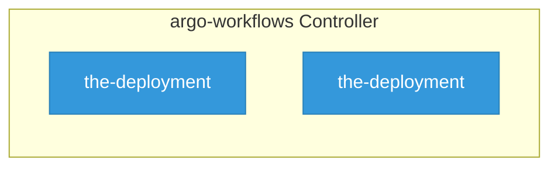

# argo-workflows

> **Architecture snapshot: 2026-05-20** (2026-05-20)

**Repository:** argoproj/argo-workflows  
**Analyzer:** arch-analyzer 0.2.0  
**Extracted:** 2026-05-20T04:14:01Z

## Summary

| Metric | Count |
|--------|-------|
| CRDs | 0 |
| Deployments | 2 |
| Services | 2 |
| Secrets | 0 |
| Cluster Roles | 5 |
| Controller Watches | 0 |

## Component Architecture

CRDs, controllers, and owned Kubernetes resources.

### CRDs

No CRDs found in analyzed sources.

## Dependencies

### Key External Dependencies

| Module | Version |
|--------|---------|
| github.com/go-logr/logr | v1.4.2 |
| github.com/go-logr/logr | v1.4.2 |
| github.com/go-logr/logr | v1.4.2 |
| github.com/go-logr/logr | v1.2.2 |
| github.com/go-logr/logr | v1.4.2 |
| github.com/go-logr/logr | v1.4.1 |
| github.com/go-logr/logr | v1.2.2 |
| github.com/go-logr/logr | v1.4.1 |
| github.com/go-logr/logr | v1.4.2 |
| github.com/go-logr/logr | v1.4.2 |
| github.com/go-logr/logr | v1.4.2 |
| github.com/go-logr/logr | v1.4.2 |
| github.com/go-logr/stdr | v1.2.2 |
| github.com/go-logr/stdr | v1.2.2 |
| github.com/go-logr/stdr | v1.2.2 |
| github.com/go-logr/stdr | v1.2.2 |
| github.com/go-logr/zapr | v1.3.0 |
| github.com/go-logr/zapr | v1.3.0 |
| github.com/prometheus/client_golang | v1.19.1 |
| github.com/prometheus/client_golang | v1.19.1 |
| github.com/prometheus/client_golang | v1.18.0 |
| github.com/prometheus/client_golang | v1.21.1 |
| github.com/prometheus/client_golang | v1.21.1 |
| github.com/prometheus/client_golang | v1.18.0 |
| github.com/prometheus/client_golang | v1.21.1 |
| github.com/prometheus/client_model | v0.5.0 |
| github.com/prometheus/client_model | v0.6.1 |
| github.com/prometheus/client_model | v0.6.1 |
| github.com/prometheus/client_model | v0.6.1 |
| github.com/prometheus/client_model | v0.6.1 |
| github.com/prometheus/client_model | v0.6.1 |
| github.com/prometheus/client_model | v0.6.1 |
| github.com/prometheus/client_model | v0.5.0 |
| github.com/prometheus/client_model | v0.6.1 |
| github.com/prometheus/client_model | v0.6.1 |
| github.com/prometheus/common | v0.62.0 |
| github.com/prometheus/common | v0.62.0 |
| github.com/prometheus/common | v0.55.0 |
| github.com/prometheus/common | v0.62.0 |
| github.com/prometheus/common | v0.55.0 |
| github.com/prometheus/procfs | v0.15.1 |
| github.com/prometheus/procfs | v0.15.1 |
| github.com/prometheus/procfs | v0.15.1 |
| github.com/prometheus/procfs | v0.15.1 |
| google.golang.org/grpc | v1.33.1 |
| google.golang.org/grpc | v1.58.2 |
| google.golang.org/grpc | v1.63.2 |
| google.golang.org/grpc | v1.58.2 |
| google.golang.org/grpc | v1.63.2 |
| google.golang.org/grpc | v1.70.0 |
| google.golang.org/grpc | v1.70.0 |
| google.golang.org/grpc | v1.69.4 |
| google.golang.org/grpc | v1.64.0 |
| google.golang.org/grpc | v1.61.0 |
| google.golang.org/grpc | v1.61.0 |
| google.golang.org/grpc | v1.71.1 |
| google.golang.org/grpc | v1.67.3 |
| google.golang.org/grpc | v1.64.0 |
| google.golang.org/grpc | v1.71.0 |
| google.golang.org/grpc | v1.70.0 |
| google.golang.org/grpc | v1.70.0 |
| google.golang.org/grpc | v1.29.1 |
| google.golang.org/grpc | v1.33.1 |
| google.golang.org/grpc | v1.70.0 |
| google.golang.org/grpc | v1.69.4 |
| google.golang.org/grpc | v1.70.0 |
| google.golang.org/grpc | v1.59.0 |
| google.golang.org/grpc | v1.70.0 |
| google.golang.org/grpc | v1.67.1 |
| google.golang.org/grpc | v1.71.1 |
| google.golang.org/grpc | v1.70.0 |
| google.golang.org/grpc | v1.59.0 |
| google.golang.org/grpc | v1.67.1 |
| google.golang.org/grpc | v1.69.4 |
| google.golang.org/grpc | v1.71.1 |
| google.golang.org/grpc | v1.29.1 |
| google.golang.org/grpc | v1.71.0 |
| google.golang.org/grpc | v1.70.0 |
| google.golang.org/grpc | v1.67.3 |
| google.golang.org/grpc | v1.71.0 |
| google.golang.org/grpc | v1.67.1 |
| google.golang.org/grpc | v1.67.1 |
| google.golang.org/grpc | v1.69.4 |
| google.golang.org/grpc | v1.70.0 |
| google.golang.org/grpc | v1.70.0 |
| google.golang.org/grpc | v1.70.0 |
| google.golang.org/grpc | v1.71.0 |
| google.golang.org/grpc/cmd/protoc-gen-go-grpc | v1.5.1 |
| google.golang.org/grpc/cmd/protoc-gen-go-grpc | v1.5.1 |
| k8s.io/api | v0.27.1 |
| k8s.io/api | v0.32.2 |
| k8s.io/api | v0.32.2 |
| k8s.io/api | v0.32.2 |
| k8s.io/api | v0.32.2 |
| k8s.io/api | v0.17.8 |
| k8s.io/api | v0.32.2 |
| k8s.io/api | v0.32.2 |
| k8s.io/api | v0.27.1 |
| k8s.io/api | v0.32.2 |
| k8s.io/api | v0.32.2 |
| k8s.io/api | v0.32.2 |
| k8s.io/api | v0.32.2 |
| k8s.io/api | v0.17.8 |
| k8s.io/api | v0.32.2 |
| k8s.io/api | v0.27.1 |
| k8s.io/api | v0.32.2 |
| k8s.io/api | v0.27.1 |
| k8s.io/api | v0.32.2 |
| k8s.io/apimachinery | v0.32.2 |
| k8s.io/apimachinery | v0.27.1 |
| k8s.io/apimachinery | v0.32.2 |
| k8s.io/apimachinery | v0.27.1 |
| k8s.io/apimachinery | v0.17.8 |
| k8s.io/apimachinery | v0.32.2 |
| k8s.io/apimachinery | v0.32.2 |
| k8s.io/apimachinery | v0.32.2 |
| k8s.io/apimachinery | v0.32.2 |
| k8s.io/apimachinery | v0.32.2 |
| k8s.io/apimachinery | v0.32.2 |
| k8s.io/apimachinery | v0.17.8 |
| k8s.io/apimachinery | v0.32.2 |
| k8s.io/apimachinery | v0.32.2 |
| k8s.io/apimachinery | v0.32.2 |
| k8s.io/apimachinery | v0.32.2 |
| k8s.io/apimachinery | v0.32.2 |
| k8s.io/apimachinery | v0.32.2 |
| k8s.io/apimachinery | v0.32.2 |
| k8s.io/apimachinery | v0.32.2 |
| k8s.io/apimachinery | v0.32.2 |
| k8s.io/client-go | v0.27.1 |
| k8s.io/client-go | v0.32.2 |
| k8s.io/client-go | v0.17.8 |
| k8s.io/client-go | v0.32.2 |
| k8s.io/client-go | v0.32.2 |
| k8s.io/client-go | v0.32.2 |
| k8s.io/client-go | v0.32.2 |
| k8s.io/client-go | v0.32.2 |
| k8s.io/client-go | v0.27.1 |
| k8s.io/client-go | v0.32.2 |
| k8s.io/client-go | v0.27.1 |
| k8s.io/client-go | v0.27.1 |
| k8s.io/client-go | v0.32.2 |
| k8s.io/client-go | v0.17.8 |
| k8s.io/client-go | v0.32.2 |
| k8s.io/client-go | v0.32.2 |
| k8s.io/client-go | v0.32.2 |
| k8s.io/client-go | v0.32.2 |
| k8s.io/client-go | v0.32.2 |
| sigs.k8s.io/controller-runtime | v0.19.0 |
| sigs.k8s.io/controller-runtime | v0.19.0 |

